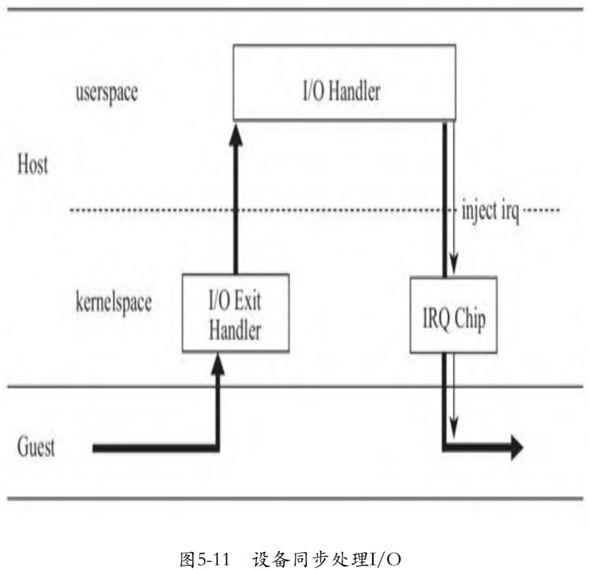
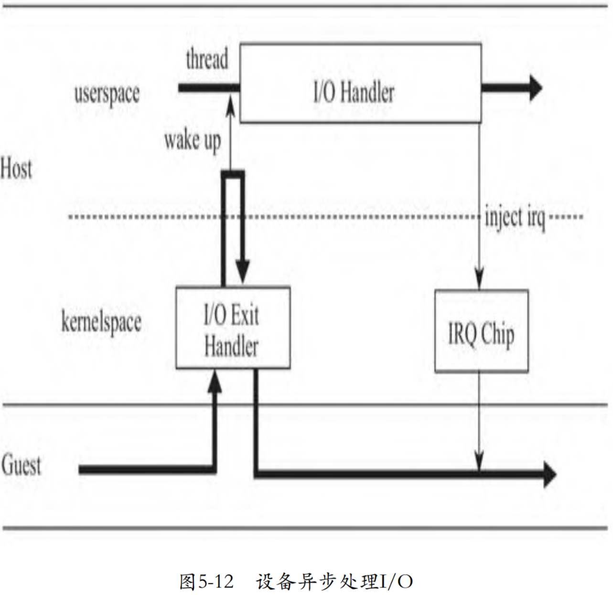

前面讨论的模拟设备中的 I/O 处理都是同步的, 也就是说, 当驱动发起 I/O 通知 `VIRTIO_PCI_QUEUE_NOTIFY` 后, 触发 VM exit, 在控制权从 Guest 转换到 kvmtool 中的模拟设备后, 一直要等到模拟设备处理完 I/O, 模拟设备才调用 `kvm__irq_line` 向 Guest 发送中断, CPU 才会从模拟设备返回到 Guest 系统. 可见, 在模拟设备进行 I/O 时, Guest 系统是被 block 住的, 如下图所示.



而在真实的块设备中, 操作系统只是挂起发起 I/O 的任务, 继续运行其他就绪任务, 而不是把整个系统都 block 住. 所以, 模拟设备的 I/O 处理过程也完全可以抽象为另外一个线程, 和 VCPU 这个线程并发执行. 在单核系统上, I/O 处理线程和 VCPU 线程可以分时执行, 避免 Guest 系统长时间没有响应; 在多核系统上, I/O 处理线程和 VCPU 线程则可以利用多核并发执行. 在异步模式下, VCPU 这个线程只需要告知一下模拟设备开始处理 I/O, 然后可以迅速地再次切回到 Guest. 在模拟设备完成 I/O 处理后, 再通过中断的方式告知 Guest I/O 处理完成了. 这个过程如下图所示.



起初, Virtio blk 使用了一个单独的线程处理 I/O, 后来, kvmtool 增加了一个线程池. 每当 I/O 来了之后, 会在队列中挂入线程池, 然后唤醒线程处理任务. 线程池的实现我们就不详细介绍了, 我们仅关注 Virtio blk 设备处理 I/O 逻辑的变迁:

```cpp
commit fb0957f29981d280fe890b7aadcee4f3df95ca65
kvm tools: Use threadpool for virtio-blk
kvmtool.git/virtio-blk.c

static bool virtio_blk_pci_io_out(struct kvm *self, uint16_t port, void *data, int size, uint32_t count)
{
    ...
	case VIRTIO_PCI_QUEUE_PFN: {
    ...
		blk_device.jobs[blk_device.queue_selector] =
			thread_pool__add_jobtype(self, virtio_blk_do_io, queue);

		break;
	}
    ...
	case VIRTIO_PCI_QUEUE_NOTIFY: {
		uint16_t queue_index;
		queue_index		= ioport__read16(data);
		thread_pool__signal_work(blk_device.jobs[queue_index]);
		break;
	}
    ...
}

static void virtio_blk_do_io(struct kvm *kvm, void *param)
{
	struct virt_queue *vq = param;

	while (virt_queue__available(vq))
		virtio_blk_do_io_request(kvm, vq);

	kvm__irq_line(kvm, VIRTIO_BLK_IRQ, 1);
}
```

当 Guest 中的 Virtio blk 驱动初始化 Virtqueue 时, 在将 Virtqueue 的地址告知模拟设备, 即写 I/O 地址 `VIRTIO_PCI_QUEUE_PFN` 时, 我们看到模拟设备将创建一个 job, job 的 callback 函数就是之前同步处理部分的代码逻辑. 每当 Guest 中的驱动通知设备处理 I/O request, 模拟设备会将这个 job 添加到线程池的队列, 然后唤醒线程池中的线程处理这个 job. 通过这种方式, 函数 `virtio_blk_pci_io_out` 不必再等待 I/O 处理完成, 而是马上再次进入内核空间, 切入 Guest. 在线程池中的某个线程处理完这个 job, 即函数 `virtio_blk_do_io` 的最后, 将调用 `kvm__irq_line` 向 Guest 注入中断, 告知 Guest 设备已经处理完了 I/O. 使用异步的方式, 即使执行长耗时 I/O, Guest 也不会被 block, 也不会出现不反应的情况, 而且对于多核系统, 可以充分利用多核的并发, 处理 I/O 的线程和 VCPU(Guest)分别在不同核上同时运行.