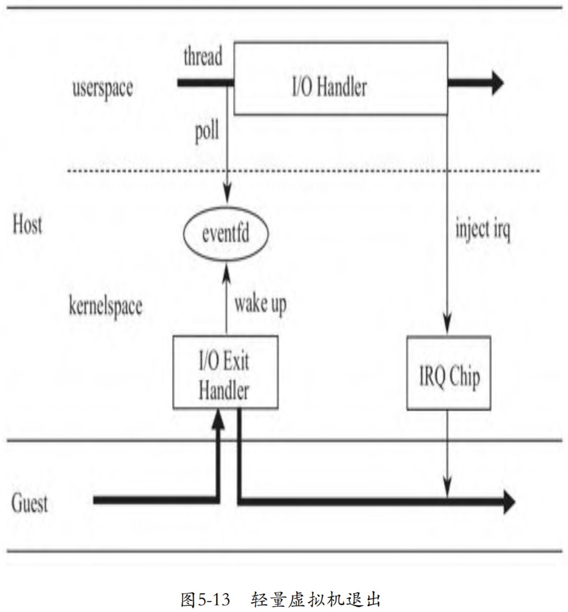

I/O处理异步化后，模拟设备中的I/O处理将不再阻塞Guest的运行。现在我们再仔细审视一下这个过程，寻找进一步优化的可能。事实上，无论I/O是同步处理，还是异步处理，每次Guest发起I/O request时，都将触发CPU从Guest切换到Host的内核空间（ring 0），然后从Host的内核空间切换到Host的用户空间（ring 3），唤醒kvmtool中的I/O thread，然后再从Host的用户空间，切换到Host的内核空间，最后进入Guest。

我们知道，内核空间和用户空间的切换是有一定开销的，而切换到用户空间后就是做了一次简单的唤醒动作，那么这两次用户空间和内核空间的上下文切换，是否可以避免呢？KVM模块是否可以直接在内核空间唤醒用户空间的I/O处理任务呢？于是KVM的开发者们基于 eventfd设计了一个ioeventfd的概念。eventfd是一个文件描述符，目的是快速、轻量地通知事件，可用于内核空间和用户空间，或者用户空间的任务之间的轻量级的通知。

在具体实现上，kvmtool中的模拟设备将创建一个eventfd文件，并将这个文件描述符告知内核中的KVM模块，然后将监听在eventfd 上。当Guest因为I/O导致vm exit时，vm exit处理函数将不再返回到用户空间，而是直接唤醒阻塞监听在eventfd等待队列上的kvmtool中的监听线程，然后马上切回到Guest。使用eventfd后，CPU的状态流转过程简化为从Guest到Host的内核空间，然后马上再次流转到Guest，如图5-13所示。



下面，我们就具体探讨一下各过程的实现。

## 创建eventfd

以Virtio blk为例，其为每个Virtqueue创建了一个eventfd，并将 eventfd 和设备及设备中的具体Virtqueue关联起来：

```cpp
commit ec75b82fc0bb17700f09d705159a4ba3c30acdf8
kvm tools: Use ioeventfd in virtio-blk
kvmtool.git/virtio/blk.c

void virtio_blk__init(struct kvm *kvm, struct disk_image *disk)
{
    ...
	for (i = 0; i < NUM_VIRT_QUEUES; i++) {
		ioevent = (struct ioevent) {
			.io_addr		= blk_dev_base_addr + VIRTIO_PCI_QUEUE_NOTIFY,
			.io_len			= sizeof(u16),
			.fn			= ioevent_callback,
			.datamatch		= i,
			.fn_ptr			= &bdev->jobs[i],
			.fn_kvm			= kvm,
			.fd			= eventfd(0, 0),
		};

		ioeventfd__add_event(&ioevent);
	}
}
```

其中，fd是kvmtool向内核申请创建的用于KVM内核模块和kvmtool进行通信的eventfd文件描述符，io_addr是一个I/O地址，用来告诉内核当Guest写的I/O地址为VIRTIO_PCI_QUEUE_NOTIFY时，唤醒睡眠在这个eventfd等待队列上的任务，fn是kvmtool中等待内核信号的线程，被唤醒后，调用这个回调函数处理I/O。创建好eventfd后，kvmtool调用函数ioeventfd__add_event将eventfd以及与其关联的I/O地址等告知KVM内核模块：

```cpp
commit ec75b82fc0bb17700f09d705159a4ba3c30acdf8
kvm tools: Use ioeventfd in virtio-blk
kvmtool.git/ioeventfd.c
void ioeventfd__add_event(struct ioevent *ioevent)
{
    ...
	if (ioctl(ioevent->fn_kvm->vm_fd, KVM_IOEVENTFD, &kvm_ioevent) != 0)
    ...
}
```

KVM模块收到用户空间发来的KVM_IOEVENTFD命令后，将在内核空间创建一个I/O设备，并将其挂到I/O总线上。这个I/O设备相当于kvmtool中的模拟设备在内核空间的一个代理，其记录着I/O地址和eventfd实例的关联：

```cpp
commit d34e6b175e61821026893ec5298cc8e7558df43a
KVM: add ioeventfd support

linux.git/virt/kvm/kvm_main.c

static long kvm_vm_ioctl(struct file *filp,
			   unsigned int ioctl, unsigned long arg)
{
    ...
	case KVM_IOEVENTFD: {
		struct kvm_ioeventfd data;
        ...
		r = kvm_ioeventfd(kvm, &data);
		break;
	}
    ...
}

linux.git/virt/kvm/eventfd.c

int
kvm_ioeventfd(struct kvm *kvm, struct kvm_ioeventfd *args)
{
	return kvm_assign_ioeventfd(kvm, args);
}

static int
kvm_assign_ioeventfd(struct kvm *kvm, struct kvm_ioeventfd *args)
{
    ...
	kvm_iodevice_init(&p->dev, &ioeventfd_ops);

	ret = __kvm_io_bus_register_dev(bus, &p->dev);
    ...
}
```

当Guest发起地址为VIRTIO_PCI_QUEUE_NOTIFY的I/O操作时，KVM 模块中的VM exit处理函数将根据地址VIRTIO_PCI_QUEUE_NOTIFY找到这个代理I/O设备，调用代理I/O设备的写函数，这个写函数将唤醒睡眠在代理设备中记录的与这个I/O地址对应的eventfd等待队列的 kvmtool中的任务，处理I/O：

```cpp
commit d34e6b175e61821026893ec5298cc8e7558df43a
KVM: add ioeventfd support

linux.git/virt/kvm/eventfd.c

static const struct kvm_io_device_ops ioeventfd_ops = {
	.write      = ioeventfd_write,
	.destructor = ioeventfd_destructor,
};
static int ioeventfd_write(struct kvm_io_device *this, gpa_t addr, int len,
		const void *val)
{
    ...
	eventfd_signal(p->eventfd, 1);
	return 0;
}

linux.git/fs/eventfd.c
int eventfd_signal(struct eventfd_ctx *ctx, int n)
{
    ...
	if (waitqueue_active(&ctx->wqh))
		wake_up_locked_poll(&ctx->wqh, POLLIN);
    ...
}
```

# kvmtool 监听 eventfd

在创建好 eventfd 后，kvmtool 创建了一个线程，调用 epoll_wait 阻塞监听eventfd，接受来自内核 KVM 模块的事件：

```cpp
commit ec75b82fc0bb17700f09d705159a4ba3c30acdf8
kvm tools: Use ioeventfd in virtio-blk
kvmtool.git/ioeventfd.c

void ioeventfd__add_event(struct ioevent *ioevent)
{
    ...
	if (epoll_ctl(epoll_fd, EPOLL_CTL_ADD, event, &epoll_event) != 0)
    ...
}

static void *ioeventfd__thread(void *param)
{
	for (;;) {
		int nfds, i;

		nfds = epoll_wait(epoll_fd, events, IOEVENTFD_MAX_EVENTS, -1);
		for (i = 0; i < nfds; i++) {
			....
			ioevent->fn(ioevent->fn_kvm, ioevent->fn_ptr);
		}
	}
}
```

当有 POLLIN 事件时，对应的 callback 将被执行（callback 函数是 ioevent_callback）。`ioevent_callback` 就是用来通知线程池处理 I/O job:

```cpp
commit ec75b82fc0bb17700f09d705159a4ba3c30acdf8
kvm tools: Use ioeventfd in virtio-blk
kvmtool.git/virtio/blk.c
static void ioevent_callback(struct kvm *kvm, void *param)
{
	struct blk_dev_job *job = param;

	thread_pool__do_job(job->job_id);
}
```

# VM exit 处理函数唤醒 I/O 任务

根据KVM内核模块的主体函数__vcpu_run中的while循环可见，如果函数vcpu_enter_guest返回0，那么代码逻辑将跳出循环，返回到用户空间发起运行虚拟机的指令。如果vcpu_enter_guest返回1，那么将再次进入while循环执行vcpu_enter_guest，直接返回Guest，即所谓的轻量级虚拟机退出：

```cpp

```