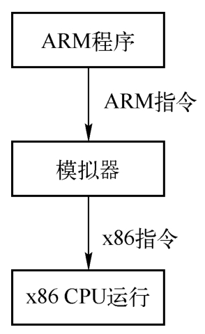
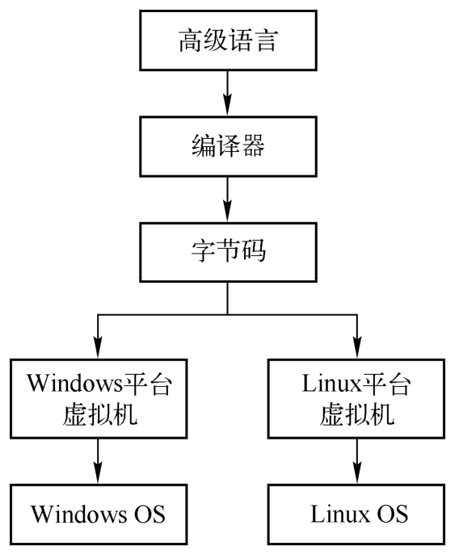
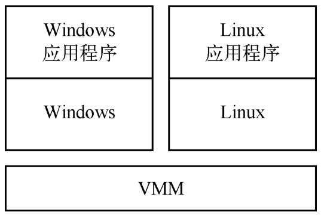

虚拟机，顾名思义，其重点在“机”上，也就是机器。理论上讲，只要能提供一个执行环境，完成用户指定任务的对象都可以叫作机器。所以可以从多种角度来解释虚拟机。

最简单的虚拟机是进程，这种虚拟机太过于普通，以至于很多人都没有意识到它们是虚拟机。进程可以看作是一组资源的集合，有自己独立的进程地址空间以及独立的CPU和寄存器，执行程序员编写的指令，完成一定的任务。一个进程在执行指令、访问内存的时候并不会影响其他进程。这是通过操作系统完成的，操作系统把CPU按照时间分配复用，把内存按照空间分配复用，通过管理底层资源，使得进程都能够使用整个计算机的物理资源，每个进程都认为自己拥有整个机器。操作系统上可以创建很多个进程，每一个进程都可以看成是一个独立的虚拟机。

进程虚拟机如图所示:

模拟器是另一种形式的虚拟机。进程的指令都是可以直接运行在硬件CPU上的，模拟器则不同，它可以使为一种硬件指令集（Instruction Set Architecture，ISA）编译的程序运行在另一种硬件指令集上。应用程序在源ISA（如ARM）上被编译出来，在模拟器的帮助下，运行在不同的目标ISA（比如x86）上。模拟器可以通过解释来实现，即对程序的源ISA指令一条一条进行分析，然后执行相应的ISA指令上的操作。模拟器也可以通过二进制翻译实现，即首先将程序中所有的源ISA指令翻译成目标ISA上具有同样功能的指令，然后在目标ISA指令机器上执行。模拟器的基本原理如下图所示。典型的模拟器有QEMU（Quick Emulator）的用户态程序模拟、Bochs模拟器等。

模拟器原理:

高级语言虚拟机在模拟器的基础上更进一步，将源ISA和目标ISA完全分离开。在高级语言虚拟机中，通常会设计一种全新的虚拟ISA，并在其中定义新的指令集、数据操作、寄存器的使用等类似于物理ISA中的规范。不同于普通程序和模拟器运行的程序，高级语言虚拟机的程序中没有任何具体物理ISA指令字节，而是自己定义虚拟的指令字节，这些指令字节通常叫作字节码。任何想要运行这种虚拟ISA指令的物理ISA平台都需要实现一个虚拟机，该虚拟机能够执行虚拟机ISA指令到物理ISA指令的转换。程序员通过使用高级语言编写程序，不需要考虑其具体的运行平台，即可非常方便地实现程序的跨平台分发。高级语言虚拟机如下图所示。典型的高级语言虚拟机有JVM虚拟机、Python虚拟机等。

高级语言虚拟机:

在高级语言虚拟机中，虚拟ISA是公开的规范，每个人都可以获得，并且可以自己写出反编译的工具，通过字节码来还原程序的源码。这也是为什么使用Java语言的程序常常需要进行代码混淆。假设我们自己定义一个虚拟的ISA，但是并不公开其规范，并且可以时不时地修改这些规范，然后将自带的虚拟机和字节码合起来一起进行分发，这样使用基于物理ISA的反编译工具就无法还原出程序的汇编代码，这就是软件保护中虚拟机保护的原理。

进程、模拟器、高级语言虚拟机提供的都是指令的执行环境，而系统虚拟机提供的是一个完整的系统环境。在这个环境中，能够运行多个用户的多个进程。通过系统虚拟化技术，能够在单个的宿主机硬件平台上运行多个虚拟机，每个虚拟机都有着完整的虚拟机硬件，如虚拟的CPU、内存、虚拟的外设等，并且虚拟机之间能够实现完整的隔离。早期系统虚拟机诞生的原因主要是大型计算机系统非常庞大且昂贵，需要多个用户共享，而用户希望可以自由地运行其需要的操作系统。在系统虚拟化中，管理全局物理资源的软件叫作虚拟机监控器（Virtual Machine Monitor，VMM），VMM之于虚拟机就如同操作系统之于进程，VMM利用时分复用或者空分复用的办法将硬件资源在各个虚拟机之间进行分配。系统虚拟机原理如图1-4所示。典型的系统虚拟化解决方案包括VMware Workstation、QEMU、VirtualBox和HyperV等。

系统虚拟机:

