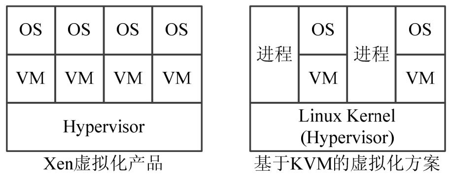
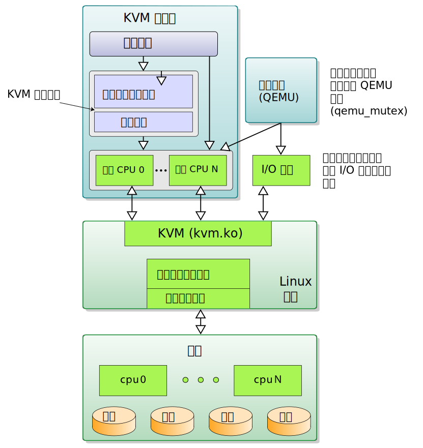
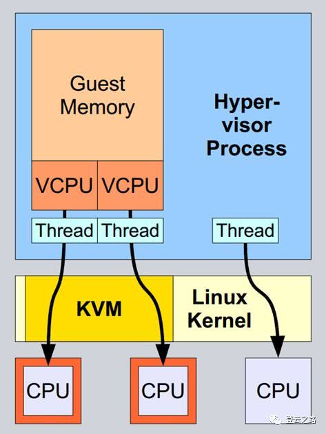
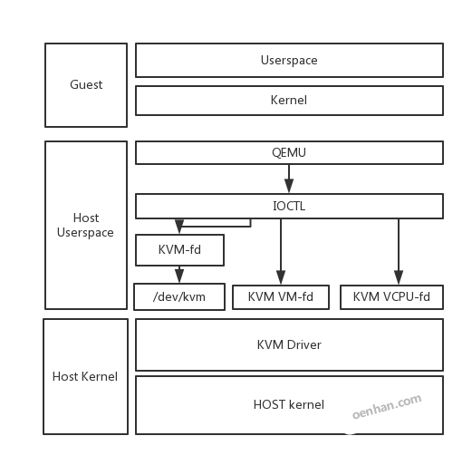
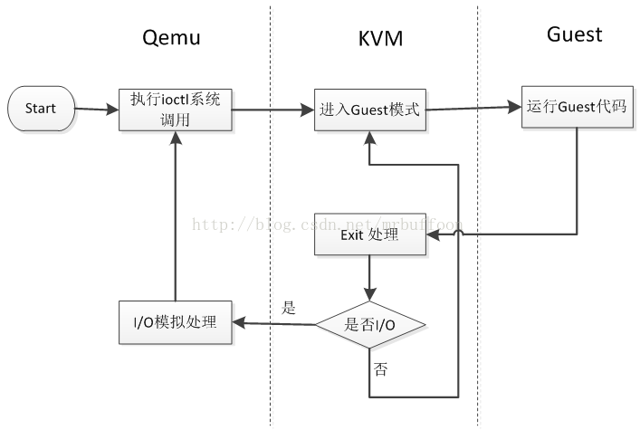
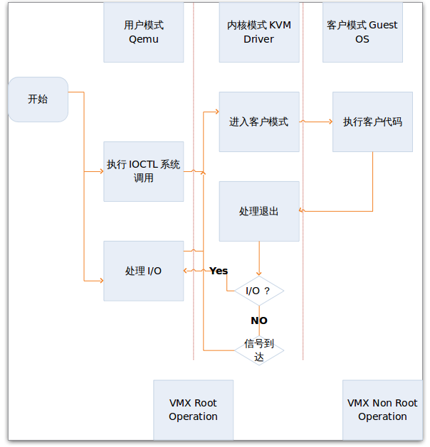
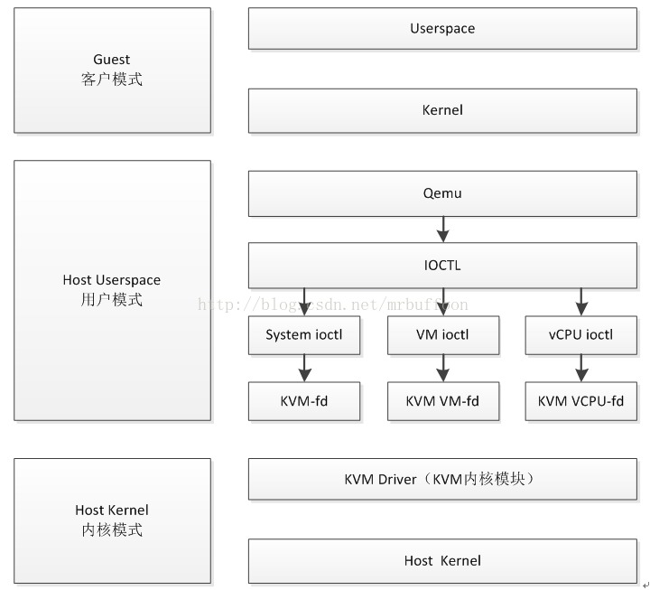
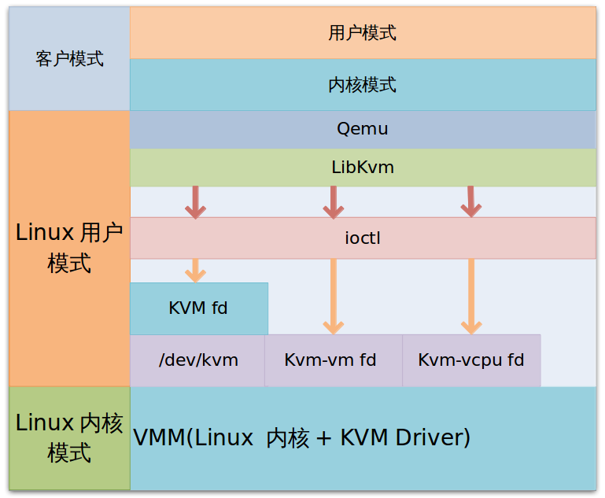

<!-- @import "[TOC]" {cmd="toc" depthFrom=1 depthTo=6 orderedList=false} -->

<!-- code_chunk_output -->

- [1. 硬件虚拟化技术背景](#1-硬件虚拟化技术背景)
  - [1.1. 指令集](#11-指令集)
  - [1.2. MMU](#12-mmu)
  - [1.3. IO](#13-io)
- [2. 虚拟化方案与 KVM](#2-虚拟化方案与-kvm)
- [3. QEMU/KVM 实现概述](#3-qemukvm-实现概述)
  - [3.1. KVM/QEMU 架构](#31-kvmqemu-架构)
  - [3.2. KVM 的抽象对象](#32-kvm-的抽象对象)
  - [3.3. KVM 的 vcpu](#33-kvm-的-vcpu)
  - [3.4. QEMU/KVM 工作原理](#34-qemukvm-工作原理)
  - [3.5. 相关进程/线程](#35-相关进程线程)
  - [3.6. KVM 运行时的三种模式](#36-kvm-运行时的三种模式)
  - [3.7. KVM 与 Qemu 的关系](#37-kvm-与-qemu-的关系)
- [4. CPU 虚拟化](#4-cpu-虚拟化)
- [5. Mem 虚拟化](#5-mem-虚拟化)
- [6. IO 虚拟化](#6-io-虚拟化)
  - [6.1. IO 的虚拟化](#61-io-的虚拟化)
  - [6.2. VirtIO](#62-virtio)
- [7. KVM IO 可能优化地方](#7-kvm-io-可能优化地方)
  - [7.1. Virt-IO 的硬盘优化](#71-virt-io-的硬盘优化)
  - [7.2. 普通设备的直接分配(Direct Assign)](#72-普通设备的直接分配direct-assign)
  - [7.3. 普通设备的复用](#73-普通设备的复用)
- [8. 参考](#8-参考)

<!-- /code_chunk_output -->

# 1. 硬件虚拟化技术背景

详细见`系统虚拟化`

**硬件虚拟化技术**通过虚拟化**指令集**、**MMU**(Memory Map Unit)以及**IO**来运行不加修改的操作系统.

## 1.1. 指令集

传统的处理器通过选择不同的运行(Ring 特权)模式, 来选择指令集的范围, 内存的寻址方式, 中断发生方式等操作. 在原有的 Ring 特权等级的基础上, 处理器的硬件虚拟化技术带来了一个新的运行模式: Guest 模式[1], 来实现指令集的虚拟化. 当切换到 Guest 模式时, 处理器提供了先前完整的特权等级, 让 Guest 操作系统可以不加修改的运行在物理的处理器上. Guest 与 Host 模式的处理器上下文完全由硬件进行保存与切换. 此时, 虚拟机监视器(Virtual Machine Monitor)通过一个位于内存的数据结构(Intel 称为 VMCS, AMD 称为 VMCB)来控制 Guest 系统同 Host 系统的交互, 以完成整个平台的虚拟化.

## 1.2. MMU

传统的操作系统通过硬件 MMU 完成虚拟地址到物理地址的映射. 在虚拟化环境中, Guest 的虚拟地址需要更多一层的转换, 才能放到地址总线上:

```
    Guest 虚拟地址 -> Guest 物理地址 -> Host 物理地址
                 ^               ^
                 |               |
                MMU1            MMU2
```

其中 MMU1 可以由软件模拟(Shadow paging 中的 vTLB)或者硬件实现(Intel EPT、AMD NPT). MMU2 由硬件提供.

## 1.3. IO

系统的 IO 虚拟化技术, 通常是 VMM 捕捉 Guest 的 IO 请求, 通过软件模拟的传统设备将其请求传递给物理设备. 一些新的支持虚拟化技术的设备, 通过硬件技术(如 Intel VT-d), 可以将其直接分配给 Guest 操作系统, 避免软件开销.

# 2. 虚拟化方案与 KVM

在所有虚拟化方案中, 都是由 **hypervisor 取代原生的 OS** 去控制具体硬件资源, 同时将资源分配具体的 VM, VM 中运行的是没有修改过的 OS, 如果让 VM 中的 OS 能正常运行, hypervisor 的任务就是模拟具体的硬件资源, 让 OS 不能识别出是真是假.

图 5-1 KVM 和 Xen 虚拟化方案比较:



在 **Xen** 的体系结构中, **Xen Hypervisor** 运行于**硬件之上**, 并且将系统资源进行了虚拟化操作, 将虚拟化的资源分配给上层的虚拟机(VM), 然后通过虚拟机 VM 来运行相应的客户机操作系统.

KVM 全称是 `Kernel-based Virtual Machine`, 是一个基于 Linux 环境的开源虚拟化解决方案.

KVM 与 Xen、VMware 等提供完整解决方案的商业化虚拟产品不同, KVM 的**思想**是在**Linux 内核的基础**上添加**虚拟机管理模块**, 这个样子[**内存分配**](http://www.oenhan.com/kernel-program-exec), [**进程调度**](http://www.oenhan.com/task-group-sched), **IO 管理**等就**无需重写代码**, 如此 hypervisor 就是所谓的 host, VM 中的 OS 就是 guest.

因此, KVM 并**不是一个完整的模拟器**, 而只是一个提供了虚拟化功能的**内核模块**, 具体的**模拟器工作**是借助**QEMU**来完成的.

# 3. QEMU/KVM 实现概述

见`Virtualization/Learning/KVM 实战: 原理、进阶与性能调优`

## 3.1. KVM/QEMU 架构

KVM 是基于硬件辅助虚拟化技术(Intel 的`VT-x`或者`AMD-V`)的全虚拟化解决方案, 客户机操作系统能够不经过修改直接在 KVM 的虚拟机中运行, **每一台虚拟机**能够享有**独立**的**虚拟硬件资源**: **网卡**、**磁盘**、**图形适配器**等.

基于 KVM/QEMU 架构实现的虚拟化, 相关的架构如下图所示: (仔细看图)




https://zh.wikipedia.org/wiki/File:Kernel-based_Virtual_Machine_zh-CN.svg



**KVM** 支持**虚拟化嵌套**, 即在虚拟化出来的主机中, KVM 能够再次进行虚拟机中的虚拟化, 但是此项功能**只针对 KVM**, 不支持 Xen、VMwaer 等其他虚拟化架构方案.

KVM 是 Linux 内核的**一个模块**, 基于**硬件虚拟化技术**实现 VMM 的功能. 该模块的工作主要是通过操作**与处理器共享的数据结构**来实现**指令集**以及**MMU**的**虚拟化**, 捕捉**Guest**的**IO 指令**(包括`Port IO`和`mmap IO`)以及实现**中断虚拟化**.

至于**IO 设备的软件模拟**, 是通过**用户程序 QEMU**来实现的. QEMU 负责解释**IO 指令流**, 并将其请求换成**系统调用**或者**库函数**传给**Host 操作系统**, 让 Host 上的驱动去完成**真正的 IO 操作**. 它们之间的关系如下图所示:

```
    +--------------+               +--------+
    | Qemu         |               |        |
    |              |               |        |
    | +---+  +----+|               | Guest  |
    | |vHD|  |vNIC||<-----+        |        |
    | +---+  +----+|      |        |        |
    +--------------+      |        +--------+
         ^                |            ^
         | syscall        |IO stream   |
         | via FDs        |            |
    +----|----------------|------------|--------+
    |    |                |            v        |
    |    v                |       +----------+  |
    |  +--------+         +------>|          |  |
    |  |drivers |<--+             |  kvm.ko  |  |
    |  +--------+   |             +----------+  |
    |    ^          |   Host kernel             |
    +----|----------|---------------------------+
         v          v
    +--------+    +---+
    | HDD    |    |NIC|
    +--------+    +---+
```

从 Host 操作系统的角度来看, **Guest**相当于**一个进程**运行在系统上, 这个进程就是**qemu**, 普通的命令如 kill、top、taskset 等可以作用于该 Guest. 该**进程**的**用户虚拟空间**就是**Guest 的物理空间**, 该**进程的线程**对应着**Guest 的处理器**.

从 Qemu 的角度来看, KVM 模块抽象出了**三个对象**, 分别代表**KVM 自己**, **Guest 的虚拟空间**(VM)以及**运行虚拟处理器**(VCPU). 这三个对象分别对应着**三个文件描述符**, Qemu 通过**文件描述符**用**系统调用 IOCTL**来操作这三个对象, 同 KVM 交互. 此时, Qemu 主要**只模拟设备**, 它以前的**CPU**和**MMU 的模拟逻辑**都被`kvm.ko`取代了.

## 3.2. KVM 的抽象对象

KVM 同应用程序(Qemu)的交互接口为`/dev/kvm`, 通过**open**以及**ioctl 系统调用**可以获取并操作 KVM 抽象出来的**三个对象**,
- Guest 的虚拟处理器(`fd_vcpu[N]`),
- Guest 的地址空间(`fd_vm`),
- KVM 本身(`fd_kvm`).

其中每一个 Guest 可以含有多个 vcpu, 每一个 vcpu 对应着 Host 系统上的一个线程.

Qemu 启动 Guest 系统时, 通过 `/dev/kvm` 获取 `fd_kvm` 和 `fd_vm`, 然后通过 `fd_vm` 将**Guest**的"**物理空间**" **mmap** 到 **Qemu 进程**的**虚拟空间**, 并根据配置信息创建`vcpu[N]`线程, 返回`fd_vcpu[N]`. 然后 Qemu 将操作`fd_vcpu`在其自己的进程空间 mmap 一块 KVM 的数据结构区域. 该数据结构(下图中的 shared)用于同 `kvm.ko` 交互, 包含 Guest 的 IO 信息, 如端口号, 读写方向, 内存地址等. Qemu 通过这些信息, 调用虚拟设备注册的回调函数来模拟设备的行为, 并将 Guest IO 请求换成系统请求发送给 Host 系统. 由于 Guest 的地址空间已经映射到 Qemu 的进程空间里面, Qemu 的虚拟设备逻辑可以很方便的存取 Guest 地址空间里面的数据.

三个对象之间的关系如下图所示:

QEMU 通过 KVM 等 fd 进行 IOCTL 控制 KVM 驱动的运行过程.



```
    +----------+            |         +--------+
    | Qemu     | Host user  |         |        |
    |          |            |         |        |
    |          |            |         | Guest  |
    |  +------+|            |         | user   |
    |  |shared||            |         |        |
    |  +------+|            |         |        |
    |       ^  |            |         |        |
    +-------|--+            |         |        |
        |   |               |         |        |
     fds|   |               |         |        |
  ------|---|---------------|         |--------|
        |   |               |         |        |
        v   v   Host kernel |         | Guest  |
     +---------+            |         | kernel |
     |         |            |         |        |
     |  kvm.ko |----+       |         |        |
     |         |    |fd_kvm |         |        |
     +---------+    |       |         +--------+
                    v       |             ^
                  +----+    |   fd_vm     |
                  |vmcs|----+--------------
      +------+    +----+    |          +------+
      | host |              |          | Guest|
      | mode |              |fd_vcpu   | mode |
      +------+              |          +------+
          ^                 v             ^
          |             +-------+         |
          | vm exit     |  Phy  | vm entry|
          +-------------|  CPU  |---------+
                        +-------+
```

图中`vm-exit`代表处理器进入 host 模式, 执行 kvm 和 Qemu 的逻辑. `vm-entry`代表处理器进入 Guest 模式, 执行整个 Guest 系统的逻辑. 如图所示, Qemu 通过三个文件描述符同 `kvm.ko` 交互, 然后 `kvm.ko` 通过 vmcs 这个数据结构同处理器交互, 最终达到控制 Guest 系统的效果. 其中 `fd_kvm` 主要用于 Qemu 同 KVM 本身的交互, 比如获取 KVM 的版本号, 创建地址空间、vcpu 等. `fd_vcpu` 主要用于控制处理器的模式切换, 设置进入 Guest mode 前的处理器状态等等(内存寻址模式, 段寄存器、控制寄存器、指令指针等), 同时 Qemu 需要通过 `fd_vcpu` 来 mmap 一块 KVM 的数据结构区域. `fd_vm` 主要用于 Qemu 控制 Guest 的地址空间, 向 Guest 注入虚拟中断等.

## 3.3. KVM 的 vcpu

如前文所述, KVM 的 vcpu 对应着 host 系统上的一个线程. 从 Qemu 的角度来看, 她运行在一个 loop 中:

```cpp
	for (;;) {
		kvm_run(vcpu);
		switch (shared_data->exit_reason) {
		...
		case KVM_IO:
			handle_io(vcpu);
			break;
		case KVM_MMIO:
			handle_mmio(vcpu);
			break;
		...
		}
	}
```

该线程同 Guest 的 vcpu 紧密相连. 如果我们把线程的执行看作 Guest vcpu 的一部分, 那么从 Host 的角度来看, 该 vcpu 在三种不同的上下文中运行: Host user/Host kernel/Guest, 将运行于一个更大的循环当中. 该 vcpu 的运行逻辑如下图:

```
      Host user   |  Host kernel  | Guest mode   |
                  |               |              |
                  |               |              |
 +->kvm_run(vcpu)-------+         |              |
 |                |     v         |              |
 |                | +->vm entry----------+       |
 |                | |             |      v       |
 |                | |             |   Execute    |
 |                | |             |   Natively   |
 |                | |             |      |       |
 |                | |  vm exit<----------+       |
 |                | |    |        |              |
 |                | |    |        |              |
 |            Yes | |    v        |              |
 |     +----------------I/O ?     |              |
 |     |          | |    | No     |              |
 |     |          | |    |        |              |
 |     |          | |    v        |              |
 |     v      Yes | |  Signal     |              |
 +--Handle IO<---------Pending?   |              |
                  | |    | No     |              |
                  | +----+        |              |
```

实际上, 在 host 上通过 ps 命令看到的关于 vcpu 这个线程的运行时间正是这三种上下文的总和.

## 3.4. QEMU/KVM 工作原理

KVM 的工作原理如图:





上图是一个执行过程图, 首先启动一个**虚拟化管理软件 qemu**, 开始启动一个虚拟机, 通过**ioctl**等**系统调用**向**内核**中**申请指定的资源**, 搭建好虚拟环境, 启动虚拟机内的 OS, 执行 **VMLAUCH** 指令, 即**进入了 guest 代码**执行过程.

如果 Guest OS 发生**外部中断**或者**影子页表缺页**之类的事件, 暂停 Guest OS 的执行, **guest VM\-exit**, 进行一些必要的处理, 然后重新进入客户模式, 执行 guest 代码; 这个时候如果是 io 请求, 则提交给用户态下的 qemu 处理, qemu 处理后再次通过 IOCTL 反馈给 KVM 驱动.

KVM 的大致工作原理:

1. 用户模式的 Qemu 利用接口 libkvm 通过**ioctl 系统调用**进入**内核模式**. KVMDriver 为虚拟机创建虚拟 CPU 和虚拟内存, 然后执行 VMLAUNCH 指令进入**客户模式**, 装载 Guest OS 并运行.

2. Guest OS 运行过程中如果发生中断或者影子缺页等异常, 将暂停 Guest OS 的运行并保存当前上下文退出到**内核模式**来处理这些异常.

3. 内核模式处理这些异常时如果不需要 I/O 则处理完成后重新进入客户模式, 如果需要 I/O 则进入到**用户模式**, 由 Qemu 来处理 I/O, 处理完成后进入内核模式, 再进入**客户模式**.

## 3.5. 相关进程/线程

每一个虚拟机(guest)在 Host 上都被模拟为一个 QEMU 进程, 即 emulation 进程, 它有自己的 pid, 也可以被 kill 系统调用直接杀死(在这种情况下, 虚拟机的行为表现为"突然断电"). 在一个 Linux 系统中, 有多少个 VM, 就有多少个进程.

并且有四个线程, 线程数量不是固定的, 但是**至少会有三个**(**vCPU**, **IO**, **Signal**). 其中几个 vCPU 对应几个线程, 有一个**IO 线程**还有一个**信号处理线程**.

```cpp
➜  ~ pstree -p 20308
qemu-system-x86(20308)-+-{qemu-system-x86}(20353)
                       |-{qemu-system-x86}(20408)
                       |-{qemu-system-x86}(20409)
                       |-{qemu-system-x86}(20412)
```

## 3.6. KVM 运行时的三种模式

kvm 模块让 Linux 主机成为一个虚拟机监视器(VMM), 并且在原有的 Linux 两种执行模式基础上, 新增加了客户模式, 客户模式拥有自己的内核模式和用户模式.

所以在**虚拟机运行**时, 有三种模式, 分别是:

- **客户模式**: 我们可以简单理解成客户机操作系统运行在的模式, 它本身又分为自己的内核模式和用户模式. 执行非 I/O 的客户代码, 虚拟机运行在这个模式下.

- **用户模式**: 为用户提供虚拟机管理的用户空间工具以及代表用户执行 I/O, Qemu 运行在这个模式之下.

- **内核模式**: 模拟 CPU 以及内存, 实现客户模式的切换, 处理从客户模式的退出. KVM 内核模块运行在这个模式下.

三种模式的层次关系我们可以用图简单描述一下:





在 kvm 的模型中, **每一个 Gust OS**都是作为一个**标准的 linux 进程**, 都可以使用 linux 进程管理命令管理.

这里假如**qemu**通过**ioctl**发出**KVM\_CREATE\_VM** 指令, **创建了一个 VM 后**, qemu 需要需要发送一些命令给 VM, 如**KVM\_CREATE\_VCPU**. 这些命令当然也是通过**ioctl**发送的, 用户程序中用 ioctl 发送**KVM\_CREATE_VM**得到的**返回值**就是**新创建的 VM 对应的 fd(kvm\_vm**), fd 是创建的**指向特定虚拟机实例**的**文件描述符**, 之后利用这个 fd 发送命令给 VM 进行访问控制. kvm 解析这些命令的函数是 kvm\_vm\_ioctl.

## 3.7. KVM 与 Qemu 的关系

我们都知道开源虚拟机 KVM, 并且知道它总是跟 Qemu 结合出现, 那这两者之间有什么关系呢?

首先, **Qemu**本身并不是 KVM 的一部分, 而是一整套**完整的虚拟化解决方案**, 它是纯软件实现的, 包括处理器虚拟化、内存虚拟化以及各种虚拟设备的模拟, 但因为是纯软件模拟, 所以性能相对比较低, 它被 KVM 进行改造后, 作为**KVM 的前端**存在, 用来进行[**创建进程**](http://www.oenhan.com/cpu-load-balance)或者**IO 交互**等;

而广义的 KVM 实际上包含两部分, 一部分是基于 Linux 内核支持的 KVM 内核模块, 另一部分就是经过简化和修改 Qemu.

KVM 内核模块模拟处理器和内存以支持虚拟机的运行, Qemu 主要处理 I/O 以及为用户提供一个用户空间工具来进行虚拟机的管理. 两者相互结合, 相辅相成, 构成了一个完整的虚拟化平台.

# 4. CPU 虚拟化

X86 体系结构**CPU 虚拟化**技术的称为 **Intel VT\-x** 技术, 引入了 VMX, 提供了两种处理器的工作环境.  VMCS 结构实现两种环境之间的切换.  VM Entry 使虚拟机进去 guest 模式, VM Exit 使虚拟机退出 guest 模式.

VMM 调度 guest 执行时, qemu 通过 ioctl [系统调用](http://oenhan.com/kernel-program-exec)进入内核模式, 在 KVM Driver 中获得当前物理 CPU 的引用. 之后将 guest 状态从 VMCS 中读出, 并装入物理 CPU 中. 执行 VMLAUCH 指令使得物理处理器进入非根操作环境, 运行 guest OS 代码.

当 guest OS 执行一些特权指令或者外部事件时, 比如 I/O 访问, 对控制寄存器的操作, MSR 的读写等,  都会导致物理 CPU 发生 VMExit,  停止运行 Guest OS, 将 Guest OS 保存到 VMCS 中, Host 状态装入物理处理器中,  处理器进入根操作环境, KVM 取得控制权, 通过读取 VMCS 中 VM_EXIT_REASON 字段得到引起 VM Exit 的原因.  从而调用 kvm_exit_handler 处理函数.  如果由于 I/O 获得信号到达, 则退出到 userspace 模式的 Qemu 处理. 处理完毕后, 重新进入 guest 模式运行虚拟 CPU.

guest 的所有用户级别(user)的指令集, 都会直接由宿主机线程执行, 此线程会调用 KVM 的 ioctl 方式提供的接口加载 guest 的指令并在特殊的 CPU 模式下运行, 不需要经过 CPU 指令集的软件模拟转换, 大大的减少了虚拟化成本, 这也是 KVM 优于其他虚拟化方式的点之一.

KVM 向外提供了一个虚拟设备/dev/kvm, 通过 ioctl(IO 设备带外管理接口)来对 KVM 进行操作, 包括虚拟机的初始化, 分配内存, 指令加载等等.

# 5. Mem 虚拟化

OS 对于物理内存主要有两点认识: 1.物理地址从 0 开始; 2.[内存地址](http://www.oenhan.com/kernel-program-exec)是连续的.

VMM 接管了所有内存, 但 guest OS 的对内存的使用就存在这两点冲突了, 除此之外, 一个 guest 对内存的操作很有可能影响到另外一个 guest 乃至 host 的运行. VMM 的内存虚拟化就要解决这些问题.

在 OS 代码中, 应用也是占用所有的逻辑地址, 同时不影响其他应用的关键点在于有线性地址这个中间层; 解决方法则是添加了一个中间层: **guest 物理地址空间**; guest 看到是从 0 开始的 guest 物理地址空间(类比从 0 开始的线性地址), 而且是连续的, 虽然有些地址没有映射; 同时 guest 物理地址映射到不同的 host 逻辑地址, 如此保证了 VM 之间的安全性要求.

这样 MEM 虚拟化就是 GVA\->GPA\->HPA 的寻址过程, 传统软件方法有**影子页表**, 硬件虚拟化提供了 EPT 支持.

guest 的内存在 host 上由 emulator 提供, 对 emulator 来说, guest 访问的内存就是他的虚拟地址空间, guest 上需要经过一次虚拟地址到物理地址的转换, 转换到 guest 的物理地址其实也就是 emulator 的虚拟地址, emulator 再次经过一次转换, 转换为 host 的物理地址. 后面会有介绍各种虚拟化的优化手段, 这里只是做一个 overview.

# 6. IO 虚拟化

## 6.1. IO 的虚拟化

**传统系统**中, **设备**都**直接或间接**的**挂在 PCI 总线**上. **PCI 设备**通过**PCI 配置空间**以及**设备地址空间**接收操作系统的**驱动请求和命令**, 通过**中断机制通知反馈操作系统**. **配置空间**和**设备地址空间**都将映射到**处理器 Port 空间**或者**操作系统内存空间**中, 所以设备的软件模拟需要 VMM 将相关的**Guest PIO**和**MMIO**请求截获, 通过硬件虚拟化提供的机制将其传送给软件. 模拟软件处理完后再通过 VMM 提供的**虚拟中断机制**反馈 Guest. 如下图所示:

```
        +-----------------------------------+
        | +--------------+                  |
        | | PCI config   |     +----------+ |
        | +--------------+<--->| driver   | |
        | +--------------+<--->|          | |
        | | Device memory|     +----------+ |
        | +--------------+           ^      |
        |       ^                    |      |
        +-------|--------------------|------+
                |                    | vINTR via VMM
PIO/MMIO via VMM|         +----------+
                v         |
         +------------------------+
         | +--------+  +--------+ |
         | |  PCI   |  | Device | |
         | | config |  | memory | |  Virtual Device
         | +--------+  +--------+ |
         +------------------------+
                      |
                      v
                +------------+
                |host driver |
                +------------+
```

**虚拟设备**的**软件逻辑**放在**用户层**也可以放在**内核**中. **完全的虚拟设备模拟**, 可以处理在 Guest 中不加修改的驱动请求. 通常这将消耗大量的处理器 cycle 去模拟设备. 如果可以修改或者重写 Guest 的驱动代码, 那么虚拟设备和驱动之间的 IO 接口可以根据虚拟化的特性重新定义为更高层更加高效的接口, 如下图所示:

```
        +----------------+
        |                |
        | +-----------+  |
        | |para-driver|  |
        | +-----------+  |
        +-------^--------+
                |
                | new I/O interface via VMM
                v
            +---------+
            |Virtual  |
            |device   |
            +---------+
                |
                v
           +------------+
           |host driver |
           +------------+
```

KVM 的 virtio 正是通过这种方式提供了高速 IO 通道.

除了软件模拟, 现有的硬件虚拟化技术还可以将一些支持虚拟化技术的新兴硬件直接分配给 Guest. 除了需要支持虚拟化技术的硬件(可以发起 remmappable 的 MSI 中断请求), 设备的直接分配一般还需要主板上的芯片以及 CPU 支持, 比如英特尔的 VT-d 技术. 支持虚拟化技术的硬件平台主要做两件事, 一个是 DMA Remapping, 将 DMA 请求中的 Guest 的物理地址映射到 Host 的物理地址, 另一个是中断 Remapping, 将能 remappable 的中断请求根据由 VMM 设置, 位于内存的 IRT(Interrupt Remapping Table)发送到指定的 vcpu 上.

PC 平台上, 通常北桥(或者类似结构的 root-complex)连接着 CPU、内存以及外设. 用于 DMA Remapping 和中断 Remapping 的硬件逻辑位于北桥中. 如下所示:

```
      +-------------+
      |cpu0, cpu1...|
      +-------------+
            ^
            |        <-- System Bus
            |                |
            v                v
   +---------------------+
   |  North Bridge       |
   |                     |       +--------+
   |    +--------+       |<----->| Memory |
   |    |  vt-d  |       |       +--------+
   |    +--------+       |
   +---------------------+
         ^            ^
         |            |
         v            v
    +--------+    +--------+
    | PCI-e  |    | South  |<-----> PCI legacy devices...
    | device |    | Bridge |
    +--------+    +--------+
```

目前, 只有支持 MSI 的 PCI/PCI-e 设备才能直接分配给 Guest. 其中 PCI-e 设备可以直接与北桥相连或者桥连, 然后单独分配给一个 Guest. 在一个桥后的所有的桥连 PCI 设备只能作为一个整体分配给一个 Guest. KVM 在硬件虚拟化的平台上支持 PCI-e/PCI 设备的直接分配.


guest 作为一个进程存在, 当然他的内核的所有驱动等都存在, 只是硬件被 QEMU 所模拟(后面介绍 virtio 的时候特殊). guest 的所有硬件操作都会有 QEMU 来接管, QEMU 负责与真实的宿主机硬件打交道.

## 6.2. VirtIO

VirtIO 为 Guest 和 Qemu 提供了高速的 IO 通道. Guest 的磁盘和网络都是通过 VirtIO 来实现数据传输的. 由于 Guest 的地址空间 mmap 到 Qemu 的进程空间中, VirtIO 以共享内存的数据传输方式以及半虚拟化(para-virtualized)接口为 Guest 提供了高效的硬盘以及网络 IO 性能. 其中, KVM 为 VirtIO 设备与 Guest 的 VirtIO 驱动提供消息通知机制, 如下图所示:

```
     +---------------+
     |  Qemu         |
     |    +--------+ |        +-------------------+
     |    | VirtIO | |        | +---------+       |
     |    | Device | |        | | VirtIO  | Guest |
     |    +--------+ |        | | Driver  |       |
     +------|--^-----+        | +---------+       |
            |  |              +---|---^-----------+
      irqfd |  |              PIO |   |
      fd_vm |  |ioeventfd         |   |vInterrupt
   ---------|--|------------------|---|------------
            v  |                  v   |
        +----------+         +--------------+ Host
        | eventfd  |<------->|  KVM.ko      | kernel
        | core     |         |              |
        +----------+         +--------------+
```

如图所示, Guest VirtIO 驱动通过访问 port 空间向 Qemu 的 VirtIO 设备发送 IO 发起消息. 而设备通过读写 irqfd 或者 IOCTL fd_vm 通知 Guest 驱动 IO 完成情况. irqfd 和 ioeventfd 是 KVM 为用户程序基于内核 eventfd 机制提供的通知机制, 以实现异步的 IO 处理(这样发起 IO 请求的 vcpu 将不会阻塞). 之所以使用 PIO 而不是 MMIO, 是因为 KVM 处理 PIO 的速度快于 MMIO.


# 7. KVM IO 可能优化地方

## 7.1. Virt-IO 的硬盘优化

从图 1 中可以看到, Guest 的 IO 请求需要经过 Qemu 处理后通过系统调用才会转换成 Host 的 IO 请求发送给 Host 的驱动. 虽然共享内存以及半虚拟化接口的通信协议减轻了 IO 虚拟化的开销, 但是 Qemu 与内核之间的系统模式切换带来的开销是避免不了的.

目前 Linux 内核社区中的 vhost 就是将用户态的 Virt-IO 网络设备放在了内核中, 避免系统模式切换以及简化算法逻辑最终达到 IO 减少延迟以及增大吞吐量的目的. 如下图所示:

```cpp
                             +-------------------+
                             | +---------+       |
                             | | VirtIO  | Guest |
                             | | Driver  |       |
                             | +-----+---+       |
                             +---|---^-----------+
                             PIO |   |
                                 |   | vInterrupt
   ------------------------------|---|--------------
                                 v   |
        +----------+         +--------------+  Host
        | Vhost    |<------->|  KVM.ko      |  kernel
        | net      |         |              |
        +----^-----+         +--------------+
             |
             |
         +---v----+
         | NIC    |
         | Driver |
         +--------+
```

目前 KVM 的磁盘虚拟化还是在用户层通过 Qemu 模拟设备. 我们可以通过 vhost 框架将磁盘的设备模拟放到内核中达到优化的效果.

## 7.2. 普通设备的直接分配(Direct Assign)

如前文所述, 目前只有特殊的 PCI 设备才能直接分配给相应的 Guest, 即 VMM-bypass, 避免额外的软件开销. 我们可以在 KVM 中软实现 DMA 以及中断的 remapping 功能, 然后将现有的普通设备直接分配给 Guest. 如下图所示:

```
               +----------------+
               |  Guest         |
               |  +---------+   |
     +-------->|  | Driver  |   |
     |         |  +---------+   |
     |         +------------^---+
   D |              |       |
   M |      DMA Req.|       | vINTR
   A |              |       |
     |      +-------|-------|----------+
   O |      |       v KVM   |          |
   p |      |   +------------------+   |
   e |      |   | DMA remmapping   |   |
   r |      |   |                  |   |
   a |      |   | INTR remmapping  |   |
   t |      |   +-----------^------+   |
   i |      +-------|-------|----------+
   o |              |       | INTR
   n |              v       |
     |              +---------+
     +------------->| Deivce  |
                    +---------+
```

这将大大减少 Guest 驱动同物理设备之间的路径(省去了 KVM 的涉入), 去掉了虚拟设备的模拟逻辑, 不过 IO 性能的提高是以增加 KVM 的逻辑复杂度的代价换来的. 此时, IO 的性能瓶颈从 Qemu/KVM 转移到物理设备, 但是 IO 的稳定性、安全性将会更加依赖于 KVM 的 remapping 逻辑实现.

## 7.3. 普通设备的复用

在普通设备的直接分配的基础上, 我们甚至可以在多个 Guest 之间复用设备, 好比 m 个进程跑在 n 个处理器上一样(n < m). 比如将一个硬盘分成多个区, 每一个分区作为一个块设备直接分配给 Guest;或者直接将 n 个网卡分配给 m 个 Guest(n < m). 其中磁盘的复用, 只需在 KVM 中添加分区管理的逻辑, 而网卡的复用则要复杂一些: KVM 需要为设备提供多个设备上下文(每一个设备上下文对应着一个 Guest), 同时还需要提供算法逻辑对设备上下文进行切换和调度. 如下图所示:

```
                        |                  KVM   |
                        |  Device context        |
                        |  queue                 |
           +------+     |     +-+                |
           |Guest |---------->| |                |
           -------+     |     +-+                |
                        |      |                 |
           +------+     |     +-+                |
           |Guest |---------->| |   +----------+ |
           +------+     |     +-+   | Device   | |
                        |      |    | Scheduler| |
           +------+     |     +-+   +----------+ |
           |Guest |---------->| |-----+          |
           +------+     |     +-+     |          |
                        |          +--v--------+ |
                        | Current--->+--+  DM  | |     +-----+
                        | Context  | +--+------------->| NIC |
                        |          +-----------+ |     +-----+
                        |                        |
```

其中, Device Modle(DM)实现前文提到的 remapping 逻辑, Device Scheduler 用于选择和切换设备上下文实现物理设备的复用. 在普通设备直接分配的基础上, 通过对现有普通设备的复用, 将会带来廉价、灵活、高效的 IO 性能. 与之相对的是, 目前已经有支持 SR-IOV 的网卡, 从硬件上实现复用功能, 支持多个(静态, 即最大数目是内置的)虚拟的 PCI 网卡设备, 价格昂贵, 且受到一个网口总带宽有限的限制(软件复用技术, 可以复用多个网卡, 进而提高系统总的带宽).


# 8. 参考

http://oenhan.com/kvm-src-1

https://www.linuxidc.com/Linux/2015-01/112328.htm

https://www.cnblogs.com/jiayy/p/3762853.html (none)