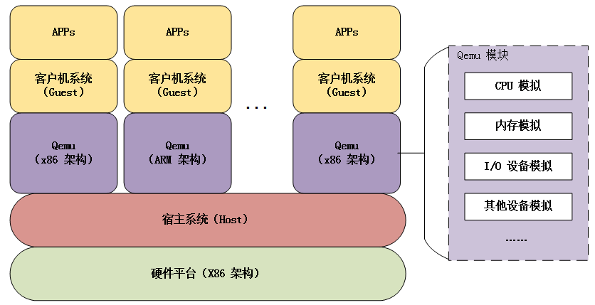
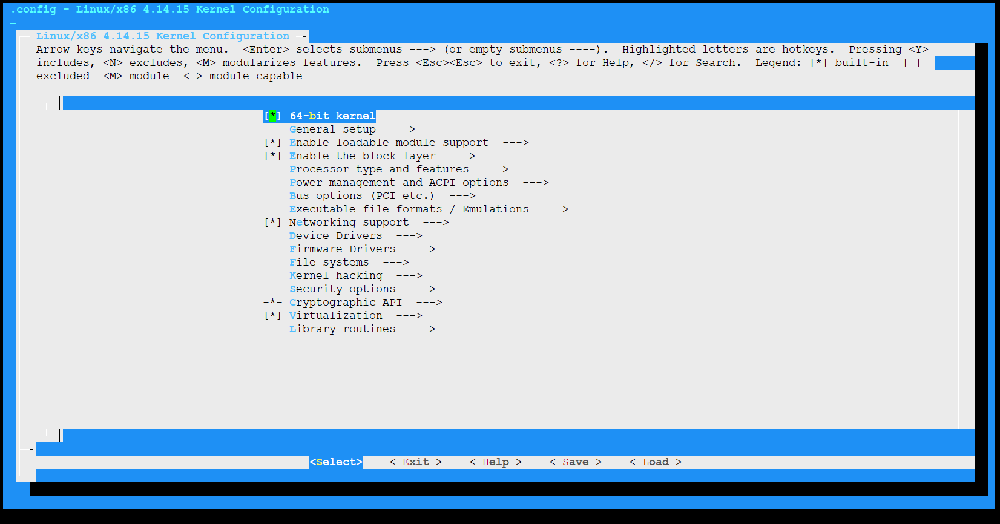
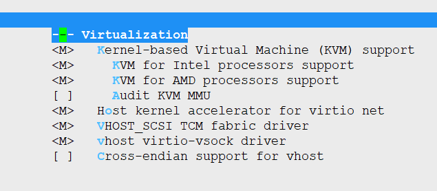
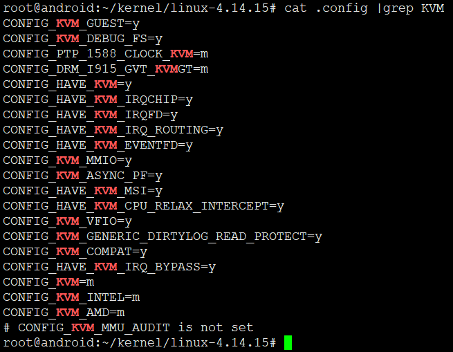

# QEMU/KVM 历史

QEMU和KVM经常被人们放在一起讨论，其实两者的关系完全可以解耦合。

QEMU最开始是由法国程序员Fabrice Bellard开发的一个模拟器。QEMU能够完成用户程序模拟和系统虚拟化模拟。用户程序模拟指的是QEMU能够将为一个平台编译的二进制文件运行在另一个不同的平台，如一个ARM指令集的二进制程序，通过QEMU的TCG（Tiny Code Generator）引擎的处理之后，ARM指令被转换成TCG中间代码，然后再转换成目的平台的代码。系统虚拟化模拟指的是QEMU能够模拟一个完整的系统虚拟机，该虚拟机有自己的虚拟CPU、芯片组、虚拟内存以及各种虚拟外部设备，能够为虚拟机中运行的操作系统和应用软件呈现出与物理计算机完全一致的硬件视图。QEMU能够模拟的平台很多，包括x86、ARM、MIPS、PPC等，早期的QEMU都是通过TCG来完成各种硬件平台的模拟，所有的虚拟机指令需要经过QEMU的转换。

系统虚拟机天生适用于云计算。云计算提供了一种按需服务的模式，让用户能够很方便地根据自己的需求使用各种计算、网络、存储资源。以计算资源中的虚拟机为例，用户可以指定不同CPU模型和内存规格的虚拟机。云计算平台可以通过系统虚拟化技术很方便地满足用户的需求。如果用户删除资源，云计算平台可以直接删除其对应的虚拟机。早期的QEMU都是软件模拟的，很明显其在性能上是不能满足要求的。所以早期的云计算平台通常使用Xen作为其底层虚拟化平台。前面提到过，Xen早期是在x86架构上直接完成的虚拟化，这需要修改虚拟机内部的操作系统，也使得Xen的整个VMM非常复杂，缺陷比较多。

Intel和AMD在2005年左右开始在CPU层面提供对系统虚拟化的支持，叫作硬件虚拟化，Intel在x86指令集的基础上增加了一套VMX扩展指令VT-x，为CPU增加了新的运行模式，完成了x86虚拟化漏洞的修补。通过新的硬件虚拟化指令，可以非常方便地构造VMM，并且x86虚拟机中的代码能够原生地运行在物理CPU上。

以色列初创公司Qumranet基于新的虚拟化指令集实现了KVM，并推广到Linux内核社区。KVM本身是一个内核模块，导出了一系列的接口到用户空间，用户空间可以使用这些接口创建虚拟机。最开始KVM只负责最核心的CPU虚拟化和内存虚拟化部分，使用QEMU作为其用户态组件，负责完成大量外设的模拟，当时的方案被称为QEMU-KVM。KVM的具体设计与实现可以参考Avi Kivity等人在2007年发表的论文“KVM:The Linux Virtual Machine Monitor”。由于KVM的设计架构精简，能够跟现有的Linux内核无缝吻合，因此在社区获得了极大的关注与支持。特别是随着Red Hat投入大量的人力去完善QEMU和KVM，QEMU社区得到了飞速发展。直到现在，QEMU社区依然非常活跃，但是其主要用途已经不是作为一个模拟器了，而是作为以QEMU-KVM为基础的为云计算服务的系统虚拟化软件。当然，不仅仅是KVM将QEMU作为应用层组件，Xen后来支持的硬件虚拟机也使用QEMU作为其用户态组件来完成虚拟机的设备模拟。


## KVM 与 Qemu 的前世今生

Qemu 是一个**纯软件实现的开源「模拟」软件**, 它能够模拟整套虚拟机的实现, 包括 CPU、内存、各种 IO 设备、鼠标、键盘、USB 、网卡、声卡等等, 基本上没有它不能模拟的. 有人可能会比较疑惑它跟 KVM 之间到底有何关系, 我们可以把它们看成是合作关系, 好基友, 谁都离不开彼此. 

**KVM 离不开 Qemu**. KVM 实现初期, 为了简化开发和代码重用, 在 Qemu 的基础上进行了修改, 主要是将比较耗性能的 CPU 虚拟化和内存虚拟化部分移到了内核中实现, 保留 IO 虚拟化模块在用户空间实现. 这样的做法主要是考虑到性能的原因, CPU 和 内存虚拟化是非常复杂的虚拟化模块, 而且使用非常频繁, 如果实现在用户空间的话, 用户态和内核态的频繁切换势必会对性能造成很大的影响. 那为什么要单独保留 IO 虚拟化在用户空间呢, 这个也是权衡之下的结果, 首先 IO 设备太多了, 其次 IO 虚拟化相对其他两个模块使用不是很频繁, 开销会小一些, 所以, 为了尽可能保持内核的纯净性, 才有了这样的分配. 

**Qemu 离不开 KVM**. 上面也说了, Qemu 是一个纯软件的实现, 运行在用户空间, 性能非常低下, 所以, 从 Qemu 的角度, 可以说是 **Qemu 使用了 KVM 的虚拟化功能, 为自身虚拟机提供加速.**

早期两者还没有区分(没有同居), KVM 修改的模块叫 qemu-kvm, 到 **Qemu1.3 版本之后, 两者就合二为一了(同居啦)**, 如果我们在用 Qemu 创建虚拟机时, **要加载 KVM 模块, 需要为其指定参数 --enable-kvm. **


* KVM 是基于硬件虚拟化(**Intel VT 或 AMD-V**)实现的一套虚拟化解决方案, 通过以上一个与 Qemu 关系的分析, 我们基本上知道它在虚拟化领域处在一个什么样的地位. 它其实只负责 CPU 和内存的虚拟化, 不负责任何设备的模拟, 而是提供接口给用户空间的 Qemu 来模拟. 这个接口是** /dev/kvm**. 
* **Qemu 通过 /dev/kvm 接口设置一个虚拟机的地址空间, 然后向它提供模拟好的 I/O 设备, 并将相关的设备回显操作映射到宿主机, 完成整个 I/O 设备的虚拟化操作. **
* /dev/kvm 接口是 Qemu 和 KVM 交互的"桥梁", 基本的原理是: /dev/kvm 本身是一个设备文件, 这就意味着可以通过 ioctl 函数来对该文件进行控制和管理, 从而可以完成用户空间与内核空间的数据交互. 在 KVM 与 Qemu 的通信过程主要就是一系列针对该设备文件的 ioctl 调用. 
* KVM是一种用于Linux内核中的虚拟化基础设施, 可以将Linux内核转换成一个Hypervisor. 
* KVM诞生初期, 以色列开发人员没有打算从头造轮子, 而是通过加载一个内核模块让Linux内核编程一个Hypervisor. 
* KVM是一个轻量级的虚拟化管理程序模块, 该模块主要来自于Linux内核, 虽然诞生比Xen晚, 但是其性能和易用性, 以及后期开源社区的贡献, 是的KVM迅速发展. 

## Qemu 架构



* Qemu 是纯软件实现的虚拟化模拟器, 几乎可以模拟任何硬件设备, 我们最熟悉的就是能够模拟一台能够独立运行操作系统的虚拟机, 虚拟机认为自己和硬件打交道, 但其实是和 Qemu 模拟出来的硬件打交道, Qemu 将这些指令转译给真正的硬件. 

* 正因为 Qemu 是纯软件实现的, 所有的指令都要经 Qemu 过一手, 性能非常低, 所以, 在生产环境中, 大多数的做法都是配合 KVM 来完成虚拟化工作, 因为 KVM 是硬件辅助的虚拟化技术, 主要负责 比较繁琐的 CPU 和内存虚拟化, 而 Qemu 则负责 I/O 虚拟化, 两者合作各自发挥自身的优势, 相得益彰. 

* Qemu 可以模拟多种非当前CPU架构平台, 虽然性能差, 但是至少模拟的了. 

**从本质上看, 虚拟出的每个虚拟机对应 host 上的一个 Qemu 进程, 而虚拟机的执行线程(如 CPU 线程、I/O 线程等)对应 Qemu 进程的一个线程.**

* Qemu 软件虚拟化实现的思路是采用二进制指令翻译技术, 主要是提取 guest 代码, 然后将其翻译成 TCG 中间代码, 最后再将中间代码翻译成 host 指定架构的代码, 如 x86 体系就翻译成其支持的代码形式, ARM 架构同理. 


## 区分Qemu、Qemu-KVM、Linux kernel KVM

```
* Qemu1.3之后默认包含KVM源码. 编译的时候 ./configure --enable-kvm 即可
* Qemu-kvm是修改了Qemu部分源码适配KVM, 本质Qemu-kvm就是Qemu
* 本质: Qemu-kvm是针对KVM专门做了修改和优化的Qemu分支
* Linux 2.6.20之后均包含KVM源码, 但不包括Qemu
* 本质: KVM = Linux内核2.6.20之后版本, 包括Kernel和KVM驱动
```

* KVM作为Linux内核模块存在, 从Linux 2.6.20版本开始被正式加入内核主干开发和正式发布代码中. 
* 只需要下载2.6.20之后的任意版本均包含KVM源码. 

## Linux 4.15 kvm源码编译

```
root@android:~/kernel/linux-4.14.15# make help
Cleaning targets:
  clean		  - Remove most generated files but keep the config and
                    enough build support to build external modules
  mrproper	  - Remove all generated files + config + various backup files
  distclean	  - mrproper + remove editor backup and patch files

Configuration targets:
  config	  - Update current config utilising a line-oriented program
  nconfig         - Update current config utilising a ncurses menu based
                    program
  menuconfig	  - Update current config utilising a menu based program
  xconfig	  - Update current config utilising a Qt based front-end
  gconfig	  - Update current config utilising a GTK+ based front-end
  oldconfig	  - Update current config utilising a provided .config as base
  localmodconfig  - Update current config disabling modules not loaded
  localyesconfig  - Update current config converting local mods to core
  silentoldconfig - Same as oldconfig, but quietly, additionally update deps
  defconfig	  - New config with default from ARCH supplied defconfig
  savedefconfig   - Save current config as ./defconfig (minimal config)
  allnoconfig	  - New config where all options are answered with no
  allyesconfig	  - New config where all options are accepted with yes
  allmodconfig	  - New config selecting modules when possible
  alldefconfig    - New config with all symbols set to default
  randconfig	  - New config with random answer to all options
  listnewconfig   - List new options
  olddefconfig	  - Same as silentoldconfig but sets new symbols to their
                    default value
  kvmconfig	  - Enable additional options for kvm guest kernel support
  xenconfig       - Enable additional options for xen dom0 and guest kernel support
  tinyconfig	  - Configure the tiniest possible kernel

Other generic targets:
  all		  - Build all targets marked with [*]
* vmlinux	  - Build the bare kernel
* modules	  - Build all modules
  modules_install - Install all modules to INSTALL_MOD_PATH (default: /)
  dir/            - Build all files in dir and below
  dir/file.[ois]  - Build specified target only
  dir/file.ll     - Build the LLVM assembly file
                    (requires compiler support for LLVM assembly generation)
  dir/file.lst    - Build specified mixed source/assembly target only
                    (requires a recent binutils and recent build (System.map))
  dir/file.ko     - Build module including final link
  modules_prepare - Set up for building external modules
  tags/TAGS	  - Generate tags file for editors
  cscope	  - Generate cscope index
  gtags           - Generate GNU GLOBAL index
  kernelrelease	  - Output the release version string (use with make -s)
  kernelversion	  - Output the version stored in Makefile (use with make -s)
  image_name	  - Output the image name (use with make -s)
  headers_install - Install sanitised kernel headers to INSTALL_HDR_PATH
                    (default: ./usr)

Static analysers:
  checkstack      - Generate a list of stack hogs
  namespacecheck  - Name space analysis on compiled kernel
  versioncheck    - Sanity check on version.h usage
  includecheck    - Check for duplicate included header files
  export_report   - List the usages of all exported symbols
  headers_check   - Sanity check on exported headers
  headerdep       - Detect inclusion cycles in headers
  coccicheck      - Check with Coccinelle.

Kernel selftest:
  kselftest       - Build and run kernel selftest (run as root)
                    Build, install, and boot kernel before
                    running kselftest on it
  kselftest-clean - Remove all generated kselftest files
  kselftest-merge - Merge all the config dependencies of kselftest to existing
                    .config.

Userspace tools targets:
  use "make tools/help"
  or  "cd tools; make help"

Kernel packaging:
  rpm-pkg             - Build both source and binary RPM kernel packages
  binrpm-pkg          - Build only the binary kernel RPM package
  deb-pkg             - Build both source and binary deb kernel packages
  bindeb-pkg          - Build only the binary kernel deb package
  tar-pkg             - Build the kernel as an uncompressed tarball
  targz-pkg           - Build the kernel as a gzip compressed tarball
  tarbz2-pkg          - Build the kernel as a bzip2 compressed tarball
  tarxz-pkg           - Build the kernel as a xz compressed tarball
  perf-tar-src-pkg    - Build perf-4.14.15.tar source tarball
  perf-targz-src-pkg  - Build perf-4.14.15.tar.gz source tarball
  perf-tarbz2-src-pkg - Build perf-4.14.15.tar.bz2 source tarball
  perf-tarxz-src-pkg  - Build perf-4.14.15.tar.xz source tarball

Documentation targets:
 Linux kernel internal documentation in different formats from ReST:
  htmldocs        - HTML
  latexdocs       - LaTeX
  pdfdocs         - PDF
  epubdocs        - EPUB
  xmldocs         - XML
  linkcheckdocs   - check for broken external links (will connect to external hosts)
  cleandocs       - clean all generated files

  make SPHINXDIRS="s1 s2" [target] Generate only docs of folder s1, s2
  valid values for SPHINXDIRS are: driver-api core-api networking input sound media userspace-api admin-guide filesystems dev-tools process crypto gpu sh kernel-hacking doc-guide

  make SPHINX_CONF={conf-file} [target] use *additional* sphinx-build
  configuration. This is e.g. useful to build with nit-picking config.

Architecture specific targets (x86):
* bzImage      - Compressed kernel image (arch/x86/boot/bzImage)
  install      - Install kernel using
                  (your) ~/bin/installkernel or
                  (distribution) /sbin/installkernel or
                  install to $(INSTALL_PATH) and run lilo
  fdimage      - Create 1.4MB boot floppy image (arch/x86/boot/fdimage)
  fdimage144   - Create 1.4MB boot floppy image (arch/x86/boot/fdimage)
  fdimage288   - Create 2.8MB boot floppy image (arch/x86/boot/fdimage)
  isoimage     - Create a boot CD-ROM image (arch/x86/boot/image.iso)
                  bzdisk/fdimage*/isoimage also accept:
                  FDARGS="..."  arguments for the booted kernel
                  FDINITRD=file initrd for the booted kernel

  i386_defconfig           - Build for i386
  x86_64_defconfig         - Build for x86_64

  make V=0|1 [targets] 0 => quiet build (default), 1 => verbose build
  make V=2   [targets] 2 => give reason for rebuild of target
  make O=dir [targets] Locate all output files in "dir", including .config
  make C=1   [targets] Check re-compiled c source with $CHECK (sparse by default)
  make C=2   [targets] Force check of all c source with $CHECK
  make RECORDMCOUNT_WARN=1 [targets] Warn about ignored mcount sections
  make W=n   [targets] Enable extra gcc checks, n=1,2,3 where
		1: warnings which may be relevant and do not occur too often
		2: warnings which occur quite often but may still be relevant
		3: more obscure warnings, can most likely be ignored
		Multiple levels can be combined with W=12 or W=123

Execute "make" or "make all" to build all targets marked with [*]
For further info see the ./README file

```









# QEMU/KVM架构

QEMU与KVM的完整架构如下图所示。该图来自QEMU官网，比较完整地展现了QEMU与KVM虚拟化的各个方面，包括QEMU的运行机制，KVM的组成，QEMU与KVM的关系，虚拟机CPU、内存、外设等的虚拟化，下面对其进行简要介绍。


