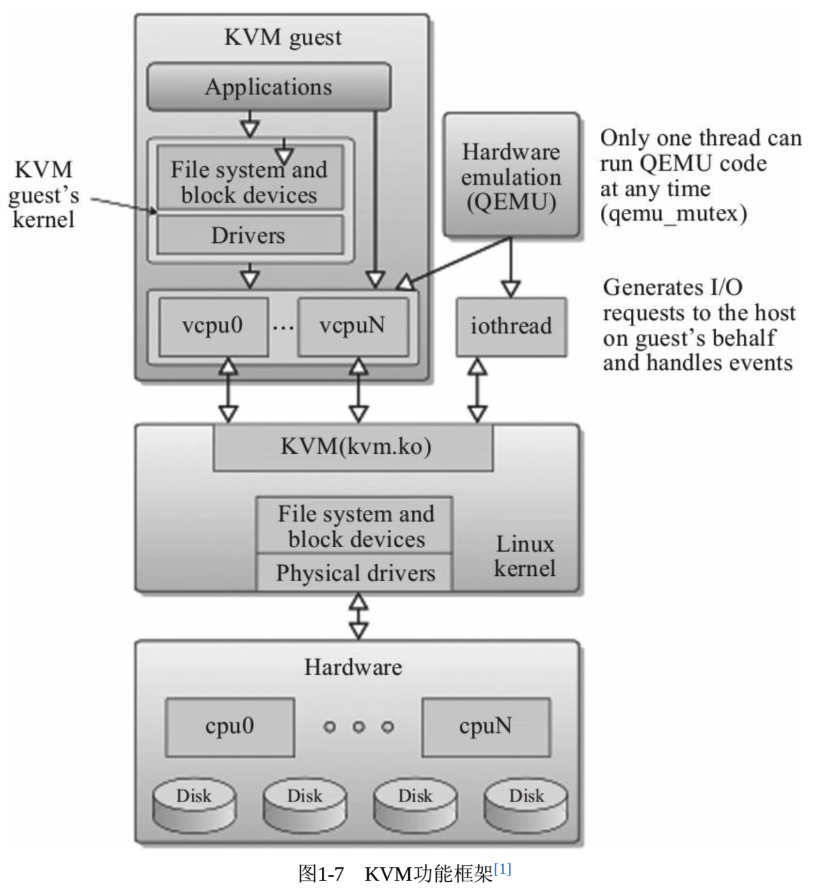

<!-- @import "[TOC]" {cmd="toc" depthFrom=1 depthTo=6 orderedList=false} -->

<!-- code_chunk_output -->

- [1. KVM 的历史](#1-kvm-的历史)
- [2. KVM 的功能概览](#2-kvm-的功能概览)
  - [2.1. 内存管理](#21-内存管理)
  - [2.2. 存储和客户机镜像的格式](#22-存储和客户机镜像的格式)
  - [2.3. 实时迁移](#23-实时迁移)
  - [2.4. 设备驱动程序](#24-设备驱动程序)
  - [2.5. 性能和可伸缩性](#25-性能和可伸缩性)
- [3. KVM 的现状](#3-kvm-的现状)
- [4. KVM 的展望](#4-kvm-的展望)

<!-- /code_chunk_output -->

# 1. KVM 的历史

KVM 全称是 Kernel-based Virtual Machine, 即基于内核的虚拟机, 是采用硬件虚拟化技术的全虚拟化解决方案. 

KVM 最初是由 Qumranet 公司的 Avi Kivity 开发的, 作为他们的 VDI 产品的后台虚拟化解决方案. 为了简化开发, Avi Kivity 并没有选择从底层开始新写一个 Hypervisor, 而是选择了基于 Linux kernel, 通过加载模块使 Linux kernel 本身变成一个 Hypervisor. 2006 年 10 月, 在先后完成了基本功能、动态迁移以及主要的性能优化之后, Qumranet 正式对外宣布了 KVM 的诞生. 同月, KVM 模块的源代码被正式纳入 Linux kernel, 成为内核源代码的一部分. 作为一个功能和成熟度都逊于 Xen 的项目, 在这么快的时间内被内核社区接纳, 主要原因在于: 

1) 在虚拟化方兴未艾的当时, 内核社区急于将虚拟化的支持包含在内, 但是 Xen 取代内核由自身管理系统资源的架构引起了内核开发人员的不满和抵触. 

2) Xen 诞生于硬件虚拟化技术出现之前, 所以它在设计上采用了半虚拟化的方式, 这让 Xen 采用硬件虚拟化技术有了更多的历史包袱, 不如 KVM 新兵上阵一身轻. 

2008 年 9 月 4 日, Redhat 公司以 1.07 亿美元收购了 Qumranet 公司, 包括它的 KVM 开源项目和开发人员. 自此, Redhat 开始在其 RHEL 发行版中集成 KVM, 逐步取代 Xen, 并从**RHEL7**开始, 正式**不支持 Xen**. 

# 2. KVM 的功能概览

KVM 从诞生开始就定位于基于硬件虚拟化支持的全虚拟化实现. 它以内核模块的形式加载之后, 就将 Linux 内核变成了一个 Hypervisor, 但**硬件管理**等还是通过**Linux kernel**来完成的, 所以它是一个典型的**Type 2 Hypervisor**, 如图 1-7 所示. 

- **一个 KVM 客户机**对应于一个**Linux 进程**, 
- **每个 vCPU**则是**这个进程**下的**一个线程**, 
- 还有单独的**处理 IO 的线程**, 也在**一个线程组**内. 

所以, 宿主机上各个客户机是由宿主机内核像**调度普通进程**一样调度的, 即可以通过 Linux 的各种进程调度的手段来实现不同客户机的权限限定、优先级等功能. 

客户机所看到的硬件设备是 QEMU 模拟出来的(不包括 VT\-d 透传的设备, 详见 6.2 节), 当客户机对模拟设备进行操作时, 由**QEMU 截获**并转换为对实际的物理设备(可能设置都不实际物理地存在)的驱动操作来完成. 

下面介绍一些 KVM 的功能特性. 

## 2.1. 内存管理

KVM 依赖**Linux 内核**进行内存管理. 上面提到, **一个 KVM 客户机**就是一个**普通的 Linux 进程**, 所以, **客户机**的"**物理内存**"就是宿主机内核管理的**普通进程的虚拟内存！！！**. 

进而, Linux 内存管理的机制, 如**大页**、**KSM(Kernel Same Page Merge, 内核的同页合并**)、**NUMA(Non\-Uniform Memory Arch, 非一致性内存架构**)、通过**mmap 的进程间共享**内存, 统统可以应用到**客户机内存管理**上. 

早期时候, 客户机自身内存访问落实到真实的宿主机的物理内存的机制叫影子页表(Shadow Page Table). KVM Hypervisor 为每个客户机准备一份影子页表, 与客户机自身页表建立一一对应的关系. 客户机自身页表描述的是 GVA→GPA 的映射关系; 影子页表描述的是 GPA→HPA 的映射关系. 当客户机操作自身页表的时候, KVM 就相应地更新影子页表. 比如, 当客户机第一次访问某个物理页的时候, 由于 Linux 给进程的内存通常都是拖延到最后要访问的一刻才实际分配的, 所以, 此时影子页表中这个页表项是空的, KVM Hypervisor 会像处理通常的缺页异常那样, 把这个物理页补上, 再返回客户机执行的上下文中, 由客户机继续完成它的缺页异常. 

影子页表的机制是比较拗口, 执行的代价也是比较大的. 所以, 后来, 这种靠软件的 GVA→GPA→HVA→HPA 的转换被硬件逻辑取代了, 大大提高了执行效率. 这就是 Intel 的 EPT 或者 AMD 的 NPT 技术, 两家的方法类似, 都是通过一组可以被硬件识别的数据结构, 不用 KVM 建立并维护额外的影子页表, 由硬件自动算出 GPA→HPA. 现在的 KVM**默认都打开了 EPT/NPT 功能**. 

## 2.2. 存储和客户机镜像的格式

严格来说, 这是**QEMU 的功能特性**. 

KVM 能够使用**Linux 支持的**任何存储来存储虚拟机镜像, 包括具有 IDE、SCSI 和 SATA 的本地磁盘, 网络附加存储(NAS)(包括 NFS 和 SAMBA/CIFS), 或者支持 iSCSI 和光线通道的 SAN. 多路径 I/O 可用于改进存储吞吐量和提供冗余. 

由于 KVM 是 Linux 内核的一部分, 它可以利用所有领先存储供应商都支持的一种成熟且可靠的存储基础架构, 它的存储堆栈在生产部署方面具有良好的记录. 

KVM 还支持**全局文件系统(GFS2**)等**共享文件系统**上的**虚拟机镜像**, 以允许**客户机镜像**在**多个宿主机之间共享或使用逻辑卷共享**. 磁盘镜像支持**稀疏文件形式**, 支持通过仅在虚拟机**需要时分配存储空间**, 而不是提前分配整个存储空间, 这就提高了存储利用率. 

KVM 的原生磁盘格式为**QCOW2**, 它支持快照, 允许多级快照、压缩和加密. 

## 2.3. 实时迁移

KVM 支持实时迁移, 这提供了在**宿主机之间转移正在运行的客户机**而**不中断服务**的能力. 实时迁移对用户是透明的, 客户机保持打开, 网络连接保持活动, 用户应用程序也持续运行, 但客户机转移到了一个新的宿主机上. 

除了实时迁移, KVM 支持将客户机的当前状态(快照, snapshot)保存到磁盘, 以允许存储并在以后恢复它. 

## 2.4. 设备驱动程序

KVM 支持**混合虚拟化！！！**, 其中**半虚拟化的驱动程序**安装在**客户机操作系统**中, 允许虚拟机使用**优化的 I/O 接口**而**不使用模拟的设备！！！**, 从而为网络和块设备提供高性能的 I/O. 

KVM 使用的**半虚拟化的驱动**程序是**IBM 和 Redhat 联合 Linux 社区**开发的**VirtIO 标准**; 它是一个**与 Hypervisor 独立**的、构建**设备驱动程序的接口**, 允许**多种 Hypervisor**使用一组**相同的设备驱动程序**, 能够实现更好的对客户机的互操作性. 

同时, KVM 也支持**Intel 的 VT\-d 技术**, 通过将**宿主机**的**PCI 总线**上的设备透传(pass\-through)给客户机, 让客户机可以直接使用原生的驱动程序高效地使用这些设备. 这种使用是几乎不需要 Hypervisor 的介入的. 

## 2.5. 性能和可伸缩性

KVM 也继承了 Linux 的性能和可伸缩性. KVM 在 CPU、内存、网络、磁盘等虚拟化性能上表现出色, 大多都在原生系统的 95%以上. KVM 的伸缩性也非常好, 支持拥有多达**288 个 vCPU**和**4TB RAM**的客户机, 对于宿主机上可以同时运行的客户机数量, 软件上无上限. 

这意味着, 任何要求非常苛刻的应用程序工作负载都可以运行在 KVM 虚拟机上. 

# 3. KVM 的现状

至本书写作时, KVM 已经 10 周岁了. 10 年之间, 得益于与 Linux 天然一体以及 Redhat 的倾力打造, **KVM**已经成为**Openstack 用户**选择的最主流的 Hypervisor(因为 KVM 是 Openstack 的默认 Hypervisor). 来自 Openstack 的调查显示, KVM 占到 87%以上的部署份额, 并且(笔者认为)还会继续增大. 

可以说, **KVM**已经主宰了**公有云部署**的 Hypervisor 市场; 而在**私有云部署**方面, 尤其大公司内部私有云部署, 还是**VMware**的地盘, 目前受到**HyperV**的竞争. 

功能上, 虚拟化发展到今天, 各个 Hypervisor 的主要功能都趋同. KVM 作为后起之秀, 并且在公有云上广泛部署, 其功能的完备性是毋庸置疑的. 并且由于其开源性, 反而较少一些出于商业目的的限制, 比如一篇文章( ftp//public.dhe.ibm.com/linux/pdfs/Clabby_Analytics_-_VMware_v_KVM.pdf )中比较 VMware EXS 与 KVM, 就是一个例子. 

性能上, 作为同样开源的 Hypervisor, KVM 和 Xen 都很优秀, 都能达到原生系统 95%以上的效率(CPU、内存、网络、磁盘等 benchmark 衡量), KVM 甚至还略微好过 Xen 一点点. 与**微软的 Hyper\-V**相比, KVM 似乎略逊于最新的 Windows 2016 上的 HyperV, 而好于 Windows 2012 R2 上的 HyperV, 但这是微软的一家之言, 笔者没有重新测试验证. 其他与诸如 VMware EXS 等的性能比较, 网上也可以找到很多, 读者可以自行搜索. 总的来说, 即使各有优劣, 虚拟化技术发展到今天已经成熟, KVM 也是如此. 

# 4. KVM 的展望

经过 10 年的发展, KVM 已经成熟. 那么, 接下来 KVM 会怎样进一步发展呢?

1) 大规模部署尚有挑战. KVM 是 Openstack 和 oVirt 选择的默认 Hypervisor, 因而实际的广泛部署常常是大规模的(large scale, scalability). 这种大规模, 一方面指高并发、高密度, 即一台宿主机上支持尽可能多的客户机; 另一方面, 也指大规模的单个客户机, 即单个客户机配备尽可能多的 vCPU 和内存等资源, 典型的, 这类需求来自高性能计算(HPC)领域. 随着硬件尤其是 CPU 硬件技术的不停发展(物理的 processor 越来越多), 这种虚拟化的大规模方面的需求也在不停地增大, 并且这不是简单数量的增加, 这种增加会伴随着新的挑战等着 KVM 开发者去解决, 比如热迁移的宕机时间(downtime)就是其中一例. 

2) 实时性(Realtime). 近几年一个新的趋势就是 NFV(Network Functions Virtualization, 网络功能的虚拟化), 它指将原先物理的网络设备搬到一个个虚拟的客户机上, 以便更好地实现软件定义网络的愿景. 网络设备对实时性的要求是非常高的; 而不巧, NFV 的开源平台 OPNFV 选择了 Openstack, 尽管 Openstack 向下支持各种 Hypervisor, 但如前文所说, KVM 是其默认以及主要部署的选择, 所以 NFV 实时性的要求责无旁贷地落到了 KVM 头上, NFV-KVM 项目应运而生, 它作为 OPNFV 的子项目主要解决 KVM 在实时性方面受到的挑战. 

3) 安全是永恒的主题/话题. 就像网络病毒永远不停地演变推陈出新一样, 新时代的 IT 架构的主体, 云/虚拟化, 也会一直受到各类恶意攻击的骚扰, 从而陷入道高一尺魔高一丈的循环. Hypervisor 的开发者、应用者会一直从如何更好地隔离客户机、更少的 Hypervisor 干预等方面入手, 增加虚拟化的安全性. KVM 作为 Type 2 的 Hypervisor, 天然地与 Host OS 有关联, 安全性方面的话题更引人注目. 同时, 硬件厂商如 Intel, 也会从硬件层面不停地推出新的安全方面的功能(feature), KVM 从软件方面也要跟上脚步, 使能(enable)之. 

4) 性能调优. 如同一句广告词说的: "进无止境". 一方面, 新的功能代码的不停引入总会给性能调优开辟新的空间; 另一方面, 老的功能的实现也许还有更好的方法. 还有, 新的硬件功能的出现, 也是性能调优永恒的动力源泉. 