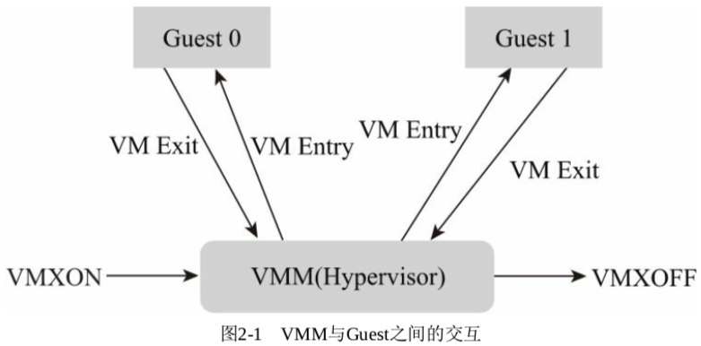
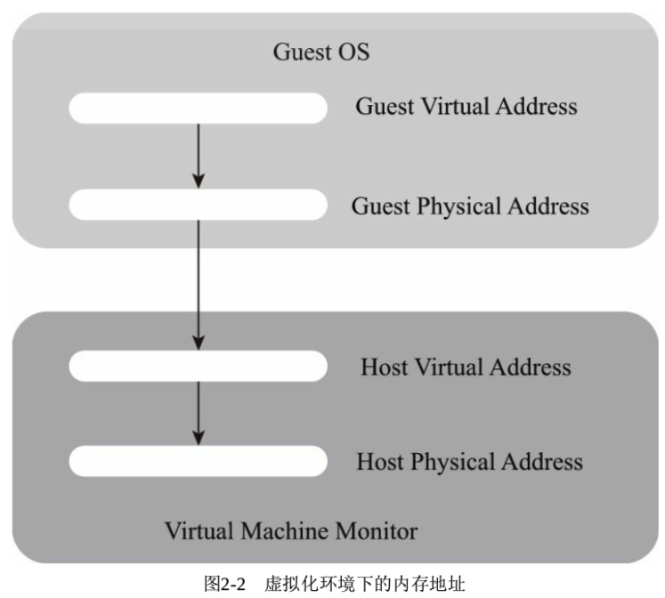
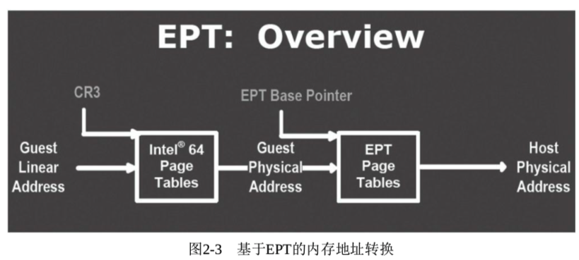
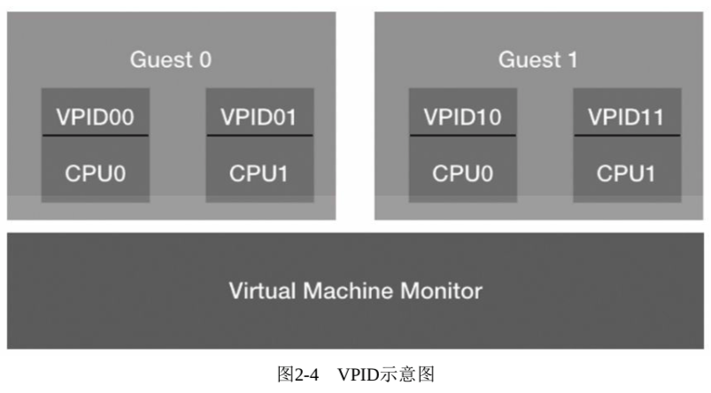
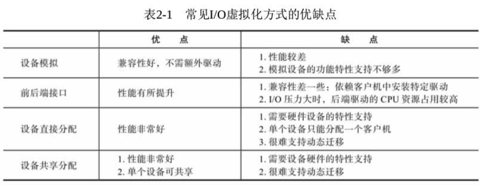
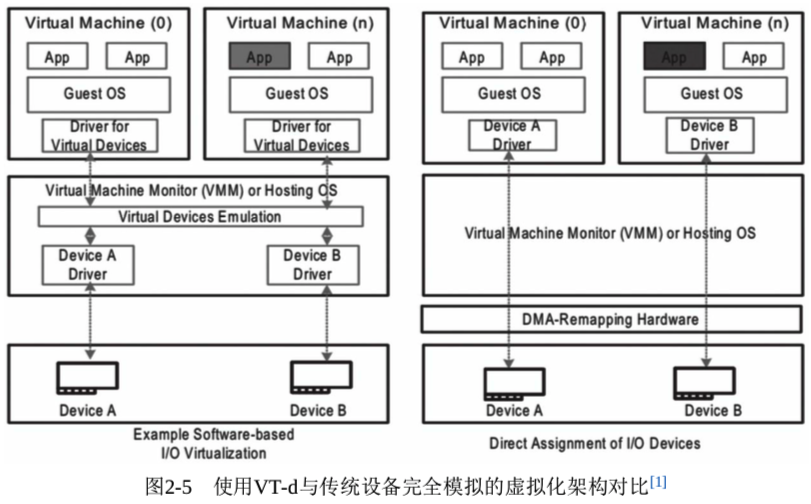
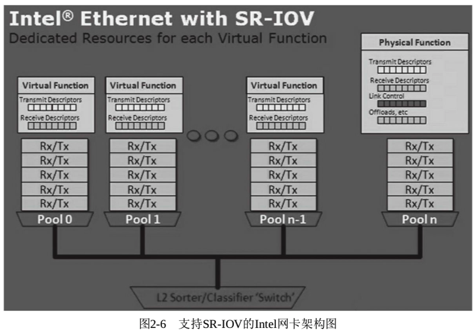
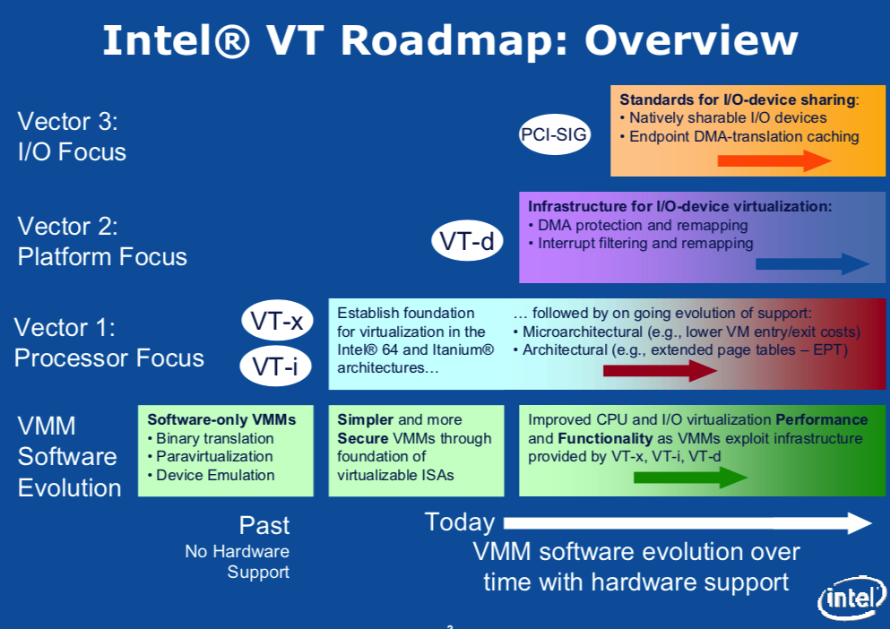

<!-- @import "[TOC]" {cmd="toc" depthFrom=1 depthTo=6 orderedList=false} -->

<!-- code_chunk_output -->

- [1. 概述](#1-概述)
- [2. CPU 虚拟化](#2-cpu-虚拟化)
- [3. 内存虚拟化](#3-内存虚拟化)
- [4. I/O 虚拟化](#4-io-虚拟化)
- [5. Intel 虚拟化技术发展](#5-intel-虚拟化技术发展)

<!-- /code_chunk_output -->

# 1. 概述

**硬件虚拟化技术**通过虚拟化**指令集**、**MMU**(Memory Map Unit)以及**IO**来运行不加修改的操作系统.

以 Intel Virtualization Technology(Intel VT)为例说明硬件辅助虚拟化技术. 中间也会讲 AMD SVM

Intel VT 是 Intel 平台上**硬件虚拟化技术的总称**, 包含了对**CPU**、**内存**和**I/O 设备**等各方面支持. 图 5-1 的 Physical Platform Resource 列举了 Intel VT 涵盖的内容.


图 5-1 展示了使用 Intel VT 技术实现的 VMM 的典型架构, 上层是通用功能, 如资源调度、系统调度等. 下层是平台相关的部分, 即使用 Intel VT 实现的处理器虚拟化、内存虚拟化和 I/O 虚拟化.

- 在**CPU 虚拟化**方面, Intel VT 提供了`VT-x`(Intel Virtualization technology for x86)技术; 中断虚拟化, Intel 提供了 APICv 机制
- **内存虚拟化**, Intel VT 提供了**EPT(Extended Page Table)技术**;
- **I/O 设备虚拟化**, Intel 提供了`VT-d`(Intel Virtualization Technology for Direct I/O)等技术.

注: 中断虚拟化也属于 CPU 虚拟化一部分.

AMD 平台提供了类似的技术.

- 在**处理器虚拟化**方面, AMD SVM 提供了与 Intel VT-x 类似的技术, 即 AMD Virtualization(`AMD-V`); 中断虚拟化, AMD 提供了 AVIC 机制, 且不支持 x2APIC, 旨在减少虚拟化环境中的中断开销.
- 在**内存虚拟化**方面, AMD SVM 提供了**NPT(Nested Page Table**)技术;
- 在 I/O 设备虚拟化方面, AMD SVM 提供了**IOMMU**(I/O Memory Management Unit)技术, `AMD-Vi`.

IOMMU, 允许 guest 通过 DMA 和中断重映射直接使用外部设备, 例如以太网, 加速图形卡和硬盘驱动器控制器. 有时称为 PCI passthrough.

IOMMU 还允许操作系统通过使用内存地址转换来消除反弹缓冲区, 该反弹缓冲区使操作系统可以与内存地址空间小于操作系统内存地址空间的外围设备进行通信. 同时, IOMMU 还允许操作系统和系统管理程序防止故障或恶意硬件损害内存安全性.

- AMD 的 I/O 虚拟化技术叫做`AMD-Vi`, 最初称为 IOMMU.
- Intel 的叫做`VT-d`(Intel Virtualization Technology for Direct I/O).

网络虚拟化

Intel 提供了`VT-c`

PCI-SIG Single Root I/O Virtualization (SR-IOV), 并非 x86 特定.

参考: https://en.wikipedia.org/wiki/X86_virtualization

Hardware-assisted virtualization
* Central processing unit
    * Virtual 8086 mode
    * AMD virtualization (AMD-V)
    * Intel virtualization (VT-x)
    * VIA virtualization (VIA VT)
    * Interrupt virtualization (AMD AVIC and Intel APICv)
* Graphics processing unit
* Chipset
    * I/O MMU virtualization (AMD-Vi and Intel VT-d)
    * Network virtualization (VT-c)
        * PCI-SIG Single Root I/O Virtualization (SR-IOV)

# 2. CPU 虚拟化

传统的处理器通过选择不同的运行(Ring 特权)模式, 来选择指令集的范围, 内存的寻址方式, 中断发生方式等操作. 在原有的 Ring 特权等级的基础上, 处理器的硬件虚拟化技术带来了一个新的运行模式: Guest 模式[1], 来实现指令集的虚拟化. 当切换到 Guest 模式时, 处理器提供了先前完整的特权等级, 让 Guest 操作系统可以不加修改的运行在物理的处理器上. Guest 与 Host 模式的处理器上下文完全由硬件进行保存与切换. 此时, 虚拟机监视器(Virtual Machine Monitor)通过一个位于内存的数据结构(Intel 称为 VMCS, AMD 称为 VMCB)来控制 Guest 系统同 Host 系统的交互, 以完成整个平台的虚拟化.

CPU 是计算机系统最核心的模块, 我们的程序执行到最后都是翻译为机器语言在 CPU 上执行的. 在没有 CPU 硬件虚拟化技术之前, 通常使用指令的二进制翻译(binary translation)来实现虚拟客户机中 CPU 指令的执行, 很早期的 VMware 就使用这样的方案, 其指令执行的翻译比较复杂, 效率比较低. 所以 Intel 最早发布的虚拟化技术就是 CPU 虚拟化方面的, 这才为本书的主角——KVM 的出现创造了必要的硬件条件.

Intel 在处理器级别提供了对虚拟化技术的支持, 被称为 VMX(virtual-machine extensions). 有两种 VMX 操作模式: VMX 根操作(root operation)与 VMX 非根操作(non-root operation). 作为虚拟机监控器中的 KVM 就是运行在根操作模式下, 而虚拟机客户机的整个软件栈(包括操作系统和应用程序)则运行在非根操作模式下. 进入 VMX 非根操作模式被称为"VM Entry"; 从非根操作模式退出, 被称为"VM Exit".

VMX 的根操作模式与非 VMX 模式下最初的处理器执行模式基本一样, 只是它现在支持了新的 VMX 相关的指令集以及一些对相关控制寄存器的操作. VMX 的非根操作模式是一个相对受限的执行环境, 为了适应虚拟化而专门做了一定的修改; 在客户机中执行的一些特殊的敏感指令或者一些异常会触发"VM Exit"退到虚拟机监控器中, 从而运行在 VMX 根模式. 正是这样的限制, 让虚拟机监控器保持了对处理器资源的控制.

一个虚拟机监控器软件的最基础的运行生命周期及其与客户机的交互如图 2-1 所示.



软件通过执行 VMXON 指令进入 VMX 操作模式下; 在 VMX 模式下通过 VMLAUNCH 和 VMRESUME 指令进入客户机执行模式, 即 VMX 非根模式; 当在非根模式下触发 VM Exit 时, 处理器执行控制权再次回到宿主机的虚拟机监控器上; 最后虚拟机监控可以执行 VMXOFF 指令退出 VMX 执行模式.

逻辑处理器在根模式和非根模式之间的切换通过一个叫作 VMCS(virtual-machine control data structure)的数据结构来控制; 而 VMCS 的访问是通过 VMCS 指针来操作的. VMCS 指针是一个指向 VMCS 结构的 64 位的地址, 使用 VMPTRST 和 VMPTRLD 指令对 VMCS 指针进行读写, 使用 MREAD、VMWRITE 和 VMCLEAR 等指令对 VMCS 实现配置.

对于一个逻辑处理器, 它可以维护多个 VMCS 数据结构, 但是在任何时刻只有一个 VMCS 在当前真正生效. 多个 VMCS 之间也是可以相互切换的, VMPTRLD 指令就让某个 VMCS 在当前生效, 而其他 VMCS 就自然成为不是当前生效的. 一个虚拟机监控器会为一个虚拟客户机上的每一个逻辑处理器维护一个 VMCS 数据结构.

根据 Intel 的官方文档, 我们这里列举部分在非根模式下会导致"VM Exit"的敏感指令和一些异常供读者朋友参考, 这对于理解 KVM 的执行机制是必要的, 因为 KVM 也必须按照 CPU 的硬件规范来实现虚拟化软件逻辑.

1) 一定会导致 VM Exit 的指令: CPUID、GETSEC、INVD、XSETBV 等, 以及 VMX 模式引入的 INVEPT、INVVPID、VMCALL、VMCLEAR、VMLAUNCH、VMPTRLD、VMPTRST、VMRESUME、VMXOFF、VMXON 等.

2) 在一定的设置条件下会导致 VM Exit 的指令: CLTS、HLT、IN、OUT、INVLPG、INVPCID、LGDT、LMSW、MONITOR、MOV from CR3、MOV to CR3、MWAIT、MWAIT、RDMSR、RWMSR、VMREAD、VMWRITE、RDRAND、RDTSC、XSAVES、XRSTORS 等. 如在处理器的虚拟机执行控制寄存器中的"HLT exiting"比特位被置为 1 时, HLT 的执行就会导致 VM Exit.

3) 可能会导致 VM Exit 的事件: 一些异常、三次故障(Triple fault)、外部中断、不可屏蔽中断(NMI)、INIT 信号、系统管理中断(SMI)等. 如在虚拟机执行控制寄存器中的"NMI exiting"比特位被置为 1 时, 不可屏蔽中断就会导致 VM Exit.

最后提一下, 由于发生一次 VM Exit 的代价是比较高的(可能会消耗成百上千个 CPU 执行周期, 而平时很多指令是几个 CPU 执行周期就能完成), 所以对于 VM Exit 的分析是虚拟化中性能分析和调优的一个关键点.

# 3. 内存虚拟化

传统的操作系统通过硬件 MMU 完成虚拟地址到物理地址的映射. 在虚拟化环境中, Guest 的虚拟地址需要更多一层的转换, 才能放到地址总线上:

```
    Guest 虚拟地址 -> Guest 物理地址 -> Host 物理地址
                 ^               ^
                 |               |
                MMU1            MMU2
```

其中 MMU1 可以由软件模拟(Shadow paging 中的 vTLB)或者硬件实现(Intel EPT、AMD NPT). MMU2 由硬件提供.


内存虚拟化的目的是给虚拟客户机操作系统提供一个从 0 地址开始的连续物理内存空间, 同时在多个客户机之间实现隔离和调度. 在虚拟化环境中, 内存地址的访问会主要涉及以下 4 个基础概念, 图 2-2 形象地展示了虚拟化环境中内存地址.



1) 客户机虚拟地址, GVA(Guest Virtual Address)

2) 客户机物理地址, GPA(Guest Physical Address)

3) 宿主机虚拟地址, HVA(Host Virtual Address)

4) 宿主机物理地址, HPA(Host Physical Address)

内存虚拟化就是要将客户机虚拟地址(GVA)转化为最终能够访问的宿主机上的物理地址(HPA). 对于客户机操作系统而言, 它不感知内存虚拟化的存在, 在程序访问客户机中虚拟地址时, 通过 CR3 寄存器可以将其转化为物理地址, 但是在虚拟化环境中这个物理地址只是客户机的物理地址, 还不是真实内存硬件上的物理地址. 所以, 虚拟机监控器就需要维护从客户机虚拟地址到宿主机物理地址之间的一个映射关系, 在没有硬件提供的内存虚拟化之前, 这个维护映射关系的页表叫作影子页表(Shadow Page Table). 内存的访问和更新通常是非常频繁的, 要维护影子页表中对应关系会非常复杂, 开销也较大. 同时需要为每一个客户机都维护一份影子页表, 当客户机数量较多时, 其影子页表占用的内存较大也会是一个问题.

Intel CPU 在硬件设计上就引入了 EPT(Extended Page Tables, 扩展页表), 从而将客户机虚拟地址到宿主机物理地址的转换通过硬件来实现. 当然, 这个转换是通过两个步骤来实现的, 如图 2-3 所示. 首先, 通过客户机 CR3 寄存器将客户机虚拟地址转化为客户机物理地址, 然后通过查询 EPT 来实现客户机物理地址到宿主机物理地址的转化. EPT 的控制权在虚拟机监控器中, 只有当 CPU 工作在非根模式时才参与内存地址的转换. 使用 EPT 后, 客户机在读写 CR3 和执行 INVLPG 指令时不会导致 VM Exit, 而且客户页表结构自身导致的页故障也不会导致 VM Exit. 所以通过引入硬件上 EPT 的支持, 简化了内存虚拟化的实现复杂度, 同时也提高了内存地址转换的效率.



除了 EPT, Intel 在内存虚拟化效率方面还引入了 VPID(Virtual-processor identifier)特性, 在硬件级对 TLB 资源管理进行了优化. 在没有 VPID 之前, 不同客户机的逻辑 CPU 在切换执行时需要刷新 TLB, 而 TLB 的刷新会让内存访问的效率下降. VPID 技术通过在硬件上为 TLB 增加一个标志, 可以识别不同的虚拟处理器的地址空间, 所以系统可以区分虚拟机监控器和不同虚拟机上不同处理器的 TLB, 在逻辑 CPU 切换执行时就不会刷新 TLB, 而只需要使用对应的 TLB 即可. VPID 的示意图如图 2-4 所示. 当 CPU 运行在非根模式下, 且虚拟机执行控制寄存器的"enable VPID"比特位被置为 1 时, 当前的 VPID 的值是 VMCS 中的 VPID 执行控制域的值, 其值是非 0 的. VPID 的值在 3 种情况下为 0, 第 1 种是在非虚拟化环境中执行时, 第 2 种是在根模式下执行时, 第 3 种情况是在非根模式下执行但"enable VPID"控制位被置 0 时.



# 4. I/O 虚拟化

系统的 IO 虚拟化技术, 通常是 VMM 捕捉 Guest 的 IO 请求, 通过软件模拟的传统设备将其请求传递给物理设备. 一些新的支持虚拟化技术的设备, 通过硬件技术(如 Intel VT-d), 可以将其直接分配给 Guest 操作系统, 避免软件开销.


在虚拟化的架构下, 虚拟机监控器必须支持来自客户机的 I/O 请求.

通常情况下有以下**4 种 I/O 虚拟化方式**.

1) 设备模拟: 在虚拟机监控器中模拟一个传统的 I/O 设备的特性, 比如在 QEMU 中模拟一个 Intel 的千兆网卡或者一个 IDE 硬盘驱动器, 在客户机中就暴露为对应的硬件设备. 客户机中的 I/O 请求都由虚拟机监控器捕获并模拟执行后返回给客户机.

2) 前后端驱动接口: 在虚拟机监控器与客户机之间定义一种全新的适合于虚拟化环境的交互接口, 比如常见的 virtio 协议就是在客户机中暴露为 virtio-net、virtio-blk 等网络和磁盘设备, 在 QEMU 中实现相应的 virtio 后端驱动.

3) 设备直接分配: 将一个物理设备, 如一个网卡或硬盘驱动器直接分配给客户机使用, 这种情况下 I/O 请求的链路中很少需要或基本不需要虚拟机监控器的参与, 所以性能很好.

4) 设备共享分配: 其实是设备直接分配方式的一个扩展. 在这种模式下, 一个(具有特定特性的)物理设备可以支持多个虚拟机功能接口, 可以将虚拟功能接口独立地分配给不同的客户机使用. 如 SR-IOV 就是这种方式的一个标准协议.

表 2-1 展示了这 4 种 I/O 虚拟化方式的优缺点, 给读者一个概括性的认识. 在这 4 种方式中, 前两种都是纯软件的实现, 后两种都需要特定硬件特性的支持.



设备直接分配在 Intel 平台上就是 VT-d(Virtualization Technology For Directed I/O)特性, 一般在系统 BIOS 中可以看到相关的参数设置. Intel VT-d 为虚拟机监控器提供了几个重要的能力: I/O 设备分配、DMA 重定向、中断重定向、中断投递等. 图 2-5 描述了在 VT-d 硬件特性的帮助下实现的设备直接分配的架构, 并与最传统的、通过软件模拟设备的 I/O 设备虚拟化进行了对比.



尽管 VT-d 特性支持的设备直接分配方式性能可以接近物理设备在非虚拟化环境中的性能极限, 但是它有一个缺点: 单个设备只能分配给一个客户机, 而在虚拟化环境下一个宿主机上往往运行着多个客户机, 很难保证每个客户机都能得到一个直接分配的设备. 为了克服这个缺点, 设备共享分配硬件技术就应运而生, 其中 SR-IOV(Single Root I/O Virtualization and Sharing)就是这样的一个标准. 实现了 SR-IOV 规范的设备, 有一个功能完整的 PCI-e 设备成为物理功能(Physical Function, PF). 在使能了 SR-IOV 之后, PF 就会派生出若干个虚拟功能(Virtual Function, VF). VF 看起来依然是一个 PCI-e 设备, 它拥有最小化的资源配置, 有用独立的资源, 可以作为独立的设备直接分配给客户机使用. Intel 的很多高级网卡如 82599 系列网卡就支持 SR-IOV 特性, 一个 85299 网卡 PF 就即可配置出多达 63 个 VF, 基本可满足单个宿主机上的客户机分配使用. 当然, SR-IOV 这种特性可以看作 VT-d 的一个特殊例子, 所以 SR-IOV 除了设备本身要支持该特性, 同时也需要硬件平台打开 VT-d 特性支持. 图 2-6 展示了一个 Intel 以太网卡支持 SR-IOV 的硬件基础架构.



# 5. Intel 虚拟化技术发展

虚拟化技术从最初的纯软件的虚拟化技术, 逐步发展到硬件虚拟化技术的支持, 时至今日硬件虚拟化技术已比较成熟. 前面 3 小节已经分别就各种硬件虚拟化技术进行了介绍, 这里以 Intel 平台为例, 再对其做一个小结.

Intel 硬件虚拟化技术大致分为如下 3 个类别(这个顺序也基本上是相应技术出现的时间先后顺序).

1) **VT-x 技术**: 是指 Intel 处理器中进行的一些虚拟化技术支持, 包括**CPU**中引入的最基础的**VMX 技术**, 使得 KVM 等硬件虚拟化基础的出现成为可能. 同时也包括**内存虚拟化**的硬件支持 **EPT、VPID** 等技术.

2) **VT-d** 技术: 是指 Intel 的**芯片组(南桥)的虚拟化**技术支持, 通过 Intel **IOMMU**可以实现对**设备直接分配**的支持.

VT-d 技术可下载 `<Intel Virtualization Technology for Directed I/O Architecture Specification>` 文档

3) **VT-c** 技术: 是指 Intel 的**I/O 设备**相关的虚拟化技术支持, 主要包含**两个技术**:

- 一个是借助**虚拟机设备队列(VMDq**)最大限度提高 I/O 吞吐率, VMDq 由**Intel 网卡！！！** 中的**专用硬件**来完成;
- 另一个是借助**虚拟机直接互连(VMDc**)大幅提升虚拟化性能, VMDc 主要就是**基于 SR-IOV 标准**将**单个 Intel 网卡**产生**多个 VF 设备**, 用来**直接分配**给客户机.

图 2-7 展示了 Intel 的硬件虚拟化技术的发展线路图, 从中我们可以看到从 2005 年开始支持 VT-x 硬件虚拟化, 到现在较多的 SR-IOV 等 VT-d 的虚拟化技术, 硬件虚拟化技术家族有了越来越多的成员, 技术特性也逐步完善. 如何在具体业务的生产环境中充分利用硬件虚拟化技术带来的技术红利, 构建高性能、可扩展、易维护的虚拟化环境, 可能是大家学习虚拟化的一个主要目标. 通过本书, 希望大家也能够了解一些实践经验和受到一些启发.





