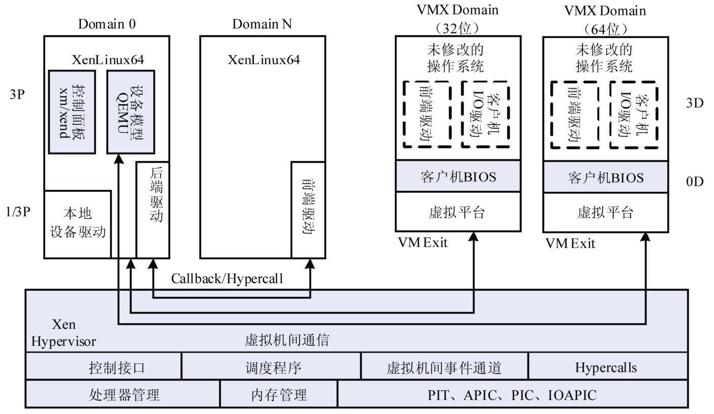

<!-- @import "[TOC]" {cmd="toc" depthFrom=1 depthTo=6 orderedList=false} -->

<!-- code_chunk_output -->

- [VMware](#vmware)
- [2 Microsoft](#2-microsoft)
- [3 Xen](#3-xen)
- [4 KVM](#4-kvm)

<!-- /code_chunk_output -->

虚拟化技术的应用从最初的服务器扩展到了桌面等更宽的领域.

# VMware

基于 Hypervisor 架构的 VMware ESX Server 直接运行在物理硬件上, 无须操作系统.

# 2 Microsoft

# 3 Xen

基于 GPL 授权的开源虚拟机软件.

从技术上, **Xen 基于混合模型**, 如图 3\-12. **特权操作系统(Domain 0**)可以是 Linux、Solaris 以及 NetBSD.

Xen 最初的虚拟化思路是**类虚拟化**, 通过**修改 Linux 内核**, 实现处理器和内存的虚拟化, 通过引进**I/O 前段驱动/后端驱动(front/backend)架构**实现设备的类虚拟化. Xen 1.0 和 2.0 实现了类虚拟化, 即图中 Domain 0 和 Domain N. Xen 类虚拟化虚拟机的性能接近物理机.

**特权操作系统(Domain 0**)可以是 Linux、Solaris 以及 NetBSD. Xen 最初的虚拟化思路是**类虚拟化**: 通过**修改 Linux 的内核**, 实现**处理器**和**内存**的虚拟化, 通过引入 **I/O 的前端驱动/后端驱动架构**实现**设备的类虚拟化**. Xen 1.0 和 Xen 2.0 成功地实现了操作系统的类虚拟化, 即图中的**Domain 0**和**Domain N**. Xen 类虚拟化虚拟机无须特殊的硬件支持, 所达到的性能即可以接近物理机.

随着发展, **硬件完全虚拟化技术**也被加入 Xen 中, **Xen 3.0**支持基于 Intel VT 和 AMD\-V 硬件技术的完全虚拟化.

图 3\-12 中的**VMX Domain**是支持**完全虚拟化的虚拟机**.

**Hypervisor**通过硬件提供的功能实现**处理器、内存和 I/O 的虚拟化**, 其中, **I/O 虚拟化**中的**设备模型**借用了**QEMU**, 利用 QEMU 的**设备模拟代码**完成 I/O 设备的虚拟化. 此外, **类虚拟化**中的**前端驱动/后端驱动的架构**也可以应用在 VMX Domain 中, 用于提高 I/O 设备的性能.

# 4 KVM

KVM(Kernel\-based Virtual Machine)基于 GPL 授权方式的开源虚拟机软件. 2007 年 2 月被集成到了 Linux 2.6.20 内核中, 成为了内核的一部分.

架构如图 3\-13.

KVM 采用**基于 Intel VT**技术的硬件虚拟化方法, 也是**结合 QEMU**来提供**设备虚拟化**. 此外, Linux 社区已经发布了 KVM 的类虚拟化扩展.

从架构上, 有说法认为是宿主模型, 因为 Linux 设计之初**没有针对虚拟化的支持**, **KVM 以内核模块形式存在**.

随着越来越多虚拟化功能被加入 Linux 内核, 也被认为是一个**Hypervisor**, 因此 KVM 是 Hypervisor 模型. 而 KVM 项目的发起人和维护人也倾向于认为 KVM 是 Hypervisor 模型.

KVM 的**宿主操作系统**必须是 **Linux**, 支持的**客户机操作系统**包括 **Linux**、**Windows**、**Solaris** 和 **BSD**, **只能**运行在**支持虚拟化扩展**的 **x86** 和 **x86\_64** 硬件架构上, 这意味着 KVM 不能运行在老式 CPU 上, 新 CPU 如果不支持虚拟化扩展, 也不能运行(如英特尔的 Atom 处理器).

KVM 的特点在于**和 Linux 内核结合的非常好**, 因此 KVM**继承了 Linux 的大部分功能**. 当然, 和 Xen 一样, 作为开源软件, KVM 的移植性也很好.