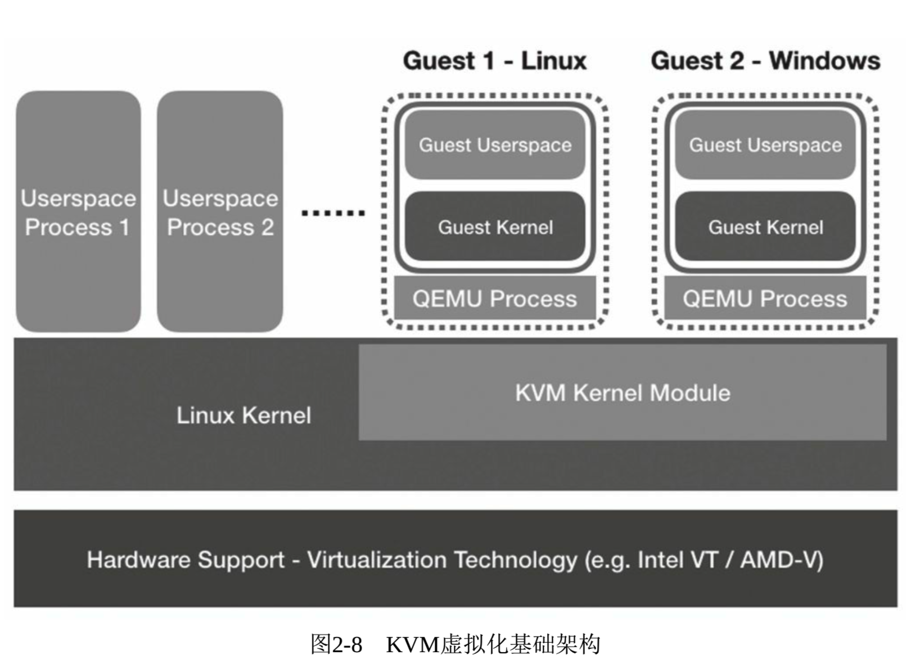

上一节介绍了 CPU、内存、I/O 等硬件虚拟化技术.

KVM 虚拟化的核心主要由以下两个模块组成:

1) **KVM 内核模块**, 它属于**标准 Linux 内核**的一部分, 是一个专门提供**虚拟化功能**的模块, 主要负责**CPU 和内存的虚拟化**, 包括: **客户机的创建**、**虚拟内存的分配**、**CPU 执行模式的切换**、**vCPU 寄存器的访问**、**vCPU 的执行**.

2) **QEMU 用户态工具**, 它是一个普通的**Linux 进程**, 为客户机提供设备模拟的功能, 包括**模拟 BIOS**、**PCI/PCIE 总线**、**磁盘**、**网卡**、**显卡**、**声卡**、**键盘**、**鼠标等**. 同时它通过**ioctl 系统调用**与内核态的 KVM 模块进行交互.

KVM 是在硬件虚拟化支持下的完全虚拟化技术, 所以它能支持在相应硬件上能运行的几乎所有的操作系统, 如: Linux、Windows、FreeBSD、MacOS 等. KVM 的基础架构如图 2-8 所示.

在**KVM 虚拟化架构**下,

- **每个客户机**就是**一个 QEMU 进程**, 在一个宿主机上有多少个虚拟机就会有多少个 QEMU 进程;
- 客户机中的**每一个虚拟 CPU**对应**QEMU 进程**中的**一个执行线程**;
- **一个宿主机**中只有**一个 KVM 内核模块**, 所有客户机都与这个内核模块进行交互.

