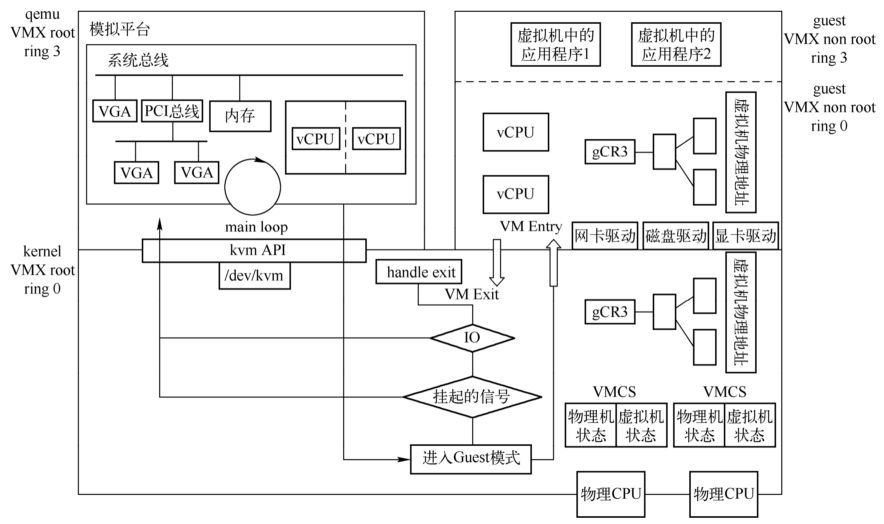

# QEMU/KVM 历史

## KVM 与 Qemu 的前世今生

* KVM 是基于硬件虚拟化(**Intel VT 或 AMD-V**)实现的一套虚拟化解决方案, 通过以上一个与 Qemu 关系的分析, 我们基本上知道它在虚拟化领域处在一个什么样的地位. 它其实只负责 CPU 和内存的虚拟化, 不负责任何设备的模拟, 而是提供接口给用户空间的 Qemu 来模拟. 这个接口是 **/dev/kvm**.

* **Qemu 通过 /dev/kvm 接口设置一个虚拟机的地址空间, 然后向它提供模拟好的 I/O 设备, 并将相关的设备回显操作映射到宿主机, 完成整个 I/O 设备的虚拟化操作.**

* /dev/kvm 接口是 Qemu 和 KVM 交互的"桥梁", 基本的原理是: /dev/kvm 本身是一个设备文件, 这就意味着可以通过 ioctl 函数来对该文件进行控制和管理, 从而可以完成用户空间与内核空间的数据交互. 在 KVM 与 Qemu 的通信过程主要就是一系列针对该设备文件的 ioctl 调用.
* KVM是一种用于Linux内核中的虚拟化基础设施, 可以将Linux内核转换成一个Hypervisor.
* KVM诞生初期, 以色列开发人员没有打算从头造轮子, 而是通过加载一个内核模块让Linux内核编程一个Hypervisor.
* KVM是一个轻量级的虚拟化管理程序模块, 该模块主要来自于Linux内核, 虽然诞生比Xen晚, 但是其性能和易用性, 以及后期开源社区的贡献, 是的KVM迅速发展.

# QEMU/KVM架构

QEMU与KVM的完整架构如下图所示. 该图来自QEMU官网, 比较完整地展现了QEMU与KVM虚拟化的各个方面, 包括QEMU的运行机制, KVM的组成, QEMU与KVM的关系, 虚拟机CPU、内存、外设等的虚拟化, 下面对其进行简要介绍.

