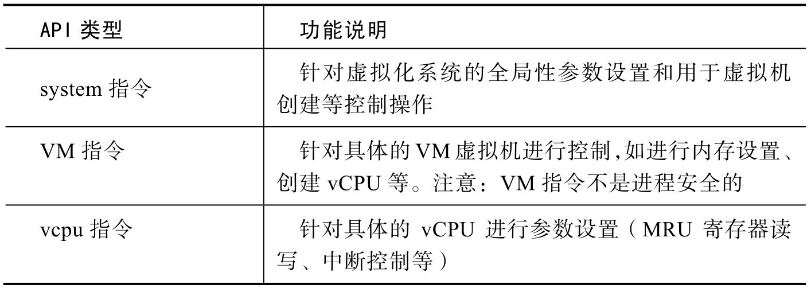
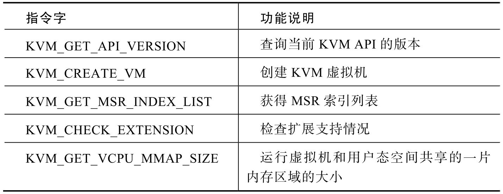
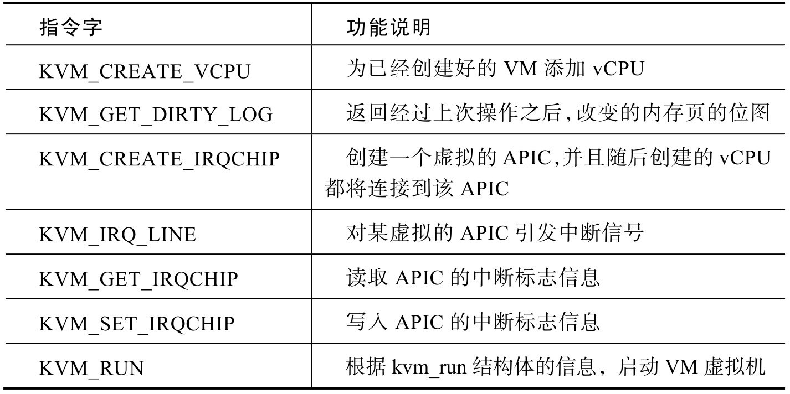
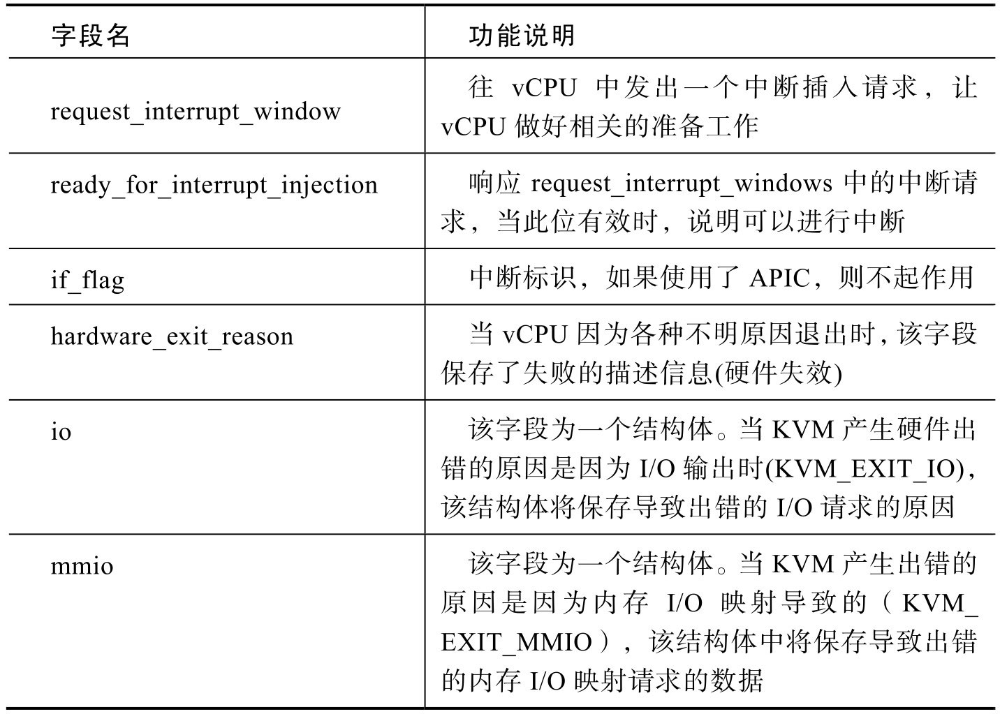
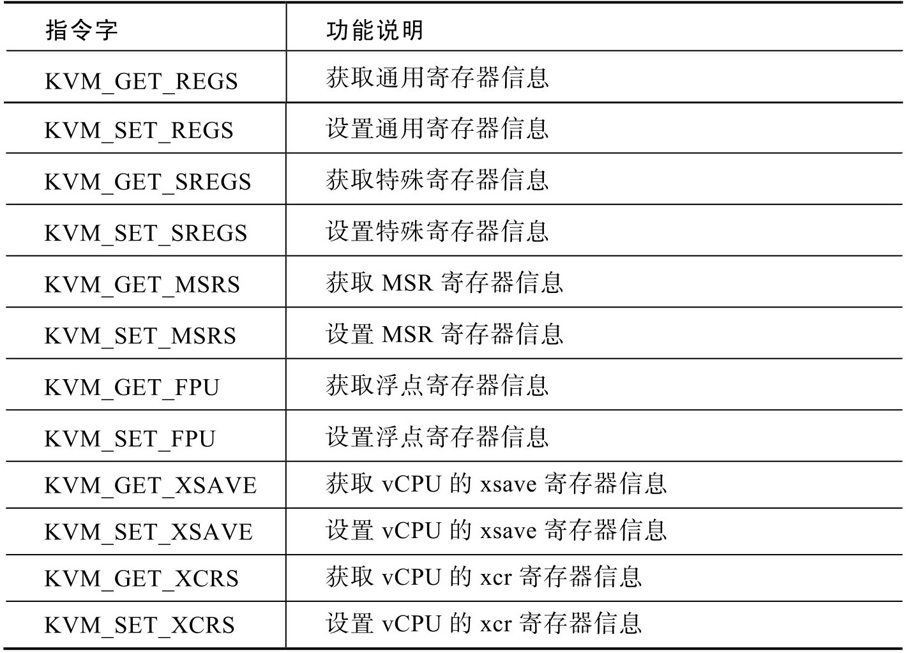
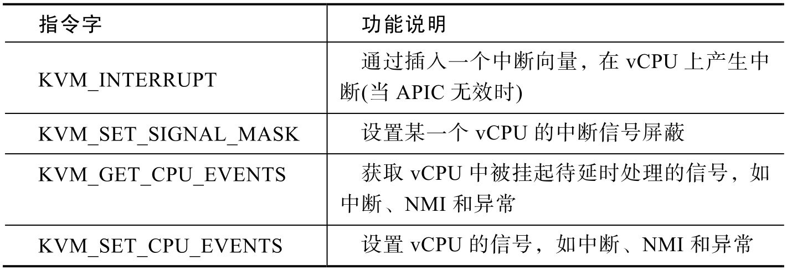
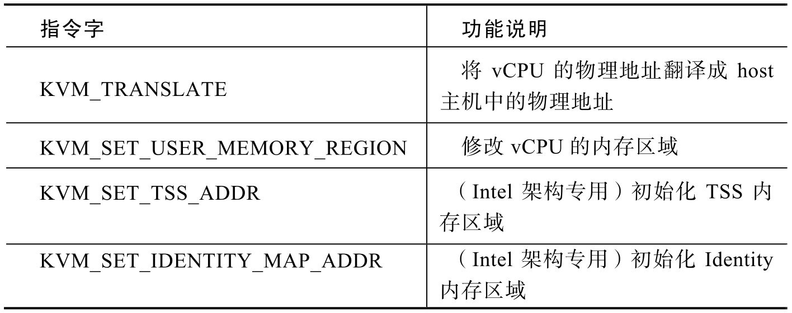
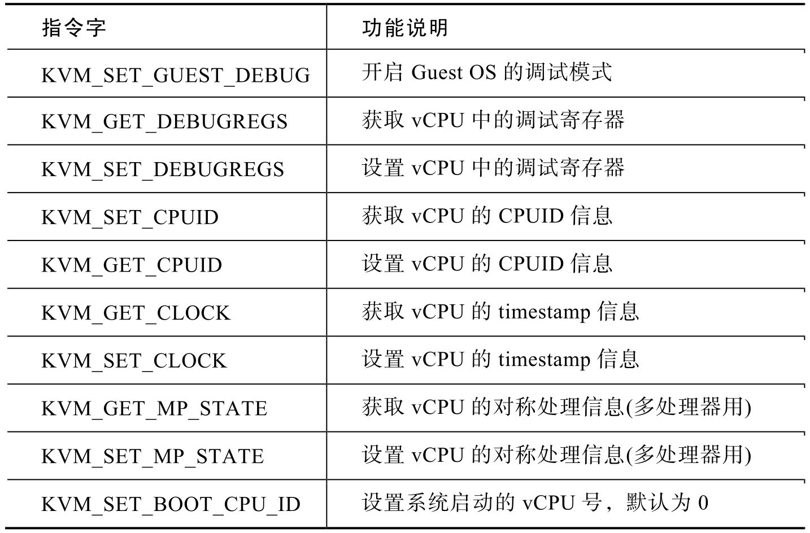

<!-- @import "[TOC]" {cmd="toc" depthFrom=1 depthTo=6 orderedList=false} -->

<!-- code_chunk_output -->

- [概述](#概述)
- [1. KVM API 纵览](#1-kvm-api-纵览)
- [2. system ioctls 调用](#2-system-ioctls-调用)
- [3. vm ioctl 系统调用](#3-vm-ioctl-系统调用)
- [4. vcpu ioctl 系统调用](#4-vcpu-ioctl-系统调用)
  - [4.1. 寄存器控制](#41-寄存器控制)
  - [4.2. 中断和事件管理](#42-中断和事件管理)
  - [4.3. 内存管理](#43-内存管理)
  - [4.4. 其它管理](#44-其它管理)

<!-- /code_chunk_output -->

# 概述

KVM 导出了一系列接口供用户态创建、配置、启动虚拟机, 典型的用户态软件是QEMU.

之所以将 QEMU 和 KVM 经常联系起来, 是因为 KVM 创立之初重用了 QEMU 的设备模拟部分, 本质上来说, QEMU 和 KVM 可以不必相互依赖.

# 1. KVM API 纵览

KVM 的 API 是通过 `/dev/kvm` 设备进行访问的. `/dev/kvm` 是一个**字符型设备**.

作为 Linux 的一个**标准字符型设备**, 可以使用常见的**系统调用**如 **open**、**close**、**ioctl** 等**指令**进行操作.

因为 KVM 的字符型设备的实现函数中, **没有**包含 **write**、**read** 等操作. 所有对 KVM 的操作都是通过 **ioctl** 发送相应的**控制字**实现的.

KVM 所提供的**用户空间 API** 从功能上划分, 可以分为**三种类型**, 如表所示.

通常,

1) 对于 KVM API 的操作是从**打开 /dev/kvm 设备**文件开始的, 通过使用**系统调用 open**之后, 会获得针对 kvm subsystem 的一个**fd 文件描述符**.

2) 然后通过**ioctl 系统指令**针对该文件描述符进行进一步的操作.

3) 通过 `KVM_CREATE_VM` 指令将**创建一个虚拟机**并**返回该虚拟机对应的 fd 文件描述符**, 然后根据**该描述符**来**控制虚拟机的行为**.

4) 通过 `KVM_CREATE_VCPU` 指令, 将**创建一个虚拟 CPU**并且返回**该 vCPU 对应的 fd**.

需要注意的一点是, 在 Linux 的**系统调用**中, 通过 **fork**()系统调用创建的**子进程**将**继承父进程的文件访问描述符 fd**, 从而实现**多进程访问**. 而在 **KVM 内部的 API 实现**中, 并**没有针对这种情况进行保护**.

# 2. system ioctls 调用

**system ioctls 系统调用**用于控制 KVM 运行环节的**参数**, 相关工作包括**全局性的参数设置**和**虚拟机创建**等工作, 其主要指令字如表所示.

**KVM\_CREATE\_VM** 是其中比较重要的指令字. 通过该参数, KVM 将**返回一个文件描述符**, 该文件描述符指向内核控件中一个新的**虚拟机**.

全新创建的虚拟机**没有 vCPU**, 也**没有内存**, 需要通过后续的 ioctl 指令进行配置. 使用 **mmap**()系统调用, 则会直接返回**该虚拟机**对应的**虚拟内存空间**, 并且内存的偏移量为 0. 如果 KVM 支持 `KVM_CAP_USER_MEMORY` 扩展特性, 则应使用其他方法.

# 3. vm ioctl 系统调用

**vm ioctl 系统调用**实现了**对虚拟机的控制**. vm ioctl 控制指令的参数大多需要从 `KVM_CREATE_VM` 中返回的 **fd 文件描述符**来进行操作, 涉及的操作主要针**对某一个虚拟机**进行**控制**, 如配置内存、配置 vCPU 等.

`KVM_RUN` 和 `KVM_CREATE_VCPU` 是 vm ioctl 系统调用的两个重要指令字. 在通过 `KVM_CREATE_VCPU` 为 VM 虚拟机**创建 vCPU**, 并且获得 **vCPU 对应的 fd 文件描述符！！！** 之后, 可以进行**KVM\_RUN 启动虚拟机！！！** 的操作.

`KVM_RUN` 指令字虽然没有任何参数, 但是在调用 **KVM_RUN** 启动了**虚拟机**之后, 可以通过 **mmap**() 系统调用**映射 vCPU 的 fd 所在的内存空间！！！** 来获得 **kvm\_run 结构体信息！！！**. 该结构体位于**内存偏移量 0**, 结束位置在 `KVM_GET_VCPU_MMAP_SIZE` 指令所**返回的大小**中.

**kvm_run 结构体**的定义在 `include/uapi/linux/kvm.h` 中, 通过读取该结构体可以了解 **KVM 内部的运行状态**, 可以类比为计算机芯片中的**寄存器组**. 其中主要的字段及说明如表 4 所示.

# 4. vcpu ioctl 系统调用

vcpu ioctl 系统调用主要针对具体的**每一个虚拟的 vCPU**进行配置, 包括**寄存器读/写**、**中断设置**、**内存设置**、**调试开关**、**时钟管理**等功能, 能够对 KVM 的虚拟机进行精确的运行时配置.

## 4.1. 寄存器控制

对于一个 VM 的 CPU 来说, **寄存器控制**是最重要的一个环节, vcpu ioctl 在寄存器控制方面提供了丰富的指令字, 如表所示.

## 4.2. 中断和事件管理

KVM 在**中断管理**和**事件管理**中, 也提供了丰富的指令字. 在**KVM 运行期间**, 可以通过**中断管理向 vCPU 插入中断**, 或者**获取 vCPU 的一些事件**(如热插拔等), 该部分指令字如表所示.

## 4.3. 内存管理

**内存管理**是虚拟机管理中一个重要的组成部分, KVM 也提供了相应的 API 支持, 该部分指令字如表所示.

## 4.4. 其它管理

除了上面的 vCPU 管理、中断管理和内存管理之外, KVM 最后还提供了其他方面的管理, 如 **CPUID 的设置**、**调试接口**等, 这部分接口的指令字如表所示.

