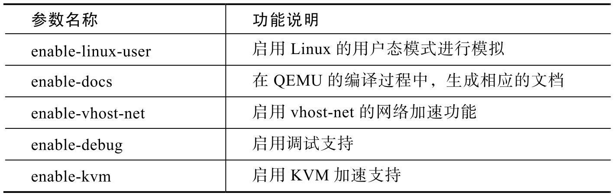
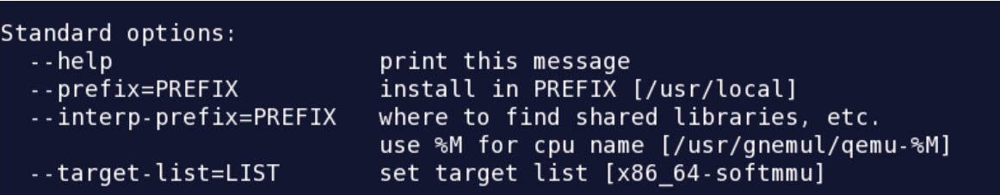

<!-- @import "[TOC]" {cmd="toc" depthFrom=1 depthTo=6 orderedList=false} -->

<!-- code_chunk_output -->

- [1. 曾经的 qemu-kvm](#1-曾经的-qemu-kvm)
- [2. qemu-kvm 的配置与编译](#2-qemu-kvm-的配置与编译)
- [3. qemu-kvm 的架构与配置](#3-qemu-kvm-的架构与配置)

<!-- /code_chunk_output -->

# 1. 曾经的 qemu-kvm

qemu-kvm 原本是 kernel 社区维护的**专门用于 KVM 的 QEMU 的分支**.

在**2012 年**年末的时候, 这个分支**并入了主流的 QEMU**( git://git.qemu-project.org/qemu.git ).

从此**通用的 QEMU** 加上 `--enable-kvm` 选项就可以创建 KVM guest.

# 2. qemu-kvm 的配置与编译

QEMU 是一个高度可定制化的模块项目. 从官方网站获得 QEMU 源代码之后, 需要通过 configure 进行配置, 以为后续的 Makefile 编译出符合要求的 QEMU 版本而做好准备.

configure 的参数比较多, 重要的部分如表 1 所示. 因为篇幅限制, 所有以 `enable-xxx` 开头的开关, 一般都具有 `disable-xxx` 用于禁止 xxx 功能配置的对应项.

表 1 `qemu-kvm`中 Configure 的配置参数说明

如果直接执行 `qemu-kvm` 的 configure, 则默认会有如图 1 所示的参数.

图 1 `qemu-kvm` 的默认参数

在这些默认的参数中, 有一个重要的设置环节是 `target-list`, 该参数代表 qemu 将要模拟的**目标系统**, 针对 Linux 虚拟化环境中, 重要的 `target-list` 是两个:

* `x86_64-softmmu`, **使用软件对 mmu 进行管理**

* `x86_64-linux-user`, 使用到 **Linux 内部**的一些**硬件加速**特性.

在编译开关配置完成之后, 输入 make, 就可以对 `qemu-kvm` 的源代码进行编译, 编译完成后, 将获得 **qemu-img**, **qemu-nbd**, **qemu-io** 和与最终编译相关的 **qemu-kvm** 执行主程序.

qemu-kvm 的主程序执行针对特定平台的模拟功能, 其具体配置在 configure 阶段中. 但是, configure 的配置功能主要是为了支持 QEMU 进行多种异构平台的模拟, 如针对 ARM、MIPS 等平台的不同开发板配置. 因此, 针对 x86 架构提供虚拟化功能时, QEMU 更多的是作为一个开发和整合的框架, KVM 开发小组通过重用该框架, 用 KVM 的相关功能对该框架进行填充后, 从而形成一套解决方案.

# 3. qemu-kvm 的架构与配置

在 `qemu-kvm` 中, 基于 **x86 的架构**定义在 `hw/pc_piix.c`, `pc_q35.c` 文件中, 通过 **machine_init** 宏在 **qemu-kvm** 启动时进行初始化.

**定义 x86 架构主机**的**数据结构**在 `qemu-kvm` 中使用得非常巧妙, 通过 **configure 等编译工具**, 将这些数据结构的初始化代码放入**全局变量区域**中.

因此, 在 **QEMU 的代码**中只有对**这些数据结构**进行**获取和使用**的部分, 而**没有用于配置的部分**, 这样提高了整个架构面向的体系模拟结构的灵活性.

