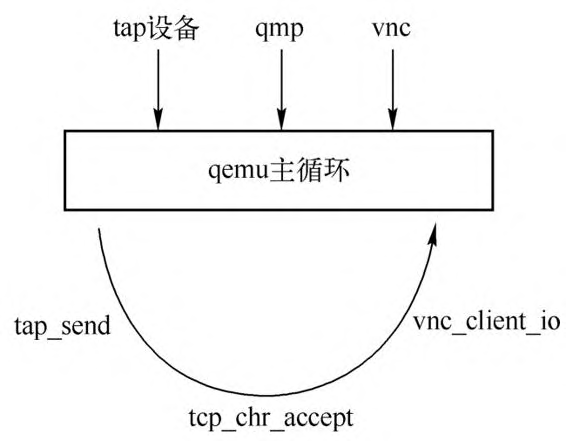

QEMU的事件循环机制如图2-2所示。QEMU在运行过程中会注册一些感兴趣的事件，设置其对应的处理函数。如对于VNC来说，会创建一个 socket 用于监听来自用户的连接，注册其可读事件为vnc_client_io，当VNC有连接到来时，glib的框架就会调用vnc_client_io函数。除了 VNC，QEMU 中还会注册很多其他事件监听，如网卡设备的后端tap设备的收包，收到包之后QEMU调用tap_send将包路由到虚拟机网卡前端，若虚拟机使用qmp，那么在管理界面中，当用户发送qmp命令过来之后，glib会调用事先注册的tcp_chr_accept来处理用户的qmp命令。本节将分析QEMU的事件循环实现。关于QEMU的事件循环机制，Fam Zheng 在KVM Forum 2015上有一个非常不错的演讲，题为“Improving the QEMU Event Loop”，读者可以自行搜索学习。

QEMU 事件循环机制:

