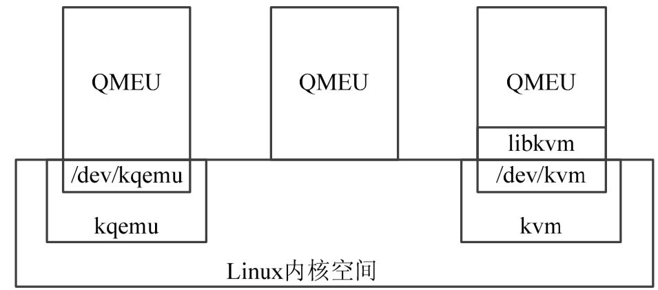
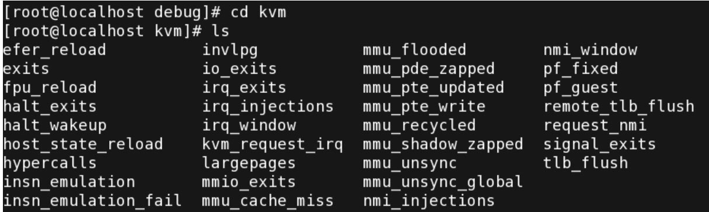

<!-- @import "[TOC]" {cmd="toc" depthFrom=1 depthTo=6 orderedList=false} -->

<!-- code_chunk_output -->

- [1. QEMU 的三种运行模式](#1-qemu-的三种运行模式)
  - [1.1. kqemu 加速](#11-kqemu-加速)
  - [1.2. 用户态 qemu](#12-用户态-qemu)
  - [1.3. kvm-qemu 加速](#13-kvm-qemu-加速)
- [2. libvirt 和 virt-manager](#2-libvirt-和-virt-manager)
- [3. KVM 的调试接口](#3-kvm-的调试接口)

<!-- /code_chunk_output -->

# 1. QEMU 的三种运行模式

QEMU 作为一个开源的硬件模拟器项目, 除了支持 x86 体系架构之外, 还支持 ARM、MIPS、PowerPC、IA64 等多种硬件架构. QEMU 采用模块化设计的方法, 因此, 还能支持多种多样的外设硬件, 并且能够方便地进行扩充.

除了支持 KVM 之外, QEMU 还支持全模拟化和 kqemu 加速模块等方式, 这三种方式的架构区别如图 5\-6 所示.

图 5-6 QEMU 的三种模块架构



## 1.1. kqemu 加速

第一种模式是通过 kqemu 模块实现内核态的加速. 通过在**内核**中加入**kqemu 的相关模块**, 在**用户态的 QEMU**则通过访问 /dev/kqemu 设备文件接口调用改进型加速. 在这种模式中, 主要针对**虚拟机**和**宿主机**运行于**统一架构**的情况下进行虚拟化.

## 1.2. 用户态 qemu

第二种模式是在用户态直接运行 QEMU, 由 QEMU 对目标机的**所有指令进行翻译**后执行, 相当于**全虚拟化**. 在这种模式下, 可以运行各种不同形态的体系结构, 如 Android 开发环境中即使用了 QEMU 来为其模拟 ARM 运行环境, 但是在这种模拟环境下, 每一条目标机的执行指令都需要耗费少则数个, 多则成千上万个宿主机的指令周期来模拟实现, 速度方面不太理想.

## 1.3. kvm-qemu 加速

第三种模式则是 KVM 官方提供的 kvm\-qemu 加速模式. 运行在**内核态的 KVM 模块**通过/**dev/kvm** 字符设备文件向外提供操作接口. KVM 通过提供 libkvm 这个操作库, 将/dev/kvm 这一层面的 ioctl 类型的 API 转化成为通常意义上的函数 API 调用, 提供给 QEMU 的相应适配层, 通过 QEMU 的支持来完成整个虚拟化工作.

针对这三种不同运行模式的测试结果表明, 通过 KVM 对 QEMU 进行加速从而获取的性能最为理想.

# 2. libvirt 和 virt-manager

在很多开源版本的 qemu\-kvm 实现中, 并不仅仅提供 qemu\-kvm 软件来进行管理, 而引入了一个叫做 libvirt 的库和 virt\-manager 进行管理.

**libvirt** 和 **virt\-manager** 都是开源的多虚拟化产品解决方案, 能够支持 QEMU、Xen、KVM 等解决方案在内的多种虚拟机. 在 Cent OS 等发行版本中, 通过使用 libvirt 和 virt\-manager 来进行虚拟机管理, 图 5\-4 为一运行了 Windows 2008 R2 的 KVM 虚拟机, 通过 virt\-manager 进行管理.

libvirt 通过引入**软件适配层**的概念, 通过统一的上层接口管理虚拟机, 对下则提供针对不同解决方案的适配器, 如 QEMU、Xen 和 KVM 等.

**virt\-manager** 是一个基于 **Python** 和 **pygtk** 编写的虚拟机管理工具前端, 通过引用 libvirt 来进行桌面环境下的虚拟机管理, 其运行界面如图 5-7 所示.

图 5-7 基于 libvirt 和 virt-manager 的虚拟机管理工具


# 3. KVM 的调试接口

KVM 提供了丰富的调试信息接口, 通过 Linux 内核自带的**debugfs**将调试信息导出. 要启用 KVM 的调试接口, 可以输入以下指令来挂载调试信息分区:

```
mount -t debugfs none /sys/kernel/debug
```

之后可以进入/**sys/kernel/debug/kvm** 目录中查看到相应的调试信息, 如图 5\-8 所示.

图 5-8 KVM 调试信息图



从前文分析中可以看出, KVM 并没有提供一个完整的 PC 虚拟环境, 而是提供了针对处理器、I/O 和内存等关键技术点的 API, 借助第三方环境实现整台 PC 机的模拟.

QEMU 基于模块化设计, 因此, KVM 的开发小组将 QEMU 针对 x86 模拟体系中的 CPU 模拟、I/O 模拟和内存模拟等模块针对 KVM 所导出的 API 进行了优化后, qemu\-kvm 就成了可以运行 KVM 虚拟机的宿主.