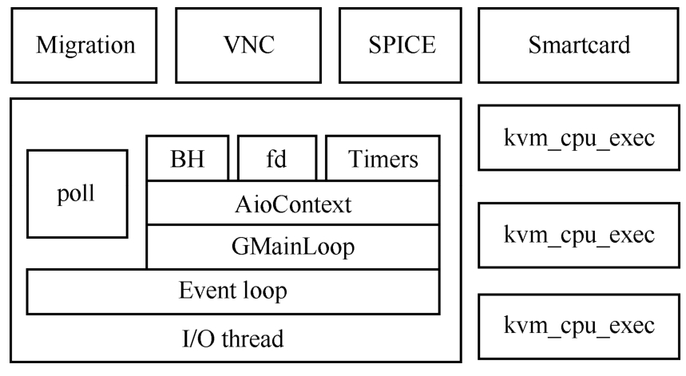

QEMU-KVM架构中, 一个QEMU进程代表一个虚拟机. QEMU会有若干个线程, 其中对于每个CPU会创建一个线程, 还有其他的线程, 如VNC线程、I/O线程、热迁移线程, QEMU线程模型如下图所示.

QEMU 线程模型:

传统上, QEMU主事件循环所在的线程由于会不断监听各种I/O事件, 所以被称为I/O线程. 现在的I/O线程通常是指块设备层面的单独用来处理I/O事件的线程. 每一个CPU都会有一个线程, 通常叫作VCPU线程, 其主要的执行函数是kvm_cpu_exec, 比如图2-12中有3个VCPU线程. QEMU为了完成其他功能还会有一些辅助线程, 如热迁移时候的migration线程、支持远程连接的VNC和SPICE线程等.

线程模型通常使用QEMU大锁进行同步, 获取锁的函数为qemu_mutex_lock_iothread, 解锁函数为qemu_mutex_unlock_iothread. 实际上随着演变, 现在这两个函数已经变成宏了. 很多场合都需要BQL, 比如os_host_main_loop_wait在有fd返回事件时, 在进行事件处理之前需要调用qemu_mutex_lock_iothread获取BQL; VCPU线程在退出到QEMU进行一些处理的时候也会获取BQL. 下面的代码是main函数主循环中获取BQL的过程.

