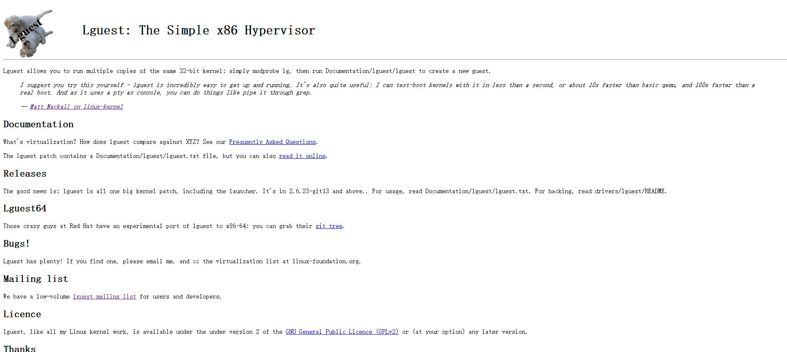

# Lguest虚拟化技术

## 相关站点

Lguest官方站点:<http://lguest.ozlabs.org/>



```
Lguest allows you to run multiple copies of the same 32-bit kernel: simply modprobe lg, then run Documentation/lguest/lguest to create a new guest.
```

## Lguest简介

**Lguest 是 Linux 内核的一个 hypervisor(虚拟化管理程序), 是一个操作系统级的虚拟化解决方案. **

* Lguest 是由 IBM 工程师 **Rusty Russell** (澳大利亚开发者)发起的虚拟化项目, 是一个**只有5000行代码的精简hypervisor(虚拟化管理程序)**, 它已经包括在最近版本的内核里了. Lguest 是内核版本2.6.23(2007年10月9日发布)中引入的, 它是一个操作系统级的虚拟化解决方案, 通过 Lguest 支持来增强 Linux 内核. Lguest 的设计是为 Linux 内核提供最小的32位x86虚拟化管理程序, 为 Linux 开发人员和用户体验虚拟化减小了复杂性. 

* 和 KVM 相似, 它支持 Intel 和 AMD 芯片的最新虚拟化技术, 但又与 VMware 公司的ESX Server不同, 在Lguest 创建的虚拟机里的操作系统知道自己是被虚拟出来的, 所以在调用CPU周期时它可以直接向真正的硬件发出请求, 而不是作为中间媒介而降低了效率, 因此这种架构大大提高了效率. 


## Lguest原理


* 来宾操作系统包含一个 Lguest 代码瘦层(根据定义, 就是准虚拟化). 这段代码提供许多服务. 在最高的级别, 有一些代码可以决定正在启动的内核是否被虚拟化. 此外, 还有一个通过虚拟化调用将特权操作发送给宿主操作系统的抽象层(通过 paravirt_ops 实现). 例如, 来宾操作系统不能禁用中断, 以使这些请求在宿主操作系统中执行. 您还可找到一个为来宾操作系统实现设备抽象的总线, 以及一组实现控制台、虚拟块驱动器和虚拟网络驱动器(允许与其他来宾通信)的简单驱动器. 
* 内核部分被实现为可加载的模块, 即lg.ko. 这个模块包含来宾操作系统通向宿主内核的接口. 第一个组件是切换器, 它实现一种方法, 让来宾操作系统在执行时根据上下文进行切换. 这个模块还实现 /proc 文件系统代码(针对 /dev/lguest), 该代码实现到内核和驱动器(包括虚拟化调用)的用户空间接口. 还有一些代码通过使用影子页表(shadow page-table)和管理 x86 区段来提供内存映射. 

* 最后, 内核中的 Documentation 子目录包含启动实用程序(lguest), 用于启动新的来宾操作系统实例. 这个文件负责两项任务, 即使用和记录. 

* Lguest 从 2.6.23(2007 年 10 月)开始就成为主流内核, 并且由 Rusty Russell 开发和维护. 它大约包含 5000 行源代码, 包括用户空间实用程序. 尽管 Lguest 很简单(据说是这样的), 但它能提供真正的准虚拟化. 不过简单性往往与局限性相随. 例如, Lguest 仅虚拟化其他支持 Lguest 的来宾操作系统, 并且目前仅能用于 x86 架构. 尽管存在这些限制, Lguest 仍然提供一种有趣的虚拟化方式, 并且对任何希望研究 Rusty 的代码的人员公开. 
