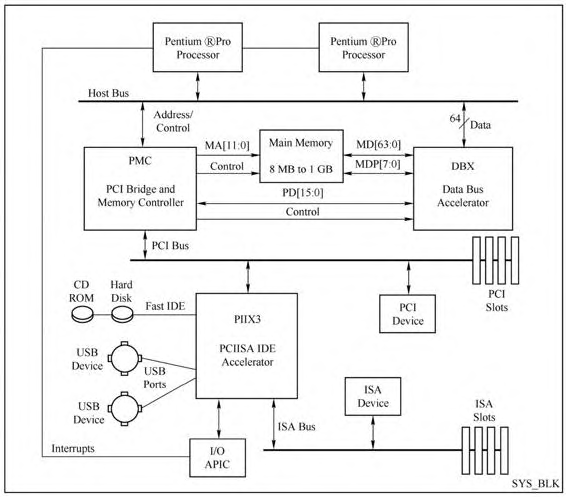

# i440fx与piix3介绍

Intel 440FX(i440fx)是Intel在1996年发布的用来支持Pentium II的主板芯片, 距今已有20多年的历史, 是一代比较经典的架构. 虽然QEMU已经能够支持更先进的q35架构的模拟, 但是目前QEMU依然默认使用i440fx架构. 本节对物理芯片和实际的QEMU模拟架构进行总体介绍, 后面的章节会对QEMU整个芯片进行介绍. 

以i440fx为北桥、piix3为南桥的芯片组结构如图所示:

