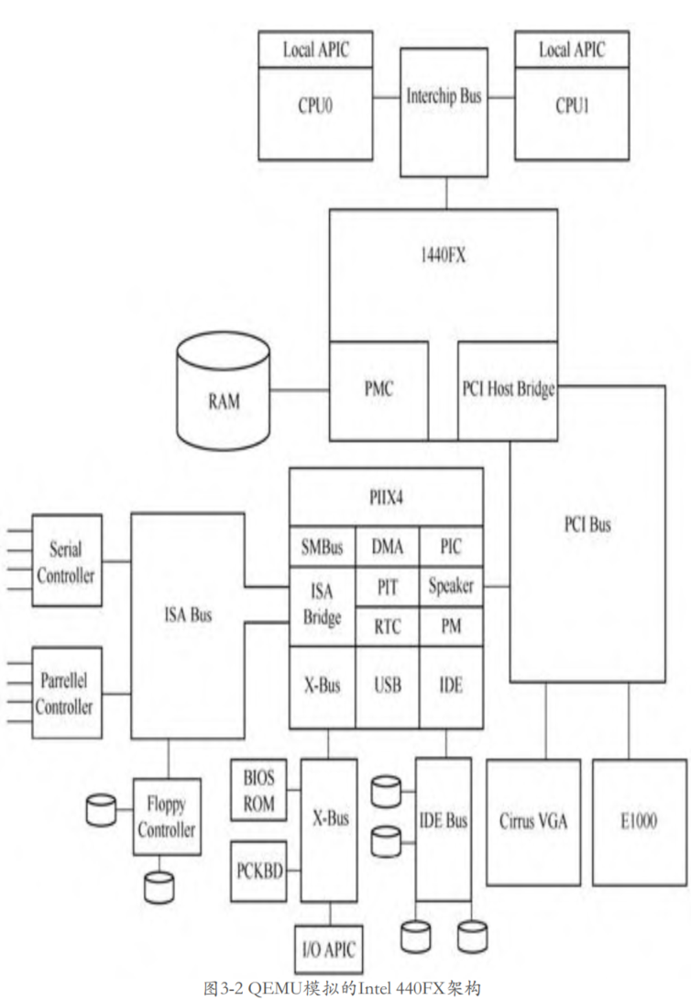

# i440fx 与 piix3 介绍

Intel 440FX(i440fx) 是 Intel 在 1996 年发布的用来支持 Pentium II 的主板芯片, 距今已有 20 多年的历史, 是一代比较经典的架构. 虽然 QEMU 已经能够支持更先进的 q35 架构的模拟, 但是目前 QEMU 依然默认使用 i440fx 架构. 本节对物理芯片和实际的 QEMU 模拟架构进行总体介绍, 后面的章节会对 QEMU 整个芯片进行介绍. 

以 i440fx 为北桥、piix3 为南桥的芯片组结构如图所示:


其中，**i440fx 北桥**包括 **PMC**（`PCI Bridge and Memory Controller`）以及 **DBX**（`Data Bus Accelerator`），北桥的作用向上连接多个处理器，向下连接内存以及 PCI 根总线，该 PCI 总线可以衍生出一个 PCI 的设备树。

piix3 南桥主要用来连接低速设备，包括 IDE 控制器、USB 控制器等，各种慢速设备可以通过控制器连接到系统，如硬盘、USB 设备等。南桥还会连接 ISA 总线，传统的 ISA 设备可以借此连接到系统。

这里面还有一个需要注意的地方，即**中断控制器** `I/O APIC` 是**直接连接到处理器**，**设备的中断**可以通过 `I/O APIC` 路由到处理器。

# QEMU模拟主板架构

从 QEMU 官网可以看到图 3-2 所示的 QEMU 主板模拟图，对比图 3-1，可以发现基本架构是一致的。



在 monitor 中输入 “`info qtree`”，可以看到 QEMU 虚拟机的设备结构，下面是经过简化的版本。

```
(qemu) info qtree
info qtree
bus: main-system-bus        // 系统总线
  type System
  dev: ps2-mouse, id ""
  dev: ps2-kbd, id ""
  dev: hpet, id ""
  dev: kvm-ioapic, id ""
  dev: fw_cfg_io, id ""
  dev: i440FX-pcihost, id ""// 北桥
    bus: pci.0              // pci 总线
      dev: VGA, id ""
      dev: PIIX4_PM, id ""
      dev: piix3-ide, id ""
        bus: ide.1
          type IDE
          dev: ide-cd, id ""
            drive = "ide1-cd0"
      dev: PIIX3, id ""
        bus: isa.0
          type ISA
          dev: port92, id ""

```

设备的起点是 `main-system-bus` 系统总线，上面挂了 hpet 和 kvmioapic 等设备，当然，最重要是的**北桥** `I440FX-pcihost`，北桥通过系统总线连接到CPU。

北桥的下面连了一条 PCI 根总线 pci.0，大量的设备都挂在了 pci.0 总线上面。如 PIIX4_PM 设备用于电源管理，piix3-ide 设备是 IDE 设备的控制器，下面可以挂IDE总线，IDE总线下面可以挂IDE设备，如硬盘等。PCI根总线当然也可以直接挂PCI设备，如e1000、VGA等。PIIX3是 PCI 转 ISA 桥，下面挂了ISA总线，总线下面挂了很多ISA设备。i440FX 则表示北桥自身在PCI总线这一侧的抽象。

从上面的结构可以看到，总线和设备是交替的，设备只能挂在总线下面，而总线本身也属于一个设备。

上面介绍的整个PC的系统结构，包括CPU、内存、设备、中断等，后续都会一一介绍。


