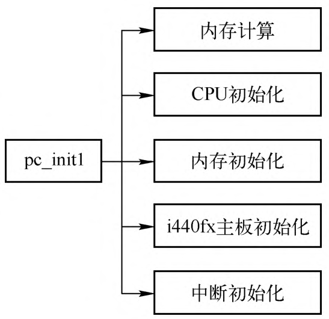

# 虚拟机初始化

QEMU 主板模拟对应的类型是 **MachineClass**, Machine 在这里表明了主板在虚拟机模拟中的地位, 这里只考虑 `i440FX+piix3` 的主板.

**机器类型的定义**是通过 `DEFINE_I440FX_MACHINE` 宏完成的, **每一个新版本**都会定义一种**新的机器类型**.

```cpp
// hw/i386/pc_piix.c
#define DEFINE_I440FX_MACHINE(suffix, name, compatfn, optionfn) \
    // pci_init_XXX 函数
    static void pc_init_##suffix(MachineState *machine) \
    { \
        void (*compat)(MachineState *m) = (compatfn); \
        if (compat) { \
            compat(machine); \
        } \
        pc_init1(machine, TYPE_I440FX_PCI_DEVICE); \
    } \
    // 宏定义
    DEFINE_PC_MACHINE(suffix, name, pc_init_##suffix, optionfn)

// include/hw/i386/pc.h
#define DEFINE_PC_MACHINE(suffix, namestr, initfn, optsfn) \
    static void pc_machine_##suffix##_class_init(ObjectClass *oc, void *data) \
    { \
        MachineClass *mc = MACHINE_CLASS(oc); \
        optsfn(mc); \
        mc->init = initfn; \
    } \
    static const TypeInfo pc_machine_type_##suffix = { \
        .name       = namestr TYPE_MACHINE_SUFFIX, \
        .parent     = TYPE_PC_MACHINE, \
        .class_init = pc_machine_##suffix##_class_init, \
    }; \
    static void pc_machine_init_##suffix(void) \
    { \
        type_register(&pc_machine_type_##suffix); \
    } \
    type_init(pc_machine_init_##suffix)
```

`DEFINE_I440FX_MACHINE` 的定义比较简单，包括**一个函数**以及另一个宏 `DEFINE_PC_MACHINE`。

下面以 `pc-i440fx-9.0` 为例, 定义为:

```cpp
// hw/i386/pc_piix.c
static void pc_i440fx_9_0_machine_options(MachineClass *m)
{
    pc_i440fx_machine_options(m);
    m->alias = "pc";
    m->is_default = true;
}

DEFINE_I440FX_MACHINE(v9_0, "pc-i440fx-9.0", NULL,
                      pc_i440fx_9_0_machine_options);
```

完整展开后如下:

```cpp
static void pc_init_v9_0(MachineState *machine)
{
    void (*compat)(MachineState *m) = (compatfn);
    if (compat) {
        compat(machine);
    }
    pc_init1(machine, TYPE_I440FX_PCI_DEVICE);
}
static void pc_machine_v9_0_class_init(ObjectClass *oc, void *data)
{
    MachineClass *mc = MACHINE_CLASS(oc);
    optsfn(mc);
    mc->init = initfn;
}
static const TypeInfo pc_machine_type_v9_0 = {
    .name       = namestr TYPE_MACHINE_SUFFIX,
    // parent 是 TYPE_PC_MACHINE
    .parent     = TYPE_PC_MACHINE,
    .class_init = pc_machine_v9_0_class_init,
};
static void pc_machine_init_v9_0(void)
{
    type_register(&pc_machine_type_v9_0);
}
type_init(pc_machine_init_v9_0)

#define type_init(function) module_init(function, MODULE_INIT_QOM)
```

可以看到，`DEFINE_I440FX_MACHINE` 宏**直接完成**了**定义一个新类型**的全部工作，以此为例，它定义了 `“pc-i440fx-9.0-machine”` 这个**新的 TypeInfo**，所以**所有的机器类型**都会被加入到 **QOM 类型链表**中，并且在 main 函数中初始化。

```cpp
main()
 ├─ qemu_init()
 │   ├─ qemu_create_machine()
 │   │   ├─ MachineClass *machine_class = select_machine(qdict, &error_fatal); // 选择一个MachineClass
 │   │   ├─ current_machine = MACHINE(object_new_with_class(OBJECT_CLASS(machine_class))); // 全局变量类型MachineState
 │   │   │   ├─ object_init_with_type(Object, TypeImpl)
 │   │   │   │   ├─ object_init_with_type(obj, type_get_parent(ti)); // 先调用父类的实例化instance_init函数
 │   │   │   │   └─ TypeImpl->instance_init(Object) // 实例化


 │   │   │   │   ├─ memset(&loaded_vmcs->host_state, 0, sizeof(struct vmcs_host_state)); // host_state
 │   │   │   │   └─ memset(&

```

main 函数会调用 `select_machine`，选择一个 **MachineClass**，其可能由**用户指定**，也有可能由**系统默认**.

QEMU **最新版本号**对应的**机器类型**为**默认设置**，这里 QEMU 的版本是 9.0.0，所以机器类型是 `pc-i440fx-9.0-machine`。

```
QEMU 版本
# /home/haiwei/workspace/codes/qemu/build/qemu-system-x86_64 --version
QEMU emulator version 8.2.91 (v9.0.0-rc1)
Copyright (c) 2003-2024 Fabrice Bellard and the QEMU Project developers

机器类型
# /home/haiwei/workspace/codes/qemu/build/qemu-system-x86_64 -machine ?
Supported machines are:
microvm              microvm (i386)
pc                   Standard PC (i440FX + PIIX, 1996) (alias of pc-i440fx-9.0)
pc-i440fx-9.0        Standard PC (i440FX + PIIX, 1996) (default)
...
q35                  Standard PC (Q35 + ICH9, 2009) (alias of pc-q35-9.0)
pc-q35-9.0           Standard PC (Q35 + ICH9, 2009)
```

main 中还会通过 `object_new_with_class` **创建 machine 的实例**，这会创建一个 `MachineState` 类型实例 `current_machine`，并且调用 parent `TYPE_PC_MACHINE` 的实例初始化函数(`instance_init`) `pc_machine_initfn`，这个函数的作用就是设置一些初始值. 如下:

```cpp
// system/main.c
main() -> qemu_init() -> qemu_create_machine(machine_opts_dict);

// system/vl.c
OBJECT_DECLARE_TYPE(MachineState, MachineClass, MACHINE)
MachineState *current_machine;
static void qemu_create_machine(QDict *qdict)
{
    MachineClass *machine_class = select_machine(qdict, &error_fatal);
    ...
    current_machine = MACHINE(object_new_with_class(OBJECT_CLASS(machine_class)));
    ...
}

object_new_with_class(ObjectClass) ->
object_new_with_type(Type) ->
object_init_with_type(Object, TypeImpl)

static void object_init_with_type(Object *obj, TypeImpl *ti)
{
    // 获取 parent
    if (type_has_parent(ti)) {
        object_init_with_type(obj, type_get_parent(ti));
    }
    // 所以从 parent 往下, 逐层调用
    if (ti->instance_init) {
        ti->instance_init(obj);
    }
}

static const TypeInfo pc_machine_info = {
    .name = TYPE_PC_MACHINE,
    .parent = TYPE_X86_MACHINE,
    ...
    .instance_init = pc_machine_initfn,
    ...
};
```

main 函数在对 `current_machine` 的一些结构进行初始化之后，会调用 `machine_class->init`，并且参数为 `current_machine`.

```cpp
// system/vl.c
main() -> qemu_init() -> qmp_x_exit_preconfig() -> qemu_init_board() -> machine_run_board_init(current_machine, mem_path, &error_fatal);

// hw/core/machine.c
// 传入了 current_machine
void machine_run_board_init(MachineState *machine, const char *mem_path, Error **errp)
{
    MachineClass *machine_class = MACHINE_GET_CLASS(machine);
    ...
    machine_class->init(machine);
    ...
}
```

这个 init 函数就是通过 `DEFINE_I440FX_MACHINE` 宏定义的 `pc_init_v9_0`，其核心工作就是调用 `pc_init1`. `pc_init1` 是主板或者说整个机器初始化最核心的函数，它的功能如图3-3所示。

`pc_init1` 是整个虚拟机初始化的核心函数，对各个子系统进行了初始化，构建起虚拟机的基本支持框架。内存计算部分计算出计算机的高端内存和低端内存的分割点，主要是因为需要在低于 4GB 左右的物理地址空间中保留一部分给 PCI 设备使用。CPU 初始化则会根据命令行提供的 CPU 个数等信息创建对应的VCPU线程，内存初始化在 QEMU 虚拟机地址空间中分配虚拟机物理内存，i440fx 主板初始化则会完成创建 PCI 根总线以及 PIIX3 控制器的初始化等功能，中断初始化会初始化 `Intel 8259` 和 `I/O APIC` **中断控制器**，建立相关的中断路由关系。

下面对 `pc_init1` 进行简要介绍，各个部分的详细功能会在后续具体章节中分析。

`pc_init1` 初始化功能:



# 
