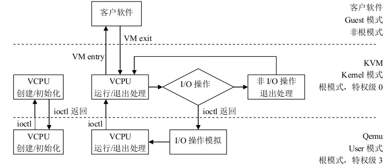
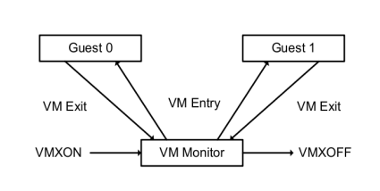
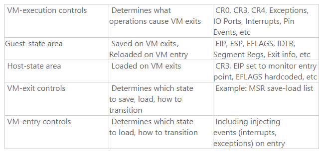

<!-- @import "[TOC]" {cmd="toc" depthFrom=1 depthTo=6 orderedList=false} -->

<!-- code_chunk_output -->

- [1. VT-x 技术](#1-vt-x-技术)
- [2. VMM 与 guest 的切换](#2-vmm-与-guest-的切换)
- [3. VMM 的生命周期](#3-vmm-的生命周期)
- [4. VMCS(Virtual-Machine control structure)](#4-vmcsvirtual-machine-control-structure)
- [5. VM-Entry](#5-vm-entry)
- [6. VM-Exit](#6-vm-exit)
- [7. 参考](#7-参考)

<!-- /code_chunk_output -->

# 1. VT-x 技术

Intel 处理器支持的虚拟化技术即是 VT-x, 之所以 CPU 支持硬件虚拟化是因为软件虚拟化的效率太低.

kvm 分 3 个模式, 对应到 VT-x 中即是

1. 客户模式对应 vmx non-root 模式
2. 内核模式对应 vmx root 模式下的 0 特权级
3. 用户模式对应 vmx root 模式下的 3 特权级

在非根模式下敏感指令引发的陷入称为`VM-Exit`, `VM-Exit`发生后, CPU 从非根模式切换到根模式; 对应的, `VM-Entry`则是从根模式到非根模式, 通常意味着调用 VM 进入运行态. `VMLAUCH`/`VMRESUME`命令则是用来发起`VM-Entry`.

1. VMM 完成 vCPU, 内存的初始化后, 通过**ioctl**调用 KVM 的接口, 完成**虚拟机的创建**, 并**创建一个线程**来运行**VM**, 由于 VM 在**前期初始化**的时候会**设置各种寄存器**来帮助**KVM**查找到**需要加载的指令的入口**(main 函数). 所以**线程**在调用了**KVM 接口**后, **物理 CPU 的控制权**就交给了**VM**.

2. VM 运行在 VMX non-root 模式, 这是 Intel-V 或者 AMD-V 提供的一种特殊的 CPU 执行模式. 然后当**VM 执行了特殊指令**的时候, CPU 将**当前 VM 的上下文**保存到**VMCS 寄存器**(这个寄存器是一个**指针**, 保存了实际的上下文地址), 然后执行权切换到 VMM.

3. VMM 获取 **VM 返回原因**, 并做处理. 如果是**IO 请求**, VMM 可以直接**读取 VM 的内存**并将**IO 操作模拟**出来, 然后再调用**VMRESUME 指令**, VM 继续执行, 此时在**VM 看来**, **IO 操作的指令**被**CPU 执行**了.

# 2. VMM 与 guest 的切换

Guest 与 VMM 之间的切换分两个部分: VM entry 和 VM exit. 有几种情况会导致 VM exit, 比如说 Guest 执行了硬件访问操作, 或者 Guest 调用了 VMCALL 指令或者调用了退出指令或者产生了一个 page fault, 或者访问了特殊设备的寄存器等. 当 Guest 处于 VMX 模式的时候, 没有提供获取是否处于此模式下的指令或者寄存器, 也就是说, Guest 不能判断当前 CPU 是否处于 VMX 模式.

当产生**VM exit**的时候, **CPU**会将**exit reason**保存到**MSRs**(VMX 模式的**特殊寄存器组**), 对应到 KVM 就是`vCPU->kvm_run->exit_reason`. VMM 根据`exit_reason`做相应的处理.

# 3. VMM 的生命周期

如上图所示, VMM 开始于 **VMXON** 指令, 结束与 **VMXOFF** 指令.

第一次启动 Guest, 通过 **VMLAUNCH** 指令加载 Guest, 这时候一切都是新的, 比如说**起始的 rip 寄存器**等. 后续 Guest exit 后再 entry, 是通过 **VMRESUME** 指令, 此指令会将**VMCS**(后面会介绍到)所指向的内容加载到**当前 Guest 的上下文**, 以便 Guest 继续执行.

# 4. VMCS(Virtual-Machine control structure)

顾名思义, **VMCS**就是**虚拟机控制结构**, 前面提到过很多次, Guest Exit 的时候, 会将当前 Guest 的上下文保存到 VMCS 中, Guest entry 的时候把 VMCS 上下文恢复到 VMM. VMCS 是一个**64 位的指针**, 指向一个**真实的内存地址**, VMCS 是以**vCPU 为单位**的, 就是说当前有多少个 vCPU, 就有多少个 VMCS 指针. VMCS 的操作包括 VMREAD, VMWRITE, VMCLEAR.

**VMCS**保存**虚拟机**的**相关 CPU 状态**, **每个 VCPU**都有一个**VMCS**(内存的), **每个物理 CPU**都有**VMCS**对应的**寄存器(物理的**).

- 当 CPU 发生`VM-Entry`时, CPU 则从**VCPU 指定的内存**中**读取 VMCS**加载到**物理 CPU**上执行;
- 当发生`VM-Exit`时, CPU 则将**当前的 CPU 状态**保存到**VCPU 指定的内存**中, 即 VMCS, 以备下次`VMRESUME`.

`VMLAUCH`指 VM 的**第一次**`VM-Entry`, `VMRESUME`则是**VMLAUCH 之后**后续的`VM-Entry`.

VMCS 下有一些**控制域**:

关于具体控制域的细节, 还是翻 Intel 手册吧.

# 5. VM-Entry

`VM-Entry`是从根模式切换到非根模式, 即 VMM 切换到 guest 上, 这个状态由**VMM 发起**, **发起之前**先保存**VMM 中的关键寄存器**内容到**VMCS**中, 然后进入到 VM-Entry, `VM-Entry`附带**参数主要有 3 个**:

1. guest 是否处于 64bit 模式,
2. `MSR VM-Entry`控制,
3. **注入事件**.

1 应该**只在 VMLAUCH 有意义**, 3 更多是在**VMRESUME**, 而 VMM 发起`VM-Entry`更多是因为 3, 2 主要用来**每次更新 MSR**.

第一次启动 Guest, 通过 VMLAUNCH 指令加载 Guest, 这时候一切都是新的, 比如说起始的 rip 寄存器等.  后续 Guest exit 后再 entry, 是通过 VMRESUME 指令, 此指令会将 VMCS 所指向的内容加载到当前 Guest 的上下文,  以便 Guest 继续执行.

# 6. VM-Exit

`VM-Exit`是 CPU 从**非根模式**切换到**根模式**, 从 guest 切换到 VMM 的操作, `VM-Exit`触发的原因就很多了, 执行**敏感指令**, [**发生中断**](http://www.oenhan.com/rwsem-realtime-task-hung), **模拟特权资源**等.

运行在**非根模式**下的**敏感指令**一般分为 3 个方面:

1. **行为没有变化**的, 也就是说该指令能够**正确执行**.

2. **行为有变化**的, 直接产生`VM-Exit`.

3. **行为有变化**的, 但是是否产生`VM-Exit`受到`VM-Execution`**控制域控制**.

主要说一下"受到`VM-Execution`控制域控制"的敏感指令, 这个就是**针对性的硬件优化**了, 一般是

1. 产生`VM-Exit`;
2. 不产生`VM-Exit`, 同时调用**优化函数完成功能**.

典型的有"**RDTSC 指令**". 除了大部分是**优化性能**的, 还有一小部分是直接`VM-Exit`执行指令结果是异常的, 或者说在虚拟化场景下是不适用的, 典型的就是**TSC offset**了.

`VM-Exit`发生时退出的相关信息, 如退出原因、触发中断等, 这些内容保存在`VM-Exit`**信息域**中.

# 7. 参考

http://oenhan.com/kvm-src-3-cpu