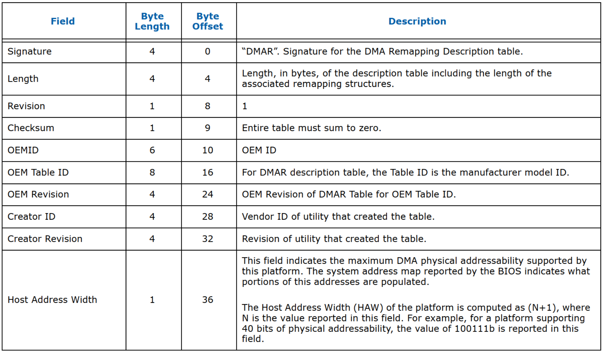
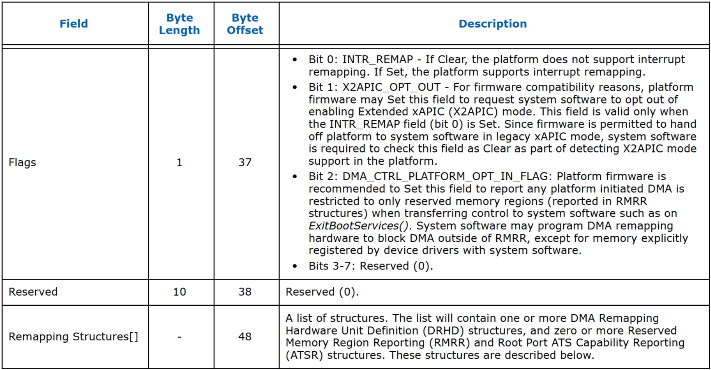

> DMA Remapping Reporting Structure

<table style="width:100%">
<caption>Description</caption>
  <tr>
    <th>
    字段
    </th>
    <th>
    长度(字节)
    </th>
    <th>
    偏移位置(字节)
    </th>
    <th>
    描述
    </th>
  </tr>
  <tr>
    <td>
    Signature
    </td>
    <td>
    4
    </td>
    <td>
    0
    </td>
    <td>
    "DMAR". DMA Remapping Description Talbe 的签名
    </td>
  </tr>
  <tr>
    <td>
    Length
    </td>
    <td>
    4
    </td>
    <td>
    4
    </td>
    <td>
    长度, 单位: 字节. 包括关联的重映射结构的描述表的长度
    </td>
  </tr>
  <tr>
    <td>
    Revision
    </td>
    <td>
    1
    </td>
    <td>
    8
    </td>
    <td>
    1
    </td>
  </tr>
  <tr>
    <td>
    Checksum
    </td>
    <td>
    1
    </td>
    <td>
    9
    </td>
    <td>
    整个表的总和必须为零。
    </td>
  </tr>
  <tr>
    <td>
    OEMID
    </td>
    <td>
    6
    </td>
    <td>
    10
    </td>
    <td>
    OEM ID
    </td>
  </tr>
  <tr>
    <td>
    OEM Table ID
    </td>
    <td>
    8
    </td>
    <td>
    16
    </td>
    <td>
    对于 DMAR 描述表，表 ID 是制造商型号 ID。
    </td>
  </tr>
  <tr>
    <td>
    OEM Revision
    </td>
    <td>
    4
    </td>
    <td>
    24
    </td>
    <td>
    OEM Revision
    </td>
  </tr>
  <tr>
    <td>
    Creator ID
    </td>
    <td>
    4
    </td>
    <td>
    28
    </td>
    <td>
    供应商 ID
    </td>
  </tr>
  <tr>
    <td>
    Creator Revision
    </td>
    <td>
    4
    </td>
    <td>
    32
    </td>
    <td>
    供应商 Revision
    </td>
  </tr>
  <tr>
    <td>
    Host Address Width
    </td>
    <td>
    1
    </td>
    <td>
    36
    </td>
    <td>
    此字段指示此<b>平台</b>支持的<b>最大 DMA 物理可寻址能力</b>。BIOS 报告的系统地址映射指示填充了此地址的哪些部分。 
    fdf
    </td>
  </tr>
</table>

设备<b>类型</b>。 
    <li><b>0b0000</b>对应<b>EP</b>;</li>
    <li><b>0b0000</b>对应<b>EP</b>;</li>
    该字段只读.

