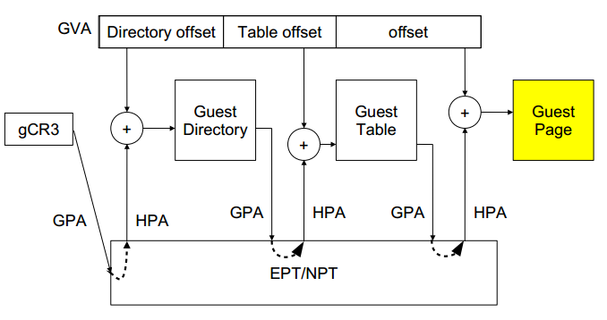

# 8. EPT 页表

Intel EPT 技术引入了 EPT(Extended Page Table)和 EPTP(EPT base pointer)的概念. EPT 中维护着 GPA 到 HPA 的映射, 而 EPTP 负责指向 EPT.

EPT 技术在**原有客户机页表**对**客户机虚拟地址**到**客户机物理地址映射**的基础上, 又引入了 **EPT 页表**来实现**客户机物理地址**到**宿主机物理地址**的另一次映射.

这**两次地址映射**都是由**硬件自动完成**, 二维地址翻译结构:

- **Guest**维护自身的客户页表: `GVA->GPA`
- **EPT**维护 `GPA->HPA` 的映射

**客户机运行**时, **客户机页表**被载入 **物理 CR3**, 而 **EPT 页表**被载入专门的 **EPT 页表指针寄存器 EPTP**. 于是在进行地址转换时, 首先通过 CR3 指向的页表实现 GVA 到 GPA 的转换, 再通过 EPTP 指向的 EPT 完成 GPA 到 HPA 的转换. 当发生 EPT Page Fault 时, 需要 VM-EXIT 到 KVM, 更新 EPT.

- 优点: Guest 的缺页在 Guest OS 内部处理, 不会 VM-EXIT 到 KVM 中. 地址转化基本由硬件(MMU)查页表来完成, 大大提升了效率, 且只需为 Guest 维护一份 EPT 页表, 减少内存的开销
- 缺点: 两级页表查询, 只能寄望于 TLB 命中

**EPT 页表对地址的映射机理**与**客户机页表对地址的映射机理相同**, 下图 4 出示了一个页面大小为 4K 的映射过程:

## 8.1. 地址转换流程

1. 处于`non-root`**模式**的**CPU**加载**guest 进程的 gCR3**;
2. gCR3 是**GPA**,cpu 需要通过**查询 EPT 页表**来实现`GPA->HPA`;
3. 如果没有, CPU 触发**EPT Violation**, 由**VMM 截获处理**;
4. 假设**客户机**有**m 级页表**, **宿主机 EPT**有**n 级**, 在 TLB 均 miss 的最坏情况下, 会产生**m*n 次内存访问**, 完成**一次客户机的地址翻译**;

## 8.2. EPT 页表的建立流程

1. 初始情况下: **Guest CR3**指向的**Guest 物理页面**为**空页面**;

2. **Guest 页表缺页异常**, KVM 采用**不处理 Guest 页表缺页**的机制, **不会导致 VM Exit**, 由**Guest 的缺页异常处理函数**负责分配**一个 Guest 物理页面(GPA**), 将该页面物理地址回填, 建立**Guest 页表结构**;

3. 完成该映射的过程需要将**GPA 翻译到 HPA**, 此时**该进程**相应的**EPT 页表为空**, 产生`EPT_VIOLATION`, 虚拟机退出到**根模式**下执行, 由 KVM 捕获该异常, 建立**该 GPA 到 HOST 物理地址 HPA 的映射**, 完成一套 EPT 页表的建立, **中断返回**, 切换到**非根模式**继续运行.

4. **VCPU 的 mmu**查询下一级**Guest 页表**, 根据 GVA 的偏移产生一条**新的 GPA**, Guest 寻址该 GPA 对应页面, 产生**Guest 缺页**, **不发生 VM_Exit**, 由 Guest 系统的缺页处理函数捕获该异常, 从 Guest 物理内存中选择一个空闲页, 将该 Guest 物理地址 GPA 回填给 Guest 页表;

5. 此时该**GPA**对应的**EPT 页表项不存在**, 发生`EPT_VIOLATION`, 切换到**根模式**下, 由 KVM 负责建立该`GPA->HPA`映射, 再切换回非根模式;

6. 如此往复, 直到**非根模式下 GVA**最后的偏移建立**最后一级 Guest 页表**, 分配 GPA, 缺页异常退出到根模式建立最后一套 EPT 页表.

7. 至此, **一条 GVA**对应在真实物理内存单元中的内容, 便可通过这**一套二维页表结构**获得.

在**客户机物理地址**到**宿主机物理地址转换**的过程中, 由于**缺页、写权限不足等原因**也会**导致客户机退出**, 产生 **EPT 异常**.

对于 **EPT 缺页异常**, KVM 首先根据**引起异常的客户机物理地址**, 映射到**对应的宿主机虚拟地址！！！**, 然后**为此虚拟地址分配新的物理页**, 最后 **KVM 再更新 EPT 页表**, 建立起引起**异常的客户机物理地址**到**宿主机物理地址**之间的映射. 对 **EPT 写权限**引起的异常, KVM 则通过**更新相应的 EPT 页表**来解决.

由此可以看出, **EPT 页表**相对于前述的影子页表, 其实现方式大大简化. 而且, 由于**客户机内部的缺页异常**也**不会致使客户机退出**, 因此**提高了客户机运行的性能**. 此外, KVM 只需为**每个客户机**维护**一套 EPT 页表**, 也大大**减少了内存的额外开销**.
