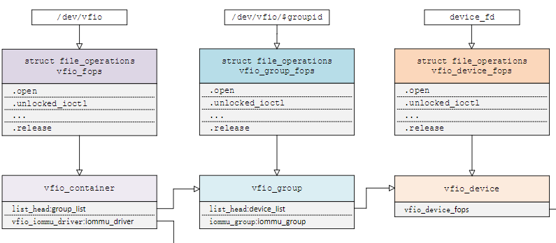

Virtual Function I/O (VFIO) 是一种现代化的设备直通方案, 它充分利用了 `VT-d`/`AMD-Vi` 技术提供的 `DMA Remapping` 和 `Interrupt Remapping` 特性, 在保证直通设备的 DMA 安全性同时可以达到接近物理设备的 I/O 的性能. **用户态进程**可以直接使用 VFIO 驱动直接访问硬件, 并且由于整个过程是在 IOMMU 的保护下进行因此十分安全, 而且非特权用户也是可以直接使用. 换句话说, VFIO 是一套完整的用户态驱动 (userspace driver) 方案, 因为它可以安全地把设备 I/O、中断、DMA 等能力呈现给用户空间.

为了达到最高的 IO 性能, 虚拟机就需要 VFIO 这种设备直通方式, 因为它具有低延时、高带宽的特点, 并且 guest 也能够直接使用设备的原生驱动. 这些优异的特点得益于 VFIO 对 `VT-d`/`AMD-Vi` 所提供的 DMA Remapping 和 Interrupt Remapping 机制的应用.

* VFIO 使用 `DMA Remapping` 为 **每个 Domain** 建立独立的 `IOMMU Page Table` 将直通设备的 DMA 访问限制在 Domain 的地址空间之内保证了用户态 DMA 的安全性
* 使用 `Interrupt Remapping` 来完成**中断重映射**和 `Interrupt Posting` 来达到 **中断隔离** 和 **中断直接投递** 的目的.

# VFIO 框架简介

整个 VFIO 框架设计十分简洁清晰, 可以用下面的一幅图描述：

```
+-------------------------------------------+
|                                           |
|             VFIO Interface                |
|                                           |
+---------------------+---------------------+
|                     |                     |
|     vfio_iommu      |      vfio_pci       |
|                     |                     |
+---------------------+---------------------+
|                     |                     |
|    iommu driver     |    pci_bus driver   |
|                     |                     |
+---------------------+---------------------+
```

最上层的是 `VFIO Interface Layer`, 它负责**向用户态**提供**统一访问的接口**, 用户态通过约定的 **ioctl** 来设置和调用 VFIO 的各种能力.

中间层分别是 `vfio_iommu` 和 `vfio_pci`

* **vfio_iommu** 是 VFIO **对 iommu 层的统一封装**主要用来实现 **DMAP Remapping** 的功能, 即**管理 IOMMU 页表**的能力.
* **vfio_pci** 是 VFIO **对 pci 设备驱动的统一封装**, 它和用户态进程一起配合完成设备访问直接访问, 具体包括 **PCI 配置空间模拟**、**PCI Bar 空间重定向**, **Interrupt Remapping** 等.

最下面的一层则是**硬件驱动调用层**

* **iommu driver** 是与硬件平台相关的实现, 例如它可能是 `intel iommu driver` 或 `amd iommu driver` 或者 `ppc iommu driver`
* `vfio_pci` 会调用到 host 上的 **pci_bus driver** 来实现设备的注册和反注册等操作.


在了解 VFIO 之前需要了解 3 个基本概念：device, group, container, 它们在逻辑上的关系如上图所示.

* **Group** 是 **IOMMU** 能够进行 **DMA 隔离的最小硬件单元**, 一个 group 内可能只有一个 device, 也可能有多个 device, 这取决于物理平台上硬件的 IOMMU 拓扑结构. 设备直通的时候一个 group 里面的设备必须都直通给一个虚拟机.

> 不能够让一个 group 里的多个 device 分别从属于 2 个不同的 VM, 也不允许部分 device 在 host 上而另一部分被分配到 guest 里, 因为这样一个 guest 中的 device 可以利用 DMA 攻击获取另外一个 guest 里的数据, 就无法做到物理上的 DMA 隔离.
> 另外, **VFIO 中的 group** 和 **iommu group** 可以认为是同一个概念.

* **Device** 指的是我们要操作的硬件设备, 不过这里的 “设备” 需要从 **IOMMU 拓扑**的角度去理解.

  * 如果该设备是**硬件拓扑上一个独立的设备**, 那么它**自己就构成一个 iommu group**.
  * 如果这里是一个 **multi-function 设备**, 那么它和其他的 function **一起组成**一个 **iommu group**.

> 因为**多个 function 设备在物理硬件上就是互联的**, 他们可以**互相访问对方的数据**, 所以必须放到一个 group 里隔离起来.
> 
> 也就是说一个 group 就是 BDF 中的 BD 相同的 device 集合
>
> 值得一提的是, 对于**支持 PCIe ACS 特性**的硬件设备, 我们可以认为他们在物理上是互相隔离的.

```
# tree /sys/kernel/iommu_groups/
/sys/kernel/iommu_groups/
├── 0
│   ├── devices
│   │   └── 0000:00:00.0 -> ../../../../devices/pci0000:00/0000:00:00.0
│   ├── reserved_regions
│   └── type
......
├── 11
│   ├── devices
│   │   ├── 0000:00:0d.0 -> ../../../../devices/pci0000:00/0000:00:0d.0
│   │   ├── 0000:00:0d.2 -> ../../../../devices/pci0000:00/0000:00:0d.2
│   │   └── 0000:00:0d.3 -> ../../../../devices/pci0000:00/0000:00:0d.3
│   ├── reserved_regions
│   └── type

# lspci
00:0d.0 USB controller: Intel Corporation Device 9a13 (rev 01)
00:0d.2 USB controller: Intel Corporation Device 9a1b (rev 01)
00:0d.3 USB controller: Intel Corporation Device 9a1d (rev 01)
......
```

* **Container** 是一个**和地址空间相关联**的概念, 这里可以简单把它理解为**一个 VM Domain 的物理内存空间**.

> DMA Isolation 是以 Domain 为单位进行隔离的. **每个 VM 的地址空间称为一个 Domain**.

从上图可以看出, 一个或多个 device 从属于某个 group, 而一个或多个 group 又从属于一个 container. 如果要**将一个 device 直通给 VM**, 那么先要找到**这个设备从属的 iommu group**, 然后将整个 group 加入到 **container** 中即可.

关于如何使用 VFIO 可以参考内核文档：[vfio.txt](https://www.kernel.org/doc/Documentation/vfio.txt)

# VFIO 数据结构关系

Linux 内核设备驱动充分利用了 “一切皆文件” 的思想, VFIO 驱动也不例外, VFIO 中为了方便操作 **device**, **group**, **container** 等对象, 将它们和对应的设备文件进行绑定. 

## vfio_container

VFIO 驱动在加载的时候会创建一个名为 `/dev/vfio/vfio` 的文件, 而**这个文件句柄**关联到了 `vfio_container` 上, 用户态进程打开这个文件就可以初始化和访问 **vfio_container**. 

```
# ll /dev/vfio/vfio
crw-rw-rw- 1 root root 10, 196 9月   8 02:37 /dev/vfio/vfio
```

## vfio_group

当我们把一个设备直通给虚拟机时, 首先要做的就是将这个设备从 host 上进行解绑, 即**解除 host 上此设备的驱动**, 然后**将设备驱动绑定**为 “`vfio-pci`”, 在完成绑定后会新增一个 `/dev/vfio/$groupid` 的文件, 其中 `$groupid` 为此 PCI 设备的 **iommu group id**, 这个 id 号是在操作系统加载 iommu driver 遍历扫描 host 上的 PCI 设备的时候就已经分配好的, 可以使用 `readlink -f /sys/bus/pci/devices/$bdf/iommu_group` 来查询. 

类似的, `/dev/vfio/$groupid` 这个文件的句柄被关联到 **vfio_group** 上, **用户态进程**打开这个文件就可以**管理这个 iommu group 里的设备**. 

```
# ll /dev/vfio/
total 0
drwxr-xr-x  2 root root       80 9月   8 02:47 ./
drwxr-xr-x 18 root root     4580 9月   8 02:47 ../
crw-------  1 root root 244,   0 9月   8 02:47 21
crw-rw-rw-  1 root root  10, 196 9月   8 02:37 vfio

# ll /sys/bus/pci/devices/0000\:01\:00.0/iommu_group
lrwxrwxrwx 1 root root 0 9月   8 02:37 /sys/bus/pci/devices/0000:01:00.0/iommu_group -> ../../../../kernel/iommu_groups/21/
# readlink -f /sys/bus/pci/devices/0000\:01\:00.0/iommu_group
/sys/kernel/iommu_groups/21
```

## device

然而 VFIO 中并**没有**为**每个 device** 单独创建一个文件, 而是通过 `VFIO_GROUP_GET_DEVICE_FD` 来调用这个 group ioctl 来**获取 device 的句柄**, 然后再通过这个句柄来管理设备.

## 关联

VFIO 框架中很重要的一部分是要完成 **DMA Remapping**, 即为 **Domain** 创建对应的 **IOMMU 页表**, 这个部分是由 `vfio_iommu_driver` 来完成的. 

`vfio_container` 包含一个指针记录 `vfio_iommu_driver` 的信息, 在 x86 上 `vfio_iommu_driver` 的具体实现是由 **vfio_iommu_type1** 模块来完成的. 其中包含了 `vfio_iommu`, `vfio_domain`, `vfio_group`, `vfio_dma` 等关键数据结构（注意这里是 iommu 里面的)

* **vfio_iommu** 可以认为是和 **container** 概念相对应的 iommu 数据结构, 在虚拟化场景下**每个虚拟机的物理地址空间**映射到一个 `vfio_iommu` 上.

* **vfio_group** 可以认为是和 **group** 概念对应的 iommu 数据结构, 它指向一个 `iommu_group` 对象, 记录了着 `iommu_group` 的信息.

* **vfio_domain** 这个概念尤其需要注意, 这里绝**不能**把它理解成**一个虚拟机 domain**, 它是一个与 **DRHD**（即 IOMMU 硬件）相关的概念, 它的出现就是**为了应对多 IOMMU 硬件的场景**, 我们知道在大规格服务器上可能会有**多个 IOMMU 硬件**, 不同的 IOMMU **硬件有可能存在差异**, 例如 IOMMU 0 支持 `IOMMU_CACHE`, 而 IOMMU 1 不支持 IOMMU_CACHE（当然这种情况少见, 大部分平台上硬件功能是具备一致性的）, 这时候我们**不能**直接将分别**属于不同 IOMMU 硬件管理的设备**直接加入到**一个 container** 中, 因为它们的 IOMMU 页表 SNP bit 是不一致的. 因此, 一种合理的解决办法就是把**一个 container** 划分**多个 vfio_domain**, 当然在大多数情况下我们只需要一个 vfio_domain 就足够了. 处在**同一个 vfio_domain 中的设备共享 IOMMU 页表区域**, 不同的 vfio_domain 的页表属性又可以不一致, 这样我们就可以支持跨 IOMMU 硬件的设备直通的混合场景.

```
# ll /sys/class/iommu/
total 0
drwxr-xr-x  2 root root 0 Sep 19 09:09 ./
drwxr-xr-x 76 root root 0 Sep 19 09:09 ../
lrwxrwxrwx  1 root root 0 Sep 19 09:09 dmar0 -> ../../devices/virtual/iommu/dmar0/
lrwxrwxrwx  1 root root 0 Sep 19 09:09 dmar1 -> ../../devices/virtual/iommu/dmar1/
```

## 互相关系

经过上面的介绍和分析, 我们可以把 VFIO 各个组件直接的关系用下图表示.



# VFIO 中的技术关键点

除了 DMA Remapping 这一关键点之外, 在虚拟化场景下 VFIO 还需要解决下面一些关键问题, 需要进行探讨：

1. VFIO 对完备的设备访问支持：其中包括 MMIO, I/O Port, PCI 配置空间, PCI BAR 空间；
2. VFIO 中高效的设备中断机制, 其中包括 MSI/MSI-X,Interrupt Remapping, 以及 Posted Interrupt 等；
3. VFIO 对直通设备热插拔支持.