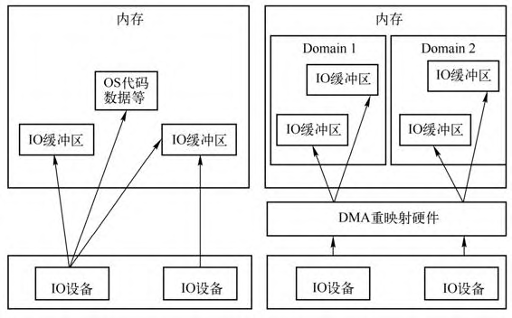

<!-- @import "[TOC]" {cmd="toc" depthFrom=1 depthTo=6 orderedList=false} -->

<!-- code_chunk_output -->

- [1. VFIO 和 VT-d](#1-vfio-和-vt-d)
  - [1.1. 设备透传](#11-设备透传)
- [2. VFIO 框架简介](#2-vfio-框架简介)
  - [2.1. vfio interface](#21-vfio-interface)
  - [2.2. vfio_iommu 和 vfio_pci](#22-vfio_iommu-和-vfio_pci)
  - [2.3. iommu driver 和 pci bus driver](#23-iommu-driver-和-pci-bus-driver)
  - [2.4. 示例](#24-示例)
- [3. 三个核心概念](#3-三个核心概念)
  - [3.1. Device](#31-device)
  - [3.2. Group](#32-group)
  - [3.3. Container](#33-container)
  - [3.4. 三个的关系](#34-三个的关系)
- [5. VFIO 数据结构](#5-vfio-数据结构)
  - [5.1. vfio_container](#51-vfio_container)
  - [5.2. vfio_group](#52-vfio_group)
  - [5.3. device](#53-device)
  - [5.4. vfio_iommu_driver](#54-vfio_iommu_driver)
  - [5.5. 小结](#55-小结)
- [4. 使用示例](#4-使用示例)
- [设备透传分析](#设备透传分析)
  - [虚拟机地址映射](#虚拟机地址映射)
  - [设备透传实现](#设备透传实现)
- [6. VFIO 中的技术关键点](#6-vfio-中的技术关键点)
- [reference](#reference)

<!-- /code_chunk_output -->

# 1. VFIO 和 VT-d

**设备直通**就是将物理设备直接挂到虚拟机, 虚拟机通过直接与设备交互来获得较好的性能.

**传统的透传设备**到 QEMU/KVM 虚拟机的方法为 **PCI passthrough**, 这种老的设备直通方式需要 **KVM 完成大量的工作**, 如与IOMMU交互, 注册中断处理函数等. 显然这种方法会让KVM过多地与设备打交道, 扮演一个设备驱动的角色, 这种方案不够通用灵活,所以后来有了VFIO(Virtual Function I/O).

VFIO是一个用户态驱动框架, 它利用硬件层面的I/O虚拟化技术, 
如 Intel 的 VT-d 和 AMD 的 AMD-Vi, 将设备直通给虚拟机.

* 传统上, 设备驱动与设备进行交互需要访问设备的很多资源, 如PCI设备的配置空间, BAR地址空间, 设备中断等, 所有这些资源都是在内核态进行分配和访问的;

* 虚拟化环境下, 把设备直通给虚拟机之后, QEMU需要接管所有虚拟机对设备资源的访问.

VFIO的基本思想包括两个部分:

* 第一个是**将物理设备的各种资源分解**, 并将**获取这些资源的接口**向上导出到**用户空间**, 如图 7-48 所示, QEMU等应用层软件可以利用这些接口获取硬件的所有资源, 包括设备的配置空间, BAR空间和中断.

**图7-48 VFIO抽象物理设备**:


* VFIO思想的第二部分就是聚合, 也就是将**从硬件设备得到的各种资源聚合起来**, 对虚拟化展示一个完整的设备接口, 这种聚合是**在用户空间完成**的, 聚合的思想如图 7-49 所示. 以QEMU为例, 它从硬件设备分解各种资源之后, 会重新聚合成一个虚拟机设备挂到虚拟机上, QEMU还会调用KVM的接口将这些资源与虚拟机联系起来, 使得虚拟机内部完全对VFIO的存在无感知, 虚拟机内部的操作系统能够透明地与直通设备进行交互, 也能够正常处理直通设备的中断请求.

**图7-49 VFIO组装成一个虚拟设备**:


> 图7-48 和 图7-49 均来自 Alex Williamson 在 KVM Forum 2016 上的演讲 `An Introduction to PCI Device Assignment with VFIO`(附件有).

在非虚拟化环境中, 大部分情况下都是通过设备驱动访问硬件外设的, 对于设备来说, 其访问的内存地址空间可以是整个机器的, 外设的中断也统一纳入操作系统的中断处理框架. 但是在虚拟化环境下, 当把设备直通给虚拟机之后,有两个难点需要解决, 一个是设备DMA使用的地址, 另一个是由于虚拟机内部在指定设备 DMA 地址的时候能够随意指定地址, 所以需要有一种机制来对设备的DMA地址访问进行隔离.

在 Intel 架构上, MSI 中断是通过写一段地址完成的, 任何 DMA 的发起者都能够写任意数据, 这就会导致虚拟机内部的攻击者能够让外设产生不属于它的中断. 所以, VT-d技术中的另一个要解决的问题是中断重定向, 设备产生的中断会经过中断重定向器来判断中断是否合法以及是否重定向到虚拟机内部.

类似于MMU把CPU访问的虚拟机地址转换为物理地址, VT-d 技术中的 DMA 重映射器和中断重映射模块叫作 IOMMU, IOMMU 的基本原理如图7-50所示.

图7-50 IOMMU基本原理:


IOMMU 的主要功能是 DMA Remapping. 如果设备的 DMA 访问没有隔离, 该设备就能够访问物理机上的所有地址空间, 如图7-51左图所示. 为了保证安全性, IOMMU会对设备的DMA地址再进行一层转换, 使得设备的DMA能够访问的地址仅限于宿主机分配的一定内存中, 如图7-51右图所示, 这里的Domain可以理解为一个虚拟机.

**图7-51 DMA Remapping原理**:



DMA Remapping的基本思想如图7-52所示,当虚拟机让设备进行DMA时,指定的是GPA地址,在经过DMA Remapping之后,该GPA地址会被转换成QEMU/KVM为其分配的物理地址.这一点与右边CPU进行访问时EPT的作用是一样的.

**图7-52 IO和CPU虚拟化**:


与MMU类似,DMA Remapping也需要建立类似页表这样的结构来完
成DMA的地址转换,图7-53展示了这个过程.

**图7-53 Device到Domain的映射表**:


Root Table总共255项,每一项表示一条总线,Root Table中的每一项用来指向一个Context Table.Context Table中的每一项都记录有该设备对应的Domain信息,这些信息里面就有地址转换页表.这样通过DMA remapping就能够将设备访问的虚拟机地址转换成宿主机分配给虚拟机的物理地址.当然,Root Table,Context Table等都需要宿主机通过iommu驱动的编程接口去构造.

有的IOMMU还会有Interrupt Remapping,其原理也是通过IOMMU对所有的中断请求做一个重定向,从而将直通设备内中断正确地分派到虚拟机,这里不再赘述.


Virtual Function I/O(VFIO就是内核针对 IOMMU 提供的软件框架, 支持 DMA Remapping 和 Interrupt Remapping.

VFIO将物理设备上的资源(设备的配置空间,BAR空间,中断等)分解,并提供接口导出到用户空间,QEMU等用户层软件可以利用这些接口来获取硬件的资源.

这里仅介绍PCI设备对应的VFIO框架图.


其中:

(1)VFIO API接口用于向应用层导出接口,QEMU等用户程序可以通过相应的ioctl与VFIO进行交互;

(2)VFIO IOMMU接口调用IOMMU驱动接口,作DMA重映射和中断重映射;

(3)VFIO-PCI 对设备驱动的封装,用于向用户进程提供设备驱动的访问,如配置空间和BAR空间;


内核态分别存在三个结构体vfio_device,vfio_group和vfio_container分别与上述三个QEMU中三个结构体对应.

对于Container API,可以进行container API和IOMMU API.


VFIO 利用 IOMMU 硬件特性, 可以**屏蔽物理地址对上层的可见性**, 可以用来**开发用户态驱动**, 也**可以实现设备透传**.

它是一套用户态驱动框架, 它提供了两个服务:

* 向用户态提供**访问硬件设备的接口**;
* 向用户态提供**配置 IOMMU 的接口**.

VFIO 由平台无关的接口层与平台相关的实现层组成. 接口层将服务抽象为 IOCTL 命令, 规化操作流程, 定义通用数据结构, 与用户态交互. 实现层完成承诺的服务. 据此, 可在用户态实现支持 DMA 操作的高性能驱动. 在虚拟化场景中, 亦可借此完全在用户态实现 device passthrough.

VFIO 实现层又分为设备实现层与 IOMMU 实现层. 当前 VFIO 仅支持 PCI 设备. IOMMU 实现层则有 x86 与 PowerPC 其它种类硬件及 IOMMU 的支持.

## 1.1. 设备透传

它充分利用了 `VT-d`/`AMD-Vi` 技术提供的 IOMMU `DMA Remapping` 和 `Interrupt Remapping` 特性, 在保证直通设备的 DMA 安全性同时可以达到接近物理设备的 I/O 的性能.

**用户态进程**可以直接使用 **VFIO 驱动**直接访问硬件, 并且由于整个过程是在 IOMMU 的保护下进行因此十分安全, 而且非特权用户也是可以直接使用.

> 换句话说, **VFIO** 是一套完整的**用户态驱动**(userspace driver)**方案**, 因为它可以安全地把**设备 I/O**, **中断**, **DMA** 等能力呈现给用户空间.

为了达到最高的 IO 性能, 虚拟机就需要 VFIO 这种设备直通方式, 因为它具有低延时, 高带宽的特点, 并且 guest 也能够直接使用设备的原生驱动. 这些优异的特点得益于 VFIO 对 `VT-d`/`AMD-Vi` 所提供的 DMA Remapping 和 Interrupt Remapping 机制的应用:

* 使用 **DMA Remapping** 为 **每个 Domain** 建立独立的 `IOMMU Page Table`, 将直通设备的 DMA 访问限制在 **Domain 的地址空间之内**, 从而保证了用户态 DMA 的安全性.

* 使用 `Interrupt Remapping` 来完成**中断重映射**和 `Interrupt Posting` 来达到 **中断隔离** 和 **中断直接投递** 的目的.

# 2. VFIO 框架简介

整个 VFIO 框架设计十分简洁清晰, 可以用下面的一幅图描述:

```
+-------------------------------------------+
|                                           |
|             VFIO Interface                |
|                                           |
+---------------------+---------------------+
|                     |                     |
|     vfio_iommu      |      vfio_pci       |
|                     |                     |
+---------------------+---------------------+
|                     |                     |
|    iommu driver     |    pci_bus driver   |
|                     |                     |
+---------------------+---------------------+
```

## 2.1. vfio interface

与 KVM 一样, 用户态通过 IOCTL 与 VFIO 交互. 可作为操作对象的几种文件描述符有:

* Container 文件描述符
    * 打开 `/dev/vfio` 字符设备可得
* IOMMU group 文件描述符
    * 打开 `/dev/vfio/N` 文件可得(详见后文)
* Device文件描述符
    * 向 IOMMU group 文件描述符发起相关 ioctl 可得

逻辑上来说, IOMMU group 是 IOMMU 操作的最小对象. 某些 IOMMU 硬件支持将若干 IOMMU group 组成更大的单元. VFIO 据此做出 **container** 的概念, 可容纳**多个 IOMMU group**, 打开 `/dev/vfio` 文件即新建一个空的 container. 在 VFIO 中, container 是 IOMMU 操作的最小对象.

要使用 VFIO, 需先将设备与原驱动拨离, 并与 VFIO 绑定.

用 VFIO 访问硬件的步骤:

* 打开设备所在 IOMMU group 在 /dev/vfio/ 目录下的文件
* 使用 `VFIO_GROUP_GET_DEVICE_FD` 得到表示设备的文件描述(参数为设备名称,一个典型的PCI设备名形如 `0000:03.00.01`)
* 对设备进行 `read`/`write`/`mmap` 等操作

用 VFIO 配置 IOMMU 的步骤

* 打开 `/dev/vfio`, 得到 container 文件描述符
* 用 `VFIO_SET_IOMMU` 绑定一种 IOMMU 实现层
* 打开 `/dev/vfio/N`, 得到 IOMMU group 文件描述符
* 用 `VFIO_GROUP_SET_CONTAINER` 将 IOMMU group 加入 container
* 用 `VFIO_IOMMU_MAP_DMA` 将此 IOMMU group 的 DMA 地址映射至进程虚拟地址空间

逻辑:

VFIO设备实现层与Linux设备模型紧密相连,当前,VFIO
中仅有针对PCI的设备实现层(实现在vfio-pci模块中
实现层的作用与普通设备驱动的作用类似.普通设备驱动
向上穿过若干抽象层,最终以Linux里广为人知的抽象设备
(网络设备,块设备等等
在/dewvfio/目录下为设备所在IOMMU group生成相关文
件,继而将设备暴露出来,两者起点相同,最终呈现给用
户态不同的接口.欲使设备置于VFIO管辖之下,需将其与
旧驱动解除绑定,由VFIO设备实现层接管.用户态能感知
到的,是一个设备的消失如eth0
生(其中N为设备所在IOMMU group的序号
group内的设备相互影响,只有组内全部设备被VFIO管理
时,方能经VFIO配置此IOMMU group.
把设备归于IOMMU group的策略由平台决定,在PowerNV
平台,一个IOMMU group与一个PE对应.PowerPC平台
不支持将多个IOMMU group作为更大的IOMMU操作单
元,故而container只是IOMMU group的简单包装而已.对
container进行的IOMMU操作最终会被路由至底层的
IOMMU实现层,这实际上将用户态与内核里的IOMMU驱
动接连了起来,


最上层的是 `VFIO Interface Layer`, 它负责**向用户态**提供**统一访问的接口**, 用户态通过约定的 **ioctl** (`/dev/vfio/vfio`) 来设置和调用 VFIO 的各种能力.

```
# ll /dev/vfio/vfio
crw-rw-rw- 1 root root 10, 196 9月   8 02: 37 /dev/vfio/vfio
```

```cpp
// drivers/vfio/vfio.c
static struct miscdevice vfio_dev = {
        .minor = VFIO_MINOR,
        .name = "vfio",
        .fops = &vfio_fops,
        .nodename = "vfio/vfio",
        .mode = S_IRUGO | S_IWUGO,
};

static const struct file_operations vfio_fops = {
        .owner          = THIS_MODULE,
        .open           = vfio_fops_open,
        .release        = vfio_fops_release,
        .read           = vfio_fops_read,
        .write          = vfio_fops_write,
        .unlocked_ioctl = vfio_fops_unl_ioctl,
        .compat_ioctl   = compat_ptr_ioctl,
        .mmap           = vfio_fops_mmap,
};
```

## 2.2. vfio_iommu 和 vfio_pci

中间层分别是 `vfio_iommu` 和 `vfio_pci`

* **vfio_iommu** 是 VFIO **对 iommu 层的统一封装**主要用来实现 **DMAP Remapping** 的功能, 即**管理 IOMMU 页表**的能力.

```cpp
// drivers/vfio/vfio_iommu_type1.c
static const struct vfio_iommu_driver_ops vfio_iommu_driver_ops_type1 = {
        ......
        .release                = vfio_iommu_type1_release,
        .ioctl                  = vfio_iommu_type1_ioctl,
        .pin_pages              = vfio_iommu_type1_pin_pages,
        .dma_rw                 = vfio_iommu_type1_dma_rw,
        ......
}

static int __init vfio_iommu_type1_init(void)
{
        return vfio_register_iommu_driver(&vfio_iommu_driver_ops_type1);
}
module_init(vfio_iommu_type1_init);
```

* **vfio_pci** 是 VFIO **对 pci 设备驱动的统一封装**, 它和**用户态进程**一起配合完成**设备访问直接访问**, 具体包括 **PCI 配置空间模拟**, **PCI Bar 空间重定向**, **Interrupt Remapping** 等.

```cpp
// drivers/vfio/pci/vfio_pci.c
static const struct vfio_device_ops vfio_pci_ops = {
        .name           = "vfio-pci",
        .open_device    = vfio_pci_open_device,
        .close_device   = vfio_pci_core_close_device,
        .ioctl          = vfio_pci_core_ioctl,
        .read           = vfio_pci_core_read,
        .write          = vfio_pci_core_write,
        .mmap           = vfio_pci_core_mmap,
        .request        = vfio_pci_core_request,
        .match          = vfio_pci_core_match,
};
```

```
  │ Symbol: VFIO_PCI [=m]                                                                                        │
  │ Type  : tristate                                                                                             │
  │ Defined at drivers/vfio/pci/Kconfig:2                                                                        │
  │   Prompt: VFIO support for PCI devices                                                                       │
  │   Depends on: VFIO [=y] && PCI [=y] && EVENTFD [=y] && MMU [=y]                                              │
  │   Location:                                                                                                  │
  │     -> Device Drivers                                                                                        │
  │ (1)   -> VFIO Non-Privileged userspace driver framework (VFIO [=y])                                          │
  │ Selects: VFIO_VIRQFD [=m] && IRQ_BYPASS_MANAGER [=m]

  │ Symbol: PCIE_BUS_DEFAULT [=y]                                                                                │
  │ Type  : bool                                                                                                 │
  │ Defined at drivers/pci/Kconfig:218                                                                           │
  │   Prompt: Default                                                                                            │
  │   Depends on: <choice> && PCI [=y]                                                                           │
  │   Location:                                                                                                  │
  │     -> Device Drivers                                                                                        │
  │       -> PCI support (PCI [=y])                                                                              │
  │ (1)     -> PCI Express hierarchy optimization setting (<choice> [=y])
```

## 2.3. iommu driver 和 pci bus driver

最下面的一层则是**硬件驱动调用层**

* **iommu driver** 是与**硬件平台相关的实现**, 例如它可能是 `intel iommu driver` 或 `amd iommu driver` 或者 `ppc iommu driver`

```cpp
// drivers/iommu/intel/iommu.c
const struct iommu_ops intel_iommu_ops = {
        .capable                = intel_iommu_capable,
        .domain_alloc           = intel_iommu_domain_alloc,
        .domain_free            = intel_iommu_domain_free,
        ......
}
```

* **vfio_pci** 会调用到 host 上的 **pci_bus driver** 来实现**设备的注册和反注册**等操作. 仅仅调用了注册/反注册逻辑??

```cpp
// drivers/pci/bus.c

```

## 2.4. 示例

1. `vfio_iommu_driver` -> `iommu driver` -> `intel iommu driver`

* `"drivers/vfio/vfio_iommu_type1.c"` -> `"drivers/iommu/iommu.c"` -> `"drivers/iommu/intel/iommu.c"`

* `release()` -> `vfio_iommu_type1_release()` -> `vfio_release_domain()` -> `iommu_domain_free()` -> `domain->ops->domain_free(domain)` -> `intel_iommu_domain_free()`

2.

`"drivers/pci/pci-driver.c"` -> `drivers/pci/bus.c`

`vfio_pci_probe()` -> `vfio_pci_core_register_device()`

`vfio_pci_bus_notifier()`

`pci_device_probe()` ->

# 3. 三个核心概念


在了解 VFIO 之前需要了解 3 个基本概念: device, group, container, 它们在逻辑上的关系如上图所示.

## 3.1. Device

* **Device** 指的是我们要操作的硬件设备, 不过这里的 "设备" 需要从 **IOMMU 拓扑**的角度去理解.

  * 如果该设备是**硬件拓扑上一个独立的设备**, 那么它**自己就构成一个 iommu group**.
  * 如果这里是一个 **multi-function 设备**, 那么它和其他的 function **一起组成**一个 **iommu group**.

> 因为**多个 function 设备在物理硬件上就是互联的**, 他们可以**互相访问对方的数据**, 所以必须放到一个 group 里隔离起来.
>
> 也就是说一个 group 就是 BDF 中的 BD 相同的 device 集合
>
> 值得一提的是, 对于**支持 PCIe ACS 特性**的硬件设备, 我们可以认为他们在物理上是互相隔离的.

```
# tree /sys/kernel/iommu_groups/
/sys/kernel/iommu_groups/
├── 0
│   ├── devices
│   │   └── 0000: 00: 00.0 -> ../. ./. ./. ./devices/pci0000: 00/0000: 00: 00.0
│   ├── reserved_regions
│   └── type
......
├── 11
│   ├── devices
│   │   ├── 0000: 00: 0d.0 -> ../. ./. ./. ./devices/pci0000: 00/0000: 00: 0d.0
│   │   ├── 0000: 00: 0d.2 -> ../. ./. ./. ./devices/pci0000: 00/0000: 00: 0d.2
│   │   └── 0000: 00: 0d.3 -> ../. ./. ./. ./devices/pci0000: 00/0000: 00: 0d.3
│   ├── reserved_regions
│   └── type

# lspci
00: 0d.0 USB controller: Intel Corporation Device 9a13 (rev 01)
00: 0d.2 USB controller: Intel Corporation Device 9a1b (rev 01)
00: 0d.3 USB controller: Intel Corporation Device 9a1d (rev 01)
......
```

## 3.2. Group

* **Group** 是 **IOMMU** 能够进行 **DMA 隔离的最小硬件单元**, 一个 group 内可能只有一个 device, 也可能有**多个 device**, 这取决于**物理平台**上**硬件的 IOMMU 拓扑结构**. 设备直通的时候一个 group 里面的设备必须都直通给一个虚拟机.

> 不能够让一个 group 里的多个 device 分别从属于 2 个不同的 VM, 也不允许部分 device 在 host 上而另一部分被分配到 guest 里, 因为这样一个 guest 中的 device 可以利用 DMA 攻击获取另外一个 guest 里的数据, 就无法做到物理上的 DMA 隔离.
>
> 另外, **VFIO 中的 group** 和 **iommu group** 可以认为是同一个概念.

## 3.3. Container

* **Container** 是一个**和地址空间相关联**的概念. 对于虚机, 理解为**一个 VM Domain 的物理内存空间**; 对于用户态驱动, Container可以是多个Group的集合

> DMA Isolation 是以 Domain 为单位进行隔离的. **每个 VM 的地址空间称为一个 Domain**.

## 3.4. 三个的关系


上图中 PCIe-PCI 桥下的两个设备, 在发送 DMA 请求时,  PCIe-PCI 桥会为下面两个设备生成 Source Identifier, 其中 Bus 域为红色总线号 bus, device 和 func 域为 0. 这样的话, PCIe-PCI 桥下的两个设备会找到**同一个 Context Entry** 和**同一份页表**, 所以这两个设备不能分别给两个虚机使用, 这两个设备就属于一个Group.

从上图可以看出:

1. 一个或**多个 device** 从属于**某个 group**
2. 而一个或**多个 group** 又从属于**一个 container**, 这些group共享页表信息.

如果要**将一个 device 直通给 VM**, 那么先要找到**这个设备从属的 iommu group**, 然后将整个 group 加入到 **container** 中即可.

关于如何使用 VFIO 可以参考内核文档: [vfio.txt](https://www.kernel.org/doc/Documentation/vfio.txt)

# 5. VFIO 数据结构

Linux 内核设备驱动充分利用了 "一切皆文件" 的思想, VFIO 驱动也不例外, VFIO 中为了方便操作 **device**, **group**, **container** 等对象, 将它们和对应的设备文件进行绑定.

## 5.1. vfio_container

VFIO Container 和 VFIO Group 不同.

**VFIO Group** 和 `/dev/vfio/$GROUP` 设备文件绑定, 每个设备文件唯一对应**一个VFIO Group**, 且**只能打开一次**, 试图第二次打开会返回 `-EBUSY`.

**VFIO Container** 只有一个入口点即`/dev/vfio/vfio`, 每次打开该设备文件, 都将获得一个新的VFIO Container实例.

> **VFIO 驱动**在加载的时候会创建这个名为 `/dev/vfio/vfio` 的文件.

```cpp
// drivers/vfio/vfio.c
static const struct file_operations vfio_fops = {
        ......
        .open           = vfio_fops_open,
        ......
}

static int vfio_fops_open(struct inode *inode, struct file *filep)
{
        struct vfio_container *container;

        container = kzalloc(sizeof(*container), GFP_KERNEL);
        if (!container)
                return -ENOMEM;

        INIT_LIST_HEAD(&container->group_list);
        init_rwsem(&container->group_lock);
        kref_init(&container->kref);

        filep->private_data = container;

        return 0;
}
```

```cpp
// qemu
s->container = open("/dev/vfio/vfio", O_RDWR);
```

VFIO Container 本身具备的功能微乎其微, 只有三个ioctl:

* `VFIO_GET_API_VERSION`, 返回VFIO_API_VERSION(目前版本号为0)
* `VFIO_CHECK_EXTENSION`, ext, 返回1表示支持该extension(ext), 返回0表示不支持
* `VFIO_SET_IOMMU`, type, 设置 **IOMMU Driver** 为 type 类型, 在调用该 ioctl 前**必须至少挂载一个 VFIO Group**
  * 本质上只有**两种类型**, 即 **Type1 IOMMU** 和 **sPAPR IOMMU**, 前者代表 x86,ARM 等架构上的 IOMMU, 后者代表 POWER 架构上的 IOMMU
  * 我们只关心 **Type1 IOMMU**, 它又细分为 `VFIO_TYPE1_IOMMU`,`VFIO_TYPE1v2_IOMMU` 和 `VFIO_TYPE1_NESTING_IOMMU`, 一般来说用 `VFIO_TYPE1v2_IOMMU` 即可
  * 所有的 type 都可以作为 VFIO_CHECK_EXTENSION 的参数, 检查内核是否支持该类型, 用户应该先检查是否支持该类型再设置 IOMMU Driver

https://tcbbd.moe/linux/qemu-kvm/vfio/#Overview

## 5.2. vfio_group

当我们把一个设备直通给虚拟机时, 首先要做的就是将这个设备从 host 上进行解绑, 即**解除 host 上此设备的驱动**, 然后**将设备驱动绑定**为 "`vfio-pci`", 在完成绑定后会新增一个 `/dev/vfio/$groupid` 的文件, 其中 `$groupid` 为此 PCI 设备的 **iommu group id**, 这个 id 号是在操作系统加载 iommu driver 遍历扫描 host 上的 PCI 设备的时候就已经分配好的, 可以使用 `readlink -f /sys/bus/pci/devices/$bdf/iommu_group` 来查询.

类似的, `/dev/vfio/$groupid` 这个文件的句柄被关联到 **vfio_group** 上, **用户态进程**打开这个文件就可以**管理这个 iommu group 里的设备**.

```
# ll /dev/vfio/
total 0
drwxr-xr-x  2 root root       80 9月   8 02: 47 ./
drwxr-xr-x 18 root root     4580 9月   8 02: 47 ../
crw-------  1 root root 244,   0 9月   8 02: 47 21
crw-rw-rw-  1 root root  10, 196 9月   8 02: 37 vfio

# ll /sys/bus/pci/devices/0000\: 01\: 00.0/iommu_group
lrwxrwxrwx 1 root root 0 9月   8 02: 37 /sys/bus/pci/devices/0000: 01: 00.0/iommu_group -> ../. ./. ./. ./kernel/iommu_groups/21/
# readlink -f /sys/bus/pci/devices/0000\: 01\: 00.0/iommu_group
/sys/kernel/iommu_groups/21
```

## 5.3. device

然而 VFIO 中并**没有**为**每个 device** 单独创建一个文件, 而是通过 `VFIO_GROUP_GET_DEVICE_FD` 来调用这个 group ioctl 来**获取 device 的句柄**, 然后再通过这个句柄来管理设备.

> VFIO_GROUP_GET_DEVICE_FD: vfio 从 group->device_list 中查找device, 并通过匿名node和fd建立关系

## 5.4. vfio_iommu_driver

VFIO 框架中很重要的一部分是要完成 **DMA Remapping**, 即为 **Domain** 创建对应的 **IOMMU 页表**, 这个部分是由 `vfio_iommu_driver` 来完成的.

**vfio_container** 包含一个指针记录 **vfio_iommu_driver** 的信息, 在 x86 上 `vfio_iommu_driver` 的具体实现是由 **vfio_iommu_type1** 模块来完成的.

```cpp
struct vfio_container {
        struct kref                     kref;
        struct list_head                group_list;
        struct rw_semaphore             group_lock;
        struct vfio_iommu_driver        *iommu_driver;
        void                            *iommu_data;
        bool                            noiommu;
};
```

```
│ Symbol: VFIO_IOMMU_TYPE1 [=y]
│ Type  : tristate
│ Defined at drivers/vfio/Kconfig:2
│   Depends on: VFIO [=y]
│ Selected by [y]:
│   - VFIO [=y] && MMU [=y] && (X86 [=y] || S390 || ARM || ARM64)
```

**vfio_iommu_type1** 模块包含了 `vfio_iommu`, `vfio_domain`, `vfio_group`, `vfio_dma` 等关键数据结构.

```
// drivers/vfio/vfio_iommu_type1.c
vfio_iommu : struct
vfio_domain : struct
vfio_dma : struct
vfio_batch : struct
vfio_iommu_group : struct
vfio_iova : struct
vfio_pfn : struct
vfio_regions : struct
```


* **vfio_iommu** 可以认为是和 **container** 概念相对应的 iommu 数据结构, 在虚拟化场景下**每个虚拟机的物理地址空间**映射到一个 `vfio_iommu` 上.


* **vfio_group** 可以认为是和 **group** 概念对应的 iommu 数据结构, 它指向一个 `iommu_group` 对象, 记录了着 `iommu_group` 的信息.

* **vfio_domain** 这个概念尤其需要注意, 这里绝**不能**把它理解成**一个虚拟机 domain**, 它是一个与 **DRHD**(即 IOMMU 硬件)相关的概念, 它的出现就是**为了应对多 IOMMU 硬件的场景**, 我们知道在大规格服务器上可能会有**多个 IOMMU 硬件**, 不同的 IOMMU **硬件有可能存在差异**, 例如 IOMMU 0 支持 `IOMMU_CACHE`, 而 IOMMU 1 不支持 IOMMU_CACHE(当然这种情况少见, 大部分平台上硬件功能是具备一致性的), 这时候我们**不能**直接将分别**属于不同 IOMMU 硬件管理的设备**直接加入到**一个 container** 中, 因为它们的 IOMMU 页表 SNP bit 是不一致的. 因此, 一种合理的解决办法就是把**一个 container** 划分**多个 vfio_domain**, 当然在大多数情况下我们只需要一个 vfio_domain 就足够了. 处在**同一个 vfio_domain 中的设备共享 IOMMU 页表区域**, 不同的 vfio_domain 的页表属性又可以不一致, 这样我们就可以支持跨 IOMMU 硬件的设备直通的混合场景.

```
# ll /sys/class/iommu/
total 0
drwxr-xr-x  2 root root 0 Sep 19 09: 09 ./
drwxr-xr-x 76 root root 0 Sep 19 09: 09 ../
lrwxrwxrwx  1 root root 0 Sep 19 09: 09 dmar0 -> ../. ./devices/virtual/iommu/dmar0/
lrwxrwxrwx  1 root root 0 Sep 19 09: 09 dmar1 -> ../. ./devices/virtual/iommu/dmar1/
```

## 5.5. 小结

经过上面的介绍和分析, 我们可以把 VFIO 各个组件直接的关系用下图表示.


对这些的用户态代码可以看 qemu 或 kvmtool(更简单)


# 4. 使用示例

这里先以简单的用户态驱动为例, 在设备透传小节中, 再分析如何利用 vfio 实现透传.

```cpp
int container, group, device, i;
    struct vfio_group_status group_status =
                    { .argsz = sizeof(group_status) };
    struct vfio_iommu_type1_info iommu_info = { .argsz = sizeof(iommu_info) };
    struct vfio_iommu_type1_dma_map dma_map = { .argsz = sizeof(dma_map) };
    struct vfio_device_info device_info = { .argsz = sizeof(device_info) };

    /* Create a new container */
    container = open("/dev/vfio/vfio", O_RDWR);

    /* Unknown API version */
    if (ioctl(container, VFIO_GET_API_VERSION) != VFIO_API_VERSION)

    /* Doesn't support the IOMMU driver we want. */
    if (!ioctl(container, VFIO_CHECK_EXTENSION, VFIO_TYPE1_IOMMU))

    /* Open the group */
    group = open("/dev/vfio/26", O_RDWR);

    /* Test the group is viable and available */
    ioctl(group, VFIO_GROUP_GET_STATUS, &group_status);

    /* Group is not viable (ie, not all devices bound for vfio) */
    if (!(group_status.flags & VFIO_GROUP_FLAGS_VIABLE))

    /* Add the group to the container */
    ioctl(group, VFIO_GROUP_SET_CONTAINER, &container);

    /* Enable the IOMMU model we want */
    // type 1 open | attatch
    ioctl(container, VFIO_SET_IOMMU, VFIO_TYPE1_IOMMU);

    /* Get addition IOMMU info */
    ioctl(container, VFIO_IOMMU_GET_INFO, &iommu_info);

    /* Allocate some space and setup a DMA mapping */
    //倒数第二个参数的 0 是什么意思?一般不是文件描述符吗 fd=open(...)??
    dma_map.vaddr = mmap(0, 1024 * 1024, PROT_READ | PROT_WRITE,
                        MAP_PRIVATE | MAP_ANONYMOUS, 0, 0);
    dma_map.size = 1024 * 1024;
    /* 1MB starting at 0x0 from device view */
    dma_map.iova = 0;
    dma_map.flags = VFIO_DMA_MAP_FLAG_READ | VFIO_DMA_MAP_FLAG_WRITE;
    //把iova地址转换到vaddr对应的物理地址??
    ioctl(container, VFIO_IOMMU_MAP_DMA, &dma_map);

    /* Get a file descriptor for the device */
    device = ioctl(group, VFIO_GROUP_GET_DEVICE_FD, "0000:06:0d.0");

    /* Test and setup the device */
    ioctl(device, VFIO_DEVICE_GET_INFO, &device_info);
```

对于 dev 下 Group 就是按照上一节介绍的 Group 划分规则产生的, **上述代码**描述了**如何使用 VFIO 实现映射**.

对于 Group 和 Container 的相关操作这里不做过多解释, 主要关注如何完成映射, 下图解释具体工作流程.


1. 首先, 利用 mmap 映射出 1MB 字节的虚拟空间, 因为**物理地址对于用户态不可见**, 只能通过虚拟地址访问物理空间;

2. 然后执行 ioctl 的 `VFIO_IOMMU_MAP_DMA` 命令, 传入参数主要包含 **vaddr** 及 **iova**, 其中**iova** 代表的是**设备发起DMA请求时要访问的地址**, 也就是 IOMMU映射前的地址; vaddr 就是 mmap 的地址. `VFIO_IOMMU_MAP_DMA` 命令会为**虚拟地址 vaddr** 找到**物理页**并 **pin** 住(因为**设备 DMA 是异步的**, 随时可能发生, 物理页面不能交换出去), 然后找到 Group 对应的 `Contex Entry`, 建立**页表项**, 页表项能够将 **iova 地址**映射成上面 pin 住的物理页对应的物理地址上去, 这样对用户态程序完全屏蔽了物理地址, 实现了用户空间驱动. IOVA 地址的 `0(0x100000)` 对应 DRAM 地址 `0x10000000(0x10100000)`, size 为 `1024 * 1024`.

一句话概述, `VFIO_IOMMU_MAP_DMA` 这个命令就是将 iova 通过 IOMMU 映射到 vaddr 对应的物理地址上去.

# 设备透传分析

设备透传就是由虚机直接接管设备, 虚机可以直接访问MMIO空间, VMM配置好IOMMU之后, 设备DMA读写请求也无需VMM借入, 需要注意的是设备的配置空间没有透传, 因为VMM已经配置好了BAR空间, 如果将这部分空间也透传给虚机, 虚机会对BAR空间再次配置, 会导致设备无法正常工作.

## 虚拟机地址映射

在介绍透传之前, 先看下虚机的GPA与HVA和HPA的关系, 以及虚机是如何访问到真实的物理地址的, 过程如下图.


一旦页表建立好后, 整个映射过程都是硬件自动完成的, 对于上图有如下几点说明:

* 对于虚机内的页表, 完成GVA到GPA的映射, 虽然整个过程都是硬件自动完成, 但有一点要注意下, 在虚机的中各级页表也是存储在HPA中的, 而CR3及各级页表中装的地址都是GPA, 所以在访问页表时也需要借助EPT, 上图中以虚线表示这个过程

* 利用虚机页表完成GVA到GPA的映射后, 此时借助EPT实现GPA到HPA的映射, 这里没有什么特殊的, 就是一层层页表映射

* 看完上图, 有没有发现少了点啥, 是不是没有HVA. 单从上图整个虚机寻址的映射过程来看, 是不需要HVA借助的, 硬件会自动完成GVA->GPA->HPA映射, 那么HVA有什么用呢?这里从下面两方面来分析: 1)Qemu利用iotcl控制KVM实现EPT的映射, 映射的过程中必然要申请物理页面. Qemu是应用程序, 唯一可见的只是HVA, 这时候又需要借助mmap了, Qemu会根据虚机的ram大小, 即GPA大小范围, 然后mmap出与之对应的大小, 即HVA. 通过KVM_SET_USER_MEMORY_REGION命令控制KVM, 与这个命令一起传入的参数主要包括两个值, guest_phys_addr代表虚机GPA地址起始, userspace_addr代表上面mmap得到的首地址(HVA). 传入进去后, KVM就会为当前虚机GPA建立EPT映射表实现GPA->HPA, 同时会为VMM建立HVA->HPA映射. 2)当vm_exit发生时, VMM需要对异常进行处理, 异常发生时VMM能够获取到GPA, 有时VMM需要访问虚机GPA对应的HPA, VMM的映射和虚机的映射方式不同, 是通过VMM完成HVA->HPA, 且只能通过HVA才能访问HPA, 这就需要VMM将GPA及HVA的对应关系维护起来, 这个关系是Qemu维护的, 这里先不管Qemu的具体实现(后面会有专门文档介绍), 当前只需要知道给定一个虚机的GPA, 虚机就能获取到GPA对应的HVA. 下图描述VMM与VM的地址映射关系.


## 设备透传实现

在前面介绍VFIO的使用实例时, 核心思想就是IOVA经过IOMMU映射出的物理地址与HVA经过MMU映射出的物理地址是同一个. 对于设备透传的情况, 先上图, 然后看图说话.


先来分析一下设备的DMA透传的工作流程, 一旦设备透传给了虚机, 虚机在配置设备DMA时直接使用GPA. 此时GPA经由EPT会映射成HPA1, GPA经由IOMMU映射的地址为HPA2, 此时的HPA1和HPA2必须相等, 设备的透传才有意义. 下面介绍在配置IOMMU时如何保证HPA1和HPA2相等, 在VFIO章节讲到了VFIO_IOMMU_MAP_DMA这个命令就是将iova通过IOMMU映射到vaddr对应的物理地址上去. 对于IOMMU来讲, 此时的GPA就是iova, 我们知道GPA经由EPT会映射为HPA1, 对于VMM来讲, 这个HPA1对应的虚机地址为HVA, 那样的话在传入VFIO_IOMMU_MAP_DMA命令时讲hva作为vaddr, IOMMU就会将GPA映射为HVA对应的物理地址及HPA1, 即HPA1和HPA2相等. 上述流程帮助理清整个映射关系, 实际映射IOMMU的操作很简单, 前面提到了qemu维护了GPA和HVA的关系, 在映射IOMMU的时候也可以派上用场. 注: IOMMU的映射在虚机启动时就已经建立好了, 映射要涵盖整个GPA地址范围, 同时虚机的HPA对应的物理页都不会交换出去(设备DMA交换是异步的).

# 6. VFIO 中的技术关键点

除了 DMA Remapping 这一关键点之外, 在虚拟化场景下 VFIO 还需要解决下面一些关键问题, 需要进行探讨:

1. VFIO 对完备的设备访问支持: 其中包括 MMIO, I/O Port, PCI 配置空间, PCI BAR 空间;

2. VFIO 中高效的设备中断机制, 其中包括 MSI/MSI-X, Interrupt Remapping, 以及 Posted Interrupt 等;

3. VFIO 对直通设备热插拔支持.

# reference

http://element-ui.cn/news/show-44900.html