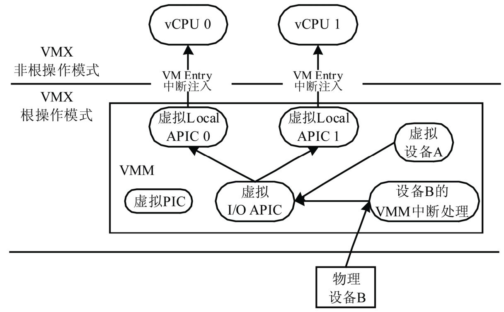
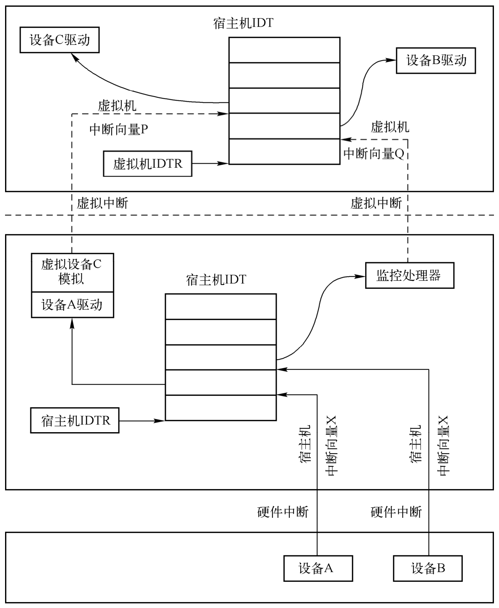

# 4.2. 中断架构

虚拟化环境中, VMM 也需要为客户机 OS 展现一个与物理中断架构类似的虚拟中断架构.

虚拟机的中断架构:



和物理平台一样, **每个 VCPU** 都对应**一个虚拟 Local APIC** 用于**接收中断**. **虚拟平台**也包含**虚拟 I/O APIC** 或**虚拟 PIC** 用于**发送中断**.

和 VCPU 一样, **虚拟 Local APIC**、**虚拟 I/O APIC** 和**虚拟 PIC** 都是 **VMM 维护的软件实体**.

- 当**虚拟设备**需要**发送中断**时, **虚拟设备**会**调用虚拟 I/O APIC 的接口发送中断**.

- **虚拟 I/O APIC** 根据中断请求, 挑选出**相应的虚拟 Local APIC**, 调用其接口**发送中断请求**.

- **虚拟 Local APIC** 进一步利用 `VT-x` 的事件注入机制将中断注入到相应的 VCPU.

可见, 中断虚拟化的主要任务是实现图 5-10 描述的虚拟中断架构, 具体包括**虚拟 PIC**、**虚拟 I/O APIC** 和**虚拟 Local APIC**, 并实现**中断的生成**、**采集**和**注入**的**整个过程**.

# 中断过程

在 **VMX root** 模式下, **外部来的中断**是直接通过**宿主机**的**物理中断控制器**处理的, **虚拟机**的**中断控制器** (如 PIC 或者 APIC) 是通过 **VMM** 创建的, VMM 可以利用虚拟机的中断控制器向其注入中断. 下图展示了宿主机外部中断和虚拟机虚拟中断的关系.

宿主机外部中断和虚拟机虚拟中断:



设备 A 为宿主机拥有, 在宿主机的 IDT 表中, 由 X 向量号对应的中断处理程序处理, 中断处理程序由设备 A 在宿主机中加载的驱动程序注册. 虚拟机有一个虚拟设备 C, 其利用物理设备 A 的功能完成模拟, 虚拟设备 C 的中断处理由虚拟机的 IDT 表中 P 向量号对应的中断处理程序处理, 这个中断处理程序是由虚拟设备 C 在虚拟机中加载的驱动程序注册的. 设备 B 是一个物理设备, 但是被直通给了虚拟机, 设备 B 的中断首先由宿主机 IDT 表中 Y 向量号对应的中断处理程序处理, 这个中断处理程序由 VMM 设置, VMM 接着会向虚拟机注入中断, 虚拟机 IDT 表中的 Q 向量对应的中断处理程序会进行处理, 这个中断处理程序由虚拟机的设备 B 驱动注册.

接下来从代码角度详细分析这些过程, 其中直通设备的中断处理将在第 7 章介绍.

# 虚拟化环境下的中断注入

前面多种中断分发与处理机制, 这些机制少不了中断控制器. 从设备上来说, QEMU-KVM 必须模拟这些中断控制器设备, 另一方面还需要 Intel 的硬件 CPU 提供一种机制, 让 CPU 在进入 VMX non-root 的时候能够将中断信息告诉虚拟机, 从而让虚拟机开始对应的中断处理. VMCS 中的 VM-entry interruption-information field 即用来设定虚拟机的中断信息, 这个成员包括 4 个字节, 总共 32 位.

从 Intel SDM 第二卷表 24-13 可以知道, VM-entry interruption-information field 的低 8 位表示中断 vector, 也就是虚拟机接收到的中断向量号, 用来索引虚拟机 CPU 的 IDT 表查找中断处理函数, 8:10 表示中断类型, 对于模拟硬件设备产生的中断, 该值设置为 0, 第 11 位表示是否需要将异常错误码压栈, 只有当第 31 位 valid 为 1 的时候才进行中断注入.

KVM 中 kvm_x86_ops 结构的 set_irq 回调函数用于注入中断, 对于 Intel 的硬件虚拟化方案来说该回调函数为 vmx_inject_irq, 代码如下.

```cpp
// arch/x86/kvm/vmx/vmx.c
void vmx_inject_irq(struct kvm_vcpu *vcpu, bool reinjected)
{
	struct vcpu_vmx *vmx = to_vmx(vcpu);
	uint32_t intr;
    // 重点 1
	int irq = vcpu->arch.interrupt.nr;

	trace_kvm_inj_virq(irq, vcpu->arch.interrupt.soft, reinjected);

	++vcpu->stat.irq_injections;
	if (vmx->rmode.vm86_active) {
		int inc_eip = 0;
		if (vcpu->arch.interrupt.soft)
			inc_eip = vcpu->arch.event_exit_inst_len;
		kvm_inject_realmode_interrupt(vcpu, irq, inc_eip);
		return;
	}
	intr = irq | INTR_INFO_VALID_MASK;
	if (vcpu->arch.interrupt.soft) {
		intr |= INTR_TYPE_SOFT_INTR;
		vmcs_write32(VM_ENTRY_INSTRUCTION_LEN,
			     vmx->vcpu.arch.event_exit_inst_len);
	} else
		intr |= INTR_TYPE_EXT_INTR;
    // 重点 2
	vmcs_write32(VM_ENTRY_INTR_INFO_FIELD, intr);

	vmx_clear_hlt(vcpu);
}
```

`vmx_inject_irq` 函数首先从 vcpu->arch.interrupt.nr 中取得中断向量号保存在 irq, irq 与 `INTR_INFO_VALID_MASK` 和 `INTR_TYPE_EXT_INTR` 组成一个 32 位的变量 intr, 最终通过 vmcs_write32 写入 VM-entry interruption-information 区域.

在进入 VMX non-root 之前, KVM 会调用 vcpu_enter_guest 函数的检查其中 pending 的 request, 如果发现有 `KVM_REQ_EVENT` 请求, 就会调用 `kvm_check_and_inject_events` 函数进行事件注入, 这类事件中就有设备中断. `kvm_check_and_inject_events` 函数代码如下.

```cpp
// arch/x86/kvm/x86.c
static int vcpu_enter_guest(struct kvm_vcpu *vcpu)
{
    ...
	if (kvm_check_request(KVM_REQ_EVENT, vcpu) || req_int_win ||
	    kvm_xen_has_interrupt(vcpu)) {
        ...
		r = kvm_check_and_inject_events(vcpu, &req_immediate_exit);
        ...
    }
    ...
}

static int kvm_check_and_inject_events(struct kvm_vcpu *vcpu,
				       bool *req_immediate_exit)
{
	bool can_inject;
	int r;
    ...
    // 重点
	if (kvm_cpu_has_injectable_intr(vcpu)) {
		r = can_inject ? kvm_x86_call(interrupt_allowed)(vcpu, true) :
				 -EBUSY;
		if (r < 0)
			goto out;
		if (r) {
			int irq = kvm_cpu_get_interrupt(vcpu);

			if (!WARN_ON_ONCE(irq == -1)) {
				kvm_queue_interrupt(vcpu, irq, false);
				kvm_x86_call(inject_irq)(vcpu, false);
				WARN_ON(kvm_x86_call(interrupt_allowed)(vcpu, true) < 0);
			}
		}
		if (kvm_cpu_has_injectable_intr(vcpu))
			kvm_x86_call(enable_irq_window)(vcpu);
	}
    ...
}
```

`kvm_check_and_inject_events` 函数会调用 `kvm_cpu_has_injectable_intr` 判断是否有中断需要注入, 然后调用 `interrupt_allowed()` 判断当前 VCPU 是否允许中断注入. 如果允许注入则会调用 `kvm_cpu_get_interrupt()` 得到当前的中断向量号, 然后调用 `kvm_queue_interrupt` 将需要注入的中断向量号写入到 `vcpu->arch.interrupt.nr` 中, 代码如下.

```cpp
// arch/x86/kvm/x86.h
static inline void kvm_queue_interrupt(struct kvm_vcpu *vcpu, u8 vector,
	bool soft)
{
	vcpu->arch.interrupt.injected = true;
	vcpu->arch.interrupt.soft = soft;
	vcpu->arch.interrupt.nr = vector;
}
```

kvm_queue_interrupt 完成之后, inject_pending_event 会调用 `inject_irq`(`vmx_inject_irq`), 最终将中断写入到 VMCS 的 VM-entry interruption-information 区域.

这就是在最开头提到的 Intel VT 提供的中断注入的机制, 本节后面的分析中不管是 PIC 和 I/O APIC 中断控制器, 还是 MSI/MSIX 中断注入方式, 本质上都是通过该机制实现中断注入的.


