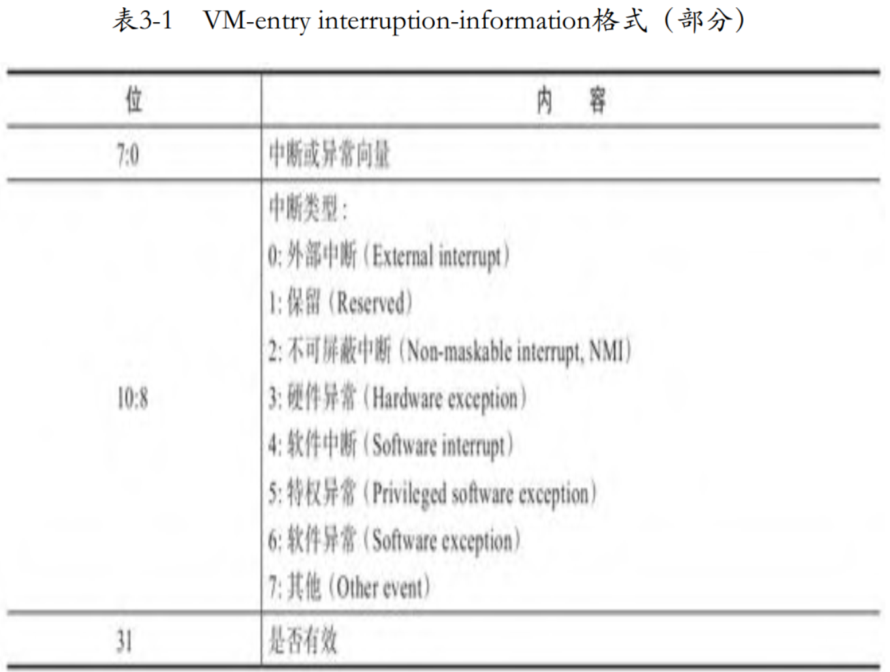

# 可编程中断控制器 8259A

参见 `Architecture\0. 基本架构\x86\0. Learning\2. x86_64编程体系探索及编程\第4篇 中断体系\第17章 8259中断控制器`

操作系统会将中断对应的服务程序地址等信息存储在一个数组中, 数组中的每一个元素对应一个中断. 在实模式下, 这个数组称为 IVT(interrupt vector table). 在保护模式下, 这个数组称为 IDT(Interrupt descriptor table). 在响应中断时, CPU 使用中断向量从 IVT/IDT 中索引中断服务程序. 但是, x86 体系约定, 前 32 个中断号 (0~31) 是留给处理器自己使用的, 比如第 0 个中断号是处理器出现除 0 异常的, 因此, 外设的中断向量只能从 32 号中断开始. 所以, 在初始化 8259A 时, 操作系统通常会设置 8259A 的中断向量从 32 号中断开始, 因此当 8259A 收到管脚 IR0 的中断请求时, 其将向 CPU 发出的中断向量是 32, 当收到管脚 IR1 的中断请求时, 其将向 CPU 发出的中断向量是 33, 以此类推. 在 CPU 初始化 8259A 时, 通过第 2 个初始化命令字 (ICW2) 设置 8259A 起始中断向量号, 下面代码中的变量 irq_base 记录的就是起始中断向量号:

```cpp
commit 85f455f7ddbed403b34b4d54b1eaf0e14126a126
KVM: Add support for in-kernel PIC emulation
linux.git/drivers/kvm/i8259.c
static void pic_ioport_write(void *opaque, u32 addr, u32 val)
{
    ...
        switch (s->init_state) {
        ...
        case 1:
            s->irq_base = val & 0xf8;
            s->init_state = 2;
            break;
        ...
        }
    ...
}
```

后来, 随着 APIC 和 MSI 的出现, 中断向量设置得更为灵活, 可以为每个 PCI 设备设置其中断向量, 这个中断向量存储在 PCI 设备的配置空间中.

内核中抽象了一个结构体 `kvm_kpic_state` 来记录每个 8259A 的状态:

```cpp
commit 85f455f7ddbed403b34b4d54b1eaf0e14126a126
KVM: Add support for in-kernel PIC emulation
linux.git/drivers/kvm/irq.h
struct kvm_kpic_state {
    u8 last_irr;	/* edge detection */
    u8 irr;		/* interrupt request register */
    u8 imr;		/* interrupt mask register */
    u8 isr;		/* interrupt service register */
    ...
};

struct kvm_pic {
    struct kvm_kpic_state pics[2]; /* 0 is master pic, 1 is slave pic */
    irq_request_func *irq_request;
    void *irq_request_opaque;
    int output;		/* intr from master PIC */
    struct kvm_io_device dev;
};
```

一片 8259A 只能连接最多 8 个外设, 如果需要支持更多外设, 需要多片 8259A 级联. 在结构体 kvm_pic 中, 我们看到有两片 `8259A:pic[0]` 和 `pic[1]`. KVM 定义了结构体 kvm_kpic_state 记录 8259A 的状态, 其中包括我们之前提到的 IRR,IMR,ISR 等.

# 虚拟设备向 PIC 发送中断请求

如同物理外设请求中断时拉高与 8259A 连接的管脚的电压一样, 虚拟设备请求中断的方式是通过虚拟 8259A 芯片对外提供的一个 API, 以 kvmtool 中的 virtio blk 虚拟设备为例:

```cpp
commit 4155ba8cda055b7831489e4c4a412b073493115b
kvm: Fix virtio block device support some more
kvmtool.git/blk-virtio.c
static bool blk_virtio_out(struct kvm *self, uint16_t port, void *data, int size, uint32_t count)
{
    ...
    switch (offset) {
    case VIRTIO_PCI_QUEUE_NOTIFY: {
        ...
        while (queue->vring.avail->idx != queue->last_avail_idx) {
            if (!blk_virtio_read(self, queue))
                return false;
        }
        kvm__irq_line(self, VIRTIO_BLK_IRQ, 1);
        ...
    }
    ...
}
```

当 Guest 内核的块设备驱动需要从块设备读取数据时, 其通过写 I/O 端口 VIRTIO_PCI_QUEUE_NOTIFY 触发 CPU 从 Guest 模式切换到 Host 模式, KVM 中的块模拟设备开始 I/O 操作, 上述代码中的 while 循环就是处理 I/O 的, 函数 blk_virtio_read 从保存 Guest 文件系统的镜像文件中读取 I/O 数据. 在这个提交中, 块设备的 I/O 处理是同步的, 也就是说, 一直要等到虚拟设备 I/O 操作完成后, 才会向 Guest 发送中断, 返回 Guest. 显然, 阻塞在这里是不合理的, 更合理的方式是马上返回 Guest, 这样 Guest 可以执行其他任务, 待虚拟设备完成 I/O 操作后, 再通过中断通知 Guest, kvmtool 后来已经改进为异步的方式.

virtio blk 在处理完 I/O 后, 调用函数 kvm__irq_line 向虚拟 8259A 发送中断请求, 其中 VIRTIO BLK IRQ 对应管脚号, 第 3 个参数 "1" 代表高电平, 其代码如下:

```cpp
commit 4155ba8cda055b7831489e4c4a412b073493115b
kvm: Fix virtio block device support some more
kvmtool.git/kvm.c
void kvm__irq_line(struct kvm *self, int irq, int level)
{
    struct kvm_irq_level irq_level;

    irq_level	= (struct kvm_irq_level) {
        {
            .irq		= irq,
        },
        .level		= level,
    };

    if (ioctl(self->vm_fd, KVM_IRQ_LINE, &irq_level) < 0)
        die_perror("KVM_IRQ_LINE failed");
}
```

函数 `kvm__irq_line` 将管脚号和管脚电平信息封装到结构体 `kvm_irq_level` 中, 传递给内核中的 KVM 模块:

```cpp
commit 85f455f7ddbed403b34b4d54b1eaf0e14126a126
KVM: Add support for in-kernel PIC emulation
linux.git/drivers/kvm/kvm_main.c
static long kvm_vm_ioctl(struct file *filp,
               unsigned int ioctl, unsigned long arg)
{
    ...
    switch (ioctl) {
    case KVM_IRQ_LINE: {
        struct kvm_irq_level irq_event;

        r = -EFAULT;
        if (copy_from_user(&irq_event, argp, sizeof irq_event))
            goto out;
        if (irqchip_in_kernel(kvm)) {
            if (irq_event.irq < 16)
                kvm_pic_set_irq(pic_irqchip(kvm),
                    irq_event.irq,
                    irq_event.level);
            /* TODO: IOAPIC */
            r = 0;
        }
        break;
    }
    ...
}
```

KVM 模块将 kvmtool 中组织的中断信息从用户空间复制到内核空间中, 然后调用虚拟 8259A 的模块中提供的 API kvm_pic_set_irq, 向 8259A 发出中断请求.

# 记录中断到 IRR

当中断到来时, CPU 可能正在处理其他中断, 或者多个中断同时到来, 需要排队依次请求 CPU 处理, 因此, 当外设中断请求到来时, 8259A 首先需要将它们记录下来, 这个寄存器就是 IRR(Interrupt Request Register), 8259A 用它来记录有哪些中断需要处理.

当 KVM 模块收到外设的请求, 调用虚拟 8259A 的 API kvm_pic_set_irq 时, 其第一件事情就是将中断记录到 IRR 中:

```cpp
commit 85f455f7ddbed403b34b4d54b1eaf0e14126a126
KVM: Add support for in-kernel PIC emulation
linux.git/drivers/kvm/i8259.c
void kvm_pic_set_irq(void *opaque, int irq, int level)
{
    struct kvm_pic *s = opaque;

    pic_set_irq1(&s->pics[irq >> 3], irq & 7, level);
    pic_update_irq(s);
}

static inline void pic_set_irq1(struct kvm_kpic_state *s, int irq, int level)
{
    int mask;
    mask = 1 << irq;
    if (s->elcr & mask)	/* level triggered */
        if (level) {
            s->irr |= mask;
            s->last_irr |= mask;
        } else {
            s->irr &= ~mask;
            s->last_irr &= ~mask;
        }
    else	/* edge triggered */
        if (level) {
            if ((s->last_irr & mask) == 0)
                s->irr |= mask;
            s->last_irr |= mask;
        } else
            s->last_irr &= ~mask;
}
```

信号有边缘触发和水平触发, 在物理上可以理解为, 8329A 在前一个周期检测到管脚信号是 0, 当前周期检测到管脚信号是 1, 如果是上升沿触发模式, 那么 8259A 就认为外设有请求了, 这种触发模式就是边缘触发. 对于水平触发, 以高电平触发为例, 当 8259A 检测到管脚处于高电平, 则认为外设来请求了.

在虚拟 8259A 的结构体 kvm_kpic_state 中, 寄存器 elcr 是用来记录 8259A 被设置的触发模式的, 我们以边缘触发为例进行讨论, 即代码第 16~22 行. 参数 level 即相当于硬件层面的电信号, 0 表示低电平, 1 表示高电平. 当管脚收到一个低电平时, 即 level 的值为 0, 代码进入 else 分支, 即代码第 21,22 行, 结构体 kvm_kpic_state 中的字段 last_irr 会清除该 IRQ 对应 IRR 的位, 即相当于设置该中断管脚为低电平状态. 当管脚收到高电平时, 即 level 的值为 1, 代码进入 if 分支, 即代码第 17~20 行, 此时 8259A 将判断之前该管脚的状态, 即代码第 18 行, 也就是判断结构体 kvm_kpic_state 中的字段 last_irr 中该 IRQ 对应 IRR 的位, 如果之前管脚为低电平, 而现在管脚是高电平, 那么显然管脚电平有一个跳变, 说明中断源发出了中断请求, 8259A 在字段 irr 中记录下中断请求. 当然, 同时需要在字段 last_irr 记录下当前该管脚的状态.

# 设置待处理中断标识

当 8259A 将中断请求记录到 IRR 中后, 下一步就是开启一个中断评估 (evaluate) 过程, 包括评估中断是否被屏蔽, 多个中断请求的优先级等, 最后将通过管脚 INTA 通知 CPU 处理外部中断. 与物理 8259A 主动发起中断不同, 虚拟中断的发起方式不再是由虚拟中断芯片主动发起, 而是在每次准备切入 Guest 时, KVM 查询中断芯片, 如果有待处理的中断, 则执行中断注入. 模拟 8259A 在将收到的中断请求记录到 IRR 后, 将设置一个变量 "output", 后面在切入 Guest 前 KVM 会查询这个变量:

```cpp
commit 85f455f7ddbed403b34b4d54b1eaf0e14126a126
KVM: Add support for in-kernel PIC emulation
linux.git/drivers/kvm/i8259.c
void kvm_pic_set_irq(void *opaque, int irq, int level)
{
    struct kvm_pic *s = opaque;

    pic_set_irq1(&s->pics[irq >> 3], irq & 7, level);
    pic_update_irq(s);
}

static void pic_update_irq(struct kvm_pic *s)
{
    ...
    irq = pic_get_irq(&s->pics[0]);
    if (irq >= 0)
        s->irq_request(s->irq_request_opaque, 1);
    else
        s->irq_request(s->irq_request_opaque, 0);
}

static void pic_irq_request(void *opaque, int level)
{
    struct kvm *kvm = opaque;

    pic_irqchip(kvm)->output = level;
}
```

在函数 vmx_vcpu_run 中, 在准备切入 Guest 之前将调用函数 vmx_intr_assist 去检查虚拟中断芯片是否有等待处理的中断, 相关代码如下:

```cpp
commit 85f455f7ddbed403b34b4d54b1eaf0e14126a126
KVM: Add support for in-kernel PIC emulation
linux.git/drivers/kvm/vmx.c
static int vmx_vcpu_run(struct kvm_vcpu *vcpu, struct kvm_run *kvm_run)
{
    ...
    if (irqchip_in_kernel(vcpu->kvm))
        vmx_intr_assist(vcpu);
    ...
}

static void vmx_intr_assist(struct kvm_vcpu *vcpu)
{
    ...
    has_ext_irq = kvm_cpu_has_interrupt(vcpu);
    ...
    if (!has_ext_irq)
        return;
    interrupt_window_open =
        ((vmcs_readl(GUEST_RFLAGS) & X86_EFLAGS_IF) &&
         (vmcs_read32(GUEST_INTERRUPTIBILITY_INFO) & 3) == 0);
    if (interrupt_window_open)
        vmx_inject_irq(vcpu, kvm_cpu_get_interrupt(vcpu));
    ...
}
```

其中函数 `kvm_cpu_has_interrupt` 查询 8259A 设置的变量 output:

```cpp
commit 85f455f7ddbed403b34b4d54b1eaf0e14126a126
KVM: Add support for in-kernel PIC emulation
linux.git/drivers/kvm/irq.c
int kvm_cpu_has_interrupt(struct kvm_vcpu *v)
{
    struct kvm_pic *s = pic_irqchip(v->kvm);

    if (s->output)	/* PIC */
        return 1;
    /*
     * TODO: APIC
     */
    return 0;
}
```

如果变量 output 非 0, 就说明有外部中断等待处理. 然后接下来还需要判断 Guest 是否可以被中断, 比如 Guest 是否正在执行一些不能被中断的指令, 如果 Guest 可以被中断, 则调用 `vmx_inject_irq` 完成中断的注入. 其中, 传递给函数 `vmx_inject_irq` 的第 2 个参数是函数 `kvm_cpu_get_interrupt` 返回的结果, 该函数获取需要注入的中断. 这个过程就是中断评估过程, 我们下一节讨论.

# 中断评估

在上一节我们看到在执行注入前, vmx_inject_irq 调用函数 `kvm_cpu_get_interrupt` 获取需要注入的中断. 函数 `kvm_cpu_get_interrupt` 的核心逻辑就是中断评估, 包括待处理的中断有没有被屏蔽? 待处理的中断的优先级是否比 CPU 正在处理的中断优先级高? 等等. 代码如下:

```cpp
commit 85f455f7ddbed403b34b4d54b1eaf0e14126a126
KVM: Add support for in-kernel PIC emulation
linux.git/drivers/kvm/irq.c
int kvm_cpu_get_interrupt(struct kvm_vcpu *v)
{
    ...
    vector = kvm_pic_read_irq(s);
    if (vector != -1)
        return vector;
    /*
     * TODO: APIC
     */
    return -1;
}

linux.git/drivers/kvm/i8259.c
int kvm_pic_read_irq(struct kvm_pic *s)
{
    int irq, irq2, intno;

    irq = pic_get_irq(&s->pics[0]);
    if (irq >= 0) {
        pic_intack(&s->pics[0], irq);
        if (irq == 2) {
            ...
        } else
            intno = s->pics[0].irq_base + irq;
    } else {
        ...
    }
    pic_update_irq(s);

    return intno;
}
```

kvm_pic_read_irq 调用函数 pic_get_irq 获取评估后的中断. 根据由上面代码中黑体标识的部分, 我们可以清楚地看到中断向量是在中断管脚的基础上叠加了一个 irq_base. 这个 irq_base 就是初始化 8259A 时通过 ICW 设置的, 完成从 IRn 到中断向量的转换.

一个中断芯片通常连接多个外设, 所以在某一个时刻, 可能会有多个设备请求到来, 这时就有一个优先处理哪个请求的问题, 因此, 中断就有了优先级的概念. 8259A 支持多种优先级模式, 典型的有两种中断优先级模式:

1) 固定优先级(fixed priority), 即优先级是固定的, 从 IR0 到 IR7 依次降低, IR0 的优先级永远最高, IR7 的优先级永远最低.

2) 循环优先级(rotating priority), 即当前处理完的 IRn 优先级调整为最低, 当前处理的下一个, 即 IRn + 1, 调整为优先级最高. 比如, 当前处理的中断是 irq2, 那么紧接着 irq3 的优先级设置为最高, 然后依次是 irq4,irq5,irq6,irq7,irq1,irq2,irq3. 假设此时 irq5 和 irq2 同时来了中断, 那么 irq5 会被优先处理. 然后 irq6 被设置为优先级最高, 接下来依次是 irq7,irq1,irq2,irq3,irq4,irq5.

理解了循环优先级算法后, 从 8259A 中获取最高优先级请求的代码就很容易理解了:

```cpp
commit 85f455f7ddbed403b34b4d54b1eaf0e14126a126
KVM: Add support for in-kernel PIC emulation
linux.git/drivers/kvm/i8259.c
static int pic_get_irq(struct kvm_kpic_state *s)
{
    int mask, cur_priority, priority;

    mask = s->irr & ~s->imr;
    priority = get_priority(s, mask);
    if (priority == 8)
        return -1;
    /*
     * compute current priority. If special fully nested mode on the
     * master, the IRQ coming from the slave is not taken into account
     * for the priority computation.
     */
    mask = s->isr;
    if (s->special_fully_nested_mode && s == &s->pics_state->pics[0])
        mask &= ~(1 << 2);
    cur_priority = get_priority(s, mask);
    if (priority < cur_priority)
        /*
         * higher priority found: an irq should be generated
         */
        return (priority + s->priority_add) & 7;
    else
        return -1;
}

static inline int get_priority(struct kvm_kpic_state *s, int mask)
{
    int priority;
    if (mask == 0)
        return 8;
    priority = 0;
    while ((mask & (1 << ((priority + s->priority_add) & 7))) == 0)
        priority++;
    return priority;
}
```

函数 pic_get_irq 分成两部分, 第一部分是从当前待处理的中断中取得最高优先级的中断, 需要过滤掉被屏蔽的中断, 即第 5,6 行代码, mask 中的值是去除掉 IMR 的 IRR. 第二部分是获取正在被 CPU 处理的中断的优先级, 即第 10~12 行代码, mask 中的值就是 ISR 中记录的, CPU 正在处理的中断. 然后比较两个中断的优先级, 见第 13~17 行代码, 如果待处理的优先级高, 那么就向上层调用者返回待处理的中断的管脚号.

我们再来看一下计算优先级的函数 get_priority, 这是一个典型的循环优先级算法. 其中变量 priority_add 记录的是当前最高优先级中断对应的管脚号, 所以逻辑上就是从当前的管脚开始, 依次检查后面的管脚是否有 pending 的中断. 比如当前处理的是 IR4 管脚的中断请求, priority_add 的值就是 4, 那么接下来就从紧接在 IR4 后面的管脚开始, 按照顺序处理 IR5,IR6, 一直到 IR3. 在这个过程中, 只要遇到管脚有中断请求, 则跳出循环. 如果 IR5 没有中断请求, 但是 IR6 有中断请求, 则 priority 累加后的值为 2, 函数 get_priority 返回 2. 那么下一个需要处理的中断管脚就是 4+2, 即管脚 IR6 对应的中断.

# 中断 ACK

物理 CPU 在准备处理一个中断请求后, 将通过管脚 INTA 向 8259A 发出确认脉冲. 同样, 软件模拟上也需要类似的处理. 在完成中断评估后, 准备向 Guest 注入中断前, KVM 向虚拟 8259A 执行确认状态的操作. 代码如下:

```cpp
commit 85f455f7ddbed403b34b4d54b1eaf0e14126a126
KVM: Add support for in-kernel PIC emulation
linux.git/drivers/kvm/i8259.c
int kvm_pic_read_irq(struct kvm_pic *s)
{
    int irq, irq2, intno;

    irq = pic_get_irq(&s->pics[0]);
    if (irq >= 0) {
        pic_intack(&s->pics[0], irq);
    ...
}

static inline void pic_intack(struct kvm_kpic_state *s, int irq)
{
    if (s->auto_eoi) {
        if (s->rotate_on_auto_eoi)
            s->priority_add = (irq + 1) & 7;
    } else
        s->isr |= (1 << irq);
    /*
     * We don't clear a level sensitive interrupt here
     */
    if (!(s->elcr & (1 << irq)))
        s->irr &= ~(1 << irq);
}
```

函数 `kvm_pic_read_irq` 获取评估的中断结果后, 调用函数 `pic_intack` 完成了中断确认的动作. 在收到中断确认后, 8259A 需要更新自己的状态. 因为中断已经开始得到服务了, 所以要从 IRR 中清除等待服务请求. 另外, 如果 8259A 工作在非 AEOI 模式, 那么还需要在 ISR 中记录 CPU 正在处理的中断. 如果 8259A 工作在 AEOI 模式, 那么就无须设置 ISR 了.

# 关于 EOI 的处理

如果 8259A 工作在非 AEOI 模式, 在中断服务程序执行的最后, 需要向 8259A 发送 EOI, 告知 8259A 中断处理完成. 8259A 在收到这个 EOI 时, 复位 ISR, 如果采用的是循环优先级, 还需要设置变量 `priority_add`, 使其指向当前处理 IRn 的下一个:

```cpp
commit 85f455f7ddbed403b34b4d54b1eaf0e14126a126
KVM: Add support for in-kernel PIC emulation
linux.git/drivers/kvm/i8259.c
static void pic_ioport_write(void *opaque, u32 addr, u32 val)
{
    ...
            cmd = val >> 5;
            switch (cmd) {
            ...
            case 1:	/* end of interrupt */
            case 5:
                priority = get_priority(s, s->isr);
                if (priority != 8) {
                    irq = (priority + s->priority_add) & 7;
                    s->isr &= ~(1 << irq);
                    if (cmd == 5)
                        s->priority_add = (irq + 1) & 7;
                    pic_update_irq(s->pics_state);
                }
                break;
    ...
}
```

如果 8259A 被设置为 AEOI 模式, 不会再收到后续中断服务程序的 EOI, 那么 8259A 在收到 ACK 后, 就必须立刻处理收到 EOI 命令时执行的逻辑, 调整变量 priority_add, 记录最高优先级位置:

```cpp
commit 85f455f7ddbed403b34b4d54b1eaf0e14126a126
KVM: Add support for in-kernel PIC emulation
linux.git/drivers/kvm/i8259.c
static inline void pic_intack(struct kvm_kpic_state *s, int irq)
{
    if (s->auto_eoi) {
        if (s->rotate_on_auto_eoi)
            s->priority_add = (irq + 1) & 7;
    } else
    ...
}
```

# 中断注入

对于外部中断, CPU 在每个指令周期结束后, 将会去检查 INTR 是否有中断请求. 那么对于处于 Guest 模式的 CPU, 如何知道有中断请求呢? Intel 在 VMCS 中设置了一个字段: VM-entry interruptioninformation, 在 VM entry 时 CPU 将会检查这个字段, 其格式表 3-1 所示.



在 VM entry 前, KVM 模块检查虚拟 8259A, 如果有待处理的中断需要处理, 则将需要处理的中断信息写入 VMCS 中的字段 VM-entry interruption-information:

```cpp
commit 85f455f7ddbed403b34b4d54b1eaf0e14126a126
KVM: Add support for in-kernel PIC emulation
linux.git/drivers/kvm/vmx.c
static void vmx_inject_irq(struct kvm_vcpu *vcpu, int irq)
{
    ...
    vmcs_write32(VM_ENTRY_INTR_INFO_FIELD,
            irq | INTR_TYPE_EXT_INTR | INTR_INFO_VALID_MASK);
}
```

我们看到, 中断注入是在每次 VM entry 时, KVM 模块检查 8259A 是否有待处理的中断等待处理. 这样就有可能给中断带来一定的延迟, 典型如下面两类情况:

1) CPU 可能正处在 Guest 模式, 那么就需要等待下一次 VM exit 和 VM entry.

2) VCPU 这个线程也许正在睡眠, 比如 Guest VCPU 运行 hlt 指令时, 就会切换回 Host 模式, 线程挂起.

对于第 1 种情况, 是多处理器系统下的一个典型情况. 目标 CPU 正在运行 Guest, KVM 需要想办法触发 Guest 发生一次 VM exit, 切换到 Host. 我们知道, 当处于 Guest 模式的 CPU 收到外部中断时, 会触发 VM exit, 由 Host 来处理这次中断. 所以, KVM 可以向目标 CPU 发送一个 IPI 中断, 触发目标 CPU 发生一次 VM exit.

对于第 2 种情况, 首先需要唤醒睡眠的 VCPU 线程, 使其进入 CPU 就绪队列, 准备接受调度. 如果宿主系统是多处理器系统, 那么还需要再向目标 CPU 发送一个 "重新调度" 的 IPI 中断, 促使其尽快发生调度, 加快被唤醒的 VCPU 线程被调度, 执行切入 Guest 的过程, 从而完成中断注入.

所以当有中断请求时, 虚拟中断芯片将主动 "kick" 一下目标 CPU, 这个 "踢" 的函数就是 kvm_vcpu_kick:

```cpp
commit b6958ce44a11a9e9425d2b67a653b1ca2a27796f
KVM: Emulate hlt in the kernel
linux.git/drivers/kvm/i8259.c
static void pic_irq_request(void *opaque, int level)
{
    ...
    pic_irqchip(kvm)->output = level;
    if (vcpu)
        kvm_vcpu_kick(vcpu);
}
```

如果虚拟 CPU 线程在睡眠, 则 "踢醒" 它; 如果目标 CPU 运行在 Guest 模式, 则将其从 Guest 模式 "踢" 到 Host 模式, 在 VM entry 时完成中断注入. kick 的手段就是我们刚刚提到的 IPI, 代码如下:

```cpp
commit b6958ce44a11a9e9425d2b67a653b1ca2a27796f
KVM: Emulate hlt in the kernel
linux.git/drivers/kvm/irq.c
void kvm_vcpu_kick(struct kvm_vcpu *vcpu)
{
    int ipi_pcpu = vcpu->cpu;

    if (waitqueue_active(&vcpu->wq)) {
        wake_up_interruptible(&vcpu->wq);
        ++vcpu->stat.halt_wakeup;
    }
    if (vcpu->guest_mode)
        smp_call_function_single(ipi_pcpu, vcpu_kick_intr, vcpu, 0, 0);
}
```

如果 VCPU 线程睡眠在等待队列上, 则唤醒使其进入 CPU 的就绪任务队列. 如果宿主系统是多处理器系统且目标 CPU 处于 Guest 模式, 则需要发送核间中断, 触发目标 CPU 发生 VM exit, 从而在下一次进入 Guest 时, 完成中断注入.

事实上, 由于目标 CPU 无须执行任何 callback, 也无须等待 IPI 返回, 所以也无须使用 `smp_call_function_single`, 而是直接发送一个请求目标 CPU 重新调度的 IPI 即可, 因此后来 KVM 模块直接使用了函数 `smp_send_reschedule`. 函数 smp_send_reschedule 简单直接地发送了一个 RESCHEDULE 的 IPI:

```cpp
commit 32f8840064d88cc3f6e85203aec7b6b57bebcb97
KVM: use smp_send_reschedule in kvm_vcpu_kick
linuxt.git/arch/x86/kvm/x86.c
void kvm_vcpu_kick(struct kvm_vcpu *vcpu)
{
    int me;
    int cpu = vcpu->cpu;

    if (waitqueue_active(&vcpu->wq)) {
        wake_up_interruptible(&vcpu->wq);
        ++vcpu->stat.halt_wakeup;
    }

    me = get_cpu();
    if (cpu != me && (unsigned)cpu < nr_cpu_ids && cpu_online(cpu))
        if (!test_and_set_bit(KVM_REQ_KICK, &vcpu->requests))
            smp_send_reschedule(cpu);
    put_cpu();
}
linuxt.git/arch/x86/kernel/smp.c
static void native_smp_send_reschedule(int cpu)
{
    ...
    apic->send_IPI_mask(cpumask_of(cpu), RESCHEDULE_VECTOR);
}
```