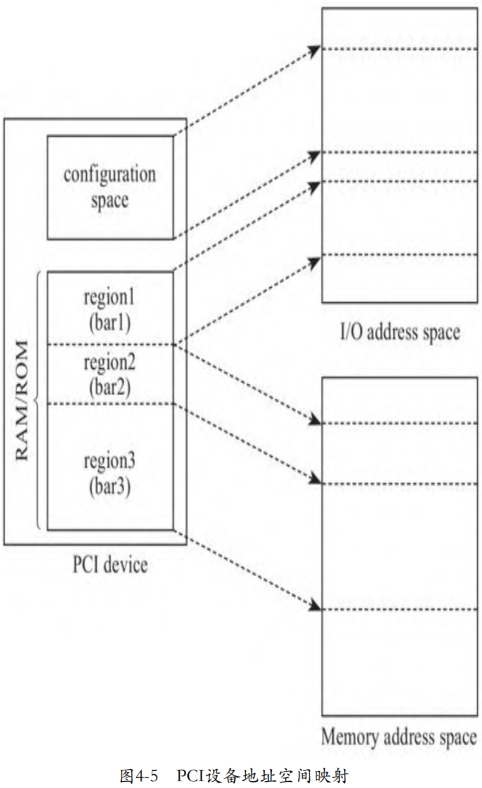
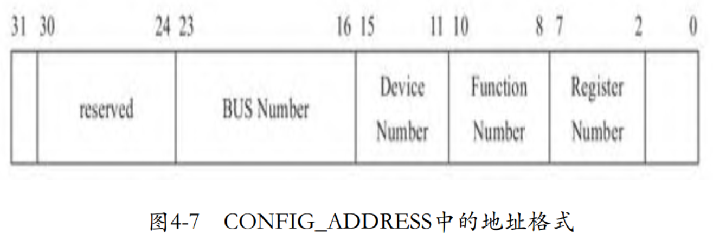

# PCI 结构

PCI 是用来连接外设的一种局部总线，其主要功能是连接外部设备。

每一个 PCI 设备在系统中的位置由总线号（Bus Number），设备号（Device Number）以及功能号（Function Number）唯一确定。

有的设备可能有多个功能，从逻辑上来说是**单独的设备**。可以在PCI总线上挂一个**桥设备**，之后在该桥上再挂一个 PCI 总线或者其他总线。

PCI 设备结构如下图所示。


**PCI 设备**有自己**独立的地址空间**，叫作 PCI 地址空间，也就是说从设备角度看到的地址跟 CPU 角度看到的地址本质上**不在一个地址空间**，这种隔离就是由图中的 `HOST-PCI` 主桥完成的。CPU 需要通过主桥才能访问 PCI 设备，而 PCI 设备也需要通过主桥才能访问主存储器。主桥的一个重要作用就是将处理器访问的**存储器地址**转换为 **PCI 总线地址**。x86架构对于存储器地址空间和PCI地址空间不是很清晰，因为**本质上**是**两个不同的地址空间**，但是**其地址是相同且一一对应**的.

# 配置空间的基本结构

PCI 标准约定, **每个 PCI 设备**都需要实现一个称为**配置空间**(`Configuration Space`)的结构, 该结构就是**若干寄存器的集合**, 其大小为 256 字节, 包括**预定义头部**(`predefined header region`)和**设备相关部分**(`device dependent region`), 预定义头部占据 64 字节, 其余 192 字节为设备相关部分. 预定义头部定义了 PCI 设备的基本信息以及通用控制相关部分, 包括 Vendor ID、Device ID 等, 其中 **Vendor ID** 是**唯一**的, 由 **PCI 特别兴趣小组**(`PCI SIG`)统一负责分配. 在 Linux 内核中, **PCI 设备驱动**就是通过 **Device ID** 和 **Vendor ID** 来**匹配设备**的. 所有 PCI 设备的预定义头部的前 16 字节完全相同, 16~63 字节的内容则依具体的PCI设备类型而定. 位于配置空间中的偏移 0x0E 处的寄存器 `Header Type` 定义了 PCI **设备的类型**, 00h 为普通 PCI 设备, 01h 为 PCI 桥, 02h 为 CardBus 桥. 图 4-4 为普通 PCI 设备的预定义头部.


除了预定义头部外, 从偏移 64 字节开始到 255 字节, 共 192 字节为**设备相关**部分, 比如存储设备的能力(`Capabilities`). 比如 PCI 设备支持的 `MSI(X)` 中断机制, 就是利用 PCI 设备配置空间中设备相关部分来**存储中断信息**的, 包括**中断目的地址**(即**目的 CPU**), 以及**中断向量**. **操作系统**初始化中断时将为 PCI 设备分配的**中断信息**写入 PCI **配置空间**中的设备相关部分. 系统初始化时, **BIOS**(或者 **UEFI**)将把 PCI 设备的**配置空间映射到处理器**的 **I/O 地址空间**, **操作系统**通过 I/O 端口访问配置空间中的寄存器. 后来的 PCI Exepress 标准约定配置空间从 256 字节扩展到了 4096 字节, 处理器需要通过 **MMIO** 方式访问配置空间, 当然**前 256 字节**仍然可以通过 **I/O 端口方式**访问. 篇幅所限, 我们不过多讨论 PCI Exepress 相关内容了.

除了配置空间中的这些寄存器外, PCI 设备还有**板上存储空间**. 比如 PCI 显卡中的 `frame buffer`, 用来存储显示的图像, 板上内存可以划分为多个区域, 这个 frame buffer 就属于其中一个区域; 再比如网卡可能使用板上内存作为发送和接收队列. **处理器**需要将这些**板上内存**区域**映射**到**地址空间**进行访问, 但是与同标准中**预先约定好的配置空间**相比, 不同设备的板上内存大小不同, 不同机器上的 PCI 设备也不同, 这些都是**变化的**, 处理器**不可能预先**为所有 PCI 设备制定一个地址空间映射方案. 因此, PCI 标准提出了一个聪明的办法, 即**各 PCI 设备**自己提出需要占据的地址空间的**大小**, 以及**板上内存**是映射到**内存地址空间**, 还是 **I/O 地址空间**, 然后将这些诉求**记录**在配置空间的寄存器 **BAR** 中, 每个 PCI 最多可以请求映射 **6** 个区域. 至于映射到**地址空间**的**什么位置**, 由 **BIOS**(或者 **UEFI**)在**系统初始化**时, 访问寄存器 BAR, 查询各 PCI 设备的诉求, **统一**为 PCI 设备**划分**地址空间.

**PCI** 设备**配置空间**和**板上存储空间**到**处理器地址空间**的映射关系如下图所示.



# CPU 访问 配置空间

了解了 PCI 设备的配置空间的基本结构后, 在探讨 VMM 如何虚拟 PCI 设备的配置空间前, 我们还需要知晓处理器是如何访问 PCI 设备的配置空间的.

**PCI 总线**通过 `PCI Host Bridge` 和 **CPU** 总线相连, PCI Host Bridge 和 PCI 设备之间通过 **PCI 总线**通信. **PCI Host Bridge** 内部有**两个寄存器**用于**系统软件**访问 **PCI 设备**的**配置空间**:

* 一个是位于 **CF8h** 的 `CONFIG_ADDRESS`;

* 另一个是位于 **CFCh** 的 `CONFIG_DATA`.

当**系统软件**访问 PCI 设备**配置空间**中的**寄存器**时:

* 首先将**目标地址**写入寄存器 `CONFIG_ADDRESS` 中;

* 然后向寄存器 `CONFIG_DATA` 发起访问操作, 比如向寄存器 `CONFIG_DATA` 写入一个**值**.

当 **PCI Host Bridge** 感知到 CPU 访问 `CONFIG_DATA` 时, 其**根据地址寄存器** `CONFIG_ADDRESS` 中的值, 片选**目标 PCI 设备**, 即有效连接目标 PCI 设备的管脚 **IDSEL**(`Initialization Device Select`), 然后将寄存器 `CONFIG_ADDRESS` 中的**功能号**和**寄存器号**发送到 **PCI 总线**上. 目标 PCI 设备在收到**地址信息**后, 在接下来的时钟周期内与 PCI Host Bridge 完成数据传输操作. 这个过程如图 4-6 所示. 对于 PCIe 总线, 图 4-6 中的 **PCI Host Bridge** 对应为 **Root Complex**.


图 4-6 中特别画出了**内存控制器**, 目的是协助读者理解**系统**是如何**区分**映射到内存地址空间的**设备内存**和**真实物理内存**, 对于**设备内存映射**的**内存地址**, **内存控制器**会将其**忽略**, 而 **PCI Host Bridge** 则会**认领**. 在 **BIOS**(或者 **UEFI**)为 **PCI 设备**分配**内存地址空间**后, 会将其告知 PCI Host Bridge, 所以 PCI Host Bridge 知晓哪些地址应该发往 PCI 设备.

根据 PCI 的体系结构可见, **寻址一个 PCI 配置空间**的**寄存器**, 显然需要**总线号**(`Bus Number`)、**设备号**(`Device Number`)、**功能号**(`Function Number`)以及**最后的寄存器地址**, 也就是我们通常简称的 **BDF** 加上**偏移地址**. 如果是 **PCIe 设备**, 还需要在**总线号前面**加上一个 **RC**(`Root Complex`)**号**. 因此, **PCI Host Bridge** 中的**寄存器** `CONFIG_ADDRESS` 的格式如图 4-7 所示.



访问具体的 PCI 设备时, 作为 **CPU** 与 **PCI 设备**之间的**中间人** `PCI Host Bridge`, 还需要将**系统软件**发送过来的**地址格式**转换为 **PCI 总线地址格式**, 转换方式如图 4-8 所示.


由于 `PCI Host Bridge` 使用**管脚** **IDSEL** 已经片选了**目标 PCI 设备**, 因此 PCI 总线地址**不**再需要**设备号**了, 只需要将**功能号**和**寄存器号**翻译到 **PCI 总线地址**即可.

下面以 kvmtool 为例讨论其是如何虚拟 PCI 设备配置空间的:

```cpp
commit 06f4810348a34acd550ebd39e80162397200fbd9
kvm tools: MSI-X fixes

kvmtool.git/include/kvm/pci.h

#define PCI_CONFIG_ADDRESS	0xcf8
struct pci_config_address {
    unsigned	zeros		: 2;		/* 1  .. 0  */
    unsigned	register_number	: 6;		/* 7  .. 2  */
    unsigned	function_number	: 3;		/* 10 .. 8  */
    unsigned	device_number	: 5;		/* 15 .. 11 */
    unsigned	bus_number	: 8;		/* 23 .. 16 */
    unsigned	reserved	: 7;		/* 30 .. 24 */
    unsigned	enable_bit	: 1;		/* 31       */
};

kvmtool.git/pci.c

// 所有设备的configure space header
static struct pci_device_header		*pci_devices[PCI_MAX_DEVICES];
// PCI Host Bridge中的寄存器CONFIG_ADDRESS
static struct pci_config_address	pci_config_address;

static void *pci_config_address_ptr(u16 port)
{
    unsigned long offset;
    void *base;

    offset		= port - PCI_CONFIG_ADDRESS;
    base		= &pci_config_address;

    return base + offset;
}

// Guest写CONFIG_ADDRESS, vm-exit后设备模拟
static bool pci_config_address_out(struct ioport *ioport, struct kvm *kvm, u16 port, void *data, int size)
{
    // 获取kvmtool记录的位置
    void *p = pci_config_address_ptr(port);
    // 复制data的size大小内容到p
    // 记录guest要访问的PCI设备地址
    memcpy(p, data, size);

    return true;
}

// Guest读CONFIG_ADDRESS, vm-exit后设备模拟
static bool pci_config_address_in(struct ioport *ioport, struct kvm *kvm, u16 port, void *data, int size)
{
    // 获取kvmtool记录的位置
    void *p = pci_config_address_ptr(port);
    // 复制p的size大小内容到data
    // 获取kvmtool记录的PCI设备地址信息
    memcpy(data, p, size);

    return true;
}

// port I/O
static struct ioport_operations pci_config_address_ops = {
    .io_in		= pci_config_address_in,
    .io_out		= pci_config_address_out,
};

// Guest写CONFIG_DATA, vm-exit后设备模拟
static bool pci_config_data_out(struct ioport *ioport, struct kvm *kvm, u16 port, void *data, int size)
{
    unsigned long start;
    u8 dev_num;

    /*
     * If someone accesses PCI configuration space offsets that are not
     * aligned to 4 bytes, it uses ioports to signify that.
     */
    start = port - PCI_CONFIG_DATA;

    dev_num		= pci_config_address.device_number;

    if (pci_device_exists(0, dev_num, 0)) {
        unsigned long offset;

        offset = start + (pci_config_address.register_number << 2);
        if (offset < sizeof(struct pci_device_header)) {
            void *p = pci_devices[dev_num];
            u8 bar = (offset - PCI_BAR_OFFSET(0)) / (sizeof(u32));
            u32 sz = PCI_IO_SIZE;

            if (bar < 6 && pci_devices[dev_num]->bar_size[bar])
                sz = pci_devices[dev_num]->bar_size[bar];

            /*
             * If the kernel masks the BAR it would expect to find the
             * size of the BAR there next time it reads from it.
             * When the kernel got the size it would write the address
             * back.
             */
            if (ioport__read32(p + offset)) {
                /* See if kernel tries to mask one of the BARs */
                if ((offset >= PCI_BAR_OFFSET(0)) &&
                    (offset <= PCI_BAR_OFFSET(6)) &&
                    (ioport__read32(data)  == 0xFFFFFFFF))
                    memcpy(p + offset, &sz, sizeof(sz));
                    else
                    memcpy(p + offset, data, size);
            }
        }
    }

    return true;
}
// Guest读CONFIG_DATA, vm-exit后设备模拟
static bool pci_config_data_in(struct ioport *ioport, struct kvm *kvm, u16 port, void *data, int size)
{
    unsigned long start;
    u8 dev_num;

    start = port - PCI_CONFIG_DATA;
    // 取出目标设备号
    dev_num		= pci_config_address.device_number;
    // 判断设备号是否在 pci_devices 数组中
    if (pci_device_exists(0, dev_num, 0)) {
        unsigned long offset;
        // 
        // 目标寄存器在配置空间的偏移
        offset = start + (pci_config_address.register_number << 2);
        if (offset < sizeof(struct pci_device_header)) {
            // 以设备号为索引
            // 取出设备的配置空间基址
            void *p = pci_devices[dev_num];
            // 复制到data
            memcpy(data, p + offset, size);
        } else
            memset(data, 0x00, size);
    } else
        // 设备不存在
        memset(data, 0xff, size);

    return true;
}

// port I/O
static struct ioport_operations pci_config_data_ops = {
    .io_in		= pci_config_data_in,
    .io_out		= pci_config_data_out,
};

void pci__init(void)
{
    ioport__register(PCI_CONFIG_DATA + 0, &pci_config_data_ops, 4, NULL);
    ioport__register(PCI_CONFIG_ADDRESS + 0, &pci_config_address_ops, 4, NULL);
}
```

kvmtool 定义了一个数组 `pci_devices`, **所有的 PCI 设备**都会在这个数组中注册, 这个数组的**每个元素**都是一个 PCI 设备**配置空间头**.

kvmtool 定义了变量 `pci_config_address`, 对应于 PCI 标准中约定的用于记录 PCI 设备**寻址的寄存器** `CONFIG_ADDRESS`.

当**系统软件**访问 **PCI 设备**的**配置空间头信息**时, 其**首先**将向 `CONFIG_ADDRESS` 写入**目标 PCI 设备**的地址信息, 包括目标 PCI 的**总线号**、**设备号**以及访问的是配置空间中的哪一个**寄存器**. 代码 `pci_config_address_in` 就是当 **Guest** 向寄存器 `CONFIG_ADDRESS` **读**将要访问的**目标 PCI 设备**的**地址**时, 触发 VM exit 陷入 VMM 后, VMM 进行模拟处理的过程. 结合函数 `pci_config_address_ptr` 的实现可见, kvmtool 将 Guest 准备访问的**目标 PCI 设备地址**记录在变量 `pci_config_address` 中.

待 **Guest** 设置完将要访问的**目标地址**后, 接下来将开启读写 PCI 配置空间数据的过程. **Guest** 将通过访问寄存器 `CONFIG_DATA` 读写 PCI 配置空间头的信息, Guest 访问寄存器 `CONFIG_DATA` 的这个 I/O 操作将触发 VM exit, 处理过程进入 KVM, 代码 `pci_config_data_in` 是 KVM 中对这个**读寄存器** `CONFIG_DATA` 过程的模拟.

kvmtool 首先从寄存器 `CONFIG_ADDRESS` 中**取出**目标 PCI 设备的**设备号**, 然后以设备号为索引, 在**数组** `pci_devices` 中确认是否存在这个 PCI 设备. PCI 标准规定, 对于**不存在**的设备, 寄存器 `CONFIG_DATA` 的**所有位**都置为 "1", 表示**无效设备**.

代码 `start + (pci_config_address.register_number << 2)`, 从寄存器 `CONFIG_ADDRESS` 取出**寄存器号**, 寄存器号**这个字段**的单位是**双字**(DWORD), 即 4 字节, 所以代码中将 `register_number` 左移 2 位, 将双字转换为字节, 即计算出**目标寄存器**在**配置空间**中的**偏移**. 然后以设备号为索引, 从数组 `pci_devices` 中取出目标 PCI 设备的**配置空间**的**基址**, 然后加上寄存器的偏移, 就计算出了最终的目标地址. 最后调用 memcpy 将 Guest 写到配置空间的值存储到设备的配置空间中.

代码 `start + (pci_config_address.register_number << 2)`, 中有个变量 start, 用来处理 Guest 以非 4 字节对齐的方式访问 PCI 设备配置空间, 类似的, 函数 `pci_config_address_ptr` 也考虑了这种情况. 我们来看一下 kvmtool **早期**只处理了 4 字节对齐的情况, 可以看到寄存器的偏移仅仅是寄存器号乘以 4 字节:

```cpp
commit 18ae021a549062a3a8bdac89a2040af26ac5ad2c
kvm, pci: Don't calculate offset twice

kvmtool.git/pci.c

static bool pci_config_data_in(struct kvm *self, uint16_t port, void *data, int size, uint32_t count)
{
    if (pci_device_matches(0, 1, 0)) {
        unsigned long offset;

        offset		= pci_config_address.register_number << 2;
        if (offset < sizeof(struct pci_device_header)) {
            void *p = &virtio_device;

            memcpy(data, p + offset, size);
        } else
            memset(data, 0x00, size);
    } else
        memset(data, 0xff, size);

    return true;
}
```

探讨了通用的 PCI 设备配置空间的虚拟后, 我们再通过一个具体的例子体会一下 **VMM** 是如何**虚拟**配置空间中的寄存器 **BAR** 的. 下面是 kvmtool 中 Virtio 设备初始化相关的代码:

```cpp
commit 06f4810348a34acd550ebd39e80162397200fbd9
kvm tools: MSI-X fixes
kvmtool.git/virtio/pci.c
int virtio_pci__init(struct kvm *kvm, struct virtio_pci *vpci, void *dev,
            int device_id, int subsys_id)
{
    u8 pin, line, ndev;

    vpci->dev = dev;
    vpci->msix_io_block = pci_get_io_space_block();
    vpci->msix_pba_block = pci_get_io_space_block();

    vpci->base_addr = ioport__register(IOPORT_EMPTY, &virtio_pci__io_ops, IOPORT_SIZE, vpci);
    kvm__register_mmio(kvm, vpci->msix_io_block, 0x100, callback_mmio_table, vpci);
    kvm__register_mmio(kvm, vpci->msix_pba_block, 0x100, callback_mmio_pba, vpci);

    vpci->pci_hdr = (struct pci_device_header) {
        .vendor_id		= PCI_VENDOR_ID_REDHAT_QUMRANET,
        ...
        // I/O地址空间
        .bar[0]			= vpci->base_addr | PCI_BASE_ADDRESS_SPACE_IO,
        // Memory地址空间
        .bar[1]			= vpci->msix_io_block | PCI_BASE_ADDRESS_SPACE_MEMORY
                    | PCI_BASE_ADDRESS_MEM_TYPE_64,
        // Memory地址空间
        .bar[3]			= vpci->msix_pba_block | PCI_BASE_ADDRESS_SPACE_MEMORY
                    | PCI_BASE_ADDRESS_MEM_TYPE_64,
        ...
    };

    vpci->pci_hdr.msix.cap = PCI_CAP_ID_MSIX;
    vpci->pci_hdr.msix.next = 0;
    vpci->pci_hdr.msix.ctrl = (VIRTIO_PCI_MAX_VQ + 1);

    /*
     * Both table and PBA could be mapped on the same BAR, but for now
     * we're not in short of BARs
     */
    vpci->pci_hdr.msix.table_offset = 1; /* Use BAR 1 */
    vpci->pci_hdr.msix.pba_offset = 3; /* Use BAR 3 */
    vpci->config_vector = 0;

    if (irq__register_device(VIRTIO_ID_RNG, &ndev, &pin, &line) < 0)
        return -1;

    vpci->pci_hdr.irq_pin	= pin;
    vpci->pci_hdr.irq_line	= line;
    // 
    pci__register(&vpci->pci_hdr, ndev);

    return 0;
}
```

函数 `virtio_pci__init` 为 virtio PCI 设备准备了 **3** 块**板上内存区间**.

* 寄存器 `bar[0]` 中的板上存储区间需要映射到 Guest 的 **I/O 地址空间**, 起始地址为 `vpci-＞base_addr`;

* 寄存器 `bar[1]` 中的板上存储空间需要映射到 Guest 的**内存地址空间**, 起始地址为`vpci-＞msix_io_block`;

* 寄存器 `bar[3]` 中的板上存储空间页需要映射到 Guest 的**内存地址空间**, 起始地址为 `vpci-＞msix_pba_block`.

kvmtool 中为 PCI 设备**分配内存地址空间**的函数为 `pci_get_io_space_block`. kvmtool 从地址 `KVM_32BIT_GAP_START+0x1000000` 开始为 PCI 设备分配地址空间. 每当 PCI 设备申请地址空间时, 函数 `pci_get_io_space_block` 从这个地址处依次叠加:

```cpp
commit 06f4810348a34acd550ebd39e80162397200fbd9
kvm tools: MSI-X fixes

kvmtool.git/pci.c

static u32 io_space_blocks		= KVM_32BIT_GAP_START + 0x1000000;

u32 pci_get_io_space_block(void)
{
    u32 block = io_space_blocks;
    io_space_blocks += PCI_IO_SIZE;

    return block;
}
```

类似的, kvmtool 为 PCI 设备**分配 I/O 地址空间**的函数为 `ioport__register`, 我们不再赘述.

在函数 `virtio_pci__init` 的最后, 我们看到其调用 `pci__register` 在**记录 PCI 设备的数组** `pci_devices` 中注册了设备, 这样 Guest 就可以枚举这些设备了:

```cpp
commit 06f4810348a34acd550ebd39e80162397200fbd9
kvm tools: MSI-X fixes

kvmtool.git/pci.c

void pci__register(struct pci_device_header *dev, u8 dev_num)
{
    ...

    pci_devices[dev_num]	= dev;
}
```