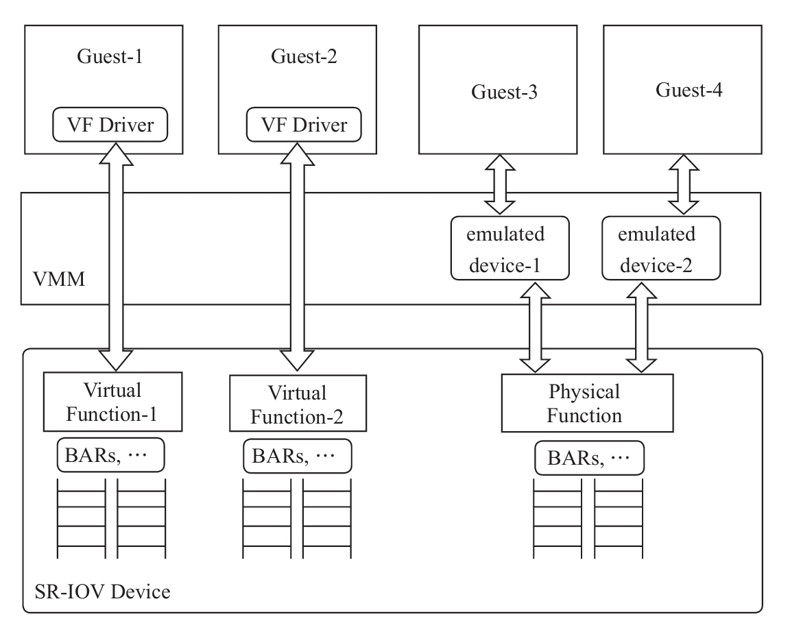
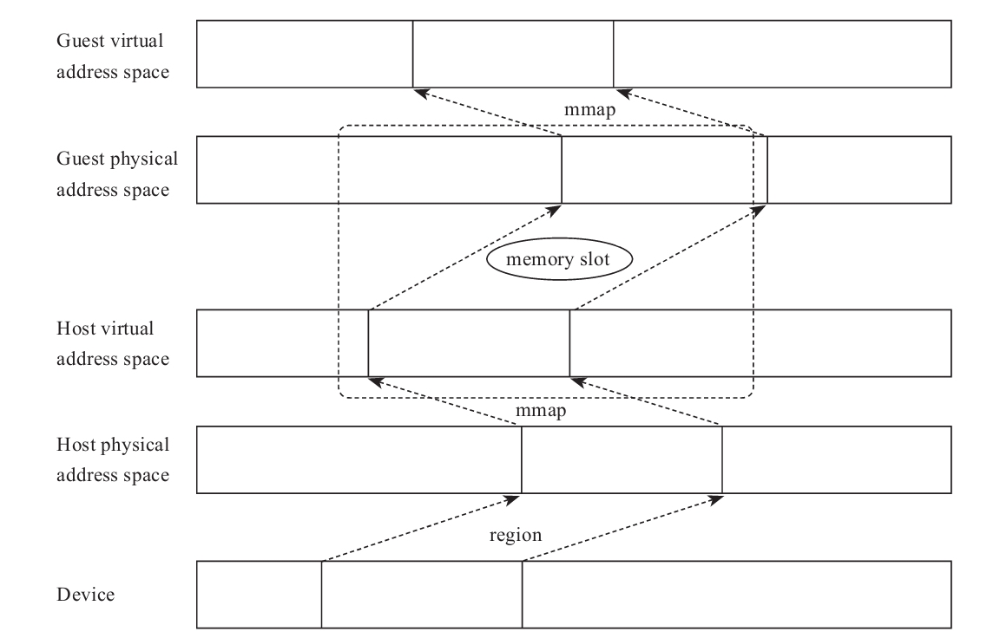
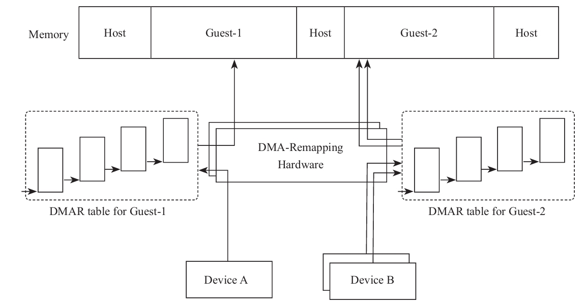
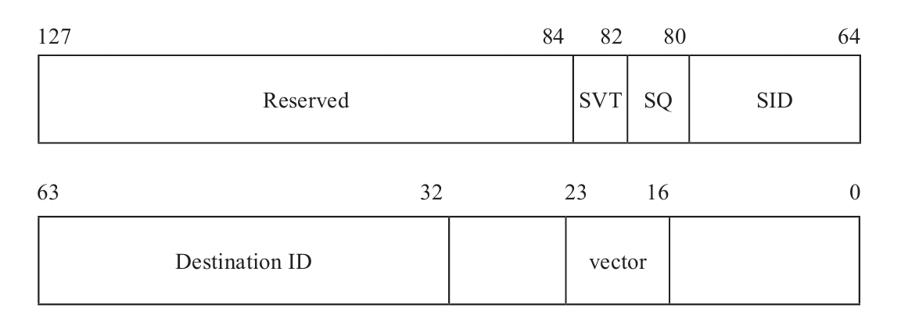
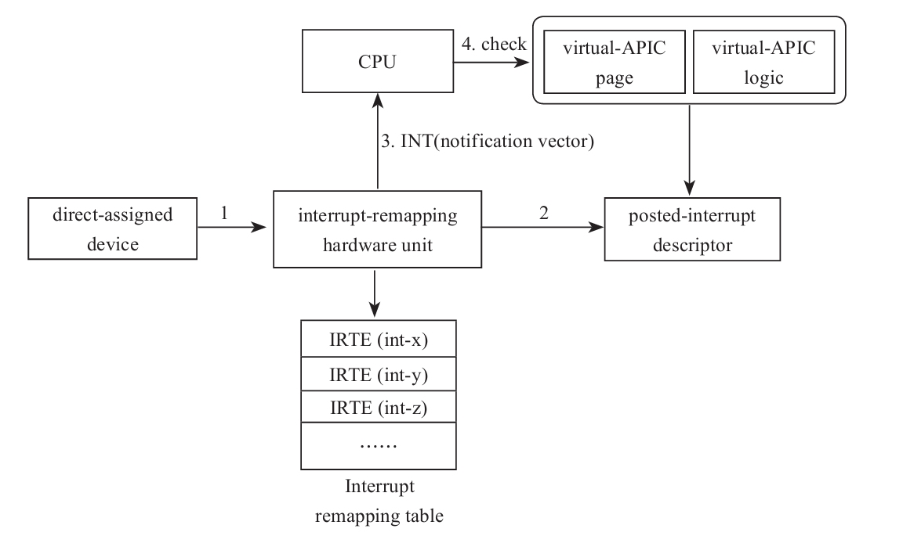
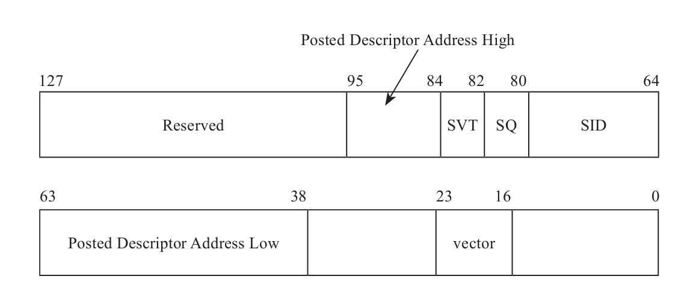

# 1. 两种模式

## 1.1. 直接分配

> Direct Assignment

设备虚拟化如果采用软件模拟的方式, 则需要 VMM 参与进来. 为了避免这个开销, Intel 尝试从 **硬件层面** 对 I/O 虚拟化进行支持, 即将 **设备直接透传** 给 **Guest**, Guest **绕过 VMM 直接访问物理设备**, 无须 VMM 参与 I/O 过程, 这种方式提供了最佳的 I/O 虚拟化性能. Intel 最初采用的方式是 Direct Assignment, 即将整个设备透传给某一台虚拟机, 不支持多台 VM 共享同一设备.

## 1.2. SR-IOV

对于一台多核的物理机, 其上可以运行若干台虚拟机, 如果外设只能分配给一台虚拟机使用, 那么这种方案显然**不具备扩展性**.

于是**设备制造商**们试图在**硬件层面**将**一个物理设备**虚拟出**多个设备**, 每个设备可以透传给一台虚拟机, 这样从硬件设备层面实现共享, 而无须由 VMM 通过软件的方式支持多台虚拟机共享同一物理外设.

为了使不同设备制造商的设备可以互相兼容, `PCI-SIG` 制定了一个标准: `Single Root I/O Virtualization and Sharing`, 简称 SR-IOV.

SR-IOV 引入了两个新的 Function 类型:

* 一个是 Physical Function, 简称 PF;

* 另一个是 Virtual Function, 简称 VF.

一个 SR-IOV 可以支持多个 VF, 每一个 VF 可以分别透传给 Guest, 如此, 就从硬件角度实现了多个 Guest 分享同一物理设备, 如图 4-9 所示.



每个 **VF** 都有自己**独立**的用于数据传输的**存储空间**, **队列**, **中断**及**命令处理单元**等, 但是这些 VF 的管理仍然在 VMM 的控制下, VMM 通过 PF 管理这些 VF. 虚拟机可以直接访问这些 VF, 而无须再通过 VMM 中的模拟设备访问物理设备. PF 除了提供管理 VF 的途径外, Host 以及其上的应用仍然可以通过 PF 无差别地访问物理设备. 对于那些没有 VF 驱动的 Guest, 虚拟机依然可以通过 SR-IOV 设备的 PF 接口共享物理设备.

# 2. 虚拟配置空间

通过将 VF 透传给 Guest 的方式, **VF 的数据访问**不再需要通过 VMM, 大大提高了 Guest 的 I/O 性能.

但是, 如果 **Guest** 恶意**修改配置空间**中的信息, 比如**中断信息**(**MSI**), 则可能导致 VF 发出中断攻击. 因此, 出于安全方面的考虑, **VF 配置空间**仍然需要 VMM 介入, 而且后面我们会看到, 有些信息, 比如寄存器 **BAR** 中的地址, 必须依照虚拟化场景进行虚拟.

Guest 不能直接修改设备的配置, 当 Guest 访问 VF 的配置空间时, 将会触发 **VM exit** 陷入 VMM, VMM 将过滤 Guest 对 VF 配置空间的访问并作为 Guest 的代理完成对 VF 设备的配置空间的操作. 这个过程**不会卷入数据传输**中, 因此**不影响数据传输的效率**.

## 2.1. kvmtool 实现

前面在讨论 PCI 配置空间及其模拟时, 我们看到 kvmtool 定义了一个数组 `pci_devices`, 用来**记录虚拟机所有的 PCI 设备**, 后来 kvmtool 将这个数组优化为**一棵红黑树**.

当 Guest 枚举 PCI 设备时, kvmtool 将以**设备号**为**索引**在这个数据结构中查找设备.

因此, 为了能够让 Guest 枚举到 VF, kvmtool 需要将 VF 注册到这个数据结构中, 用户可以通过 kvmtool 的命令行参数 "`vfio-pci`" 指定将哪些 VF 透传给虚拟机:

```
# ./lkvm run -h
VFIO options:
        --vfio-pci <[domain:]bus:dev.fn>
                          Assign a PCI device to the virtual machine
```

```cpp
commit 6078a4548cfdca42c766c67947986c90310a8546
Add PCI device passthrough using VFIO
kvmtool.git/vfio/pci.c
int vfio_pci_setup_device(…)
{
    …
    ret = device__register(&vdev->dev_hdr);
    …
}
```

对于 VF 来说, 在系统启动时, 虽然 **Host** 的 **BIOS**(或者 UEFI)已经为 **VF** 划分好了**内存地址空间**并存储在了寄存器 **BAR** 中, 而且 Guest 也可以直接读取这个信息. 但是, 因为 Guest 不能直接访问 Host 的物理地址, 所以 **Guest** 并**不能直接使用**寄存器 BAR 中记录的 **HPA**.

所以, kvmtool 需要对 VF 配置空间中寄存器 BAR 的内容进行虚拟, 结合内存虚拟化原理, 设备板上内存到 Guest 空间的映射关系如图 4-10 所示.



结合图 4-10, kvmtool 需要完成两件事:

* 一是将 VF 配置空间的 **BAR** 寄存器中的地址信息修改为 **GPA**, 而**不是 HPA**;

* 二是保护模式下的 CPU 是采用虚拟地址寻址的, 所以 PA 还需要映射为 VA, 操作系统自身提供了 mmap 功能完成 PA 到 VA 的映射, 因此, kvmtool 只需要**建立 GPA 到 HVA 的映射关系**.

相关代码如下:

```cpp
commit 6078a4548cfdca42c766c67947986c90310a8546
Add PCI device passthrough using VFIO
kvmtool.git/vfio/pci.c
01 int vfio_pci_setup_device(struct kvm *kvm, …)
02 {
03   …
04   ret = vfio_pci_configure_dev_regions(kvm, vdev);
05   …
06 }
07 static int vfio_pci_configure_dev_regions(struct kvm *kvm,
08             struct vfio_device *vdev)
09 {
10   …
11   ret = vfio_pci_parse_cfg_space(vdev);
12   …
13   for (i = VFIO_PCI_BAR0_REGION_INDEX; 
14         i <= VFIO_PCI_BAR5_REGION_INDEX; ++i) {
15     …
16     ret = vfio_pci_configure_bar(kvm, vdev, i);
17     …
18   }
19   …
20   return vfio_pci_fixup_cfg_space(vdev);
21 }
```

普通的虚拟设备没有真实的配置空间, 所以 kvmtool 需要从 0 开始组织虚拟设备的配置空间. 而 VF 是有真实的配置空间的, kvmtool 需要做的是加工, 所以 kvmtool 首先需要读取 VF 的配置空间, 然后在这个原始数据的基础上进行加工, 第 11 行代码就是读取 VF 的配置空间并进行解析. 然后, **kvmtool** 从 **Guest 地址空间**中为 VF 板上内存**分配地址空间**, 并使用 **GPA** 更新寄存器 BAR, 第 13~18 行代码就是循环处理所有的寄存器 BAR. 最后, kvmtool 将加工好的配置空间更新回 VF 真实的配置空间, 见第 20 行代码.

函数 `vfio_pci_parse_cfg_space` **读取 VF 配置空间**, 具体代码如下.

VF 中将配置空间分成很多区域, 比如每 256 字节的配置空间是一个区域, 每个 BAR 定义对应一个区域. 代码中 `VFIO_PCI_CONFIG_REGION_INDEX` 对应的就是 256 字节的配置空间, 对于 PCIe 设备, 配置空间大小是 4096 字节.

函数 `vfio_pci_parse_cfg_space` 首先通过 ioctl 获取**配置空间**在 VF 中的**偏移**, 然后调用函数 pread 从这个偏移处读取配置空间:

```cpp
commit 6078a4548cfdca42c766c67947986c90310a8546
Add PCI device passthrough using VFIO
kvmtool.git/vfio/pci.c
static int vfio_pci_parse_cfg_space(struct vfio_device *vdev)
{
  …
  info = &vdev->regions[VFIO_PCI_CONFIG_REGION_INDEX].info;
  *info = (struct vfio_region_info) {
      .argsz = sizeof(*info),
      .index = VFIO_PCI_CONFIG_REGION_INDEX,
  };

  ioctl(vdev->fd, VFIO_DEVICE_GET_REGION_INFO, info);
  …
  if (pread(vdev->fd, &pdev->hdr, sz, info->offset) != sz) {
  …
}
```

接下来, kvmtool 需要从 Guest 地址空间中为 VF 板上内存**分配地址空间**, 并使用 GPA **更新**配置空间中的寄存器 **BAR**, 这个逻辑在函数 `vfio_pci_configure_bar` 中.

函数 `vfio_pci_configure_bar` 首先通过 ioctl 从 VF 中读取 BAR 对应的区域的信息, 然后根据获取的区域的大小 (代码中的 `map_size`) 调用函数 `pci_get_io_space_block` 从 Guest 的地址空间中分配地址区间. 函数 `pci_get_io_space_block` 从变量 `io_space_blocks` 指定的地址空间处, 依次为 PCI 设备在 Guest 的地址空间中分配地址. 分配好了 Guest 的地址区间后, 还需要将这个地址区间和 Host 的 BIOS(或者 UEFI)为 VF 分配的真实的物理地址区间一一映射起来, 这就是 `vfio_pci_configure_bar` 调用 `vfio_map_region` 的目的:

```cpp
commit 6078a4548cfdca42c766c67947986c90310a8546
Add PCI device passthrough using VFIO
kvmtool.git/vfio/pci.c
static int vfio_pci_configure_bar(struct kvm *kvm, 
struct vfio_device *vdev, size_t nr)
{
  …
  region->info = (struct vfio_region_info) {
    .argsz = sizeof(region->info),
    .index = nr,
  };

  ret = ioctl(vdev->fd, VFIO_DEVICE_GET_REGION_INFO, 
&region->info);
  …
  region->guest_phys_addr = pci_get_io_space_block(map_size);
…
  ret = vfio_map_region(kvm, vdev, region);
  …
}
```

函数 `vfio_map_region` 为 **GPA 和 HVA 建立起映射关系**. 从内存虚拟化角度, 其实就是 Host 为 Guest 准备一个内存条:

```cpp
commit 8a7ae055f3533b520401c170ac55e30628b34df5
KVM: MMU: Partial swapping of guest memory
linux.git/include/linux/kvm.h
struct kvm_userspace_memory_region {
    …
    __u64 guest_phys_addr;
    …
    __u64 userspace_addr; /* start of the userspace …*/
};
```

显然, 对应我们现在的情况, 变量 guest_phys_addr 就是 kvmtool 为 BAR 对应的区间在 Guest 地址空间中分配的地址. 变量 userspace_addr 就是 Host 的 BIOS(或者 UEFI)为 VF 在 Host 的地址空间分配的地址 PA 对应的 VA, 函数 vfio_map_region 中调用 mmap 函数就是为了得出 VA. 确定了变量 guest_phys_addr 和 userspace_addr 后, vfio_map_region 调用 kvm__register_dev_mem 请求 KVM 模块为 Guest 注册虚拟内存条. 当 CPU 发出对 BAR 对应的内存地址空间的访问时, EPT 或者影子页表会将 GPA 翻译为 VF 在 Host 地址空间中的相应 HPA, 当这个 HPA 到达 Host bridge 时, 内存控制器将忽略这个地址, PCI bost bridge 或者 Root Complex 将认领这个地址. 函数 vfio_map_region 的代码如下:

```cpp
commit 6078a4548cfdca42c766c67947986c90310a8546
Add PCI device passthrough using VFIO
kvmtool.git/vfio/pci.c
int vfio_map_region(struct kvm *kvm, struct vfio_device *vdev,
        struct vfio_region *region)
{
  …
  base = mmap(NULL, region->info.size, prot, MAP_SHARED, vdev->fd,
        region->info.offset);
  …
  region->host_addr = base;

  ret = kvm__register_dev_mem(kvm, region->guest_phys_addr,
           map_size, region->host_addr);
  …
}
```

完成了 BAR 等寄存器的加工后, kvmtool 将调用 vfio_pci_fixup_cfg_space 将加工好的配置空间更新到 VF 的配置空间中. 比如下面的代码中, 我们可以看到, 寄存器 BAR 的信息是 kvmtool 加工后的信息:

```cpp
commit 6078a4548cfdca42c766c67947986c90310a8546
Add PCI device passthrough using VFIO
kvmtool.git/vfio/pci.c
static int vfio_pci_fixup_cfg_space(struct vfio_device *vdev)
{
  …
  for (i = VFIO_PCI_BAR0_REGION_INDEX; 
i <= VFIO_PCI_BAR5_REGION_INDEX; ++i) {
    struct vfio_region *region = &vdev->regions[i];
    u64 base = region->guest_phys_addr;
    …
    pdev->hdr.bar[i] = (base & PCI_BASE_ADDRESS_MEM_MASK) |
          PCI_BASE_ADDRESS_SPACE_MEMORY |
          PCI_BASE_ADDRESS_MEM_TYPE_32;
  }
  …
  info = &vdev->regions[VFIO_PCI_CONFIG_REGION_INDEX].info;
  hdr_sz = PCI_DEV_CFG_SIZE;
  if (pwrite(vdev->fd, &pdev->hdr, hdr_sz, info->offset) != hdr_sz)
…
}
```

除了寄存器 BAR 的虚拟外, 还有其他的一些虚拟, 比如为了支持 MSI-X, 需要虚拟配置空间中设备相关的 Capability 部分. 这些逻辑都比较直接, 我们不再一一讨论了.

# 3. DMA 重映射

将设备直接透传给 Guest 后, 为了提高数据传输效率, 透传设备可以直接访问内存, 但是如果 Guest 可以直接控制设备, 那就需要防范恶意的 Guest 借助透传的设备访问其他 Guest 或者 Host 的内存. 比如, Device A 透传给了 Guest-1, 但是其有可能访问 Guest-2 和 Host 的内存; Device B 透传给了 Guest-2, 但是其也有可能访问 Guest-1 和 Host 的内存, 如图 4-11 所示.


为此, 芯片厂商设计了 DMA 重映射 (DMA Remmaping) 机制, 在**外设**和**内存**之间增加了 **DMA 硬件重映射单元**, 一个 DMA 重映射硬件可以为所有设备提供地址重映射服务, 也可以有多个 DMA 重映射硬件, 分别为一些外设提供服务.

当 VMM 处理透传给 Guest 的外设时, VMM 将请求内核为 **Guest** 建立一个**页表**, 并将这个页表告知负责这个外设地址翻译的 **DMA 重映射硬件单元**, 这个页表限制了外设只能访问这个页面覆盖的内存, 从而限制外设只能访问其属于的虚拟机的内存.

当**外设访问内存**时, **内存地址**首先到达 **DMA 重映射硬件**, DMA 重映射硬件根据这个外设的**总线号, 设备号以及功能号**, 确定其对应的**页表**, 查表得出物理内存地址, 然后将地址送上总线. 在虚拟化场景下, 如果**多个设备**可以透传给**同一个虚拟机**, 那么它们共享一个页表, 如图 4-12 所示.



## 3.1. kvmtool 实现

如同一台真实的物理计算机有多段用于不同用途的内存段一样, **kvmtool** 将为 **Guest** 准备**多段内存段**, kvmtool 将内存段称为 **memory bank**.

在为 Guest 准备好内存段之后, **kvmtool** 将为**每个内存段**通过 ioctl 向内核发送 `VFIO_IOMMU_MAP_DMA` 命令, **请求内核**在 **DMA 重映射单元页表**中为其建立好映射关系. 相对于为 CPU 进行地址翻译的 MMU, DMA 重映射硬件是为外设进行 **I/O 地址翻译**的, 所以也称为 IOMMU.

kvmtool 中代码如下:

```cpp
commit c9888d9571ca6fa0093318c06e71220df5c3d8ec
vfio-pci: add MSI-X support
kvmtool.git/vfio/core.c
static int vfio_map_mem_bank(…, struct kvm_mem_bank *bank, …)
{
  int ret = 0;
  struct vfio_iommu_type1_dma_map dma_map = {
    …
    .vaddr  = (unsigned long)bank->host_addr,
    .iova = (u64)bank->guest_phys_addr,
    .size = bank->size,
  };
  …
  if (ioctl(vfio_container, VFIO_IOMMU_MAP_DMA, &dma_map)) {
  …
}
```

当为外设建立页表时, 如果外设透传给的**虚拟机尚未建立页表**, 则内核将创建根页表. 在虚拟化的场景下, 代码中的 domain 指代的就是**一个虚拟机**:

```cpp
commit ba39592764ed20cee09aae5352e603a27bf56b0d
Intel IOMMU: Intel IOMMU driver
linux.git/drivers/pci/intel-iommu.c
static int domain_init(struct dmar_domain *domain, …)
{
  …
  domain->pgd = (struct dma_pte *)alloc_pgtable_page();
  …
}
```

内核在通知外设进行 DMA 前, 需要将 DMA 地址告知外设. 虚拟地址是 CPU 使用的, 设备并不知道这个概念, 所以, 内核的设备驱动需要将虚拟地址转换为物理地址. 在设备透传场景下, 设备和 Guest 之间不再有 VMM 的干预, 外设接收的是 GPA. 留意上面代码中函数 `vfio_map_mem_bank` 请求内核建立映射关系的参数 `dma_map`, 其中这句代码是设置 IOMMU 的输入地址:

```cpp
.iova = (u64)bank->guest_phys_addr,
```

我们看到, 代码中将 IOMMU 的输入地址命名为 iova, 其他多处也使用了这个名字, 那么为什么称其为 iova 呢? 我们比照 CPU 的虚拟内存就很容易理解了, 外设用这个地址发起 DMA, 就类似于 CPU 使用虚拟地址 (VA) 访存, 然后给到 MMU, 所以, 这里从设备发出的给到 IOMMU 的, 也被称为 VA, 因为是用于 I/O 的, 所以命名为 iova.

函数 `vfio_map_mem_bank` 中设置 IOMMU 翻译的目的地址的代码如下:

```cpp
.vaddr  = (unsigned long)bank->host_addr,
```

显然, 这里的 vaddr 是 virtual address 的缩写. 但是事实上, 需要 IOMMU 将 GPA 翻译为 HPA, 所以理论上 dma_map 中应该使用物理地址 paddr, 而不是 vaddr, 那么, 为什么使用虚拟地址呢? 我们知道, kvmtool 在用户空间中申请区间作为 Guest 的物理内存段, 自然使用的是虚拟地址记录区间. 但这不是问题, 因为内核会在建立 IOMMU 的页表前, 将虚拟地址转换为物理地址, 最后 IOMMU 页表中记录的是 GPA 到 HPA 的映射.

内核中处理 kvmtool 发来的命令 `VFIO_IOMMU_MAP_DMA` 的核心函数是 `domain_page_mapping`, 该函数完成 IOMMU 页表的建立. 注意该函数的第 3 个参数, 可见内核已经将 kvmtool 传入的 HVA 转换为 HPA 了. `domain_page_mapping` 通过一个循环完成了一个内存段的地址映射, 其根据 GPA, 即 iova, 从页表中找到具体的表项, 然后将 HPA 写入表项中. 具体代码如下:

```cpp
commit ba39592764ed20cee09aae5352e603a27bf56b0d
Intel IOMMU: Intel IOMMU driver
linux.git/drivers/pci/intel-iommu.c
static int domain_page_mapping(struct dmar_domain *domain,
dma_addr_t iova, u64 hpa, size_t size, int prot)
{
  u64 start_pfn, end_pfn;
  struct dma_pte *pte;
  …
  start_pfn = ((u64)hpa) >> PAGE_SHIFT_4K;
  end_pfn = (PAGE_ALIGN_4K(((u64)hpa) + size)) >> PAGE_SHIFT_4K;
  index = 0;
  while (start_pfn < end_pfn) {
    pte = addr_to_dma_pte(domain, iova + PAGE_SIZE_4K * index);
    …
    dma_set_pte_addr(*pte, start_pfn << PAGE_SHIFT_4K);
    dma_set_pte_prot(*pte, prot);
    __iommu_flush_cache(domain->iommu, pte, sizeof(*pte));
    start_pfn++;
    index++;
  }
  return 0;
}
```

# 4. 中断重映射

当将 **设备直接透传** 给虚拟机时, 有一个问题就不得不面对, 那就是如何避免 **虚拟机** 对 **外设编程** 发送一些 **恶意的中断**, 对 **主机** 或 **其他虚拟机** 进行 **攻击**. 因此, 硬件厂商引入了 **中断重映射**(`interrupt remapping`)机制, 在 **外设** 和 **CPU** 之间加了一个 **硬件中断重映射单元**. 当接收到 **来自外设的中断** 时, **硬件中断重映射单元** 会对中断请求的来源进行 **有效性验证**, 然后以 **中断号** 为索引查询 **中断重映射表**, **代替外设** 向目标 CPU **发送中断**. 中断重映射表由 VMM 而不是虚拟机进行设置, 因此从这个层面确保了透传设备不会因虚拟机恶意篡改而向 Host 或者其他 Guest 发送具有攻击性目的的中断. **中断重映射硬件** 提取接收到的中断请求的来源(PCI 设备的 Bus,Device 和 Function 号等信息), 然后根据不同设备所属的 domain, 将该中断请求转发到相应的虚拟机.

为了使 VMM 能够控制系统重要的资源, 当 CPU 处于 Guest 模式, 并探测到有外部设备中断到达时, 将首先从 Guest 模式退出到 Host 模式, 由 VMM 处理中断, 然后注入中断给目标 Guest. 另外, 在 "中断虚拟化" 一章中, 我们看到, 为了去掉中断注入时需要的 VM exit, Intel 设计了 `posted-interrupt` 机制, CPU 可以在 Guest 模式直接处理中断. 因此, 当设备透传给 Guest 时, 在有中断重映射提供安全保护作用的情况下, Intel 将中断重映射和 `posted-interrupt` 结合起来实现了 `VT-d posted-interrupt`, 使外设中断直达虚拟机, 避免了 VM exit, 不再需要 VMM 的介入.

为了支持中断重映射, 还需要对 **中断源** 进行 **升级**, 包括 **I/O APIC** 以及支持 MSI, MSI-X 的 **外设**, 使 **中断重映射硬件** 能从 **中断消息** 中提出中断重映射表的 **索引**. 为了向后兼容, 对于那些只能发送经典的中断消息格式的外设, 中断重映射单元就像不存在一样, 不做任何干预, 原封不动地将中断消息送上总线. **可重映射** 的 **中断消息格式** 如图所示.


在 Address 消息中, 第 5~19 位和第 2 位共同组成了 16 位的 handle, 并且在第 3 位 SHV 为 1 的情况下, Data 消息的第 0~15 位包含了 subhandle. **中断重映射硬件** 将根据 **handle** 和 **subandle** 计算该 **中断** 在 **中断重映射表** 中的 **索引值**, 计算方法如下:

```cpp
if (address.SHV == 0) {
    interrupt_index = address.handle;
} else {
    interrupt_index = (address.handle + data.subhandle);
}
```

**VMM** 需要在 **初始化** 时在内存中为中断重映射表分配 **一块区域**, 并将该区域告知 **中断重映射硬件单元**, 即将 **该表的地址** 写到 **中断重映射表地址寄存器**(`Interrupt Remap Table Address Register`, `IRTA_REG`):

```cpp
commit 2ae21010694e56461a63bfc80e960090ce0a5ed9
x64, x2apic/intr-remap: Interrupt remapping infrastructure
linux.git/drivers/pci/intr_remapping.c

static int setup_intr_remapping(struct intel_iommu *iommu, int mode)
{
    struct ir_table *ir_table;
    struct page *pages;

    ir_table = iommu->ir_table = kzalloc(sizeof(struct ir_table),
                         GFP_KERNEL);
    ...
    pages = alloc_pages(GFP_KERNEL | __GFP_ZERO, INTR_REMAP_PAGE_ORDER);
    ...
    ir_table->base = page_address(pages);

    iommu_set_intr_remapping(iommu, mode);
    return 0;
}

static void iommu_set_intr_remapping(struct intel_iommu *iommu, int mode)
{
    u64 addr;
    u32 cmd, sts;
    unsigned long flags;
    // 物理地址
    addr = virt_to_phys((void *)iommu->ir_table->base);
    ...
    // 将重映射表的地址告知硬件
    dmar_writeq(iommu->reg + DMAR_IRTA_REG,
            (addr) | IR_X2APIC_MODE(mode) | INTR_REMAP_TABLE_REG_SIZE);

    /* Set interrupt-remapping table pointer */
    cmd = iommu->gcmd | DMA_GCMD_SIRTP;
    writel(cmd, iommu->reg + DMAR_GCMD_REG);

    IOMMU_WAIT_OP(iommu, DMAR_GSTS_REG,
              readl, (sts & DMA_GSTS_IRTPS), sts);

    ...

    /* Enable interrupt-remapping */
    cmd = iommu->gcmd | DMA_GCMD_IRE;
    iommu->gcmd |= DMA_GCMD_IRE;
    writel(cmd, iommu->reg + DMAR_GCMD_REG);

    IOMMU_WAIT_OP(iommu, DMAR_GSTS_REG,
              readl, (sts & DMA_GSTS_IRES), sts);

    ...
}
```

当中断重映射硬件单元工作在重映射中断 (`Remapped Interrupt`) 方式下, 中断重映射单元根据 **中断请求** 中的 **信息** 计算出一个索引, 然后从 **中断重映射表** 中索引到具体的 **表项 IRTE**, 从 IRTE 中取出 **目的 CPU**, **中断 vector** 等, 创建一个 **中断消息**, 发送到 **总线** 上, 此时的**中断重映射单元**相当于一个**代理**.

在这种方式下, 除了外设或中断芯片和 CPU 之间多了一层中断重映射硬件单元外, 在其他方面没有任何差异, 从 **LAPIC** 看到的和来自外设或者 `I/O APIC` 的**中断消息**别无二致. 这种方式的 IRTE 格式如图 4-14 所示.



在 "中断虚拟化" 一章中, 我们讨论了 Intel 设计的 posted-interrupt processing 机制, 在该机制下, 假设 **虚拟设备** 运行在一颗 **CPU** 上, 而 **VCPU** 运行在 **另外** 一颗 **CPU** 上, 那么虚拟设备发出中断请求时, 虚拟中断芯片将中断的信息更新到 **VCPU** 对应的 `posted-interrupt descriptor` 中, 然后向 VCPU 发送一个通知 `posted-interrupt notification`, 即一个 **指定向量值** 的 **核间中断**, 处于 Guest 模式的 CPU 收到这个中断后, 将不再触发 VM exit, 而是在 Guest 模式直接处理中断.

那么对于设备透传模式, 是否可以和 Posted-interrupt 结合起来, 避免掉这些 VM exit 以及 VMM 的介入呢? 于是, 芯片厂商设计了 `Vtd Posted-interrupt`, 在这种机制下, 由中断重映射硬件单元完成 `posted-interrupt descriptor` 的填写, 以及向目标 CPU 发送通知 `posted-interrupt notification`, 如图 4-15 所示.



当中断重映射硬件单元工作在 Post-interrupt 的方式下时, 其中断重映射表项 IRTE 的格式如图 4-16 所示. 与 Remapped Interrupt 方式不同的是, IRTE 中没有了目标 CPU 字段, 取而代之的是 `posted-interrupt descriptor` 的地址.



那么在 **什么时机设置中断重映射表** 呢? 我们以支持 `MSI(X)` 的设备为例, 其 **中断相关的信息** 保存在 **配置空间** 的 Capabilities list 中, 这些信息由 **操作系统内核设置**. 在虚拟化场景下, 当 **Guest** 的内核设置 VF 配置空间中的 `MSI(X)` 信息时, 将触发 `VM exit`, CPU 将陷入 VMM 中. 此时, VMM 除了代理 Guest 完成对 VF 配置空间的访问外, 就可以通过 Host 内核中的 VFIO 驱动, 为透传设备分配, 更新相应的中断重映射表项. kvmtool 中截获 Guest 设置配置空间中 `MSI(X)` 相关寄存器的处理函数是 `vfio_pci_msix_table_access`, 代码如下:

```cpp
commit c9888d9571ca6fa0093318c06e71220df5c3d8ec
vfio-pci: add MSI-X support
kvmtool.git/vfio/pci.c
static int vfio_pci_create_msix_table(struct kvm *kvm,
                      struct vfio_pci_device *pdev)
{
    ...
    ret = kvm__register_mmio(kvm, table->guest_phys_addr, table->size,
                 false, vfio_pci_msix_table_access, pdev);
    ...
}

static void vfio_pci_msix_table_access(struct kvm_cpu *vcpu, u64 addr, u8 *data,
                       u32 len, u8 is_write, void *ptr)
{
    ...
    /* Update the physical capability if necessary */
    if (vfio_pci_enable_msis(kvm, vdev))
    ...
}
```

`vfio_pci_msix_table_access` 截获到 Guest 配置 VF 配置空间的 `MSI(X)` 的操作后, 调用 vfio_pci_enable_msis 向 Host 内核中的 VFIO 模块发起配置 MSI(X) 以及中断重映射相关的请求. 内核收到用户空间的请求后, 将初始化设备配置空间中的 MSI(X) 相关的 capability, 这个过程是由函数 `msi_capability_init` 来完成的, `msi_capability_init`  在做了一些通用的初始化后, 将调用体系结构相关的函数 `arch_setup_msi_irqs` 完成体系结构相关的部分:

```cpp
commit 75c46fa61bc5b4ccd20a168ff325c58771248fcd
x64, x2apic/intr-remap: MSI and MSI-X support for interrupt remapping infrastructure
linux.git/drivers/pci/msi.c
static int msi_capability_init(struct pci_dev *dev)
{
    ...
    /* Configure MSI capability structure */
    ret = arch_setup_msi_irqs(dev, 1, PCI_CAP_ID_MSI);
    ...
}
```

对于 x86 架构, 起初这个函数实现在 I/O APIC 相关的文件中, 但是事实上这个函数是处理 MSI 中断的, 只是开发者将其暂时实现在这个文件中, 因此后来开发者将其独立到一个单独文件 msi.c 中.

`arch_setup_msi_irqs` 最终会调用到函数 `msi_compose_msg` 设置中断消息的目的地(MSI 的地址), 中断消息的内容(MSI 的 data). 注意 `msi_compose_msg` 这个函数的实现, 可以清楚地看到在这个函数中为中断准备了中断重定向表项, 并将其更新到中断重定向表中, 相关代码如下:

```cpp
commit 75c46fa61bc5b4ccd20a168ff325c58771248fcd
x64, x2apic/intr-remap: MSI and MSI-X support for interrupt remapping infrastructure
linux.git/arch/x86/kernel/io_apic_64.c
static int msi_compose_msg(struct pci_dev *pdev, unsigned int irq, struct msi_msg *msg)
{
    ...
#ifdef CONFIG_INTR_REMAP
    if (irq_remapped(irq)) {
        struct irte irte;
        ...
        irte.vector = cfg->vector;
        irte.dest_id = IRTE_DEST(dest);
        modify_irte(irq, &irte);
        ...
    }
    ...
}

linux.git/drivers/pci/intr_remapping.c
int modify_irte(int irq, struct irte *irte_modified)
{
    ...
    index = irq_2_iommu[irq].irte_index + irq_2_iommu[irq].sub_handle;
    irte = &iommu->ir_table->base[index];

    set_64bit((unsigned long *)irte, irte_modified->low | (1 << 1));
    ...
}
```

对于 Post-interrupt 方式的中断, 需要在 IRTE 中记录 posted-interrupt descriptor 的地址, 这样中断重映射单元才可以更新 `posted-interrupt descriptor`. 更新 `posted-interrupt descriptor` 相关的代码如下, 其中 `pda_h` 指的是 Posted Descriptor 高地址, `pda_l` 指的是 Posted Descriptor 低地址:

```cpp
commit 87276880065246ce49ec571130d3d1e4a22e5604
KVM: x86: select IRQ_BYPASS_MANAGER
linux.git/arch/x86/kvm/vmx.c
/*
 * vmx_update_pi_irte - set IRTE for Posted-Interrupts
 */
static int vmx_update_pi_irte(struct kvm *kvm, unsigned int host_irq,
                  uint32_t guest_irq, bool set)
{
    ...
            ret = irq_set_vcpu_affinity(host_irq, &vcpu_info);
    ...
}

linux.git/drivers/iommu/intel_irq_remapping.c
static struct irq_chip intel_ir_chip = {
    ...
    .irq_set_vcpu_affinity = intel_ir_set_vcpu_affinity,
};
static int intel_ir_set_vcpu_affinity(struct irq_data *data, void *info)
{
    ...
        struct irte irte_pi;
    ...
        irte_pi.p_vector = vcpu_pi_info->vector;
        irte_pi.pda_l = (vcpu_pi_info->pi_desc_addr >>
                (32 - PDA_LOW_BIT)) & ~(-1UL << PDA_LOW_BIT);
        irte_pi.pda_h = (vcpu_pi_info->pi_desc_addr >> 32) &
                ~(-1UL << PDA_HIGH_BIT);

        modify_irte(&ir_data->irq_2_iommu, &irte_pi);
    ...
}
```

