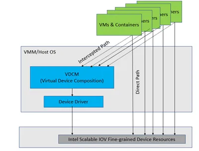
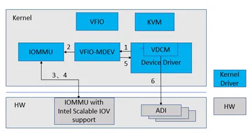
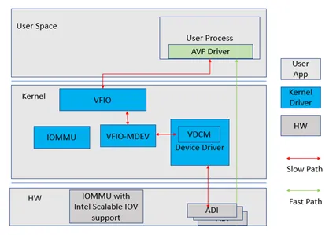
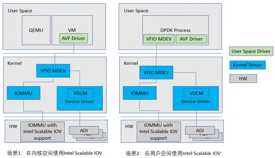

# 简介

Intel® Scalable I/O Virtualization(Intel Scalable IOV)是针对下一代 CPU 服务器平台的虚拟化解决方案, 是一种硬件辅助的I/O设备直通技术. 它采用了现有的 PCI Express 功能结构, 实现了高性能和更灵活的I/O设备共享的架构.

## 系统平台支持

系统平台方面, Intel VT-d 3.0 添加了对Intel Scalable IOV的支持. IOMMU提供DMA重映射技术, 把不同设备提供的IOVA地址转换成物理地址, 用于设备 DMA.

Intel IOMMU 实现基于 PASID 粒度的地址转换. 平台 IOMMU 支持基于每个设备 DMA 的 PASID 查找不同的页表, 保证 ADI 之间的隔离.

## 硬件设备功能

Intel Scalable IOV 基于 PASID(Process Address Space ID)实现设备隔离. 使用 PASID 可以实现比 VF 更细粒度的隔离和更轻量的资源分配. 硬件 PCIe 设备需要使能 PASID TLP 前缀, 在其 PCIe 数据包的 TLP Prefix 部分添加 PASID 值. 通过 PASID 值以及 requester ID(即BDF号), 可以确定数据包所属的进程地址空间 ID.

Intel Scalable IOV 支持的最小硬件资源为 ADI(Assignable Device Interface). ADI 可以由不同的设备资源组成, 比如有固定数量 RX/TX 队列的虚拟网卡.

在对设备进行初始化和枚举时需要知道设备是否支持 Scalable IOV. Intel 定义了 DVSEC 域用于发现和配置支持 Scalable IOV 技术的设备.

## 优势和适用场景

Intel Scalable IOV的资源更轻量, 因此同一个设备上可以支持更多的虚拟设备. 如Intel E810网卡, 可以支持的VF数量为256个, 而基于PASID可以支持700+个ADI. Intel Scalable IOV支持虚拟设备按需、动态创建. 因为Intel Scalable IOV占用的资源少, 因此启动时间更短, 也更易于热迁移. Intel Scalable IOV更适用于大规模容器群.

# 深度剖析

## 整体架构

对于Intel Scalable IOV软件支持的框架如图1所示.

> VDCM有不同的实现方式: 可以如图所示作为host或者VMM上的一个模块, 也可以是平台上独立于host和VMM的其他系统. 由于篇幅限制, 本文主要介绍VDCM在host和VMM上实现的情况.



VDCM(Virtual Device Composition Module)负责设备的管理和慢速路径的处理.

虚拟机和容器有两条路径访问硬件设备: intercepted path和direct path. 其中, intercepted path路径负责配置资源、管理设备, 通过VDCM软件模拟实现. VDCM使用设备驱动提供的接口配置设备; direct path通过映射底层的硬件设备, 提升硬件设备访问性能. 这种架构的好处在于: 一方面, 设备模型更简单灵活; 另一方面, 由hypervisor负责创建管理设备, 解决了SR-IOV中hypervisor无法记录和感知设备状态的问题.

VDEV(virtual device)作为共享物理设备和虚拟机的接口, 分配给虚拟机或者容器. VDEV包含虚拟的requester ID(即BDF号)、CSR和BARs, 以及虚拟的MSI-X表. 使用VDEV时不需要提前创建好将来要用的所有实例, 在需要使用的时候创建就可以.

## 设备部分软件实现

本文介绍的软件实现依赖于 linux kernel 的 VFIO-MDEV(Mediated Device)[框架](https://docs.kernel.org/driver-api/vfio-mediated-device.html?highlight=mediated%20device), 在linux 5.2-rc1 版本引入. VDCM(Virtual Device Composition Module)模块负责: 1)分配、配置、重置和释放ADI, 2)配置PASID.

下面介绍一下如何把VDEV和PASID绑定以及用户态程序访问ADI资源的两种方式.

## VDEV和PASID绑定

如前文所述, Intel Scalable IOV 基于 PASID 实现设备隔离. 这一节介绍如何把 VDEV 和 PASID 绑定.

如下图所示, VDEV 绑定 PASID 的流程如下:



1) VDCM 通过 mdev_set_iommu_device() 接口把 VDEV 注册到 MDEV bus.

2) VFIO 把 MDEV 绑定到一个 IOMMU domain.

3) IOMMU分配一个 PASID 并建立IOMMU页表——所有标记了该PASID的DMA请求都将使用这个IOMMU domain翻译.

4) 设备驱动通过 VFIO 的mdev_get_iommu_domain() 接口和 IOMMU 的 iommu_aux_get_pasid() 接口获得 VDEV所在的 IOMMU domain 和 VDEV 绑定的 PASID.

5) 把 PASID 值写入设备设备寄存器.

## ADI资源访问

如下图所示, 用户态程序(以AVF驱动为例)有两种方式访问ADI资源. 一种是通过VFIO和VDCM: 即图中的slow path: VDCM通过软件模拟ADI寄存器, 经由设备驱动访问和配置设备; 另一种是使用内存映射, 即图中的fast path: 把VDEV映射到user space, 建立MMU或者EPT页表, 实现HVA(Host Virtual Address)或者GPA(Guest Physical Address)到HPA(Host Physical Address)的转换.



# 直通案例

## 在VM中使用Intel E810 ADI 设备

本节介绍在虚拟机环境中使用基于Intel E810的Intel Scalable IOV. 系统架构如下图场景1所示.



使用步骤如下:

1) 加载MDEV内核模块.

```
# modprobe mdev
```

2) 创建MDEV. E810网卡的BDF是0000:16:00.0. 这个时候内核驱动中的VDCM模块分配ADI资源, 为ADI申请PASID并绑定到IOMMU domain.

```
# echo "596661ba-b9f9-11ec-97ad-984fee0051ab" > \
/sys/class/mdev_bus/0000\:16\:00.0/mdev_supported_types/ice-vdcm/create
```

3) 启动QEMU, 通过参数把VDEV传给虚拟机.


```
-device vfio-pci, \
sysfsdev=/sys/bus/mdev/devices/596661ba-b9f9-11ec-97ad-984fee0051ab/
```

4) 在VM中加载AVF驱动.

```
# insmod iavf.ko
```

对于没有映射到虚拟机的寄存器, AVF驱动在访问时会产生缺页异常类型的VM-Exit, 被KVM捕获后, QEMU模拟该寄存器的读写, 调用VFIO和VDCM; 对于映射到虚拟机的寄存器, 访问不会被QEMU模拟. QEMU在启动的时候把VDEV的BAR映射到QEMU的进程地址空间. KVM建立EPT页表后, 虚拟机在访问VDEV的寄存器时不会产生缺页异常.

Intel E810的网卡中现已添加了对Intel Scalable IOV的支持, 相关代码在设备驱动 OOT版本中发布.

## 在DPDK中使用Intel E810 ADI设备

本节介绍在DPDK中使用基于Intel E810的Intel Scalable IOV. 系统架构如上图场景2所示, 在DPDK的PCI总线中支持了MDEV设备. PCI总线在probe的时候加载MDEV. 使用步骤如下:

1) 加载MDEV内核模块.

```
# modprobe mdev
```

2) 创建MDEV——步骤1和2跟上一个案例在VM里使用Intel E810 ADI是一样的.

```
# echo "596661ba-b9f9-11ec-97ad-984fee0051ab" > \
/sys/class/mdev_bus/0000\:16\:00.0/mdev_supported_types/ice-vdcm/create
```

3) 启动testpmd. PCI总线驱动在probe发现MDEV, 根据MDEV的sysfs路径查找MDEV设备并把VDEV的硬件寄存器地址映射到DPDK的虚拟地址空间.

```
# ./dpdk-testpmd -c 0xf -n 4 -m 512 -- -I –rxq=1 –rxq=1
```

4) DPDK中AVF驱动访问虚拟寄存器地址时通过VFIO直接访问到VDEV的硬件寄存器.

DPDK中英特尔E810网卡驱动也已支持Intel Scalable IOV, 该功能可以在customer release中使用.