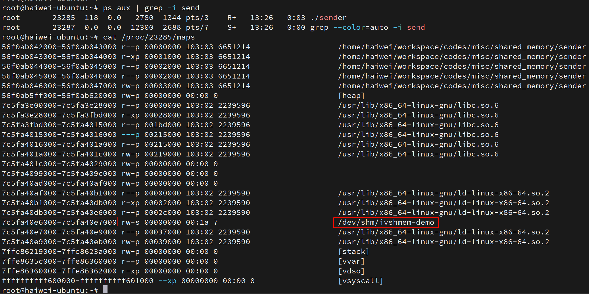

# 前言

ivshmem-plain 设备是 Qemu 提供的一种特殊设备，通过这个设备，可以实现**虚机内存和主机上其它进程内存共享**，**应用程序**可以利用**此设备**实现**虚机内部**和**主机上进程间**的高效数据传输。

通常，虚机内部的进程作为生产者，往共享内存中写入数据，主机侧进程作为消费者，从共享内存中读取数据，这种模式常常应用在虚拟化的杀毒软件场景，虚机内部的杀毒软件驱动程序搜集虚机的行为数据放到共享内存，后端的杀毒软件分析虚机暴露的数据，判断该虚机是否行为异常甚至中毒，本文主要分析这类杀毒软件的工作基础 ivshmem-plain 设备。

# 基本原理

linux 支持进程间共享内存，通过文件的形式提供编程接口，共享内存通常由一个进程打开共享内存的文件并写入内容，作为生产者，由另一个进程通过只读方式打开同样的内存文件并作为消费着读取。我们通过简单测试程序了解共享内存的使用方式，代码见 `shared_memory`

> 参考 `Linux\Memory\Shared Memory\0. 共享内存综述.md` 中的 `POSIX 共享内存`.

测试程序有两个，一个作为生产者（sender）创建共享内存文件 /`dev/shm/ivshmem-demo`，同时往内存文件中写入内容，这里 sender 分别写入了三个整数 0、1、2。一个作为消费者（receiver）通过**只读方式**打开共享内存文件 `/dev/shm/ivshmem-demo`，读取该内存文件，测试程序运行结果如下：

```
# ./sender
sender mapped address: 0x7526e3246000
do cleanup

# ./receiver
receiver mapped address: 0x763353b26000
0
1
2
# ps aux | grep -i sender
root       23146  107  0.0   2780  1344 pts/3    R+   13:20   0:09 ./sender
# kill 23146
```

生产者打开共享内存文件，可以看到，进程空间分配的内存比实际映射的多，为4k，猜测共享内存的最小单位是一个内存页。



Qemu 的 ivshmem-plain 设备，其本质也是利用 linux 提供的这一套共享内存机制，实现虚拟机内存和主机上进程的内存共享。实际上虚机内存在主机上进程看来就是 Qemu 分配创建的共享内存，因此可以互相访问.

# 协议规范

