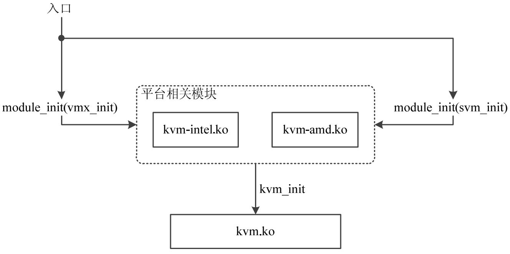

QEMU-KVM实际上包括QEMU和KVM两部分，在创建和初始化虚拟机时，实际上也是在这两部分进行的。

KVM实际上就是KVM内核模块，包括kvm.ko、kvm\-intel.ko、kvm-amd.ko三部分，后两部分分别对应Intel体系的VMX技术以及AMD体系的SVM技术。

首先，我们需要加载模块，当我们加载kvm\-xxx.ko模块时，会调用对应的module\_init()函数，然后调用vmx\_init()或者svm\_init()函数，最后进入到统一的kvm.ko模块中的kvm\_init()函数，现在正式进行虚拟机的初始化工作。



```c
//arch/x86/kvm/vmx/vmx.c
module_init(vmx_init)     
```

```cpp
//arch/x86/kvm/vmx/vmx.c
static int __init vmx_init(void)     
{  
       ..............//省略部分代码  
       r= kvm_init(&vmx_x86_ops, sizeof(struct vcpu_vmx),  
                   __alignof__(struct vcpu_vmx),THIS_MODULE);  
       ................//省略部分代码  
}  
```

```c
// virt/kvm/kvm_main.c 
int kvm_init(voidvoid *opaque, unsigned vcpu_size,unsigned vcpu_align,  
                struct module *module)    
{  
       ......................//省略部分代码  
       r= kvm_arch_init(opaque);  
       ........................//省略部分代码  
}  
```

在进入到kvm\_init()函数后，进行了很多初始化的相关工作，这里单独强调一下kvm\_arch\_init()函数。

在vmx.c文件中声明并定义了一个结构体vmx\_x86\_ops，这是函数指针的集合，其实就是各种操作的一个集合。内部很多函数是后续的初始化工作需要具体调用到的，比如很多Qemu层的ioctl调用到内核层实际上就是执行这内部的一些函数。具体的内容如下：

```c
// arch/x86/kvm/vmx/vmx.c
static struct kvm_x86_ops vmx_x86_ops __ro_after_init = {
	.cpu_has_kvm_support = cpu_has_kvm_support,
	.disabled_by_bios = vmx_disabled_by_bios,
	.hardware_setup = hardware_setup,
	.hardware_unsetup = hardware_unsetup,
	.check_processor_compatibility = vmx_check_processor_compat,
	.hardware_enable = hardware_enable,
	.hardware_disable = hardware_disable,
	.cpu_has_accelerated_tpr = report_flexpriority,
	.has_emulated_msr = vmx_has_emulated_msr,

	.vm_init = vmx_vm_init,
	.vm_alloc = vmx_vm_alloc,
	.vm_free = vmx_vm_free,

	.vcpu_create = vmx_create_vcpu,
	.vcpu_free = vmx_free_vcpu,
	.vcpu_reset = vmx_vcpu_reset,

	.prepare_guest_switch = vmx_prepare_switch_to_guest,
	.vcpu_load = vmx_vcpu_load,
	.vcpu_put = vmx_vcpu_put,

	.update_bp_intercept = update_exception_bitmap,
	.get_msr_feature = vmx_get_msr_feature,
	.get_msr = vmx_get_msr,
	.set_msr = vmx_set_msr,
	.get_segment_base = vmx_get_segment_base,
	.get_segment = vmx_get_segment,
	.set_segment = vmx_set_segment,
	.get_cpl = vmx_get_cpl,
	.get_cs_db_l_bits = vmx_get_cs_db_l_bits,
	.decache_cr0_guest_bits = vmx_decache_cr0_guest_bits,
	.decache_cr3 = vmx_decache_cr3,
	.decache_cr4_guest_bits = vmx_decache_cr4_guest_bits,
	.set_cr0 = vmx_set_cr0,
	.set_cr3 = vmx_set_cr3,
	.set_cr4 = vmx_set_cr4,
	.set_efer = vmx_set_efer,
	.get_idt = vmx_get_idt,
	.set_idt = vmx_set_idt,
	.get_gdt = vmx_get_gdt,
	.set_gdt = vmx_set_gdt,
	.get_dr6 = vmx_get_dr6,
	.set_dr6 = vmx_set_dr6,
	.set_dr7 = vmx_set_dr7,
	.sync_dirty_debug_regs = vmx_sync_dirty_debug_regs,
	.cache_reg = vmx_cache_reg,
	.get_rflags = vmx_get_rflags,
	.set_rflags = vmx_set_rflags,

	.tlb_flush = vmx_flush_tlb,
	.tlb_flush_gva = vmx_flush_tlb_gva,

	.run = vmx_vcpu_run,
	.handle_exit = vmx_handle_exit,
	.skip_emulated_instruction = skip_emulated_instruction,
	.set_interrupt_shadow = vmx_set_interrupt_shadow,
	.get_interrupt_shadow = vmx_get_interrupt_shadow,
	.patch_hypercall = vmx_patch_hypercall,
	.set_irq = vmx_inject_irq,
	.set_nmi = vmx_inject_nmi,
	.queue_exception = vmx_queue_exception,
	.cancel_injection = vmx_cancel_injection,
	.interrupt_allowed = vmx_interrupt_allowed,
	.nmi_allowed = vmx_nmi_allowed,
	.get_nmi_mask = vmx_get_nmi_mask,
	.set_nmi_mask = vmx_set_nmi_mask,
	.enable_nmi_window = enable_nmi_window,
	.enable_irq_window = enable_irq_window,
	.update_cr8_intercept = update_cr8_intercept,
	.set_virtual_apic_mode = vmx_set_virtual_apic_mode,
	.set_apic_access_page_addr = vmx_set_apic_access_page_addr,
	.get_enable_apicv = vmx_get_enable_apicv,
	.refresh_apicv_exec_ctrl = vmx_refresh_apicv_exec_ctrl,
	.load_eoi_exitmap = vmx_load_eoi_exitmap,
	.apicv_post_state_restore = vmx_apicv_post_state_restore,
	.hwapic_irr_update = vmx_hwapic_irr_update,
	.hwapic_isr_update = vmx_hwapic_isr_update,
	.guest_apic_has_interrupt = vmx_guest_apic_has_interrupt,
	.sync_pir_to_irr = vmx_sync_pir_to_irr,
	.deliver_posted_interrupt = vmx_deliver_posted_interrupt,

	.set_tss_addr = vmx_set_tss_addr,
	.set_identity_map_addr = vmx_set_identity_map_addr,
	.get_tdp_level = get_ept_level,
	.get_mt_mask = vmx_get_mt_mask,

	.get_exit_info = vmx_get_exit_info,

	.get_lpage_level = vmx_get_lpage_level,

	.cpuid_update = vmx_cpuid_update,

	.rdtscp_supported = vmx_rdtscp_supported,
	.invpcid_supported = vmx_invpcid_supported,

	.set_supported_cpuid = vmx_set_supported_cpuid,

	.has_wbinvd_exit = cpu_has_vmx_wbinvd_exit,

	.read_l1_tsc_offset = vmx_read_l1_tsc_offset,
	.write_l1_tsc_offset = vmx_write_l1_tsc_offset,

	.set_tdp_cr3 = vmx_set_cr3,

	.check_intercept = vmx_check_intercept,
	.handle_external_intr = vmx_handle_external_intr,
	.mpx_supported = vmx_mpx_supported,
	.xsaves_supported = vmx_xsaves_supported,
	.umip_emulated = vmx_umip_emulated,
	.pt_supported = vmx_pt_supported,

	.request_immediate_exit = vmx_request_immediate_exit,

	.sched_in = vmx_sched_in,

	.slot_enable_log_dirty = vmx_slot_enable_log_dirty,
	.slot_disable_log_dirty = vmx_slot_disable_log_dirty,
	.flush_log_dirty = vmx_flush_log_dirty,
	.enable_log_dirty_pt_masked = vmx_enable_log_dirty_pt_masked,
	.write_log_dirty = vmx_write_pml_buffer,

	.pre_block = vmx_pre_block,
	.post_block = vmx_post_block,

	.pmu_ops = &intel_pmu_ops,

	.update_pi_irte = vmx_update_pi_irte,

#ifdef CONFIG_X86_64
	.set_hv_timer = vmx_set_hv_timer,
	.cancel_hv_timer = vmx_cancel_hv_timer,
#endif

	.setup_mce = vmx_setup_mce,

	.smi_allowed = vmx_smi_allowed,
	.pre_enter_smm = vmx_pre_enter_smm,
	.pre_leave_smm = vmx_pre_leave_smm,
	.enable_smi_window = enable_smi_window,

	.check_nested_events = NULL,
	.get_nested_state = NULL,
	.set_nested_state = NULL,
	.get_vmcs12_pages = NULL,
	.nested_enable_evmcs = NULL,
	.need_emulation_on_page_fault = vmx_need_emulation_on_page_fault,
};
```

这个结构体作为参数传递到kvm\_init()函数，再传递到kvm\_arch\_init()函数，再传递到全局变量kvm\_x86\_ops中，注册各种操作函数，后续可以调用。随后还进行了一些内部数据结构以及定时器、调试信息等的一些初始化工作。

与此同时，qemu层也会进行大部分的初始化工作，这一部分后一篇再讲。


# 参考

https://blog.csdn.net/mrbuffoon/article/details/53606356