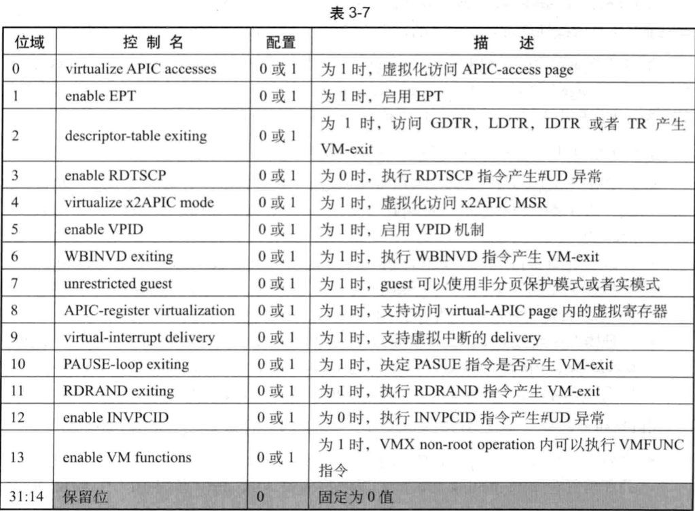

processor-based 控制字段提供基于处理器层面上的控制，两个这样的控制字段如下：

* primary processor-based VM-execution control 字段
* secondary processor-based VM-execution control 字段

这两个字段是 32 位向量值，每一位可以对应一个功能控制。在进入 VMX non-root  operation 模式后，它们控制着虚拟处理器的行为。primary processor-based VM-execution  control 字段与一个 TRUE 寄存器对应，而 secondary processor-based VM-execution control 字段无须 TRUE 寄存器控制（参见 2.5.6 节）。

# primary processor-based VM-execution control 字段

# secondary processor-based VM-execution control 字段

随着处理器架构的不断发展，一些**新的 VMX 架构功能**也可能被不断地加入。这个字段就用于提供这些扩展的控制功能，或者说**新的 VMX 功能**，如表 3-7 所示。只有在  `primary processor-based Vm-execution control` 字段的“`activate secondary controls`”位为 1 时才有效。否则，全部控制位关闭。

这个字段的**保留位**为 **default**（固定为 0 值）。软件通过 `IA32_VMX_PROCBASED_CTLS2` 寄存器来检查支持哪个控制位。当 `primary processor-based VM-execution control` 字段的 "`activate secondary control`"控制位为 0 时，这个字段无效。

## virtual APIC accesses

当“virtualize APIC accesses”为 1 时，将实施 local APIC 访问的虚拟化。它引入了个被称为“APIC-aceess page”的 4K 页面，这个 APlC-access page 的物理地址必须提供在 APIC-access address 字段里。

启用 local APIC 的访问虚拟化后，guest 软件访问 APIC- access page 页面将产生 VM- exit，或者访问到 virtual- APIC page 内的数据，这取决于“use TPR shadow”及“APIC  register virtualization”控制位。

这里需要清楚地理解“访问 "**APIC-access page**" 的三种方式（详见 72.3 节）。

 (1) 线性地址访问：线性地址转换的物理地址落在 APIC- access page 内。

 (2) guest- physical address 访问：在启用 EPT 机制时，guest- physical addres 转换的物理地址落在 APIC- access page 内，但这个 guest- physical address 并不是由线性地址转换而来的。

 (3) physical address 访问：直接访问的物理地址落在 APIC- access page 内，这个物理地址并不是由线性地址转换而来的，也不是由 guest- physical address 转换而来的。

使用线性地址访问 APIC- access page 将实施虚拟化，guest-physical address 访问 APIC- access page 则产生 VM-exi。而 physical address 1 访问 APIC- access page 是一种不确定行为，可能引发 VM-exi，也可能访问到 virtual- APIC page 内的数据。

 guest- physical address i 访问 APC- access page 可以来自下面的情形：

在 PAE 分页模式下，执行 MOV to CR3 指令更新 CR3 寄存器时会引起 PDPTES 加载。CR3 寄存器存放的 guest- physical address 转换为物理地址后落入 APlC- access page 内