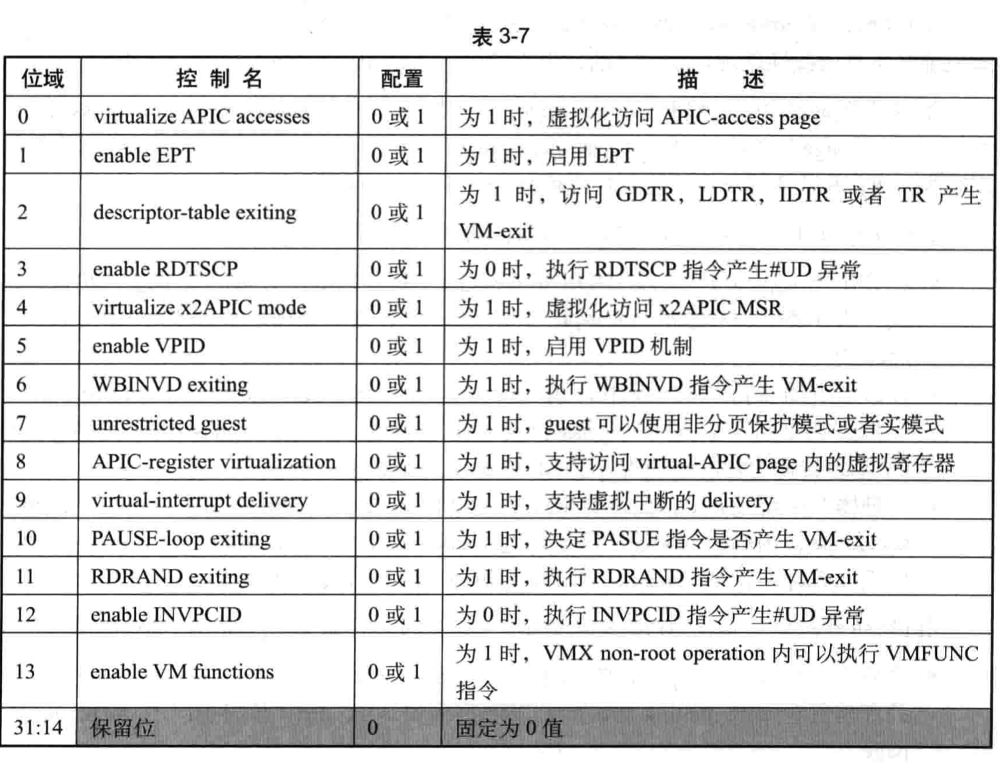

VM-execution 控制类字段主要控制处理器在 VMX non-root operation模式下的行为能力, 典型地可以控制某些条件引发 VM-exit 事件, 也控制着 VMX 的某些虚拟化功能的开启. 例如 APIC 的虚拟化及 EPT 机制.

VM-execution 控制类字段包括下面所列举的 26 个项目:

(1) Pin-based VM-execution control字段

(2) Processor-based VM-execution control字段

(21) EPTP字段

# 1. Pin-based VM-execution control字段

Pin-based VM-execution control 字段提供基于**处理器Pin接口**的控制(**INTR与NMI**), 也就是与**外部中断**和**NMI**相关的配置(包括一些特色功能), 如表3-5所示.

...

## activate VMX-preemption timer

当为1, 启用VMX提供的定时器功能. VMM需要在`VMX-preemption timer value`字段为VM提供一个**计数值**. 该值在`VM-entry`操作开始后进行递减, 当减为0时发生`VM-exit`. 递减的步伐依赖于TSC和`IA32_VMX_MISC[4:0]`值, 见2.5.11.

# 2. processor-based VM-execution control字段

processor-based VM-execution control控制字段提供基于**处理器层面上的控制**, 两个这样的控制字段如下:

- primary processor-based VM-execution control字段
- secondary processor-based VM-execution control字段

这两个字段是32位向量值, 每一位对应一个功能控制. 

在进入**VMX non-root operation**模式后, 它们控制着**虚拟处理器的行为**. 

primary processor-based VM-execution control字段与一个TRUE寄存器对应, 而secondary processor-based VM-execution control字段无需TRUE寄存器控制(见2.5.6)

## 2.1. primary processor-based VM-execution control字段

处理器 **VMX non-root operation** 模式下的主要行为由**这个字段控制**, 它的**bit 31**也控制着**是否启用**secondary processor-based VM-execution control字段.

## 2.2. secondary processor-based VM-execution control字段

处理器架构的不断发展, 一些新的功能可能被不断加入.

该字段用于提供这些扩展的控制功能, 如表3-7所示. 只有在primary processor-based VM-execution control字段的"activate secondary controls"位为1时才有效. 否则, 全部控制位关闭.

# 3. posted-interrupt notification vector字段

但是posted-interrupt processing机制允许处理器接受一个"通知性质"的外部中断但不会产生VM-exit, 其他的外部中断仍然会产生VM-exit. 

**这个中断**通知**处理器**进行下面的一些特殊处理:

- 从一个被称为"`posted-interrupt descriptor`"的结构中读取**预先设置**好的中**断向量号**, 并复制到virtual-APIC page内的VIRR寄存器中, 从而构成virtual-interrupt请求.
- 对virtual-interrupt进行评估. 通过评估后, 未屏蔽的虚拟中断将由guest-IDT进行deliver执行(见7.2.13)

这个**通知性质的外部中断号**提供在`posted-interrupt notification vector`字段, 这个字段为16位宽. 

在**使用posted-interrupt processing机制前！！！**, VMM**需要设置**这个通知中断向量号以**供处理器进行检查对比**.

# 4. posted-interrupt descriptor address字段

在`posted-interrupt processing`机制处理下, **VMM**在一个被称为"`posted-interrupt descriptor`"的数据结构里**预先设置**需要给guest传递执行的**中断向量号**. 

Posted-interrupt descriptor address字段提供**这个数据结构**的**64位物理地址**. 

关于posted-interrupt descriptor见7.2.14的表7\-3.

# 5. EPTP 字段

在 "enable EPT" 为 1 时, 支持 **GPA 转换为 HPA** .

EPT(Extended Page Table, 扩展页表)用于将 GPA 转换成 HPA . EPT 的原理与保护模式下的分页机制下的页表是一样的. 

VMX non-root operation 内的保护模式分页机制的页表被称为 "guest paging-structure", 而EPT页表结构被称为 "EPT paging-structure".

**64 位**的 EPTP 字段提供 **EPT PML4T 表的物理地址**, 与分页机制下的 CR3 寄存器作用类似. 它的结构如图 3-4 所示.

`bits 2:0` 指示 EPT paging-structure 的**内存类型**(属于 VMM 管理的数据区域), 当前只支持 **UC**(值0) 和** WB**(值6)类型. 

`bits 5:3` 指示 **EPT 页表结构的层级**, 这个值加上 1 才是真正级数. 例如, 它值为3时表示有 4 级页表结构.

`bit 6` 为 1 时, 指示 EPT **页表结构**项里的 **access** 与 **dirty** **标志位有效**(EPT 表项的 bit 8 与 bit 9). **处理器**会**更新** EPT 表项的这两个标志.

`bits N-1:12` 提供 EPT PML4T 表的**物理地址**(`N=MAXPHYADDR`), 这个值对齐在 4K 边界上. 如果 MAXPHYADDR 为 36 , 则 `bits 35:12` 提供 36 位的物理地址的高 24 位. `bits N-1:12` 的地址值也被称为 "**EP4TA**", 作为一个**域标识**用于**cache的维护**操作.

bits