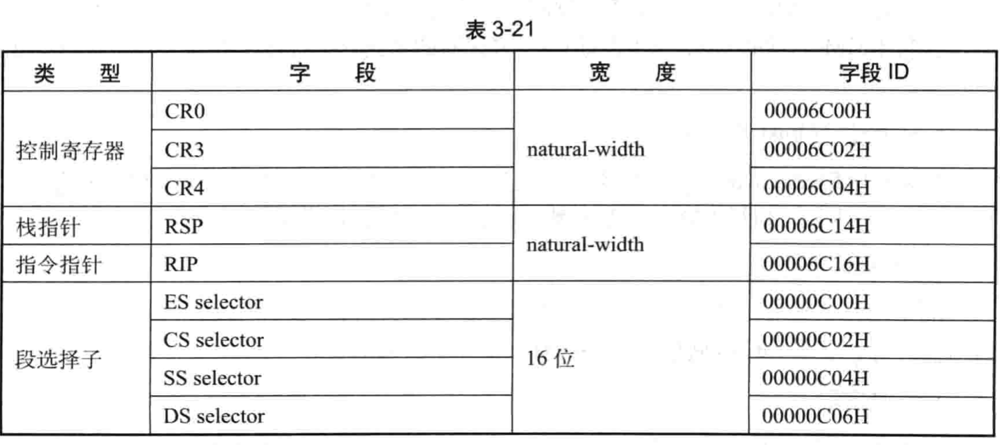

在 **VM-exit！！！** 发生时, 处理器将从 `host-state` 区域读取**host(VMM)的环境信息**, 加载到处理器内, 转入 `host-state`区域内提供的**入口点！！！** 继续执行.

当进行 `VM-entry` 操作时, 如果由于 `guest-state` 区域字段检查或加载而引起 `VM-entry` 失败, 处理器也会从 `host-state`区域里加载host环境信息转入 host 入口点继续执行.

如表 3-21 所示, `host-state` 区域内的字段比 guest-state 字段少了许多, 那是因为当返回到host(VMM)时, 有许多处理器的状态值是强制设置的. 因此, 这次状态值不必提供在 host-state 区域中.

# 控制寄存器字段

# host-RSP与host-RIP字段

这两个字段属于 natural-width 类型. 

在发生 **VM-exit** 后, 处理器从 **host-RIP** 字段读取**VMM**的**入口地址**, 执行 VMM 的**管理例程**. 

host-RSP 字段提供 VMM 使用的栈指针.

# 段selector字段

host-state 区域有 **6 个code/data 段寄存器**和**一个 TR 寄存器 selector 字段**, 固定为 16 为宽.

注: host-state 区域里**不**提供 **LDTR 寄存器**的 selector 字段.

# 段基址字段

# MSR 字段