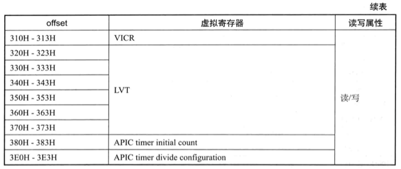

<!-- @import "[TOC]" {cmd="toc" depthFrom=1 depthTo=6 orderedList=false} -->

<!-- code_chunk_output -->

- [1. virtual-APIC page 机制](#1-virtual-apic-page-机制)
- [2. Virtualized APIC Registers: 虚拟 local APC 寄存器](#2-virtualized-apic-registers-虚拟-local-apc-寄存器)
- [3. APIC-access page 与 virtual-APIC page 的关系](#3-apic-access-page-与-virtual-apic-page-的关系)
- [4. Local APIC MSR 与 virtual-APIC page 的关系](#4-local-apic-msr-与-virtual-apic-page-的关系)

<!-- /code_chunk_output -->

# 1. virtual-APIC page 机制

当“`use TPR shadow`”为 1 时，引入了一个被称为“`virtual-APIC page`”的**影子页面**(shadow page)。这个影子页面与物理 APIC page 样是 4K 大小，是 local APIC 的虚拟页面。

* 当“`APIC-register virtualization`”为 1 时，`virtual-APIC page` 页面内存在**每个 local APIC 寄存器**对应的一份**影子数据**（即**虚拟 local APIC 寄存器**）。

* 当“`APIC-register virtualization`”为 0 时，还细分有下面的情况：

    * "`virtual-interrupt delivery`"为 0 时，只有偏移量为 **80H** 的 **VTPR** 寄存器(`virtual-TPR`）是有效的。**其他位置的数据属于无效**（不可访问）。

    * "`virtual-interrupt delivery`"为 1 时，除了偏移量为 **80H** 的 **VTPR** 寄存器外，还有偏移量为 **BOH** 的 **VEOI** 寄存器（`virtual-EOI`），以及偏移量为 **300H** 的 **VICR** 寄存器（`virtual-ICR`）的**低 32 位**可以进行**写访问**，但**不能进行读访问**! **其他位置的数据属于无效**（不可访问）。

`virtual-APIC page` 页面的 64 位**物理地址**需要在 `virtual-APIC address` 字段里提供(VMCS 中 `VM-execution control` 域, 64位)。这个 4K 页面属于 VMCS 区城所引用的数据结构区域（例如 IO bitmap 与 MSR  bitmap), VMM 在初始化 VMCS 区域时需要为 VM 分配这样的一个 4K 页面。

注意：无论是虚拟化 **xAPIC** 模式还是 **x2APIC** 模式，都会存在 `virtual-APIC page` 页面; 而 `APIC-access page`页面仅仅在 xapic 模式中存在.

# 2. Virtualized APIC Registers: 虚拟 local APC 寄存器

`virtual-APIC page` 页面内存在物理 local APIC 对应的一份虚拟寄存器。表 7-2 列出了可访问的虚拟 local APIC 寄存器.

根据某些VM执行控件的设置，逻辑处理器可以使用virtual-APIC页面上的以下字段来虚拟化对APIC寄存器的某些访问：

* 虚拟任务优先级寄存器（VTPR）：虚拟APIC页面上偏移080H处的32位字段。
* **虚拟处理器优先级寄存器**（VPPR）：虚拟APIC页面上位于偏移量0A0H的32位字段。**表中没有显示**.
* 虚拟中断结束寄存器（VEOI）：位于virtual-APIC页面上偏移量0B0H的32位字段。
* 虚拟中断服务寄存器（VISR）：256位值，包含8个非连续的32位字段，在虚拟APIC页面上的偏移量为100H，110H，120H，130H，140H，150H，160H和170H。 VISR的位x在偏移（100H |（（x＆E0H）»1））的位位置（x＆1FH）。处理器仅使用偏移量为100H，110H，120H，130H，140H，150H，160H和170H的每个16字节字段的低4字节。
* 虚拟中断请求寄存器（VIRR）：包含8个非连续的32位字段的256位值，在虚拟APIC页面上的偏移量为200H，210H，220H，230H，240H，250H，260H和270H。 VIRR的位x在偏移（200H |（（x＆E0H）»1））的位位置（x＆1FH）。处理器仅使用每个16字节字段的低4字节，其偏移量为200H，210H，220H，230H，240H，250H，260H和270H。
* 虚拟中断命令寄存器（VICR_LO）：位于virtual-APIC页面上偏移量300H的32位字段
* 虚拟中断命令寄存器（VICR_HI）：位于virtual-APIC页面上偏移量310H处的32位字段。

如前面所述，

* **只有**在“`APIC-register virtualization`”为 1 时，表中**所有的虚拟寄存器是可访问的**。

* “`APIC-register virtualization`”与“`virtual-interrupt delivery`”都为 **0** 时，只有 **VTPR** 是**可访问**的。

* “`APIC-register virtualization`”为 **0** 且 "`virtual-interrupt delivery`"为 **1** 时，只有 **VTPR**(**读/写**), **VEOI**(**只写**)以及 **VICR**(偏移量 300H，**只写**)是可访问的。

部分 local APIC 对应的虚拟寄存器是**不可访问**的，譬如偏移量为 **AOH** 的 **VPPR**(`virtual processor-priority register`，**虚拟处理器优先级别寄存器**）。尝试访问则产生 VM-exit。

# 3. APIC-access page 与 virtual-APIC page 的关系

`APIC-access page` 与 `virtual-APIC page` 之间的关系类似于**页映射**中的**虚拟地址**与**物理地址**。当 **guest** 尝试**线性**访问 `APIC-access page` 页面时（**不**包括 **guest-physical 访问**与**物理访问**），实际上访问了 `virtual-APIC page` 页面的数据。如图 7-7 所示。

注: `APIC-access page` 到 `virtual-APIC page` 没有转换关系, 具体读写`APIC-access page`见下面

当启用了`virtual-APIC page`和`use TPR shadow`后, 如上图 7-7 所示guest尝试线性访问 TPR 寄存器, 处理器返回的是 `virtual-APIC page` 页面内的 VTPR 寄存器值.

当 guest 尝试以 **guest-physical**(GPA) 方式访问 `APIC- access page` 页面时，**不能**得到 `virtual-APIC page` 页面内的虚拟寄存器数据，而是**产生 Vm-exit**。

以物理方式(HPA)访间时**可能会访问到**, 也可能会产生 `VM-exit`.

# 4. Local APIC MSR 与 virtual-APIC page 的关系

当使用 **x2APIC** 模式虚拟化机制时，guest 访问 local APIC **MSR** 同样访问到 `virtual-APIC page` 页面内的虚拟寄存器。如同图 7-7 所示，所不同的是通过 MSR 来访问 local APIC 物理页面。