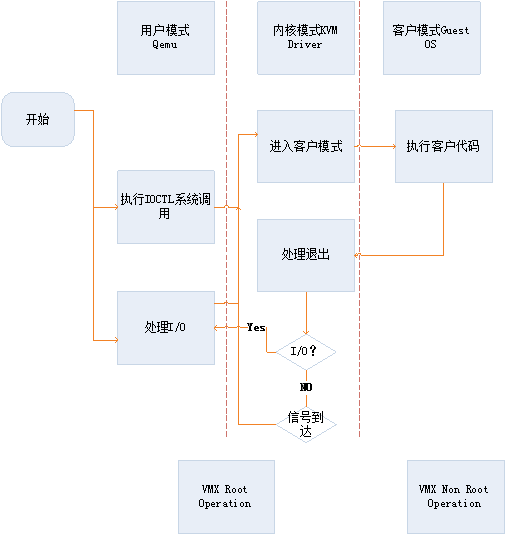

<!-- @import "[TOC]" {cmd="toc" depthFrom=1 depthTo=6 orderedList=false} -->

<!-- code_chunk_output -->

- [1 QEMU和KVM的关系](#1-qemu和kvm的关系)
- [2 QEMU基本介绍](#2-qemu基本介绍)
- [3 KVM基本介绍](#3-kvm基本介绍)
  - [3.1 KVM架构](#31-kvm架构)
  - [3.2 KVM模块](#32-kvm模块)
  - [3.3 KVM三种类型的文件描述符](#33-kvm三种类型的文件描述符)
    - [3.3.1 kvm设备](#331-kvm设备)
    - [3.3.2 具体的VM](#332-具体的vm)
    - [3.3.3 具体的VCPU](#333-具体的vcpu)
  - [3.4 KVM工作原理](#34-kvm工作原理)
- [4 QEMU简介](#4-qemu简介)
  - [4.1 QEMU的框架](#41-qemu的框架)
    - [4.1.1 两种操作模式](#411-两种操作模式)
    - [4.1.2 多重事件回应架构](#412-多重事件回应架构)
    - [4.1.3 QEMU的事件驱动核心](#413-qemu的事件驱动核心)
    - [4.1.4 卸下特殊的任务到工作线程](#414-卸下特殊的任务到工作线程)
    - [4.1.5 执行guest代码](#415-执行guest代码)
    - [4.1.6 IOTHREAD和NON\-IOTHREAD线程架构](#416-iothread和non-iothread线程架构)
      - [4.1.6.1 non\-iothread线程架构](#4161-non-iothread线程架构)
      - [4.1.6.2 iothread线程架构](#4162-iothread线程架构)
  - [4.2 QEMU的线程](#42-qemu的线程)
- [5 QEMU的初始化流程](#5-qemu的初始化流程)
- [6 QEMU虚拟网卡设备的创建流程](#6-qemu虚拟网卡设备的创建流程)
  - [5 QEMU网卡的流程](#5-qemu网卡的流程)
- [相关技术-处理器管理和硬件辅助虚拟化技术](#相关技术-处理器管理和硬件辅助虚拟化技术)
  - [1 KVM中Guest OS的调度执行](#1-kvm中guest-os的调度执行)

<!-- /code_chunk_output -->

# 1 QEMU和KVM的关系

现在所说的虚拟化, 一般都是指在CPU硬件支持基础之上的虚拟化技术. KVM也同hyper\-V、Xen一样依赖此项技术. 没有CPU硬件虚拟化的支持, KVM是无法工作的. 

准确来说, KVM是Linux的一个模块. 可以用modprobe去加载KVM模块. 加载了模块后, 才能进一步通过其他工具创建虚拟机. 但仅有KVM模块是远远不够的, 因为用户无法直接控制内核模块去作事情: 还必须有一个**用户空间的工具**才行. 这个用户空间的工具, 开发者选择了已经成型的开源虚拟化软件 QEMU. 说起来QEMU也是一个虚拟化软件. 它的特点是可虚拟不同的CPU. 比如说在x86的CPU上可虚拟一个Power的CPU, 并可利用它编译出 可运行在Power上的程序. KVM使用了QEMU的一部分, 并稍加改造, 就成了可控制KVM的用户空间工具了. 所以你会看到, 官方提供的**KVM下载**有两大部分三个文件, 分别是**KVM模块**、**QEMU工具**以及二者的合集. 也就是说, 你可以只升级KVM模块, 也可以只升级QEMU工具. 

# 2 QEMU基本介绍

Qemu是一个完整的可以单独运行的软件, 它可以用来模拟机器, 非常灵活和可移植. 它主要通过一个特殊的'重编译器'将为特定处理器编写二进制代码转换为另一种. (也就是, 在PPCmac上面运行MIPS代码, 或者在X86 PC上运行ARM代码)

# 3 KVM基本介绍

KVM是一个基于Linux内核的虚拟机, 它属于完全虚拟化范畴, 从Linux-2.6.20开始被包含在Linux内核中. KVM基于x86硬件虚拟化技术, 它的运行要求Intel VT-x或AMD SVM的支持. 

一般认为, 虚拟机监控的实现模型有两类: 监控模型(Hypervisor)和宿主机模型(Host-based). 由于监控模型需要进行处理器调度, 还需要实现各种驱动程序, 以支撑运行其上的虚拟机, 因此实现难度上一般要大于宿主机模型. KVM的实现采用宿主机模型(Host-based), 由于KVM是集成在Linux内核中的, 因此可以自然地使用Linux内核提供的内存管理、多处理器支持等功能, 易于实现, 而且还可以随着Linux内核的发展而发展. 另外, 目前KVM的所有I/O虚拟化工作是借助Qemu完成的, 也显著地降低了实现的工作量. 以上可以说是KVM的优势所在. 

## 3.1 KVM架构

kvm基本结构有2个部分构成: 

- kvm 驱动: 现在已经是linux kernel的一个模块了. 其主要负责虚拟机的创建, 虚拟内存的分配, VCPU寄存器的读写以及VCPU的运行. 

- Qemu: 用于模拟虚拟机的用户空间组件, 提供I/O设备模型, 访问外设的途径. 


kvm基本结构如上图. 

## 3.2 KVM模块

kvm已经是**内核模块**, 被看作是一个**标准的linux 字符集设备**(/dev/kvm). 

Qemu通过**libkvm应用程序接口**, 用**fd**通过**ioctl**向**设备驱动**来发送**创建**, **运行虚拟机**命令. 

设备驱动kvm就会来解析命令(**kvm\_dev\_ioctl**函数在**kvm\_main.c**文件中),如下图: 


KVM模块让**Linux主机**成为一个**虚拟机监视器**(VMM, Virtual Machine Monitor), 并且在原有的Linux两种执行模式基础上, 新增加了**客户模式**, 客户模式拥有自己的内核模式和用户模式. 在虚拟机运行时, 三种模式的工作各为: 

- 客户模式: 执行非I/O的客户代码, 虚拟机运行在这个模式下. 
- 用户模式: 代表用户执行I/O指令, qemu运行在这个模式下. 
- 内核模式: 实现客户模式的切换, 处理因为I/O或者其他指令引起的从客户模式退出(VM\_EXIT). kvm 模块工作在这个模式下. 

在kvm的模型中, 每一个Gust OS都是作为一个标准的linux进程, 都可以使用linux进程管理命令管理. 

## 3.3 KVM三种类型的文件描述符

### 3.3.1 kvm设备

首先是**kvm设备**本身. kvm内核模块本身是作为一个设备驱动程序安装的, 驱动的设备名称是"/**dev/kvm**". 

要使用kvm, 需要先用**open**打开"/**dev/kvm**"设备, 得到一个**kvm设备文件描述符fd**, 然后**利用此fd**调用**ioctl**就可以**向设备驱动发送命令**了. 

kvm驱动解析此种请求的函数是**kvm\_dev\_ioctl**(kvm\_main.c), 如**KVM\_CREATE\_VM**. 

### 3.3.2 具体的VM

其次是**具体的VM**. 通过**KVM\_CREATE\_VM**创建了一个VM后, 用户程序需要发送一些命令给VM, 如**KVM\_CREATE\_VCPU**. 这些命令当然也是要通过ioctl来发送, 所以**VM**也需要对应一个**文件描述符**才行. 用户程序中用ioctl发送KVM\_CREATE\_VM得到的**返回值**就是**新创建VM对应的fd**, 之后利用此fd发送命令给此VM. 

kvm驱动解析此种请求的函数是**kvm\_vm\_ioctl**. 

此外, 与OS线程类似, **每个VM**在kvm驱动中会对应一个VM控制块结构**struct kvm**, **每个对VM的内核操作**都基本要访问这个**结构**, 那么**kvm驱动**是如何找到**请求这次命令的VM的控制块**的呢?

回答这个问题首先要知道, **linux内核**用一个**struct file结构**来表示**每个打开的文件**, 其中有一个**void \*private\_data**字段, kvm驱动将**VM控制块的地址**保存到**对应struct file**的**private\_data**中. 用户程序**发送ioctl**时, 指定**具体的fd**, 内核根据**fd**可以找到**相应的struct file**, 传递给**kvm\_vm\_ioctl**, 再通过**private\_data**就可以找到了. 

### 3.3.3 具体的VCPU

最后是具体的VCPU. 

原理基本跟VM情况差不多, kvm驱动解析此种请求的函数是**kvm\_vcpu\_ioctl**. 

VCPU控制块结构为**struct kvm\_vcpu**. 

## 3.4 KVM工作原理

KVM的基本工作原理: **用户模式**的**Qemu**利用接口**libkvm**通过ioctl系统调用进入内核模式. **KVM Driver**为**虚拟机**创建**虚拟内存**和**虚拟CPU**后执行**VMLAUCH指令**进入**客户模式**. 装载Guest OS执行. 如果Guest OS发生**外部中断**或者**影子页表**(shadow page)缺页之类的事件, 暂停Guest OS的执行, 退出客户模式进行一些必要的处理. 然后重新进入客户模式, 执行客户代码. 如果发生I/O事件或者信号队列中有信号到达, 就会进入用户模式处理. KVM采用全虚拟化技术. 客户机不用修改就可以运行. 



# 4 QEMU简介

## 4.1 QEMU的框架

### 4.1.1 两种操作模式

QEMU属于**应用层的仿真程序**, 它支持**两种操作模**式: **用户模式仿真**和**系统模式仿真**. 

**用户模式仿真** 允许一个 **CPU** 构建的**进程**在另一个 **CPU** 上执行(执行主机 CPU 指令的动态翻译并相应地转换 Linux 系统调用). 

**系统模式仿真** 允许对**整个系统进行仿真**, 包括处理器和配套的外围设备. 

每个模拟方式都有其安装要求. 对于系统模拟, 安装客户操作系统就像安装一台单独的计算机(下载并使用预先配置的磁盘镜像是一个替代方法). 对于用户空间模拟, 不需要安装整个系统, 但要考虑安装使用软件所需的支持库. 也许还需要配置跨编译器以生成想要测试的二进制文件. 

在本文中, 我将主要介绍**QEMU的系统模式**下的工作方式. 

### 4.1.2 多重事件回应架构

QEMU工作在操作系统的**用户态程序**, 它有一个如一般应用程序的入口点函数——**main函数**(**vl.c**源码文件). 这个main函数也是**QEMU的系统模式**的入口点函数. 在这个main函数中, 其主要的工作就是初始化一系列的参数、硬件设备仿真等以及命令行参数转换, 进而进入一个**main\_loop**的循环中. 

在QEMU中有很重要的一部分就是**TCG(Tiny Code Generator**), 这就是一个**Guest OS**程序向**Host OS**程序转换的内置翻译器, 主要目的是为了在**Host的硬件**上面可以**运行Guest的代码**. 本文将主要集中在整体流程的介绍以及QEMU与KVM之间的交互, 因此这部分将不会花过多精力涉及. 

下面的部分翻译自 http://blog.vmsplice.net/2011/03/qemu-internals-overall-architecture-and.html . 由QEMU的开发者编写, 主要是为了让开发者对QEMU有个清晰的认识, 但是由于该文章比较古老, 因此将根据现有的设计再做调整. 

**Guest OS的运行**涉及到**Guest OS代码的执行**、**timer的处理**、**IO处理**以及**对monitor命令的响应**. 

对于这种需要回应**从多重资源发来的事件**的程序来说, 现行有两种比较流行的架构: 

**Parallel architecture(平行架构**)把那些**可以同时执行的工作**分成**多个进程或是线程**. 我叫它线程化的架构(threaded architecture). 

**Event\-driven architecture(事件驱动架构**)通过执行一个**主循环**来**发送事件到handler**以此对事件做反馈处理. 这一方法通常通过使用**select**(2)或者**poll**(2)系列的系统调用**等待多个文件描述符**的方式来实现. 

目前, QEMU使用一种**混合架构**, 把**事件驱动**和**线程**组合在一起. 这种做法之所以有效是因为

- **只在单个线程**上执行的**事件循环**不能有效利用底层**多核心**的硬件. 
- 再则, 有时候使用一个**专用线程**来减少特定工作的负担要比把它整合在一个事件驱动的架构中**更简单有效**. 

虽然如此, **QEMU的核心**还是**事件驱动**的, 大多数代码都是在这样一个环境中执行的. 

### 4.1.3 QEMU的事件驱动核心

一个**事件驱动的架构**是以一个**派发事件到处理函数**的**循环**为核心的. 

QEMU的**主事件循环**是**main\_loop\_wait**()(**main\-loop.c**文件), 它主要完成以下工作: 

- 等待**文件描述符**变成**可读或可写！！！**. 文件描述符是一个关键角色, 因为files、sockets、pipes以及其他各种各样的**资源**都是**文件描述符**(file descriptors). **文件描述符**的**增加**方式: **qemu\_set\_fd\_handler**(). 

- 处理**到期**的**定时器(timer**). 定时器的管理在**qemu\-timer.c**文件中. 

- 执行**bottom\-halves**(BHs), 它和定时器类似会立即过期. BHs用来放置回调函数的重入和溢出. BHs的添加方式: qemu\_bh\_schedule(). 

当**一个文件描述符准备好**了、**一个定时器过期**或者是**一个BH**被调度到时, **事件循环**就会调用一个**回调函数**来回应这些事件. 回调函数对于它们的环境有两条规则: 

- **没有其他核心同时在执行**, 所以不需要考虑同步问题. 对于**核心代码**来说, **回调函数**是**线性**和**原子**执行的. 在**任意给定的时间**里**只有一个线程**控制执行核心代码. 

- **不**应该执行**可阻断系统调用**或是**长运行计算**(long\-running computations). 由于事件循环在继续其他事件时会等待当前回调函数返回, 所以如果违反这条规定会导致guest暂停并且使管理器无响应. 

第二条规定有时候很难遵守, 在**QEMU**中会有**代码会被阻塞**. 事实上, **qemu\_aio\_wait**()里面还有**嵌套循环**, 它会等待那些顶层事件循环正在处理的事件的子集. 庆幸的是, 这些违反规则的部分会在未来重新架构代码时被移除. 新代码几乎没有合理的理由被阻塞, 而**解决方法之一**就是使用**专属的工作线程**来卸下(offload)这些**长执行**或者**会被阻塞的代码**. 

### 4.1.4 卸下特殊的任务到工作线程

尽管很多**I/O操作**可以以一种**非阻塞的形式**执行, 但**有些系统调用**却**没有非阻塞的替代方式**. 再者, 长运行的计算单纯的霸占着CPU并且很难被分割到回调函数中. 在这种情况下**专属的工作线程**就可以用来小心的将这些任务移出核心QEMU. 

在**posix\-aio\-compat.c**中有一个工作线程的例子, 一个**异步的文件I/O**实现. 当**核心QEMU**放出一个**aio请求**, 这个请求被放到**一个队列**总. **工作线程**从**队列**中拿出这个**请求**, 并在**核心QEMU**中执行它. 它们可能会有阻塞的动作, 但因为它们在它们自己的线程中执行所以并**不会阻塞剩余的QEMU执行**. 这个实现对于必要的同步以及工作线程和核心QEMU的通信有小心的处理. 

另一个例子是ui/vnc\-jobs\-async.c中将**计算密集型的镜像解压缩和解码**移到**工作线程**中. 

因为**核心QEMU**的主要部分**不是线程安全**的, 所以**工作线程不能调用到核心QEMU的代码**. 当然简单的使用类似**qemu\_malloc**()的函数是**线程安全**的, 这些是例外, 而**不在规则之内**. 这也引发了**工作线程如何将事件传回核心QEMU**的问题. 

当**一个工作线程**需要**通知核心QEMU**时, **一个管道**或者**一个qemu\_eventfd文件描述符**将被**添加到事件循环**中. **工作线程**可以向**文件描述符**中写入, 而当**文件描述符变成可读**时, **事件循环**会调用**回调函数**. 另外, 必须使用**信号**来确保事件循环可以在任何环境下执行. 这种方式在posix\-aio\-compat.c中被使用, 而且在了解guest代码如何被执行之后变的更有意义. 

### 4.1.5 执行guest代码

目前为止我们已经大概的看了一下QEMU中的事件循环和它的主要规则. 其中执行guest代码的能力是特别重要的, 少了它, QEMU可以响应事件但不会非常有用. 

这里有**两种方式**用来**执行guest代码**: 

- Tiny Code Generator(TCG)
- 和KVM. 

TCG通过**动态二进制转化(dynamic binary translation**)来模拟guest, 它也以**即时编译(Just\-in\-Time compilation**)被熟知. 

而KVM则是利用现有的现代intel和AMD CPU中硬件虚拟化扩展来**直接**安全的在**host CPU**上执行guest代码. 

在这篇文章中, 真正重要的并不是实际的技术, 不管是**TCG**还是**KVM**都允许我们**跳转到guest代码**中并且执行它. 

**跳入guest代码**中会使我们**失去对程序执行的控制**而**把控制交给guest**. 而一个**正在执行guest代码**的**线程**不能同时处在**事件循环！！！** 中, 因为**guest控制着CPU**. 一般情况下, 花在guest代码中的时间是有限的. 因为对于被**模拟设备**的寄存器的读写和其他异常导致我们离开guest而把控制交还给QEMU. 在极端的情况下一个guest可以花费无限制的时间而不放弃控制权, 而这会引起QEMU无响应. 

为了解决guest代码霸占问题, **QEMU线程**使用**信号**来**跳出guest**. 一个**UNIX信号**从**当前的执行流程**中**抓取控制权**并调用一个**信号处理函数**. 这使得QEMU得以采取措施来**离开guest代码**并**返回它的主循环**, 因而**事件循环**才有机会处理待解决的事件. 

上述的结果是新事件可能第一时间被发觉如果QEMU当前正在guest代码中. 事实上**QEMU大多数时间规避处理事件**, 但因而产生的额外的延迟也成为的效能问题. 因此, 到**核心QEMU的I/O结束**和从**工作线程来的通知**使用**信号**来**确保事件循环**会被**立即处理**. 

你可能会疑惑说到底**事件循环**和有**多核心的SMP guest**之间的架构图会是什么样子的. 而现在, 线程模型和guest代码都已经提到了, 现在我们来讨论整体架构. 

### 4.1.6 IOTHREAD和NON\-IOTHREAD线程架构

#### 4.1.6.1 non\-iothread线程架构

**传统的架构**是**单个QEMU线程**来执行**guest代码**和**事件循环**. 这个模型就是所谓的**non\-iothread**或者说!CONFIG\_IOTHREAD, 它是QEMU**默认使用**./configure && make的设置. 

**QEMU线程**执行**guest代码**直到一个**异常或者信号！！！** 出现才回到**控制器**. 然后它在**select**(2)**不被阻塞**的情况执行一次**事件循环的一次迭代**. 然后它又回到guest代码中并重复上述过程直到QEMU被关闭. 

如果guest使用, 例如\-**smp 2**, 以启动一个**多vcpu**启动, 也**不会有多的QEMU线程被创建！！！**. 取而代之的是在**单个QEMU线程**中**多重执行两个vcpu和事件循环**. 因而non\-iothread不能很好利用**多核心的host硬件**, 而使得对SMP guest的模拟性能很差. 

需要注意的是, 虽然**只有一个QEMU线程**, 但可能会有**0或多个工作线程**. 这些线程可能是临时的也可能是永久的. 记住这些工作线程**只执行特殊的任务**而**不执行guest代码**也**不处理事件**. 我之说以要强调这个是因为当监视host时很容易被工作线程迷惑而把他们当做vcpu线程来中断. 记住, **non\-iothread只有一个QEMU线程**. 

#### 4.1.6.2 iothread线程架构

一种更新的架构是**每个vcpu一个QEMU线程**外加**一个专用的事件循环线程**. 这个模型被定义为iothread或者CONFIG\_IOTHREAD, 它可以通过./configure \-\-enable\-io\-thread在创建时开启. 

**每个vcpu线程**可以**平行的执行guest代码**, 以此提供真正的SMP支持. 而**iothread**执行**事件循环**. **核心QEMU代码**不能同时执行的规则通过一个**全局互斥**来维护, 并通过**该互斥锁**同步**vcpu**和**iothread**间核心QEMU代码. 大多数时候**vcpu线程**在执行**guest代码**而不需要获取全局互斥锁. 大多数时间**iothread**被阻塞在**select**(2)因而也不需要获取全局互斥锁. 

注意, **TCG不是线程安全**的, 所以即使在在**iothread模式**下, 它还是在**一个QEMU线程**中**执行多个vcpu**. 只有KVM可以真正利用每个vcpu一个线程的优势. 

## 4.2 QEMU的线程

HOST将**qemu**当做一个**普通的进程**和其他进程统一调度, 可以使用资源对qemu进行**资源预留隔离(cpuset**)和**优先级提升(chrt**). 

**qemu进程**包含**多个线程**, 分配给GUEST的**每个vcpu**都对应**一个vcpu线程**, 另外**qemu**还有一个**线程**循环执行**select专门处理I/O事件**. 

```
[root@gerrylee ~]# qemu-system-x86_64 -enable-kvm -smp 2 -m 2G,slots=4,maxmem=4G -hda /data/images/centos7.4.20g.qcow2 -display vnc=:0 -device piix3-usb-uhci -device usb-tablet -monitor stdio
QEMU 4.0.50 monitor - type 'help' for more information
(qemu) info cpus
* CPU #0: thread_id=10967
  CPU #1: thread_id=10968

[root@gerrylee ~]# pstree -p 9080
bash(9080)───qemu-system-x86(10962)─┬─{qemu-system-x86}(10963)
                                    ├─{qemu-system-x86}(10964)
                                    ├─{qemu-system-x86}(10967)
                                    ├─{qemu-system-x86}(10968)
                                    └─{qemu-system-x86}(10970)

[root@gerrylee ~]# pstree -p 9080
bash(9080)───qemu-system-x86(10962)─┬─{qemu-system-x86}(10963)
                                    ├─{qemu-system-x86}(10967)
                                    ├─{qemu-system-x86}(10968)
                                    └─{qemu-system-x86}(10970)

(qemu) info iothreads
(qemu)
```

QEMU的主要线程:

- **主线程(main\_loop**), **一个**, 10962
- **vCPU线程**, **一个或者多个**, 10967, 10968
- **I/O线程(aio**), **一个或者多个**, 
- **worker thread(VNC/SPICE**), **一个！！！**, 

qemu里有个**主线程**处于**无限循环**, 会做如下操作(main\_loop\_wait)

- **IO线程**里有个**select函数**, 它阻塞在一个**文件描述符(fd)集合！！！** 上, 等待其就绪. fd可以通过qemu\_set\_fd\_handler()添加

- 运行**到期的定时器**, 定时器通过qemu\_mod\_timer()添加

- 运行**BH(bottom\-halves**), BH通过qemu\_bh\_schedule()添加

当**文件描述符就绪**, **定期器到期**或者**BH被调度**, **相应的callback**会被调用

qemu中还有一些**worker threads**. 一些占用CPU较多的工作会明显增大主IO线程的IO处理延迟, 这些工作可以放在专用的线程里, 例如**posix\-aio\-compat.c**中实现了**异步文件I/O**, 当有aio请求产生, 该请求被**置于队列**, **工作线程**可以在qemu主线程之外处理这些请求. **VNC**就是这样一个例子, 它用了一个**专门的worker thread**(ui/vnc\-jobs.c)进行**计算密集型**的**图像压缩和编码**工作. 

# 5 QEMU的初始化流程

待续

# 6 QEMU虚拟网卡设备的创建流程

**虚拟网卡类型**为**virtio\-net\-pci**

virtio网卡设备对应的命令行参数为 

```
-device virtio-net-pci,netdev=hostnet0,id=net0,mac=00:16:36:01:c4:86,bus=pci.0,addr=0x3
```

注: \-device是**QEMU模拟的前端**, 即**客户机里看到的设备**, 这是统一的设备命令参数

1). 在parse命令行的时候, qemu把**所有的\-device选项**parse后保存到**qemu\_device\_opts**中

2). 调用module\_call\_init(MODULE\_INIT\_DEVICE); 往系统中**添加所有支持的设备类型**

**virtio\-net\-pci的设备类型**信息如下(**virtio\-pci.c**): 

```c
static PCIDeviceInfo virtio_info[] = {
    {
        .qdev.name  = "virtio-net-pci",
        .qdev.size  = sizeof(VirtIOPCIProxy),
        .init       = virtio_net_init_pci,
        .exit       = virtio_net_exit_pci,
        .romfile    = "pxe-virtio.bin",
        .qdev.props = (Property[]) {
            DEFINE_PROP_BIT("ioeventfd", VirtIOPCIProxy, flags,
                            VIRTIO_PCI_FLAG_USE_IOEVENTFD_BIT, false),
            DEFINE_PROP_UINT32("vectors", VirtIOPCIProxy, nvectors, 3),
            DEFINE_VIRTIO_NET_FEATURES(VirtIOPCIProxy, host_features),
            DEFINE_NIC_PROPERTIES(VirtIOPCIProxy, nic),
            DEFINE_PROP_UINT32("x-txtimer", VirtIOPCIProxy,
                               net.txtimer, TX_TIMER_INTERVAL),
            DEFINE_PROP_INT32("x-txburst", VirtIOPCIProxy,
                              net.txburst, TX_BURST),
            DEFINE_PROP_STRING("tx", VirtIOPCIProxy, net.tx),
            DEFINE_PROP_END_OF_LIST(),
        },
        .qdev.reset = virtio_pci_reset,
    }
   };
```

3). 调用**qemu\_opts\_foreach**(\&qemu\_device\_opts, **device\_init\_func**, NULL, 1) **创建命令行上指定的设备**

4). **device\_init\_func**调用**qdev\_device\_add**(opts)

5). qdev\_device\_add函数的流程如下: 

a) 调用**qemu\_opt\_get**(opts, "**driver**")获取**driver选项**, 这里应该是**virtio\-net\-pci**

b) 调用**qdev\_find\_info**(NULL, driver)来获取**注册的DeviceInfo**, 这里应该是上面**virtio\_info里面**关于**virtio\-net\-pci的结构**

c) 调用qemu\_opt_get(opts, "**bus**")获取**bus路径**, 以/分隔各组件. 这里是**pci.0**

d) 如果**bus路径不为空**, 则调用**qbus\_find**(path)来获取**bus实例**(**BusState结构**)

qbus\_find函数的流程如下: 

d.1) 先找到路径中的**根bus**, 如果**路径以/开头**, 则根bus为**main\_system\_bus**, 否则, 使用qbus\_find\_recursive(main\_system\_bus, elem, NULL)来查找. 这里的elem = "**pci.0**"

d.2) 如果整个路径已经完成, 则返回**当前bus**

d.2) parse出下一个组件, 调用qbus\_find\_dev查找对应的设备

d.3) parse出下一个组件, 调用qbus\_find\_bus查找属于上层设备的**子bus**

d.4) 返回步骤2

由于这里的值是**pci.0**, 因此其实只进行了一次qbus\_find\_recursive调用

e) 如果**bus路径为空**, 则调用qbus\_find\_recursive(main\_system\_bus, NULL, info\-\>bus\_info)来获取**bus实例**. 这里的**info**是driver("virtio\-net\-pci")所对应的**DeviceInfo**, 即最上面的结构**virtio\-pci**的初始化步骤是virtio\_pci\_register\_devices \-\> pci\_qdev\_register\_many \-\> pci\_qdev\_register, 在该函数中, 会设置info\-\>bus\_info = \&pci\_bus\_info, 这样就把**PCIDeviceInfo**和pci的**BusInfo**联系起来了

qbus\_find\_recursive是一个递归函数, 其流程如下: 

e.1) 如果当前bus的名称和指定的名称相同(指定名称不为空的情况下), 并且当前bus指向的bus info和指定的bus info相同(指定bus info不为空的情况下), 则返回当前bus

e.2) 这里是一个两重循环:

对于当前bus所有附属的设备(bus\-\>children为链表头)

对于当前设备所有的附属bus(dev\-\>child\_bus为链表头)

调用qbus\_find\_recursive函数

f) 调用**qdev\_create\_from\_info**(bus, info)来**创建设备**, 返回的是**DeviceState**结构. 这里其实返回的是一个**VirtIOPCIProxy实例**, 因为create的时候是根据**qdev.size**来分配内存大小的. 

g) 如果qemu\_opts\_id(opts)不为空, 则设置qdev\-\>id

h) 调用qemu\_opt\_foreach(opts, set\_property, qdev, 1)来设置设备的各种属性

i) 调用qdev\_init来初始化设备. 

j) qdev\_init会调用dev\-\>info\-\>init函数. 这里实际调用的函数是virtio\_net\_init\_pci

在这里也大致描述一下bus pci.0是如何生成的

1). 在main函数里面很前面的地方会调用module\_call\_init(**MODULE\_INIT\_MACHINE**);

2). module\_call_init会调用**所有已注册QEMUMachine**的**init**函数. 该版本的qemu是注册了pc\_machine\_rhel610, pc\_machine\_rhel600, pc\_machine\_rhel550, pc\_machine\_rhel544, pc\_machine\_rhel540这几个 (**pc.c**)

3). 这些**Machine**的**init函数**(pc\_init\_rhel600, ...)都会调用到**pc\_init\_pci函数**

4). pc\_init\_pci会调用**pc\_init1**, pc\_init1在pci\_enabled情况下会调用**i440fx\_init** (piix\_pci.c)

5). i440fx\_init首先会调用**qdev\_create**(NULL, "i440FX\-pcihost")创建一个**host device**

6). 然后调用pci\_bus\_new在该设备下面创建一个附属的pci bus. 在调用该函数时, 传递的name为NULL. 

下面再看看这个bus的名称怎么会变成pci.0的

7). pci\_bus\_new调用pci\_bus\_new\_inplace(bus, parent, name, devfn\_min), 其中bus指向刚分配的内存, parent是前面创建的host device, name为NULL, devfn\_min为0

8). pci\_bus\_new\_inplace会调用qbus\_create\_inplace(\&bus\-\>qbus, \&pci\_bus\_info, parent, name), 

注意这里的第二个参数是\&pci\_bus\_info

9). qbus\_create\_inplace在开始的地方会为该bus生成一个名称. 因为传递进来的name为NULL, 并且parent(那个host device)的id也为NULL, 因此分支会跳到下面的代码

```c
len = strlen(info->name) + 16;
buf = qemu_malloc(len);
len = snprintf(buf, len, "%s.%d", info->name,
                parent ? parent->num_child_bus : 0);
for (i = 0; i < len; i++)
    buf[i] = qemu_tolower(buf[i]);
bus->name = buf;
```

10). 在该段代码中, info就是之前pci\_bus\_new\_inplace调用时传进来的\&pci\_bus\_info, info\-\>name是字符串"PCI". 并且, 因为这是在host device上创建的第一个bus, 因此parent\-\>num\_child\_bus = 0, 
最后经过小写处理之后, 该bus的名称就成为了"pci.0"

这一段分析所对应的bus/device layout如下

main\-system\-bus \-\-\-\-\>  i440FX\-pcihost \-\-\-\-\> pci.0

与这段流程类似的有一张流程图可以更加详尽的介绍一下流程, 但与上文介绍的内容不是一一对应的. 


## 5 QEMU网卡的流程


6 QEMU中使用BIOS的流程分析
http://www.ibm.com/developerworks/cn/linux/1410_qiaoly_qemubios/


# 相关技术-处理器管理和硬件辅助虚拟化技术

Intel 在2006年发布了硬件虚拟化技术. 其中支持X86体系结构的称为Intel VT\-x技术. ADM称为SVM技术. 

VT\-x引入了一种新的处理器操作, 叫做VMX(Virtual Machine Extension), 提供了两种处理器的工作环境. VMCS结构实现两种环境之间的切换. VM Entry使虚拟机进去客户模式, VM Exit使虚拟机退出客户模式. 

## 1 KVM中Guest OS的调度执行

VMM调度Guest OS执行时, Qemu通过ioctl系统调用进入内核模式, 在KVM Driver中通过get\_cpu获得当前物理CPU的引用. 之后将Guest状态从VMCS中读出. 并装入物理CPU中. 执行VMLAUCH指令使得物理处理器进入非根操作环境, 运行客户代码. 

当Guest OS执行一些特权指令或者外部事件时, 比如I/O访问, 对控制寄存器的操作, MSR的读写数据包到达等. 都会导致物理CPU发生VMExit, 停止运行Guest OS. 将Guest OS保存到VMCS中, Host状态装入物理处理器中, 处理器进入根操作环境, KVM取得控制权, 通过读取VMCS中VM\_EXIT\_REASON字段得到引起VM Exit的原因. 从而调用kvm\_exit\_handler处理函数. 如果由于I/O获得信号到达, 则退出到用户模式的Qemu处理. 处理完毕后, 重新进入客户模式运行虚拟CPU. 如果是因为外部中断, 则在Lib KVM中做一些必要的处理, 重新进入客户模式执行客户代码. 

2 KVM中内存管理

KVM使用影子页表实现客户物理地址到主机物理地址的转换. 初始为空, 随着虚拟机页访问实效的增加, 影子页表被逐渐建立起来, 并随着客户机页表的更新而更新. 在KVM中提供了一个哈希列表和哈希函数, 以客户机页表项中的虚拟页号和该页表项所在页表的级别作为键值, 通过该键值查询, 如不为空, 则表示该对应的影子页表项中的物理页号已经存在并且所指向的影子页表已经生成. 如为空, 则需新生成一张影子页表, KVM将获取指向该影子页表的主机物理页号填充到相应的影子页表项的内容中, 同时以客户机页表虚拟页号和表所在的级别生成键值, 在代表该键值的哈希桶中填入主机物理页号, 以备查询. 但是一旦Guest OS中出现进程切换, 会把整个影子页表全部删除重建, 而刚被删掉的页表可能很快又被客户机使用, 如果只更新相应的影子页表的表项, 旧的影子页表就可以重用. 因此在KVM中采用将影子页表中对应主机物理页的客户虚拟页写保护并且维护一张影子页表的逆向映射表, 即从主机物理地址到客户虚拟地址之间的转换表, 这样VM对页表或页目录的修改就可以触发一个缺页异常, 从而被KVM捕获, 对客户页表或页目录项的修改就可以同样作用于影子页表, 通过这种方式实现影子页表与客户机页表保持同步. 

3 KVM中设备管理

一个机器只有一套I/O地址和设备. 设备的管理和访问是操作系统中的突出问题、同样也是虚拟机实现的难题, 另外还要提供虚拟设备供各个VM使用. 在KVM中通过移植Qemu中的设备模型(Device Model)进行设备的管理和访问. 操作系统中, 软件使用可编程I/O(PIO)和内存映射I/O(MMIO)与硬件交互. 而且硬件可以发出中断请求, 由操作系统处理. 在有虚拟机的情况下, 虚拟机必须要捕获并且模拟PIO和MMIO的请求, 模拟虚拟硬件中断. 

捕获PIO: 由硬件直接提供. 当VM发出PIO指令时, 导致VM Exit然后硬件会将VM Exit原因及对应的指令写入VMCS控制结构中, 这样KVM就会模拟PIO指令. MMIO捕获: 对MMIO页的访问导致缺页异常, 被KVM捕获, 通过X86模拟器模拟执行MMIO指令. KVM中的I/O虚拟化都是用户空间的Qemu实现的. 所有PIO和MMIO的访问都是被转发到Qemu的. Qemu模拟硬件设备提供给虚拟机使用. KVM通过异步通知机制以及I/O指令的模拟来完成设备访问, 这些通知包括: 虚拟中断请求, 信号驱动机制以及VM间的通信. 

以虚拟机接收数据包来说明虚拟机和设备的交互. 


(1)当数据包到达主机的物理网卡后, 调用物理网卡的驱动程序, 在其中利用Linux内核中的软件网桥, 实现数据的转发. 

(2)在软件网挢这一层, 会判断数据包是发往那个设备的, 同时调用网桥的发送函数, 向对应的端口发送数据包. 

(3)若数据包是发往虚拟机的, 则要通过tap设备进行转发, tap设备由两部分组成, 网络设备和字符设备. 网络设备负责接收和发送数据包, 字符设备负责将数据包往内核空间和用户空间进行转发. Tap网络部分收到数据包后, 将其设备文件符置位, 同时向正在运行VM的进程发出I/O可用信号, 引起VM Exit, 停止VM运行, 进入根操作状态. KVM根据KVM\_EXIT\_REASON判断原因, 模拟I/O指令的执行, 将中断注入到VM的中断向量表中. 

(4)返回用户模式的Qemu中, 执行设备模型. 返回到kvm\_main\_loop中, 执行kvm\_main\_loop\_wait, 之后进入main\_loop\_wait中, 在这个函数里收集对应设备的设备文件描述符的状态, 此时tap设备文件描述符的状态同样被集到fd set. 

(5)kvm\_main\_loop不停地循环, 通过select系统调用判断哪个文件描述符的状态发生变化, 相应的调用对应的处理函数. 对予tap来说, 就会通过qemu\_send\_packet将数据发往rtl8139\_do\_receiver, 在这个函数中完成相当于硬件RTL8139网卡的逻辑操作. KVM通过模拟I/O指令操作虚拟RTL8139将数据拷贝到用户地址空间, 放在相应的I/O地址. 用户模式处理完毕后返回内核模式, 而后进入客户模式, VM被再次执行, 继续收发数据包. 

三、 源码分析

1 源码文件结构

源码文件主要是分为三部分: kvm核心代码(平台无关)、kvm平台相关代码以及头文件

kvm核心代码目录: virt/kvm, 其中所包含文件: 

* ioapic.h
* ioapic.c
* iodev.h
* kvm\_main.c

kvm平台相关源代码文件. 比如针对intel的HVM支持的vmx.c文件, 以及针对AMD的HVM支持的svm.c文件. 其所在目录为: arch/x86/kvm, 其中所包含的文件为: 

* Kconfig
* Makefile
* i8259.c
* irq.c
* irq.h
* kvm\_svm.h
* lapic.c
* lapic.h
* mmu.c
* mmu.h
* paging\_tmpl.h
* segment\_descriptor.h
* svm.c
* svm.h
* vmx.c
* vmx.h
* x86.c
* x86_emulate.c


头文件分为两种, 根据平台分为include/linux和include/asm\-x86目录. 

include/linux目录包含的是通用pc上linux的头文件, 其对应文件为: 

* kvm.h
* kvm\_host.h
* kvm\_para.h
* kvm\_x86\_emulate.h

include/asm\-x86/

* kvm.h
* kvm\_host.h
* kvm\_para.h
* kvm\_x86\_emulate.h

2 KVM创建和运行虚拟机的流程

KVM虚拟机创建和运行虚拟机分为用户态和核心态两个部分, 用户态主要提供应用程序接口, 为虚拟机创建虚拟机上下文环境, 在libkvm中提供访问内核字符设备/dev/kvm的接口; 内核态为添加到内核中的字符设备/dev/kvm, 模块加载进内核后即可进行接口用户空间调用创建虚拟机. 在创建虚拟机过程中, kvm字符设备主要为客户机创建kvm数据机构, 创建该虚拟机的虚拟机文件描述符及其相应的数据结构以及创建虚拟处理器及其相应的数据结构. Kvm创建虚拟机的流程如下图所示. 


首先申明一个kvm\_context\_t变量用以描述用户态虚拟机上下文信息, 然后调用kvm\_init()函数初始化虚拟机上下文信息; 函数kvm\_create()创建虚拟机实例, 该函数通过ioctl系统调用创建虚拟机相关的内核数据结构并且返回虚拟机文件描述符给用户态kvm\_context\_t数据结构; 创建完内核虚拟机数据结构后, 再创建内核pit以及mmio等基本外设模拟设备, 然后调用kvm\_create\_vcpu()函数来创建虚拟处理器, kvm\_create\_vcpu()函数通过ioctl()系统调用向由vm\_fd文件描述符指向的虚拟文件调用创建虚拟处理器, 并将虚拟处理器的文件描述符返回给用户态程序, 用以以后的调度使用; 创建完虚拟处理器后, 由用户态的QEMU程序申请客户机用户空间, 用以加载和运行客户机代码; 为了使得客户虚拟机正确执行, 必须要在内核中为客户机建立正确的内存映射关系, 即影子页表信息. 因此, 申请客户机内存地址空间后, 调用函数kvm\_create\_phys\_mem()创建客户机内存映射关系, 该函数主要通过ioctl系统调用向vm\_fd指向的虚拟文件调用设置内核数据结构中客户机内存域相关信息, 主要建立影子页表信息; 当创建好虚拟处理器和影子页表后, 即可读取客户机到指定分配的空间中, 然后调度虚拟处理器运行. 调度虚拟机的函数为kvm\_run(), 该函数通过ioctl系统调用调用由虚拟处理器文件描述符指向的虚拟文件调度处理函数kvm\_run()调度虚拟处理器的执行, 该系统调用将虚拟处理器vcpu信息加载到物理处理器中, 通过vm\_entry执行进入客户机执行. 在客户机正常运行期间kvm\_run()函数不返回, 只有发生以下两种情况时, 函数返回: 1, 发生了I/O事件, 如客户机发出读写I/O的指令; 2, 产生了客户机和内核KVM都无法处理的异常. I/O事件处理完毕后, 通过重新调用kvm\_run()函数继续调度客户机的执行. 

内存相关: http://www.linux-kvm.org/page/Memory