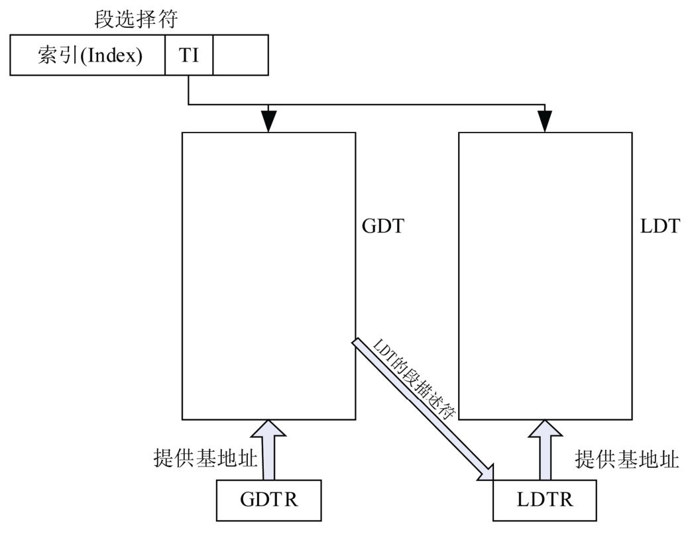

<!-- @import "[TOC]" {cmd="toc" depthFrom=1 depthTo=6 orderedList=false} -->

<!-- code_chunk_output -->

- [ 1 地址空间](#1-地址空间)
  - [ 1.1 物理地址空间](#11-物理地址空间)
  - [ 1.2 线性地址空间](#12-线性地址空间)
- [ 2 地址](#2-地址)
  - [ 2.1 逻辑地址](#21-逻辑地址)
  - [ 2.2 线性地址](#22-线性地址)
  - [ 2.3 物理地址](#23-物理地址)
- [ 3 x86内存管理机制](#3-x86内存管理机制)
  - [ 3.1 分段机制](#31-分段机制)
  - [ 3.2 分页机制](#32-分页机制)
    - [ 3.2.1 页表](#321-页表)
  - [ 3.3 TLB](#33-tlb)
  - [ 3.4 线性地址转换为物理地址的过程](#34-线性地址转换为物理地址的过程)

<!-- /code_chunk_output -->

**内存架构**往往是硬件架构中**最复杂的部分**. 

# 1 地址空间

很多把内存(这里特指安插在主板上的RAM)比作一个大数组, 地址就是这个数组的索引. 类似的, 地址空间则是更大的数组, 它是所有可用资源的集合, 同样, 地址是这个数组的索引. 地址空间可以划分成如下两种类型.

## 1.1 物理地址空间

硬件平台可粗略分为三部分: CPU, 内存和其它硬件设备. 其中, CPU是平台主导者, 从**CPU的角度**来看, **内存**和**其它硬件设备**都是可以使用的**资源**. 这些**资源组合(！！！**)在一起, 分布在**CPU的物理地址空间内(！！！内存只是一部分！！！**). CPU使用**物理地址索引这些资源(！！！**). **物理地址空间的大小**, 由CPU实现的**物理地址位数**决定, **物理地址位数**和**CPU处理数据的能力(即CPU位数**)没有必然关系, 例如**16位的8086 CPU**具有**20位地址空间**.

内存和其它硬件设备分布在物理地址空间中. 假设一个平台, CPU的**物理地址空间为4GB**, 有**512MB内存**, **其它硬件设备的I/O寄存器**被映射到**512MB的I/O地址**内, 则该平台的物理地址空间可能是如图所示划分的.


如图, 512MB内存和I/O地址只占用物理地址空间的一部分, 还有大部分处于空闲. 数组再次显示了它的作用, 有一个4GB大小的数组, 其中1GB的元素具有有效值(512MB内存, 512MB I/O地址), 其它元素不存在.

## 1.2 线性地址空间

**一个平台只有一个物理地址空间**, 但**每个程序**都认为自己**独占整个平台的硬件资源**, 为让多个程序能够有效地相互隔离和使用物理地址空间的资源, 线性地址空间概念被引入. 和物理地址空间一样, 线性地址空间大小取决于CPU实现的线性地址位数, 例如实现了32位线性地址的CPU具有4GB大小的线性地址空间. 需要注意, 线性地址空间大小和物理地址空间大小没有必然关系. 例如Intel的PAE平台就具有4GB的线性地址空间, 64GB的物理地址空间.

线性地址空间会被映射到物理地址空间某一部分或整个物理地址空间. CPU负责将线性地址转换成物理地址, 使程序能正确访问到该线性地址空间所映射的物理地址空间. **一个平台**可以有**多个线性地址空间**, 在现代操作系统中, 每个进程都拥有自己的私有线性地址空间. 一个典型的线性地址空间如图.


# 2 地址

地址是访问地址空间的索引. 根据访问地址的不同, 索引可以分为线性地址和物理地址. 但由于x86特殊的段机制, 还有一个额外的地址, 逻辑地址.

## 2.1 逻辑地址

该地址即程序直接使用的地址(x86架构无法禁用段机制, 逻辑地址一直存在). 例如

```c
int a = 1;
int *p = &a;
```

这里, 指针变量p存储的就是一个逻辑地址. **逻辑地址**由一个**16位的段选择符**和一个**32位的偏移量(32位平台**)构成. 逻辑地址的转换过程在后面介绍. 在上面例子中, 指针变量p实际上存储逻辑地址的偏移部分, 该偏移对应的段选择符位于段寄存器中, 并没有在程序中反映出来.

## 2.2 线性地址

又称虚拟地址. **线性地址**是**逻辑地址转换后的结果**, 用于**索引线性地址空间**. 当CPU使用分页机制时, 线性地址必须转换成物理地址才能访问平台内存或硬件设备; 当分页机制未启用时, 线性地址等于物理地址.

## 2.3 物理地址

该地址索引物理地址空间, 是CPU提交到总线用于访问平台内存和硬件设备的最终地址. 它和上面两个地址有如下关系.

(1) 分段机制启用, 分页未启用: 逻辑地址->线性地址=物理地址

(2) 分段 分页机制同时启用: 逻辑地址->线性地址->物理地址

有些资料还有"总线地址"的提法, 因为**给设备寄存器分配的物理地址(！！！**)和**寄存器在设备上的地址(！！！**)是不同的(通常**设备的寄存器**都**认为自己是从地址0开始**的), 两者存在一个**映射关系**, 由设**备的电子线路负责转换并对CPU透明(！！！**). 由于**CPU用于访问设备的物理地址(！！！**)是**设备寄存器展现给总线的地址**, 所以在x86下有时称**物理地址为总线地址**.

# 3 x86内存管理机制

x86架构的内存管理机制分为两部分：分段机制和分页机制。

分段机制为程序提供彼此隔离的代码区域、数据区域、栈区域，从而避免了同一个处理器上运行的多个程序互相影响。

分页机制实现了传统的按需分页、虚拟内存机制，可以将程序的执行环境按需映射到物理内存。此外，分页机制还可以用于提供多任务的隔离。

分段机制和分页机制都可以通过配置支持简单的单任务系统、多任务系统或共享内存的多处理器系统。需要强调的一点是，处理器无论在何种运行模式下都不可以禁止分段机制，但是分页机制却是可选选项。

## 3.1 分段机制

分段是一种简单的内存管理机制, 它将内存划分成以起始地址(Base)和长度(Limit)描述的块, 这些内存块就称为"段". 段可以与程序最基本的元素联系起来, 例如程序可以简单的分为代码段、数据段和栈, 段机制中就有对应的代码段、数据段和栈段。

**分段机制**由**4个基本部分**组成: **逻辑地址**、**段选择寄存器**、**段描述符**和**段描述符表**。

其**核心思想**是: 使用**段描述符**描述段的基地址、长度以及各种属性(例如**读写属性**、**访问权限**). 当程序使用**逻辑地址**访问内存的某个部分时, CPU通过逻辑地址中的**段选择符**索引**段描述符表**以得到该内存对应的**段描述符**, 并检测程序的访问是否合法, 合法的话, 根据**段描述符中的基地址**将逻辑地址转换为线性地址.


(1）段选择符（Segment Selector）

**段选择符**是**逻辑地址**的一个组成部分，用于**索引段描述符表**以获得该段对应的段描述符。段选择符存放于段选择寄存器中，共16位，结构如图1-4所示。

图1-4 段选择符的结构


各字段的含义如下。

- 索引（Index）：段描述符表的索引。
- TI：指明索引哪个段描述符表。当 TI=0 时，表示索引全局段描述符表（Global Descriptor Table，下面简称为GDT）；当TI=1时，表示索引本地段描述符表（Local Descriptor Table，下面简称为LDT）。
- RPL：Requested Privilege Level的简称，即所要求的权限级别。RPL存在于段选择寄存器的0、1位，为程序访问段时增加一级检查。

段选择符作为逻辑地址的一部分，对应用程序是可见的。但是，正如前面在逻辑地址中介绍的，**应用程序**中**只存储**和使用逻辑地址的**偏移部分**，**段描述符**的**修改和分配**由**连接器和加载器**完成。

为了使CPU能够快速地获得段选择符，x86架构提供了6个段寄存器存放当前程序中各个段的段选择符。这6个段寄存器分别如下。

- CS（Code\-Segment，代码段）：存放代码段的段选择符。
- DS（Data\-Segment，数据段）：存放数据段的段选择符。
- SS（Stack\-Segment，栈段）：存放栈的段选择符。
- ES、FS、GS：可以存放额外三个数据段的段选择符，由程序自由使用。

由于段选择符是用来索引段描述符表访问段描述符的，为了**加速段描述符的访问**，x86 在段寄存器后增加了一个程序**不可见的段描述符寄存器**。当**段寄存器**被加载到一个**新的段选择符**后，CPU自动将**该段选择符索引的段描述符**加载到这个**不可见的段描述符寄存器**中。这6个段寄存器的构造如图1-5所示。

图1-5 段寄存器的构造:


(2）段描述符（Segment Descriptor）。

段描述符描述某个段的基地址、长度以及各种属性（例如，读/写属性、访问权限等）。这是分段机制的核心思想。

段描述符的结构如图1-6所示。

图1-6 段描述符的结构


有关段描述符的详细解释，可查阅 Intel® 64 and IA-32 Architectures Software Developer’s Manual Volume 3A一书中3.4.5节的内容（附下载网址：http://www.intel.com/Assets/PDF/manual/253668.pdf ）。在此，我们只详细介绍其中的Base字段、Limit字段和DPL字段。

- Base字段描述了该段的基地址。
- Limit字段描述了该段的长度。
- DPL字段指明描述符权限级别，表示该段所具有的权限。它表示代码访问此段所需要的最低权限。

当CPU通过一个逻辑地址的段选择符获得该段对应的段描述符后，会使用段描述符中各种属性字段对访问进行检查，一旦确认访问合法，CPU将段描述符中的32位基地址和程序中逻辑地址的32位偏移量相加。至此，CPU便获得了逻辑地址所对应的线性地址。

正如前面所讲，x86 在段寄存器后增加了一个程序不可见的段描述符寄存器，每当段寄存器被加载入一个新的段选择符后，CPU自动将该段选择符索引的段描述符加载到这个不可见的段描述符寄存器中。也就是说，CPU只有在更新段寄存器时才索引段描述符表。

(3）段描述符表。

在前面介绍段选择符的结构时，我们了解到段选择符中的 TI 字段用于指明索引哪个段描述符表。TI字段的必要性源于x86架构提供了两种段描述符表—GDT和LDT。

系统中至少有一个 GDT 可以被所有的进程访问。与此同时，系统中可以有一个或多个LDT，可以被某个进程私有，也可以被多个进程共享。

- GDT是内存中的一个数据结构。简单地讲，可以将GDT看成是一个数组，由基地址（Base）和长度（Limit）描述。
- LDT 是一个段，需要用一个段描述符来描述。LDT 的段描述符存放在GDT中，当系统中有多个LDT时，GDT中必须有对应数量的段描述符。

为了加速对GDT和LDT的访问，x86架构提供了GDTR寄存器和LDTR寄存器。关于这两种寄存器的具体描述如下。

- GDTR：包括一个32位的基地址（Base）和一个16位的长度（Limit）。
- LDTR：结构与段寄存器相同（同样包含对程序不可见的段描述符寄存器）。

通过使用LGDT/SGDT指令对GDTR进行读取/存储；通过使用LLDT/SLDT对LDTR进行读取/存储。在进行进程切换时，LDTR的值会被换成新进程对应的LDT的段描述符。

通过段选择符索引GDT/LDT的过程如图1-7所示。

图1-7 通过段选择符索引段描述符表



(4) 逻辑地址转换总结

假设程序中某条语句访问了数据段, 例如:

```c
int a = 100; //全局变量
int func(){
    int b;
    b = a;
}
```

程序从加载到变量a的逻辑地址转换为线性地址过程如下.

1. 程序加载

⓵ 通过**该进程LDT的段选择符！！！**索引**GDT**, 获得LDT的段描述符, 被加载到LDTR寄存器中.

⓶ 该进程的CS、DS、SS被加载到了相应的段选择符. 同时, CPU根据段选择符的TI字段, 索引GDT/LDT, 获得相应的段描述符并加载到CS、DS、SS对应的不可见部分.

2. 程序执行到b=a, 需要从a所在的内存中取值, 必须先把a的逻辑地址转换成线性地址,

⓵ 进行必要的属性、访问权限检查

⓶ 从DS对应的段描述符寄存器获得该段的基地址

⓷ 将变量a的32位偏移量和描述符中的基地址相加, 获得变量a的线性地址.

## 3.2 分页机制

分页是更加粒度化的内存管理机制, 分页是用粒度化的单位"页"来管理线性地址空间和物理地址空间. x86下一个典型的页大小是4KB, 则一个4GB的**虚拟地址空间**可以**划分为1024X1024个页面**. **物理地址空间的划分同理**. x86允许大于4KB的页面大小, 这里只介绍4KB页面.

同时, **分页机制**让操作系统中的**虚拟内存机制**称为可能. **一个页面**可以存在于**物理内存(！！！**)中, 也可以存放在**磁盘的交换区域！！！**(如**Linux下的Swap分区！！！**, **Windows的虚拟内存文件！！！**)中, 程序可以使用比机器**物理内存更大的内存区域！！！**.

分页机制的核心思想是通过**页表**将**线性地址转换为物理地址**, 并配合**旁路转换缓冲区(Translation Lookaside Buffer, TLB！！！**)来加速地址转换过程. **操作系统**在**启动过程**中, 通过将**CR0寄存器**的**PG位置1**来启动**分页机制**. 


从图中看到, 分页机制主要由页表、CR3和TLB三个部件构成. 下面以4KB页面的32位分页为例进行讲解.

### 3.2.1 页表

**页表(Page Table**)是用于将**线性地址转换成物理地址**的主要数据结构. **一个地址对齐到页边界(！！！**)后的值称为**页帧号**, 它实际是**该地址所在页面的基地址**. **线性地址对应的页帧号！！！**即**虚拟页帧号(Virtual Frame Number, VFN！！！**), **物理地址对应的页帧号！！！**即**物理页帧号(Physical Frame Number, PFN！！！**)或**机器页帧号(Machine Frame Number**). 页表就是存储VFN到PFN映射的数据结构。

4KB的32位分页使用两级页表, 如图.


⓵ **页目录项(Page Directory Entry**): 包含**页表的物理地址(！！！不是线性地址！！！**). **页目录项**存放在**页目录(Page Directory, 也称为页目录表PDT！！！**)中, CPU使用线性地址的22\~31位(高10位)索引页目录, 以获得该线性地址对应的页目录项. 每个页目录项为4B大小, 故页目录占用4KB大小的物理页面, 共包含1024的页目录项.

⓶ 页表项(Page Table Entry): 页表项包含**该线性地址对应的PFN(！！！物理地址页帧号！！！**)。**页表项**存放在**页表(Page Table**)中, CPU使用线性地址的**12\~21位**索引页表, 获得该**线性地址**对应的**页表项**. 通过将**线性地址**的**0\~11位**偏移量和**基地址**相加, 就可以得到线性地址对应的物理地址. 页表项为4B大小, 故页表包含1024个页表项, 占用一个4KB页面.


图2\-9显示了页目录项、页表项的构成, 通过其中的各个字段, 可以对页面访问权限, 缓存机制, 全局页等属性进行控制. 这里只关注P(Present)字段, 该字段使虚拟内存的实现成为可能. P根据其值不同, 可以代表两种情况:

1. P=1: 物理页面存在于物理内存中, CPU完成地址转换后, 可以直接访问该页面.

2. P=0: **页面不在物理内存**中, 当CPU访问该页面时会产生一个**缺页错误(Page Fault**)并交由**操作系统**的**缺页错误处理程序处理**. 通常**操作系统**会将**存放在磁盘上的页面(！！！**)调入**物理内存**, 使访问可以继续. **P=0**时, **页目录项**、**页表项格式**变成图2-10中的格式。此时**1\~31位**供操作系统使用以记录物理页面在磁盘上的信息, 通常是**物理页面在磁盘上的位置！！！**.


CPU在**索引页目录**前, 必须知道**页目录所在的物理地址**, 该**物理地址**存放在**CR3(Control Register 3)寄存器**中, 也称为**页目录基地址寄存器(Page\-directory base register, PDBR**). 一个**进程在运行前(！！！**), 必须将**其页目录的基地址存入CR3**. 页目录的基地址必须**对齐到4K边界**.

## 3.3 TLB

为提高地址转换效率, x86架构使用TLB对最近用到的页面映射进行缓存, 当CPU访问某个线性地址, 其所在页面的映射存在于TLB中, 无须查找页表即可进行地址转换. 注意, 很多资料说TLB存放的是线性地址到物理地址的转换, 准确来说应该是: **VFN到PFN的转换！！！**. 即, **CPU从TLB**获得一个**线性地址对应的PFN**后, 仍然要**和线性地址的偏移相加**, 才能得到**最后的物理地址**, 而**非直接从TLB中获取物理地址**.

TLB作为缓存, 其能存放的映射条目有限, 当TLB中没有空闲条目可用时, 替换哪一个旧条目由CPU决定.

**TLB**也有**缓存一致性**的问题，这主要是指**TLB中的映射条目(！！！**)和**页表中的映射条目(！！！**)的一致性。当**操作系统**对**页表进行修改**，要**负责对TLB中对应条目或整个TLB进行刷新(！！！**)。从**软件的角度**来看, x86提供了**两种方式刷新TLB**:

⓵ **更新CR3**: 此操作可以**导致TLB被整体刷新**, TLB中**所有映射条目失效**(**全局TLB除外**). 操作系统将**当前CR3中的值**重新写会**CR3**以**刷新整个TLB**. 进程切换时, 新进程的页目录基地址会写入CR3而使老进程在TLB中的条目失效.

⓶ INVLPG指令: 这是一种更细粒度的刷新, **操作系统**用它对**TLB**中**单独的页目录项**、**页表项**进行刷新. 这通常是在**操作系统修改页表**后进行的(例如**分配/释放页面！！！**).

## 3.4 线性地址转换为物理地址的过程

⓵ CPU访问一个线性地址, 映射在TLB中跳到⓺. 如映射不存在于TLB中, 称为TLB Miss发生, 进行下一步.

⓶ **查找页表**, **页面在物理内存！！！**中跳到⓸, 不会再进行下一步.

⓷ 操作系统的缺页处理函数接管, 通常进行如下操作: a)将页面从磁盘复制到物理内存中; b)更改对应页表项, 设置P为1, 并对其他字段相应设置; c)**刷新TLB中对应的页表项**; d)从缺页错误处理函数中返回.

⓸ 到这一步, **页面**已经存在于**物理内存**中, 并且**页表**已经**包含了该映射**. 此时, 重新执行引发TLB Miss的指令.

⓹ **TLB Miss再次发生(！！！**), **CPU重新查页表**, 把**相应的映射插入到TLB**中.

⓺ 到这一步, **TLB**已经包含了**该线性地址对应的PFN**. 通过将**线性地址**中的**偏移部分和PFN相加**, 就得到了**对应的物理地址**.
