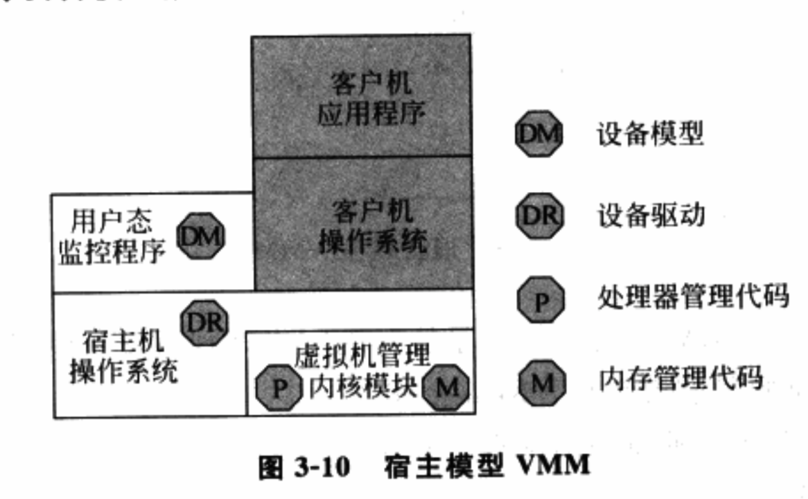

<!-- @import "[TOC]" {cmd="toc" depthFrom=1 depthTo=6 orderedList=false} -->

<!-- code_chunk_output -->

* [1 按虚拟平台分类](#1-按虚拟平台分类)
	* [1.1 完全虚拟化](#11-完全虚拟化)
		* [1.1.1 软件辅助的完全虚拟化](#111-软件辅助的完全虚拟化)
			* [1.1.1.1 优先级压缩(Ring Compression)](#1111-优先级压缩ring-compression)
			* [1.1.1.2 二进制代码翻译(Binary Translation)](#1112-二进制代码翻译binary-translation)
		* [1.1.2 硬件辅助完全虚拟化](#112-硬件辅助完全虚拟化)
	* [1.2 类虚拟化](#12-类虚拟化)
* [2 按VMM实现结构分类](#2-按vmm实现结构分类)
	* [2.1 Hypervisor模型](#21-hypervisor模型)
	* [2.2 宿主模型](#22-宿主模型)
	* [2.3 混合模型](#23-混合模型)

<!-- /code_chunk_output -->

# 1 按虚拟平台分类

根据**VMM提供的虚拟平台类**型可将VMM分成两类: 

第一类VMM虚拟的是**现实存在的平台**, 并且在**客户机操作系统**来看, **虚拟的平台**和**现实的平台是一样**的, **客户机操作系统**察觉不到是运行在一个虚拟平台上. 这样的虚拟平台可以运行现有的操作系统, **无须对操作系统进行修改**, 因此称为**完全虚拟化**(Full Virtualization). 

第二类VMM虚拟的是**现实中不存在的平台**, 而是经过**VMM重新定义**的, 这种虚拟化平台需要对所运行的**客户机操作系统**进行或多或少的**修改**使之适应虚拟环境, 因此**客户机OS知道其运行在虚拟平台**上, 并且会去主动适应. 这种称为类虚拟化(Para Virtualization). 

另外, 一个VMM既可以提供完全的虚拟化的虚拟平台, 又提供类虚拟化的虚拟平台.

## 1.1 完全虚拟化

客户OS无须修改就可以运行. 所以客户OS会像操作正常的处理器、内存、I/O设备一样来操作虚拟处理器、虚拟内存和虚拟I/O设备。从实现角度看, **客户机的行为**是通过**指令**反映出来的, 因此VMM需要能**正确处理所有可能的命令！！！**. 

对于完全虚拟化来说, **所有可能的指令**是指所虚拟的处理器其**手册规范**上定义的**所有指令**.

实现上, 以x86架构为例, **完全虚拟化**经历了两个阶段: **软件辅助的完全虚拟化**和**硬件辅助的完全虚拟化**

### 1.1.1 软件辅助的完全虚拟化

**x86虚拟化**技术早期, x86体系**没有在硬件层次！！！上对虚拟化提供支持**, 因此完全虚拟化只能通过**软件实现**. 

一个典型做法是**优先级压缩(Ring Compression**)和**二进制代码翻译(Binary Translation**)相结合.

#### 1.1.1.1 优先级压缩(Ring Compression)

**优先级压缩**的原理是: 由于**VMM**和**客户机**运行在**不同特权级**上, 对应到**x86**上, 通常是**VMM运行在Ring 0**, **客户机OS内核**运行在**Ring 1**, **客户机OS应用程序**运行在**Ring 3**. 当**客户机OS内核**执行**相关特权指令**时, 由于在**非特权的Ring 1**, 因此通常**触发异常**, **VMM截获**该**特权指令**并进行**虚拟化**. 

**Ring Compression**能正确处理**大部分特权指令**, 但是由于**x86指令体系**在**设计之初**并**没有考虑到虚拟化**, 因此**有些指令**还是**不能通过Ring Compression正常处理**, 即在**Ring 1做特权操作**的时候却**没有触发异常(比如修改EFLAGES的IF标志**), 从而VMM不能截获并做相应处理. 

#### 1.1.1.2 二进制代码翻译(Binary Translation)

**二进制代码翻译方法**因此被引入来处理这些**虚拟化不友好的指令**. 

二进制代码翻译的思想很简单, 就是通过**扫描并修改客户机的二进制代码**, 将**难以虚拟化的指令**转化为**支持虚拟化的指令**. 

**VMM**通常会对**OS**的**二进制代码进行扫描**, 一旦发现**需要处理的指令**, 就将其翻译成**支持虚拟化的指令块(Cache Block**). 这些**指令块**可以与VMM合作**访问受限的虚拟资源！！！**, 或**显式地触发异常！！！** 让VMM进一步处理. 

此外, 由于**该技术可以修改客户机的二进制代码**, 因此别广泛应用于**性能优化！！！**, 即将某些**造成性能瓶颈的指令**替换成**更高效的指令**来提高性能.

这种方式很难**在架构上保证其完整性**, 因此, x86在硬件上加入了对虚拟化的支持, 从而在硬件架构上实现了虚拟化.

### 1.1.2 硬件辅助完全虚拟化

很多问题, 如果在**本身的层次**上难以解决, 那通过**增加一个层次**, 在**其下面一个层次**就会变得容易解决. 

硬件辅助虚拟化就是这样一种方式, 既然OS是硬件上最后一层系统软件, 如果**硬件本身加入足够的虚拟化功能**, 就可以**截获操作系统对敏感指令的执行**或**对敏感资源的访问**, 从而通过异常方式报告给VMM, 这就解决了虚拟化的问题. 

Intel的VT\-x技术就是这样. VT\-x在处理器上**新引入了一个新的执行模式**用于**运行虚拟机**. 当虚拟机执行在这个特殊模式中时, 它仍然面对的是**一套完整的处理器寄存器集合和执行环境**, 只是对任何特权操作都会被处理器截获并报告给VMM. VMM本身运行在正常模式下, 在接收到处理器的报告后, 通过对目标指令的解码, 找到对应的虚拟化模块进行模拟, 并把最终的效果反映在特殊模式下的环境中.

硬件辅助虚拟化是一种完备的虚拟化方法, 因为内存和外设的访问本身也是由指令来承载, 对处理器指令级别的截获意味VMM可以模拟一个与真实主机完全一样的环境. 

## 1.2 类虚拟化

通过在**源代码级别修改指令**以**回避虚拟化漏洞的方式**来使VMM能够对物理资源实现虚拟化. 

x86的难以虚拟化的指令, 完全虚拟化通过Binary Translation在二进制代码级别上避免虚拟化漏洞. 类虚拟化采用另一种思路, 即修改操作系统的内核(即API级), 使得操作系统内核完全避免这些难以虚拟化的指令. 操作系统通常会用到处理器提供的所有功能, 例如特权级别、地址空间和控制寄存器等. 类虚拟化首先解决的问题就是如何插入VMM. 典型做法是修改操作系统的处理器相关代码, 让操作系统主动让出特权级别, 而运行在次一级特权级. 这样, 当操作系统试图执行特权指令时, 保护异常被触发, 从而提供截获点给VMM来模拟.

既然内核代码需要被修改, 类虚拟化可以进一步用来**优化I/O**. 即, **类虚拟化不是去模拟真实设备**, 因为太多寄存器模拟会影响性能. 相反, 类虚拟化可以定义出高度优化的I/O协议. 这种I/O协议**完全基于事务**, 可以达到近物理机的速度.

# 2 按VMM实现结构分类

## 2.1 Hypervisor模型

在Hypervisor模型中, **VMM**首先可被看作是一个**完备的操作系统！！！**, 不过和传统OS不同, **VMM为虚拟化而设计**的, 因此还**具备虚拟化功能**. 

从架构看, 

- 首先, **所有物理资源**如处理器、内存和I/O设备都归**VMM所有**, 因此, **VMM管理物理资源**; 

- 其次, VMM需要**向上提供虚拟机**用于**运行客户操作系统**, 因此, **VMM负责虚拟环境的创建和管理**.

图3\-9展示了Hypervisor的架构, 其中

- **处理器管理代码**(Processor, P)负责**物理处理器的管理和虚拟化！！！**, 
- **内存管理代码**(Memory, M)负责**物理内存的管理和虚拟化！！！**, 
- **设备模型**(Device Model, DM)负责**I/O设备的虚拟化**, 
- **设备驱动**(Device Driver, DR)负责**I/O设备的驱动**, 即**物理设备的管理**. 

VMM直接管理所有物理资源, 包括处理器、内存和I/O设备, 所以**设备驱动**也是**VMM的一部分**. 此外, **处理器管理代码**、**内存管理代码**和**设备模型**也是**VMM的一部分**.

由于VMM同时具备**物理资源的管理功能**和**虚拟化功能**, 所以, 物理资源虚拟化效率更高. 安全层面, **虚拟机的安全只依赖VMM的安全**. 宿主模型中同时依赖VMM和宿主机OS的安全.

Hypervisor模型拥有虚拟化高效率同时也有缺点. 由于VMM完全拥有物理资源, 因此, VMM需要进行**物理资源的管理**, 包括**设备的驱动**. 设备驱动工作量很大, 所以基于Hypervisor模型的VMM通常根据市场定位, **选择一些I/O设备来支持**, 而**不是所有**. 此外, 很多功能必须在VMM中**重新实现**, 例如**调度和电源管理等**, 无法像宿主模型那样借助宿主机OS.

## 2.2 宿主模型

**物理资源**由**宿主机OS管理**. **宿主机OS**并**不是为虚拟化设计**的, 因此本身不具备虚拟化功能, 有些实现中还包括**用户态进程**, 如负责I/O虚拟化的用户态设备模型. **VMM**通过调用**宿主机OS**的服务来**获得资源**, 实现处理器、内存和I/O设备的虚拟化。VMM创建虚拟机后, 通常将宿主机作为宿主机OS的一个进程参与调度.

图3\-10显示宿主模型架构. **宿主机OS**拥有**所有物理资源**, 包括I/O设备, 所以**设备驱动位于宿主机操作系统**中. VMM(图中**虚拟机管理内核模块**)则包含**处理器虚拟化模块**和**内存虚拟化模块**. 图中**设备模型**实际也是VMM一部分, 具体实现中, 可将**设备模型放在用户态**, 也可放在**内核态**.

宿主模型的优缺点和Hypervisor模型恰好相反. **宿主模型**最大优点是能充分利用**现有OS的设备驱动程序**, VMM无须为各类I/O设备重新实现驱动程序, 可以专注于物理资源的虚拟化. 此外, 宿主模型也可利用宿主机OS的其它功能, 例如调度和电源管理等, 这都不需要VMM重新实现.

缺点. 

- **VMM**调用**宿主机OS**的服务**获取资源进行虚拟化**, 系统服务设计之初没考虑虚拟化支持, 效率和功能有影响. 
- **安全**, 虚拟机的安全同时依赖**VMM和宿主机OS的安全**.

## 2.3 混合模型

VMM仍然在最底层, 拥有所有物理资源. 与Hypervisor不同的是, VMM会主动让出大部分I/O设备的控制权, 将他们交给一个运行在特权虚拟机中的特权操作系统来控制. 相应, VMM虚拟化的职责也被分担. 处理器和内存的虚拟化仍然是VMM完成, 而I/O虚拟化由VMM和特权操作系统共同合作完成.

图3\-11显示混合模型. I/O设备由特权操作系统控制, 因此, 设备驱动模块位于特权操作系统中. 其它物理资源的管理和虚拟化由VMM完成, 因此, 处理器管理代码和内存管理代码在VMM中.

I/O设备的虚拟化由VMM和特权操作系统共同完成, 因此, 设备模型模块位于特权操作系统中, 并且通过相应的通信机制与VMM合作.

混合模型集中了上面两种模型的优点. VMM既可利用现有OS的I/O设备驱动. VMM直接控制处理器、内存等物理资源， 虚拟化效率比较高。安全性上, 对特权OS的权限控制得当, 虚拟机安全性只依赖VMM.

缺点. 特权OS运行在虚拟机上, 当需要特权OS提供服务时, VMM需要切换, 产生上下文切换开销. 切换频繁时, 上下文切换开销会造成性能的明显下降. 出于性能考虑, 很多功能还是必须在VMM中实现, 无法借助特权OS, 如调度程序和电源管理等.

