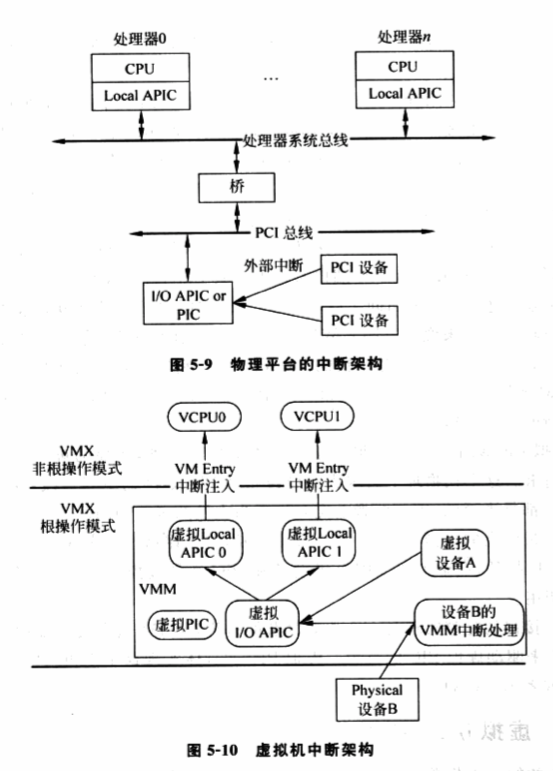

# 1 概述

物理平台, 外部中断流程如图5\-9. 首先, I/O设备通过中断控制器(I/O APIC或PIC)发出中断请求, 中断请求经由PCI总线发送到系统总线上, 最后目标CPU的Local APIC部件接收中断, CPU开始处理中断.

虚拟化环境中, VMM也需要为客户机OS展现一个与物理中断架构类似的虚拟中断架构. 图5\-10展现虚拟机中断架构. 和物理平台一样, **每个VCPU**都对应**一个虚拟Local APIC**用于**接收中断**. **虚拟平台**也包含**虚拟I/O APIC**或**虚拟PIC**用于**发送中断**. 和VCPU一样, **虚拟Local APIC**、**虚拟I/O APIC**和**虚拟PIC**都是**VMM维护的软件实体**。当**虚拟设备**需要**发送中断**时, **虚拟设备**会**调用虚拟I/O APIC的接口发送中断**. 虚拟I/O APIC根据中断请求, 挑选出相应的虚拟Local APIC, 调用其接口发送中断请求. 虚拟Local APIC进一步利用VT\-x的事件注入机制将中断注入到相应的VCPU.

可见, 中断虚拟化的主要任务是实现图5\-10描述的虚拟中断架构, 具体包括**虚拟PIC**、**虚拟I/O APIC**和**虚拟Local APIC**, 并实现**中断的生成**、**采集**和**注入**的**整个过程**.

此外, PCI/PCIe设备还支持另一种中断方式MSI, MSI可以允许设备直接发送中断到Local APIC, 不需要经过中断控制器(I/O APIC). MSI虚拟化原理和本节描述的原理类似. 感兴趣, 可以进一步参考PCI/PCIe规范中关于MSI描述, 以及IA32手册9.11节MESSAGE SIGNALLED INTERRUPTS的相关内容.

# 2 虚拟PIC

PIC本质是芯片组的一个设备. 因此, 虚拟PIC的实现, 根据PIC硬件规范, 在软件上模拟出虚拟PIC, 为虚拟机提供和物理PIC一样的接口.

虚拟PIC首先要虚拟出和物理PIC一样的软件接口. PIC为软件提供了如下接口用于操作PIC. 4个初始化命令字(Initialization Command Words): ICW1\~4, 用于初始化操作; 3个操作命令字(Operation Command Words): OCW1\~3, 用于操作PIC.

在IA32平台上, PIC的ICW1\~4和OCW1\~3都是通过I/O端口访问的. 因此, VT\-x下, VMM很容易就可以实现这些接口的虚拟化. 具体而言, 这些接口是通过**I/O端口0x20/0x21以及0xA0/0xA1**来访问, 因此, **VMM**可以设置**VMCS的I/O bitmap**中的**相应位**, 使得**客户机为访问这些端口**时发生**VM\-Exit**, 便于VMM截获.

VMM在截获这些接口访问后, 下一步就是按PIC硬件规范对这些接口的定义, 实现相应的逻辑. 举例, 接口OCW1的功能用于操作IMR寄存器, 控制指定中断是否被屏蔽. 因此, VMM会分析客户机的OCW1命令, 判断是对哪个中断进行屏蔽或解除屏蔽, VMM继而在**内部逻辑**中**记录指定中断是否被屏蔽**. 若被屏蔽, 相应的虚拟中断就不会被提交.

此外, **虚拟PIC**还要**为虚拟设备提供接口**用于发送中断请求. 这在物理上表现为**I/O设备**和**PIC**之间的电气连线, 在虚拟环境中由于设备和PIC都是虚拟的, 因而两者的交互表现为**直接的函数调用**.

**虚拟PIC**最终会向**虚拟Local APIC**提交中断, 这在**物理**上表现为**PIC和CPU之间的电气连线**. 同样, 在**虚拟环境**中由于设备和PIC都是虚拟的, 因而两者交互表现为**直接的函数调用**.

虚拟PIC接口的完整实现很复杂, VMM通常会为虚拟PIC维护一个内部的状态机来驱动虚拟PIC的行为. 虚拟PIC具体实现可参照KVM/Xen实现.

# 3 虚拟I/O APIC

PIC值适用于单CPU系统, 对于**多CPU**, 必须通过**I/O APIC来发送中断**. 因此, 对于**多CPU虚拟平台**, 必须实现**虚拟I/O APIC**.

和**虚拟PIC的实现**类似, **虚拟I/O APIC**在**VMM**中也是**一个虚拟设备！！！**. VMM根据其硬件规范来实现虚拟设备. **Intel ICH系列Datasheet**定义了**I/O APIC的软件接口**.

和PIC类似, 虚拟I/O APIC也会根据硬件规范实现相应的接口内部逻辑, 也会为虚拟设备提供接口用来发送中断请求. 虚拟I/O APIC最后也是通过虚拟Local APIC的接口来提交中断.

OS通过**MMIO方式**访问**I/O APIC**, 因此, VMM的实现和虚拟PIC有所不同. VMM会将虚**拟IO APIC的MMIO**地址**对应的页表项**置为"**该页不存在**", 因此, 当**客户机**访问**相应的MMIO寄存器**时, 就会发生原因为Page Fault的VM\-Exit. 这样, VMM就能**截获客户机对虚拟I/O APIC的访问**, 进而正确地虚拟化.

虚拟I/O APIC的具体实现可参考KVM或XEN的实现.

# 4 虚拟Local APIC

Local APIC是CPU上一个内部部件, 负责外部中断. 此外, 还提供了产生中断的