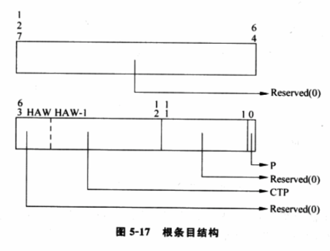
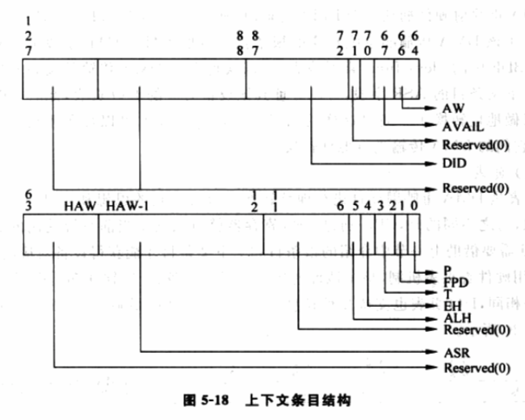

# 1 概述

**软件虚拟化**章节使用**软件**方式实现**I/O虚拟化**, 目前流行的"**设备模拟**"和"**类虚拟化**"都有各自的优点, 以及与生俱来的缺点. **前者通用性强**, 但**性能不理想**; 后者**性能不错**, 却**不通用**. Intel的**VT\-d**技术(Intel(R) Virtualization Technology for Directed I/O), 以帮助实现**通用性强**、**性能高**的**新型I/O虚拟化技术**.

介绍VT\-d之前, 先量化评价**I/O虚拟化的两个指标** \-\- **性能**和**通用性**. 性能, 越接近**无虚拟环境的I/O性**能越好; 通用性主要和**完全虚拟化**挂钩, 使用的**I/O虚拟化**技术对**客户机OS越透明**(客户机OS感知不到I/O虚拟化技术), 通用性越强. 

VT\-d如何实现这两个指标呢? 

- 对于**高性能**, 最直接方法就是让**客户机直接使用真实的硬件设备**, 这样**客户机的I/O路径**几乎和**无虚拟化的I/O路径相同**; 
- 对于**通用性**, 就得用**全虚拟化方法**, 让**客户机OS**能使用**自带驱动发现设备！！！、操作设备！！！**。

实现这些目标面临的挑战.

对于**高性能**, **客户机直接操作设备**的挑战:

⓵ 如何让**客户机直接**访问**设备真实的I/O地址空间**(包括**MMIO**和**端口IO**)

⓶ 如何让**设备的DMA操作直接访问到客户机的内存空间**? 设备不关心系统中运行的是虚拟机还是真实OS, 它只用**驱动**给提供的**物理地址做DMA**.

**通用性**面临的问题和⓵类似, 要有一种方法将**设备的I/O地址空间！！！**告诉给**客户机OS！！！**, 并让**驱动！！！**能够利用**这些地址！！！**访问到**真实的I/O地址空间！！！**.

**VT\-x！！！**已经能够解决**第一个问题**, 可以允许**客户机直接访问物理的I/O空间！！！**. 

**VT\-d**让**第二个问题**解决成为可能, 它提供了**DMA重映射技术！！！**, 帮助VMM的实现者达成目标.

VT\-d通过在**北桥(MCH**)引入**DMA重映射硬件**, 以提供**设备重映射**和**设备直接分配**的功能. 在启用VT\-d的平台上, **设备的所有DMA传输！！！**都会被**DMA重映射硬件截获！！！**. 根据**设备对应的I/O页表！！！**, **硬件**可以对**DMA中的地址进行转换！！！**, 使设备**只能访问到规定的内存！！！**. 

使用VT\-d后, 设备访问内存的架构如图5\-16所示.

图5\-16(a)是**没有VT\-d**的平台, 此时**设备的DMA**能够访问**整个物理内存**. (b)是**启用VT\-d**的情况, 此时, 设备**只能访问指定的物理内存**. 这和使用页表将进程的线性地址空间映射到指定物理内存区域的思想一样, 不过对象换成了设备. 

下面介绍VT\-d中核心的**DMA重映射技术**以及**如何探测DMA重映射硬件**, **设备分配**内容在6.7介绍. VT\-d技术较复杂, 限于篇幅, 只能对主要技术进行介绍, 完整的论述参考"**Intel(R) Virtualization Technology for Directed I/O Architecture Specification**".

# 2 VT\-d技术

上节提到的诸多难点, 最主要的难题是**DMA问题**. 设备对系统中运行的软件一无所知, 在**进行DMA**时, 设备**唯一**做的是**向(从)驱动程序告知的"物理地址"复制(读取)数据**. 内存虚拟化中可知, **虚拟机环境**下**客户机使用的是GPA**, 则**客户机**的**驱动直接操作设备时也是用GPA！！！**. 而**设备进行DMA**, 需要使用**MPA**, 如何在DMA时将GPA转换成MPA成了关键问题. 通常, 无法通过软件方法截获DMA操作, VT\-d提供的DMA重映射就是为了解决这个问题.

## 2.1 DMA重映射(DMA Remapping)

在第2章提到的PCI总线结构, 通过**BDF！！！**可索引到**任何一条总线上的任何一设备！！！**. 同样, **DMA的总线传输！！！**中包含一个**BDF**以**标识该DMA传输是由哪个设备发起！！！**的. 

在**VT\-d**中, **标识DMA操作发起者！！！**的结构称为**源标识符(Source Identifier！！！**). 对于**PCI总线！！！**, **VT\-d！！！**使用**BDF！！！**作为**源标识符！！！**, 在下面的内容中提到的BDF均代表源标识符. 其格式在第2章给出, 也可参考"Intel(R) Virtualization Technology for Directed I/O Architecture Specification"的3.2.1获取详细内容.

除了BDF, **VT\-d**还提供了**两种数据结构**来**描述PCI架构**, 分别是**根条目(Root Entry**)和**上下文条目(Context Entry**).

⓵ 根条目: 用于**描述PCI总线**, **每条总线！！！对应一个根条目！！！**. 由于PCI架构支持**最多256条总线**, 故最多可以有**256个根条目！！！**. 这些根条目一起构成一张表, 称为**根条目表(Root Entry Table**).  有了根条目表, 系统中**每一条总线都会被描述到！！！**. 图5\-17是根条目的结构.

主要字段如下.

- P: 存在位. 为0条目无效, 来自**该条目所代表总线**的**所有DMA传输被屏蔽！！！**. 为1代表该条目有效.
- CTP(Context Table Pointer, 上下文表指针): 指向**上下文条目表**.

⓶ 上下文条目: 用于描述某个具体的PCI设备, 这里的PCI设备指逻辑设备(见第2章关于BDF中function字段的阐述). 一条PCI总线上最多有256个设备, 故有256个上下文条目, 它们一起组成上下文条目表(Context Entry Table). 通过上下文条目表, 可描述某条PCI总线上所有设备. 图5\-18是上下文条目的结构.

