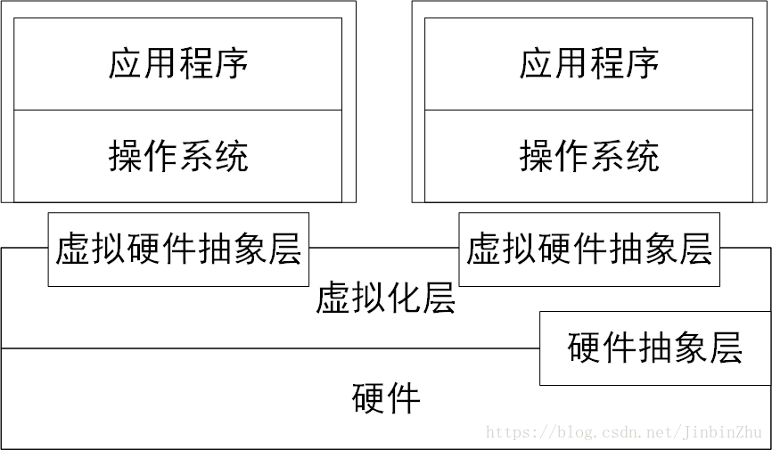

系统虚拟化是指将**一台物理计算机系统**虚拟化为**一台或多台虚拟计算机系统**，**每个虚拟的计算机系统（简称虚拟机**）都拥有自己的**虚拟硬件（如CPU、内存和设备等**），来提供一个**独立的虚拟机执行环境**。这个**虚拟化层**被称为**虚拟机监控器**。

系统虚拟化:

本质上来讲, **虚拟机系统**和**物理机系统**可以是**完全不同的ISA**。例如, 可以在一个x86物理机上运行一个ARM的虚拟机. 但是，**不同的ISA**使得**虚拟机的每一条指令**都需要**在物理机上模拟执行**，从而造成**较大的性能下降**。当然相同体系结构的紫铜

1974年，Popek和Goldberg定义了虚拟机可以看作是物理机的一种高效隔离的复制。该定义蕴含了三层含义（同质、、高效和资源受控）。

同质，虚拟机的运行环境和物理机的环境在本质上需要是相同的，但是在表现上能够有一定的差异。如核数可以不一样，但处理器必须是同一种基本类型。

高效，要求虚拟机中运行的软件接近物理机上直接运行的性能。因此，软件在虚拟机中运行时，大多数的指令是直接运行在硬件上的，只有少量指令需要经过VM处理货模拟。

资源受控，VM对系统资源拥有完全控制能力和管理权限。

