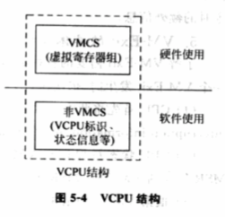
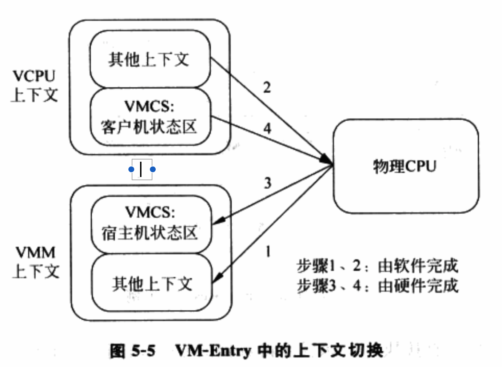

# 1 概述

硬件虚拟化使用VCPU(Virtual CPU)描述符来描述虚拟CPU. VCPU描述符类似操作系统中进程描述符(或进程控制块), 本质是一个**结构体**, 通常由下列几部分构成.

⓵ **VCPU标识信息**: 用于标识VCPU的一些属性, 例如VCPU的ID号, VCPU属于哪个客户机等.

⓶ **虚拟寄存器信息**: 虚拟的寄存器资源, 在使用Intel VT\-x情况下, 这些内容包含在VMCS中, 例如客户机状态域保存的内容.

⓷ **VCPU状态信息**: 类似于进程的状态信息, 标识该VCPU当前所处的状态, 例如睡眠、运行等， 主要供调度器使用。

⓸ **额外寄存器/部件信息**: 主要指未包含在VMCS中的一些寄存器或CPU部件. 例如浮点寄存器和虚拟的LAPIC等.

⓹ **其它信息**: 用于VMM进行优化或存储额外信息的字段, 例如存放该VCPU私有数据的指针等.

Intel VT\-x情况下, VCPU可划分为两个部分, 一个是VMCS为主由**硬件使用和更新**的部分, 主要是**虚拟寄存器**; 一个是除VMCS之外, 由**VMM使用和更新**的部分, 主要指VMCS以外的部分. 图5\-4展示了VCPU的构成.

当VMM创建客户机, 首先为客户机创建VCPU, 整个客户机运行实际上可以看作VMM调度不同的VCPU运行. 下面以VCPU创建 --- 运行 --- 退出为主线, 介绍Intel VT\-x技术的CPU虚拟化的实现.

# 2 VCPU的创建

实质上是创建VCPU描述符, 由于**本质上VCPU描述符是一个结构体**, 因此**创建VCPU描述符**简单来说就是**分配相应大小的内存**. VCPU描述符包含的内容很多, 通常会被组织成多级结构, 例如第一级结构体可以是各个平台通用的内容, 中间包含一个指针指向第二级结构体, 包含平台相关的内容. 对于这样的多级结构, 需要为每一级结构体相应分配内存.

创建之后, 需要进一步初始化才能使用. 物理CPU上电后, 硬件会自动将CPU初始化为特定的状态. VCPU的初始化也是一个类似过程. 通常包含:

⓵ 分配**VCPU标识**: 首先标识**该VCPU属于哪个客户机**, 再为该VCPU分配一个**客户机范围内唯一的标识(！！！**).

⓶ 初始化**虚拟寄存器组**: 主要指出初始化VMCS相关域. 这些寄存器的初始化值通常根据**物理CPU上电后各寄存器的值**设定.

⓷ 初始化**VCPU状态信息**: 被调度前需要配置的必要标志. 具体依据调度器实现决定.

⓸ 初始化额外部件: 将**未被VMCS包含！！！**的**虚拟寄存器**初始化为**物理CPU上电**后的值, 并**配置虚拟LAPIC**等部件.

⓹ 初始化其它信息: 根据VMM的实现初始化**VCPU的私有数据**.

## 2.1 VMCS的创建与初始化

**VMCS分配**时, 只需要分配一块**4KB大小**, 并**对齐到4KB边界的内存**即可. 初始化则需要根据VT\-x的定义, 对前面内容进行初始化, 基本思想就是按照物理CPU初始化的定义, 提供了一个和物理CPU初始化后类似的状态. 此外, 根据**VMM的CPU虚拟化策略**, 设置相应的**VMCS控制位**.

⓵ 客户机状态域: 描述了**VCPU运行时的状态**, 因此, 初始化的取值基本上是参考了**物理CPU初始化后的状态**. 例如, 物理CPU加电后会通过**复位**地址跳转到**BIOS执行**, 那么**Guest RIP字段**可直接设置为**虚拟机Guest BIOS的起始指令地址！！！**.

⓶ 宿主机状态域: **VM\-Exit**时, **CPU切换**到**VMM时寄存器值**, 因此, 初始化值参考**VMM运行时的CPU的状态**. **HOST RIP字段**通常被设置为**VMM中VMX Exit处理函数！！！**(VMX Exit Handler)的入口.

⓷ VM\-Execution控制域: 控制**VCPU运行时的一些行为**, 如执行**某些敏感指令时是否发生VM\-Exit**. 例如IN/OUT指令, 如果VMM允许客户机**直接访问某些I/O端口**, 那么VMM就会将Use I/O bitmaps位置1, 并在I/O bitmap中将相应I/O端口所对应的位置0, 这样, 客户机访问这些I/O端口就不会发生VM\-Exit. 

⓸ VM\-Entry控制域: 主要在**每次VM\-Entry之前设置**, 因此在**VCPU初始化时不需要特别设置**.

⓹ VM\-Exit控制域: 这个状态域有**两个字段**VMM通常会设置, 一个是**Acknowledge interrupt on exit**, 有助于**更快响应外部中断**; 另一个是**Host Address Space**, 用于**支持IA32模式**.

⓺ VM\-Exit信息域: **硬件自动更新**, 因此不需要初始化.

# 3 VCPU的运行

VCPU创建并初始化后, 可通过调度程序被调度运行. 调度程序会根据一定的策略算法来选择VCPU运行. 调度策略不表, 这里主要描述选定VCPU后, 如何将VCPU切换到物理CPU上运行.

## 3.1 上下文切换

第2章中, 上下文实际上是一个寄存器的集合, 包括通用寄存器、浮点寄存器、段寄存器、控制寄存器以及MSR等. 前面提到, **Intel VT\-x**的支持下, **VCPU的上下文**可以**分为两部分**. 故上下文的切换也分为由**硬件自动切换(VMCS部分**)和**VMM软件切换(非VMCS部分**)两个部分. 其中, 硬件切换部分可以更好保证VMM与客户机的隔离, 但缺乏灵活性. 软件切换部分可以由VMM自己选择性切换需要的上下文(例如, 浮点寄存器就无须每次切换), 从而有更大灵活并节省切换的开销.

图5\-5描述了VT\-x支持的CPU上下文切换过程, 下列几步.

⓵ **VMM保存自己的上下文**, 主要是保存**VMCS不保存的寄存器！！！**, 即**宿主机状态域以外**的部分.

⓶ VMM将保存在VCPU中的由软件切换的上下文加载到物理CPU中

⓷ VMM执行VMRESUME/VMLAUNCH指令, 触发VM\-Entry, 此时CPU自动将VCPU上下文中VMCS部分加载到物理CPU, CPU切换到非根模式.

此时, 物理CPU已经处于客户机的运行环境了, rip\eip也指向了客户机的指令, 这样VCPU就被成功调度并运行了.

上下文频繁切换会带来不小开销, 因此优化很有必要. 和OS一样, VMM也使用"惰性保存/恢复(Lazy Save/Restore)"的方法进行优化, 基本思想是尽量将寄存器的保存/恢复延迟到最后一刻, 即其它VCPU或VMM需要用该寄存器的时候再保存/恢复. 具体来说, VMM通过考察资源的使用情况来实现"惰性保存/恢复".

⓵ 对于VMM需要使用的寄存器, 每次VCPU和VMM切换时都要保存/恢复.

⓶ 对于VMM没有使用的寄存器, 如果VMM无法知道VCPU是否在最近的执行中曾经修改了这个寄存器(如扩展通用寄存器CR6), 那么在VCPU和VMM切换时, 不需要对这个寄存器进行保存和恢复. 但, 当VMM进行不同的VCPU切换时, 例如使一个VCPU睡眠并调度另一个VCPU运行, 需要每次否保存和恢复这个寄存器.

⓷ 对于VMM没有使用的寄存器, 如果VMM可以知道客户机是否在最近执行中修改了这个寄存器(例如浮点寄存器), 还可以进一步优化. 不仅在VCPU和VMM切换时, 不需要对这个寄存器进行恢复和保存, 即使切换不同的VCPU, 也不需要每次都保存/恢复, 而是根据需要进行.

例如, 如图5\-6, VCPU1、VCPU2和VCPU3按顺序调度到物理CPU上执行, 即VCPU1先执行, 其次VCPU2, 最后VCPU3. 其中, VCPU1和VCPU3在执行中会使用浮点寄存器, 而VCPU2不用. VMM了解到后, 在从VCPU1调度到VCPU2时, 只需保存VCPU1的浮点寄存器而无需加载VCPU2的; 从VCPU2调度到VCPU3时, 只需加载VCPU3的浮点寄存器而无需保存VCPU2的. 这就将原来两次保存/加载的工作减少为1次(保存VCPU1半次, 加载VCPU3半次).

## 3.2 VCPU的硬件优化

优化目的, 尽可能在客户机和VMM之间切换, 从而减少上下文切换开销. Intel VT\-x优化方法可分为两种.

⓵ 无条件优化: 指以往在软件虚拟化下必须陷入到VMM的敏感指令, 通过Intel VT\-x已可以在客户机中直接执行. 如后面看到的CR2访问、SYSENTER/SYSEXIT指令.

⓶ 条件优化: 指通过VMCS的VM\-Execution控制域, 可配置某些敏感指令是否产生VM\-Exit而陷入到VMM中. 如CR0、TSC的访问.

下面举例说明Intel VT\-x带来的优化技术.

### 3.2.1 访问CR0

CR0是一个控制寄存器, 控制寄存器的状态, 如启动保护模式、打开分页机制。操作CR0的指令有MOV TO CR0、MOV FROM CR0、CLTS和LMSW, 这些指令必须在特权级0执行, 否则产生保护异常.

纯软件虚拟机中, 客户OS是特权级1、特权级2上执行CR0读写指令, 因此所有指令都产生保护异常, 然后VMM模拟操作CR0指令的执行.

硬件辅助虚拟机中, 虽然CR0访问同样需要VMM模拟处理, 但VT\-x提供了加速方法, 能减少因访问CR0所引起的VM\-Exit的次数. 首先, VMCS的"VM\-Execution控制域"的CR0 read shadow字段用来加速客户机读CR0的指令. 每次客户机试图写CR0时, 该字段都会自动得到更新, 保存客户机要写的值. 这样, 客户机所有读CR0的指令都不用产生VM\-Exit, CPU只需返回CR0 read shadow的值即可. 其次, VMCS的"VM\-Execution控制域"的CR0 guest/host Mask字段提供了客户机写CR0指令的加速. 该字段每一位和CR0的每一位对应, 表示CR0对应的位是否可以被客户软件修改. 若

