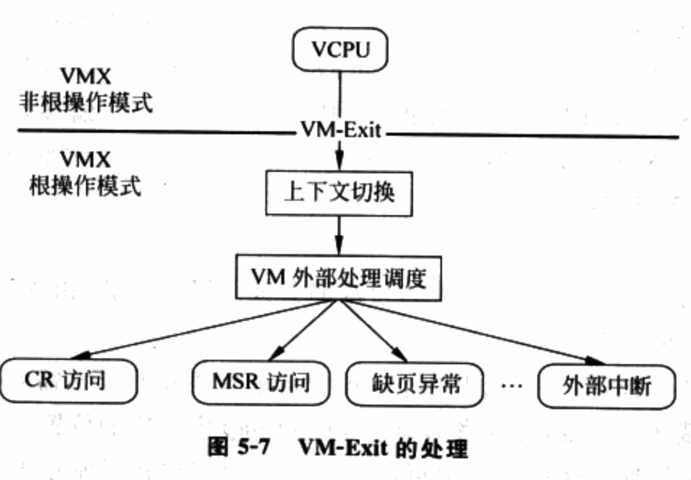

# 1 概述

硬件虚拟化使用VCPU(Virtual CPU)描述符来描述虚拟CPU. VCPU描述符类似操作系统中进程描述符(或进程控制块), 本质是一个**结构体**, 通常由下列几部分构成.

⓵ **VCPU标识信息**: 用于标识VCPU的一些属性, 例如VCPU的ID号, VCPU属于哪个客户机等.

⓶ **虚拟寄存器信息**: 虚拟的寄存器资源, 在使用Intel VT\-x情况下, 这些内容包含在VMCS中, 例如客户机状态域保存的内容.

⓷ **VCPU状态信息**: 类似于进程的状态信息, 标识该VCPU当前所处的状态, 例如睡眠、运行等， 主要供调度器使用。

⓸ **额外寄存器/部件信息**: 主要指未包含在VMCS中的一些寄存器或CPU部件. 例如浮点寄存器和虚拟的LAPIC等.

⓹ **其它信息**: 用于VMM进行优化或存储额外信息的字段, 例如存放该VCPU私有数据的指针等.

Intel VT\-x情况下, VCPU可划分为两个部分, 一个是VMCS为主由**硬件使用和更新**的部分, 主要是**虚拟寄存器**; 一个是除VMCS之外, 由**VMM使用和更新**的部分, 主要指VMCS以外的部分. 图5\-4展示了VCPU的构成.


当VMM创建客户机, 首先为客户机创建VCPU, 整个客户机运行实际上可以看作VMM调度不同的VCPU运行. 下面以VCPU创建 --- 运行 --- 退出为主线, 介绍Intel VT\-x技术的CPU虚拟化的实现.

# 2 VCPU的创建

实质上是创建VCPU描述符, 由于**本质上VCPU描述符是一个结构体**, 因此**创建VCPU描述符**简单来说就是**分配相应大小的内存**. VCPU描述符包含的内容很多, 通常会被组织成多级结构, 例如第一级结构体可以是各个平台通用的内容, 中间包含一个指针指向第二级结构体, 包含平台相关的内容. 对于这样的多级结构, 需要为每一级结构体相应分配内存.

创建之后, 需要进一步初始化才能使用. 物理CPU上电后, 硬件会自动将CPU初始化为特定的状态. VCPU的初始化也是一个类似过程. 通常包含:

⓵ 分配**VCPU标识**: 首先标识**该VCPU属于哪个客户机**, 再为该VCPU分配一个**客户机范围内唯一的标识(！！！**).

⓶ 初始化**虚拟寄存器组**: 主要指出初始化VMCS相关域. 这些寄存器的初始化值通常根据**物理CPU上电后各寄存器的值**设定.

⓷ 初始化**VCPU状态信息**: 被调度前需要配置的必要标志. 具体依据调度器实现决定.

⓸ 初始化额外部件: 将**未被VMCS包含！！！**的**虚拟寄存器**初始化为**物理CPU上电**后的值, 并**配置虚拟LAPIC**等部件.

⓹ 初始化其它信息: 根据VMM的实现初始化**VCPU的私有数据**.

## 2.1 VMCS的创建与初始化

**VMCS分配**时, 只需要分配一块**4KB大小**, 并**对齐到4KB边界的内存**即可. 初始化则需要根据VT\-x的定义, 对前面内容进行初始化, 基本思想就是按照物理CPU初始化的定义, 提供了一个和物理CPU初始化后类似的状态. 此外, 根据**VMM的CPU虚拟化策略**, 设置相应的**VMCS控制位**.

⓵ 客户机状态域: 描述了**VCPU运行时的状态**, 因此, 初始化的取值基本上是参考了**物理CPU初始化后的状态**. 例如, 物理CPU加电后会通过**复位**地址跳转到**BIOS执行**, 那么**Guest RIP字段**可直接设置为**虚拟机Guest BIOS的起始指令地址！！！**.

⓶ 宿主机状态域: **VM\-Exit**时, **CPU切换**到**VMM时寄存器值**, 因此, 初始化值参考**VMM运行时的CPU的状态**. **HOST RIP字段**通常被设置为**VMM中VMX Exit处理函数！！！**(VMX Exit Handler)的入口.

⓷ VM\-Execution控制域: 控制**VCPU运行时的一些行为**, 如执行**某些敏感指令时是否发生VM\-Exit**. 例如IN/OUT指令, 如果VMM允许客户机**直接访问某些I/O端口**, 那么VMM就会将Use I/O bitmaps位置1, 并在I/O bitmap中将相应I/O端口所对应的位置0, 这样, 客户机访问这些I/O端口就不会发生VM\-Exit. 

⓸ VM\-Entry控制域: 主要在**每次VM\-Entry之前设置**, 因此在**VCPU初始化时不需要特别设置**.

⓹ VM\-Exit控制域: 这个状态域有**两个字段**VMM通常会设置, 一个是**Acknowledge interrupt on exit**, 有助于**更快响应外部中断**; 另一个是**Host Address Space**, 用于**支持IA32模式**.

⓺ VM\-Exit信息域: **硬件自动更新**, 因此不需要初始化.

# 3 VCPU的运行

VCPU创建并初始化后, 可通过调度程序被调度运行. 调度程序会根据一定的策略算法来选择VCPU运行. 调度策略不表, 这里主要描述选定VCPU后, 如何将VCPU切换到物理CPU上运行.

## 3.1 上下文切换

第2章中, 上下文实际上是一个寄存器的集合, 包括通用寄存器、浮点寄存器、段寄存器、控制寄存器以及MSR等. 前面提到, **Intel VT\-x**的支持下, **VCPU的上下文**可以**分为两部分**. 故上下文的切换也分为由**硬件自动切换(VMCS部分**)和**VMM软件切换(非VMCS部分**)两个部分. 其中, 硬件切换部分可以更好保证VMM与客户机的隔离, 但缺乏灵活性. 软件切换部分可以由VMM自己选择性切换需要的上下文(例如, 浮点寄存器就无须每次切换), 从而有更大灵活并节省切换的开销.


图5\-5描述了VT\-x支持的CPU上下文切换过程, 下列几步.

⓵ **VMM保存自己的上下文**, 主要是保存**VMCS不保存的寄存器！！！**, 即**宿主机状态域以外**的部分.

⓶ VMM将保存在VCPU中的由软件切换的上下文加载到物理CPU中

⓷ VMM执行VMRESUME/VMLAUNCH指令, 触发VM\-Entry, 此时CPU自动将VCPU上下文中VMCS部分加载到物理CPU, CPU切换到非根模式.

此时, 物理CPU已经处于客户机的运行环境了, rip\eip也指向了客户机的指令, 这样VCPU就被成功调度并运行了.

上下文频繁切换会带来不小开销, 因此优化很有必要. 和OS一样, VMM也使用"惰性保存/恢复(Lazy Save/Restore)"的方法进行优化, 基本思想是尽量将寄存器的保存/恢复延迟到最后一刻, 即其它VCPU或VMM需要用该寄存器的时候再保存/恢复. 具体来说, VMM通过考察资源的使用情况来实现"惰性保存/恢复".

⓵ 对于VMM需要使用的寄存器, 每次VCPU和VMM切换时都要保存/恢复.

⓶ 对于VMM没有使用的寄存器, 如果VMM无法知道VCPU是否在最近的执行中曾经修改了这个寄存器(如扩展通用寄存器CR6), 那么在VCPU和VMM切换时, 不需要对这个寄存器进行保存和恢复. 但, 当VMM进行不同的VCPU切换时, 例如使一个VCPU睡眠并调度另一个VCPU运行, 需要每次否保存和恢复这个寄存器.

⓷ 对于VMM没有使用的寄存器, 如果VMM可以知道客户机是否在最近执行中修改了这个寄存器(例如浮点寄存器), 还可以进一步优化. 不仅在VCPU和VMM切换时, 不需要对这个寄存器进行恢复和保存, 即使切换不同的VCPU, 也不需要每次都保存/恢复, 而是根据需要进行.

例如, 如图5\-6, VCPU1、VCPU2和VCPU3按顺序调度到物理CPU上执行, 即VCPU1先执行, 其次VCPU2, 最后VCPU3. 其中, VCPU1和VCPU3在执行中会使用浮点寄存器, 而VCPU2不用. VMM了解到后, 在从VCPU1调度到VCPU2时, 只需保存VCPU1的浮点寄存器而无需加载VCPU2的; 从VCPU2调度到VCPU3时, 只需加载VCPU3的浮点寄存器而无需保存VCPU2的. 这就将原来两次保存/加载的工作减少为1次(保存VCPU1半次, 加载VCPU3半次).


## 3.2 VCPU的硬件优化

优化目的, 尽可能**减少在客户机和VMM之间切换**, 从而**减少上下文切换开销**. Intel VT\-x优化方法可分为两种.

⓵ **无条件优化**: 指以往在**软件虚拟化**下**必须陷入到VMM的敏感指令**, 通过Intel VT\-x已可以在**客户机中直接执行**. 如后面看到的**CR2访问**、**SYSENTER/SYSEXIT指令**.

⓶ **条件优化**: 指通过**VMCS的VM\-Execution控制域**, 可配置**某些敏感指令**是否产生**VM\-Exit**而陷入到VMM中. 如**CR0、TSC的访问**.

下面举例说明Intel VT\-x带来的优化技术.

### 3.2.1 访问CR0

CR0是一个控制寄存器, 控制寄存器的状态, 如**启动保护模式**、打开**分页机制**。操作CR0的指令有**MOV TO CR0**、**MOV FROM CR0**、**CLTS**和**LMSW**, 这些指令必须在**特权级0**执行, 否则产生保护异常.

**纯软件虚拟机**中, 客户OS是特权级1、特权级2上执行CR0读写指令, 因此所有指令都产生保护异常, 然后VMM模拟操作CR0指令的执行.

硬件辅助虚拟机中, 虽然**CR0访问同样需要VMM模拟处理！！！**, 但**VT\-x提供了加速方法**, 能减少因访问CR0所引起的VM\-Exit的次数. 首先, VMCS的"**VM\-Execution控制域**"的**CR0 read shadow字段**用来**加速客户机读CR0的指令**. 每次客户机**试图写CR0！！！**时, 该字段都会**自动得到更新(会产生VM\-Exit！！！**), 保存客户机要写的值. 这样, 客户机**所有读CR0的指令都不用产生VM\-Exit！！！**, **CPU只需返回CR0 read shadow的值**即可. 

其次, VMCS的"VM\-Execution控制域"的**CR0 guest/host Mask字段**提供了客**户机写CR0指令的加速**. 该字段**每一位**和CR0的**每一位对应**, 表示CR0对应的位是否可以被客户软件修改. 若为**0**, 表示CR0中对应位**可被客户软件修改**, **不产生VM\-Exit**; 若为1, 表示不能, 如果客户软件修改该位, 产生VM\-Exit.

同样机制被用于加速CR4的访问. 该优化属于条件优化.

### 3.2.2 访问TSC

纯软件虚拟机中, 读取TSC可以在任何特权级中执行, VMM必须想办法截获TSC读取指令.

在硬件辅助的虚拟机中, 当"VM\-Execution控制域"中RDTSC exiting字段为1, 客户软件执行RDTSC产生VM\-Exit, 由VMM模拟该指令. 客户读取TSC非常频繁, 为提高效率, VT\-x提供下面的硬件加速. 当"VM\-Execution控制域"中RDTSC exiting字段为1并且Use TSC offset为1, 硬件加速有效. VMCS中TSC偏移量表示该VMCS所代表的虚拟CPU TSC相对于物理CPU TSC的偏移, 即虚拟TSC=物理TSC+TSC偏移量. 当客户软件执行RDTSC时, 处理器直接返回虚拟TSC, 不产生VM\-Exit. 这样, 对TSC的虚拟化只需在适时更新VMCS中TSC偏移量即可, 不需要每次TSC访问都产生VM\-Exit.

这属于条件优化.

### 3.2.3 GDTR/LDTR/IDTR/TR的访问

纯软件虚拟机中, 客户OS是特权级1、特权级2上, 执行LGDT、LIDT、LLDT和LTR指令, 会产生保护异常, 需要VMM模拟这些指令的执行. 模拟过程对不同情况, 有很多复杂的处理. 例如, **客户机OS**在**GDT**中, 为**自身内核段**设置的**描述符的DPL是0**. 由于它**自身运行在非特权级0**上, 所以VMM要通过**截获LGDT指令**, **对GDT描述符修改**. 同时, 像**SGDT**这样的指令可以在**任何特权级下执行**, **客户OS**中的程序**只需要读取GDT**并**判断描述符的DPL**就知道**自身运行在虚拟环境**, 这也是一个**虚拟化漏洞！！！**.

使用Intel VT\-x技术, VMCS为客户机和VMM都提供了一套GDTR、IDTR、LDTR和TR, 分别保存在客户机状态域和宿主机状态域中(宿主机状态域没有LDTR, 因为VMM不需要使用), 由硬件转换. 而客户机运行在非根的特权级0, 所以无需对GDT表等做任何修改, 客户机执行LGDT等指令也无需VM\-Exit. 

该优化属于无条件优化.

### 3.2.4 读CR2

发生缺页异常时, CR2保存产生缺页错误的虚拟地址. 缺页错误处理程序通常会读取CR2获得产生该错误的虚拟地址. 缺页错误是一个发生频率较高的异常, 所以读取CR2是一个高频操作. 读取CR2必须在特权级0上执行, 否则产生保护错误.

纯软件虚拟机中, 客户OS在特权级1、特权级2上执行读取CR2指令, 产生保护错误, 需要VMM模拟该指令.

Intel VT\-x中, VM\-Entry/VM\-Exit时会切换CR2. 并且, 客户OS是在非根模式的特权级0执行读取CR2指令, 不产生保护错误, 故无需VMM模拟该指令. 此外, 如果客户机在特权级0以外级别执行读CR2指令, 会产生保护错误, 该错误是否引发VM\-Exit由Exception bitmap控制.

该优化属于无条件优化.

### 3.2.5 SYSENTER/SYSEXIT

早期系统调用通过INT指令和IRET指令实现. 当前主流的IA32e CPU中, Intel推出了经过优化的SYSENTER/SYSEXIT指令以提高效率. 现代OS倾向使用SYSENTER/SYSEXIT指令.

SYSENTER指令要求跳转的**目标代码段！！！**运行在**特权级0**, 否则产生保护错误.

在软件虚拟机中, 客户OS运行在特权级1、特权级2, 当客户应用执行SYSENTER会产生保护错误, 需要由VMM模拟SYSENTER指令. **SYSEXIT指令**必须在**特权级0！！！**执行, 否则产生保护错误. 和SYSENTER一样, SYSEXIT在软件虚拟化技术中必须由VMM模拟.

Intel VT\-x中, 客户OS运行在非根模式的特权级0, SYSENTER/SYSEXIT都不会引起VM\-EXIT, 即客户OS的系统调用无需VMM干预而直接执行. 该优化属于无条件优化.

### 3.2.6 APIC访问控制

现代主流的支持**SMP的OS**来说, **LAPIC**在**中断的递交**中扮演很重要角色. LAPIC有很多寄存器, 通常OS以**MMIO方式**访问. 其中, OS使用**TPR(Task Priority Register**)来**屏蔽中断优先级小于或等于TPR的外部中断**.

通过**虚拟化客户机的MMU**, 当**客户机试图访问LAPIC(！！！MMIO！！！**)时, 发生一个**缺页异常类型的VM\-Exit**, 从而被VMM拦截到. VMM经过分析, 知道客户机正试图访问LAPIC后, 会**模拟客户机对LAPIC的访问**. 通常, 对于**客户机的每个虚拟CPU**, **VMM**都会分配**一个虚拟APIC结构与之对应！！！**, **客户机的MMIO**操作**不会真正影响物理的LAPIC**, 而只反映到**相应的虚拟LAPIC结构！！！**里面. VMM这种模拟开销很大, 如果客户机的**每个LAPIC访问**都导致**一次缺页异常类型的VM\-Exit**并由**VMM模拟**, 会**严重影响客户机的性能**.

VT\-x提供了硬件加速. 可设置**VMCS**的**Use TPR shadow=1**, **Virtualize APIC accesses=1**, 设置**Virtual APIC page**为**虚拟LAPIC结构的地址**, 同时**修改VCPU页表**, 使**客户机访问LAPIC**时**不发生Page Fault**(需要相应设置VMCS中的Virtual\-APIC address寄存器). 同时, 对于那些暂时不能注入客户机的中断(如果有), 还需要挑出优先级最高的那个(即向量号最大的那个), 将其优先级填入VMCS中的TPR threshold寄存器.

这样设置后, 对于除了TPR以外的LAPIC寄存器的访问, 客户机会直接发生APIC Access类型的VM\-Exit. 此时, CPU可告知VMM客户机正试图访问哪个LAPIC, 这可降低VMM对客户机此次访问的模式开销; 而客户机对TPR的读操作则可以直接从虚拟LAPIC结构中的相应偏移处读取而无须发生任何VM\-Exit. 最后, 客户机对TPR的写操作只在必要时候(客户机把TPR减少到比TPR threshold还要小的时候)才发生TPR\-Below\-Threshold类型的VM\-Exit, 这种情况下VMM可检测是否有虚拟中断可以注入到客户机.

上面的TPR寄存器是用MMIO方式访问, 对于64位的x86, 专门有一个特别的系统控制寄存器CR8被映射到TPR(读写CR8等效于读写TPR). 64位客户机通常通过CR8寄存器来访问TPR. 当客户机试图访问CR8时, 会发生一个Control\-Register\-Accesses类型的VM\-Exit. 为更快模拟客户机对CR8的访问, 除了上面设置外, 可以设置VMCS中的CR8\-load exiting=0和CR8\-store exiting=0. 这样, 客户机读CR8时, CPU可以从虚拟LAPIC结构中相应的偏移处直接返回正确值而不产生任何VM\-Exit; 当客户机写CR8时, 只在必要时候才发生TPR\-Below\-Threshold类型的VM\-Exit.

### 3.2.7 异常控制

在软件虚拟化技术中, 客户机产生异常都会被VMM截获, 由VMM决定如何处理, 通常是注入给客户OS.

Intel VT\-x中, 可用Exception bitmap配置哪些异常需要由VMM截获. 对于不需要VMM截获的, 可将Exception bitmap中对应的位置1, 则异常发生时直接由客户OS处理. 属于条件优化.

### 3.2.8 I/O控制

软件虚拟化中, VMM需要截获I/O指令来实现I/O虚拟化. 但由于I/O指令通过设置可在特权级3执行, 截获I/O指令需要额外处理.

Intel VT\-x中, 可通过VMCS的Unconditional I/O exiting、Use I/O bitmaps、I/O bitmap进行配置, 选择性让I/O访问产生VM\-Exit而陷入VMM中. 这样, 对于不需要模拟的I/O端口, 可让客户机直接访问. 属于条件优化.

### 3.2.9 MSR位图

Intel VT\-x和I/O控制一样, 可通过use MSR bitmaps、MSR bitmap来控制对MSR的访问是否触发VM\-Exit. 属于条件优化.

# 4 VCPU的退出

执行特权指令, 发生物理中断等. 这种退出表现为VM\-Exit.

对于VCPU退出的处理是VMM进行CPU虚拟化的核心, 例如模拟各种特权指令. 



图5\-7描述了VMM处理VCPU退出的典型流程, 可归纳为下面几步.

⓵ 发生VM\-Exit, **CPU自动**进行**一部分上下文的切换**. 见6.2.7.

⓶ 当**CPU切换到根模式**开始执行**VM\-Exit的处理函数**后, 进行另一部分上下文的切换工作(见6.3.3)

根据**VM\-Exit信息域**获得**发生VM\-Exit的原因**, 并分发到**对应的处理模块处理**. 例如, 原因是执行了**特权指令**, 则调用**相应指令的模拟函数**进行模拟.

图5\-7列举了典型的VCPU退出原因. 总结起来, VCPU退出的原因大体有三类

(1) 访问了**特权资源**, 对**CR**和**MSR寄存器**的访问属于这一类

VMM通过特权资源的虚拟化解决. 特权资源虚拟化要点在于解决客户机与VMM在特权资源控制权的矛盾. 即**客户机认为自己完全拥有特权资源**, 可自由读写, 而实际拥有者是VMM, 不能允许客户机自由读写. VMM通过引入"**虚拟特权资源**"和"**影子特权资源**"来解决. "**虚拟特权资源**"是**客户机所看到的特权资源**, **VMM允许客户机自由读写**. "**影子特权资源**"是客户机运行时**特权资源真正的值**, 通常是VMM在"虚拟特权资源"基础上经过处理得到的, 因此称为"影子".

图5\-8以**特权寄存器**为例, 展示特权寄存器的虚拟化过程. 


当**VCPU读特权寄存器！！！**时, VMM将"**虚拟寄存器！！！"的值返回**. 例如, 对于MOV EAX, CR0指令, VMM将**Virtual CR0的值**赋给EAX, 然后**VM\-Entry返回！！！**. 

当**VCPU写特权寄存器**时, VMM首先将值**写入"虚拟寄存器**", 然后根据"**虚拟寄存器"的值**以及**虚拟化策略**来**更新"影子寄存器**", 最后将"**影子寄存器"的值应用到VCPU**上, 将值写入**VMCS"客户机状态域"的对应字段并且VM\-Entry返回**. 这里的虚拟化策略因特权虚拟器而异, 例如对于下面指令:

```assembly
MOV EAX, 0x00000001
MOV CR0, EAX
```

假设原来**Virtual CR0=0x80000001**, VMM比较后会发现客户机试图将**CR0的第31位(CR0.PG: 页模式)清掉**, 即关掉CPU的页模式. 为**实现内存的隔离**, VT\-x是**不允许客户机的页模式关掉的！！！**. 因此, VMM会将Virtual CR0按客户机要求设置为0x00000001, 但影子CR0依然设置为0x80000001(相应VMCS中的Guest CR0字段也会被设置). 此外, VMM会通知内存虚拟化模块有关客户机页模式的变化, 内存虚拟化模块做相应处理, 比如不再使用客户机的页表等.

(2) 客户机执行的指令引发了异常, 例如缺页异常.

客户机指令导致的异常, 很多是不需要虚拟化的, 可以直接由客户操作系统处理, 例如"除0错误"、“溢出错误”和“非法指令”等异常。这些都可以通过Exception bitmap设置。

对于需要虚拟化的异常, 没有一个通用的方法, VMM会对不同异常做不同处理. 以缺页异常为例, VMM会首先分析产生错误的原因: 如果是因为**访问MMIO地址导致**的, 则可以知道客户机在做**I/O操作**, VMM会调用**I/O虚拟化模块**处理; 如果是软件虚拟化中提到的影子页导致的异常, VMM会调用内存虚拟化模块处理; 如果都不是, 那就是客户机正常的缺页异常(即不要VMM处理的缺页异常), 该异常会被注入给客户机, 由客户机OS自己处理.

(3) 发生了中断. 可分为两种情况, 一种是发生真正的物理中断; 一种是客户机的虚拟设备发生了虚拟中断, 并通过VMM提供的接口使客户机发生VM\-Exit. 对于前者, VMM首先读取VMCS的VM\-Exit interruption information字段来获取中断向量号, 然后调用VMM中对应的中断处理函数. 对于后者, VMM在感知到虚拟中断发生时, 会用某种方法把虚拟中断的目标VCPU拖到VMM中, 常用一个方法是发一个IPI给运行该VCPU的物理CPU. 然后, VMM在IPI的处理函数中将该虚拟中断注入给客户机, 客户机OS处理.


